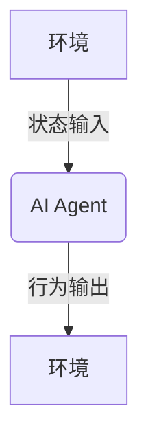

# AI人工智能 Agent：在公益事业中的应用

## 1. 背景介绍

### 1.1 人工智能的兴起

人工智能(Artificial Intelligence, AI)是当代科技发展的重要驱动力,它通过机器学习、深度学习等技术,赋予计算机系统智能化的能力,使其能够模拟人类的认知过程,完成特定的任务。随着计算能力的不断提升和海量数据的积累,人工智能技术在诸多领域得到了广泛应用,展现出巨大的潜力。

### 1.2 公益事业的重要性

公益事业关乎社会的可持续发展,旨在改善人民生活、保护环境、促进教育、维护人权等。然而,由于资金、人力等因素的制约,公益组织在实施相关项目时常面临重重挑战。如何高效地利用有限资源,最大化公益效益,成为亟待解决的问题。

### 1.3 AI赋能公益事业

人工智能技术为公益事业注入了新的活力,通过智能化的数据处理、决策支持和自动化运营,有望提高公益项目的精准度和效率,从而产生更大的社会影响力。AI代理(AI Agent)作为智能系统的关键组成部分,在公益领域大显身手。

## 2. 核心概念与联系

### 2.1 AI Agent概念

AI Agent是指能够感知环境、处理信息、做出决策并采取行动的智能体系统。它通过接收环境状态作为输入,并根据设定的目标函数输出相应的行为,从而实现自主决策和行为控制。



### 2.2 AI Agent在公益事业中的作用

公益事业涉及诸多复杂的决策过程,需要综合考虑多方面因素,AI Agent可以通过建模和优化,为决策提供有力支持:

1. **数据分析**:快速处理海量数据,发现潜在规律和见解。
2. **资源优化**:合理分配有限的人力、物力和财力资源。 
3. **风险评估**:预测潜在风险,并制定应对措施。
4. **智能推荐**:根据受助人的具体情况,推荐合适的援助方案。

### 2.3 AI Agent的核心技术

AI Agent通常由以下几个核心技术模块组成:

1. **知识库**:存储领域知识和经验教训。
2. **感知模块**:获取环境信息,如视觉、语音等传感器数据。
3. **决策引擎**:基于知识库和感知数据,运行算法模型做出决策。
4. **行为控制**:将决策指令转化为具体的行动方案。
5. **学习模块**:持续优化知识库和决策模型。

## 3. 核心算法原理具体操作步骤  

### 3.1 马尔可夫决策过程(MDP)

马尔可夫决策过程是AI Agent决策的基础理论模型。它将决策问题形式化为一个由状态、行为、奖励函数和状态转移概率组成的四元组:

$$
\langle S, A, R, P \rangle
$$

其中:
- $S$是有限的状态集合
- $A$是有限的行为集合 
- $R(s, a)$是在状态$s$执行行为$a$后获得的即时奖励
- $P(s' | s, a)$是从状态$s$执行行为$a$后转移到状态$s'$的概率

目标是找到一个策略$\pi: S \rightarrow A$,使得期望的累积奖励最大化:

$$
\max_\pi \mathbb{E} \left[ \sum_{t=0}^{\infty} \gamma^t R(s_t, a_t) \right]
$$

其中$\gamma \in [0, 1]$是折现因子,用于平衡当前和未来奖励的权重。

### 3.2 价值迭代算法

价值迭代是求解MDP的一种经典算法,包括以下步骤:

1. 初始化价值函数$V(s)$,对所有状态$s \in S$赋予任意值。

2. 对每个状态$s \in S$,更新$V(s)$:

   $$
   V(s) \leftarrow \max_{a \in A} \left\{ R(s, a) + \gamma \sum_{s' \in S} P(s' | s, a) V(s') \right\}
   $$

3. 重复步骤2,直到价值函数收敛或达到预设的迭代次数。

4. 从$V(s)$推导出最优策略$\pi^*(s)$:

   $$
   \pi^*(s) = \arg\max_{a \in A} \left\{ R(s, a) + \gamma \sum_{s' \in S} P(s' | s, a) V(s') \right\}
   $$

### 3.3 深度强化学习

传统的价值迭代算法需要事先了解MDP的完整模型,但在实际问题中,状态转移概率和奖励函数往往未知。深度强化学习通过结合深度神经网络和强化学习,可以直接从环境交互数据中学习出最优策略,无需事先建模。

深度Q网络(DQN)是深度强化学习的典型算法之一,它使用一个深度神经网络来近似Q函数:

$$
Q(s, a; \theta) \approx \max_\pi \mathbb{E} \left[ \sum_{t=0}^{\infty} \gamma^t R(s_t, a_t) | s_0 = s, a_0 = a, \pi \right]
$$

通过不断优化网络参数$\theta$,使Q函数的输出值逼近期望累积奖励,从而获得最优策略。

## 4. 数学模型和公式详细讲解举例说明

### 4.1 马尔可夫决策过程举例

假设一个公益组织需要为一个贫困社区分配援助资金,该社区共有5个村庄,每个村庄的贫困程度不同。组织每年只有固定的资金预算,需要合理分配给不同村庄。我们可以将这个问题建模为一个马尔可夫决策过程:

- 状态$S$:每个村庄的贫困程度,用一个离散值表示。
- 行为$A$:向每个村庄分配的资金数额。
- 奖励函数$R(s, a)$:分配资金$a$后,村庄贫困程度$s$的改善程度。
- 状态转移概率$P(s' | s, a)$:在分配资金$a$后,村庄贫困程度从$s$转移到$s'$的概率。

使用价值迭代算法,可以求解出最优的资金分配策略,从而最大限度地改善整个社区的贫困状况。

### 4.2 深度Q网络公式推导

我们来推导一下深度Q网络(DQN)的目标函数和优化过程。

DQN的目标是最小化Q函数的均方误差损失:

$$
L(\theta) = \mathbb{E}_{(s, a, r, s') \sim D} \left[ \left( r + \gamma \max_{a'} Q(s', a'; \theta^-) - Q(s, a; \theta) \right)^2 \right]
$$

其中:
- $D$是经验回放池,存储了之前的状态转移样本$(s, a, r, s')$。
- $\theta^-$是目标网络参数,用于估计下一状态的最大Q值。

通过随机梯度下降,可以优化网络参数$\theta$:

$$
\theta \leftarrow \theta - \alpha \nabla_\theta L(\theta)
$$

其中$\alpha$是学习率。

为了提高训练稳定性,DQN采用了目标网络和经验回放池等技巧。目标网络参数$\theta^-$会定期复制当前网络参数$\theta$,并保持一段时间不变;经验回放池则打乱了样本的时序相关性,减小了数据相关性带来的影响。

## 5. 项目实践:代码实例和详细解释说明

为了更好地理解AI Agent在公益事业中的应用,我们以"救灾物资分配"为例,使用Python编写一个简单的深度强化学习代理。

### 5.1 问题描述

假设发生了一场自然灾害,多个受灾地区急需救援物资。我们需要一个智能代理,根据每个地区的受灾情况和剩余物资,决策如何高效分配物资,最大限度满足各地需求。

### 5.2 环境模拟

我们首先定义环境类`DisasterEnv`,模拟救灾场景:

```python
import numpy as np

class DisasterEnv:
    def __init__(self, num_areas, max_supplies):
        self.num_areas = num_areas
        self.max_supplies = max_supplies
        self.reset()

    def reset(self):
        # 重置环境状态
        self.supplies = np.random.randint(self.max_supplies, size=self.num_areas)
        self.demands = np.random.randint(2 * self.max_supplies, size=self.num_areas)
        self.total_supplies = int(0.5 * self.max_supplies * self.num_areas)
        return self.get_state()

    def get_state(self):
        # 获取当前状态
        scaled_supplies = self.supplies / self.max_supplies
        scaled_demands = self.demands / (2 * self.max_supplies)
        scaled_total_supplies = self.total_supplies / (self.max_supplies * self.num_areas)
        return np.concatenate((scaled_supplies, scaled_demands, [scaled_total_supplies]))

    def step(self, action):
        # 执行分配行为,返回新状态、奖励和是否终止
        supplies_change = action - self.supplies
        supplies_change = np.clip(supplies_change, -self.total_supplies, self.max_supplies - self.supplies)
        self.supplies += supplies_change
        self.total_supplies -= np.sum(supplies_change)
        unmet_demands = np.maximum(0, self.demands - self.supplies)
        reward = -np.mean(unmet_demands)
        done = self.total_supplies == 0
        return self.get_state(), reward, done
```

环境状态由三部分组成:各地区的当前物资量、需求量,以及剩余总物资量。代理的行为是向每个地区调配的物资数量。奖励函数设置为负的未满足需求均值,目标是最大化该奖励(即最小化未满足需求)。

### 5.3 深度Q网络代理

接下来,我们构建深度Q网络代理`DQNAgent`:

```python
import torch
import torch.nn as nn
import torch.optim as optim
import random

class DQN(nn.Module):
    def __init__(self, state_dim, action_dim):
        super(DQN, self).__init__()
        self.fc1 = nn.Linear(state_dim, 64)
        self.fc2 = nn.Linear(64, action_dim)

    def forward(self, x):
        x = torch.relu(self.fc1(x))
        return self.fc2(x)

class DQNAgent:
    def __init__(self, state_dim, action_dim, gamma=0.99, epsilon=1.0, epsilon_decay=0.995, batch_size=64, buffer_size=10000):
        self.state_dim = state_dim
        self.action_dim = action_dim
        self.gamma = gamma
        self.epsilon = epsilon
        self.epsilon_decay = epsilon_decay
        self.batch_size = batch_size
        self.buffer_size = buffer_size
        self.buffer = []

        self.policy_net = DQN(state_dim, action_dim)
        self.target_net = DQN(state_dim, action_dim)
        self.target_net.load_state_dict(self.policy_net.state_dict())
        self.optimizer = optim.Adam(self.policy_net.parameters())
        self.loss_fn = nn.MSELoss()

    def get_action(self, state):
        if random.random() < self.epsilon:
            action = torch.randint(0, self.action_dim, size=(self.action_dim,))
        else:
            state = torch.from_numpy(state).float().unsqueeze(0)
            q_values = self.policy_net(state)
            action = q_values.max(1)[1].view(self.action_dim)
        return action.data.numpy()

    def update_buffer(self, transition):
        self.buffer.append(transition)
        if len(self.buffer) > self.buffer_size:
            self.buffer.pop(0)

    def update_target_net(self):
        self.target_net.load_state_dict(self.policy_net.state_dict())

    def learn(self):
        if len(self.buffer) < self.batch_size:
            return

        transitions = random.sample(self.buffer, self.batch_size)
        state_batch, action_batch, reward_batch, next_state_batch, done_batch = zip(*transitions)

        state_batch = torch.from_numpy(np.array(state_batch)).float()
        action_batch = torch.from_numpy(np.array(action_batch)).long().unsqueeze(1)
        reward_batch = torch.from_numpy(np.array(reward_batch)).float()
        next_state_batch = torch.from_numpy(np.array(next_state_batch)).float()
        done_batch = torch.from_numpy(np.array(done_batch)).float()

        q_values = self.policy