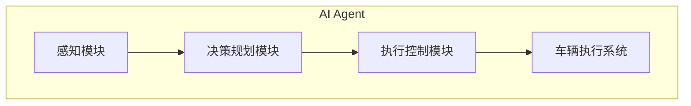
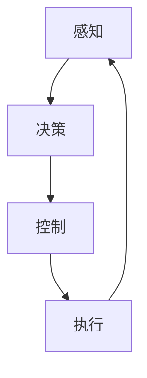

# AI人工智能 Agent：在无人驾驶中的应用

## 1. 背景介绍

### 1.1 无人驾驶的发展历程

无人驾驶技术的发展可以追溯到20世纪60年代,当时它主要应用于军事领域。随着计算机技术和人工智能算法的不断进步,无人驾驶技术逐渐向民用领域扩展。近年来,谷歌、特斯拉、百度、小马智行等科技公司纷纷投入巨资研发无人驾驶技术,推动了这一领域的快速发展。

### 1.2 无人驾驶的挑战

尽管取得了长足进步,但无人驾驶技术仍面临诸多挑战:

- **环境感知**:车辆需要准确感知复杂的路况、障碍物、交通信号等环境信息。
- **决策规划**:根据感知信息,车辆需要进行精确的路径规划和行为决策。
- **执行控制**:将决策指令精准执行到车辆的操控系统。
- **安全可靠性**:确保系统在各种情况下的稳定性和安全性。

### 1.3 AI 在无人驾驶中的作用

人工智能(AI)技术为解决上述挑战提供了强有力的支持。AI 赋予无人驾驶车辆环境感知、决策规划和执行控制等智能化能力,使其能够像人类驾驶员一样安全可靠地驾驶。因此,AI 已成为无人驾驶技术的核心支柱。

## 2. 核心概念与联系

### 2.1 AI Agent

在无人驾驶系统中,AI Agent 扮演着至关重要的角色。AI Agent 是一个智能体,能够感知环境、做出决策并执行相应的行为。它由以下三个核心模块组成:

1. **感知模块(Perception Module)**:通过传感器获取环境信息,如激光雷达、摄像头等。
2. **决策规划模块(Decision & Planning Module)**:基于感知信息,运行决策算法制定行为策略。 
3. **执行控制模块(Control Module)**:将决策指令转化为车辆的实际操控命令。

### 2.2 感知、决策、控制的循环

无人驾驶是一个连续的感知-决策-控制循环过程:

1. **感知**:获取车辆周围环境的实时数据,如车道线、障碍物、交通标志等。
2. **决策**:基于感知数据,运行决策算法规划车辆的运动轨迹。
3. **控制**:将规划的轨迹转化为实际的控制指令,如方向盘、油门、刹车等。
4. **执行**:车辆根据控制指令实施操作,改变车辆运动状态。
5. **循环**:车辆的新状态将作为下一个循环的输入,重复上述过程。

这个闭环过程使无人驾驶系统能够持续感知环境变化,并作出相应的决策和控制,确保车辆可以安全可靠地行驶。

## 3. 核心算法原理具体操作步骤  

无人驾驶系统中的核心算法主要包括三个方面:感知算法、决策规划算法和控制算法。

### 3.1 感知算法

感知算法的主要任务是从传感器数据中提取关键信息,并建立车辆周围环境的模型。常用的感知算法包括:

#### 3.1.1 目标检测与跟踪

- **目标检测**: 使用深度学习模型(如Faster R-CNN、YOLO等)在图像或点云数据中检测出车辆、行人、障碍物等目标。
- **目标跟踪**: 使用卡尔曼滤波、SORT等算法,跟踪检测到的目标在时间上的运动轨迹。

#### 3.1.2 语义分割

使用全卷积神经网络(如FCN、SegNet等)对图像进行像素级别的语义分割,识别出车道线、路面、建筑物等不同的语义区域。

#### 3.1.3 三维重建

基于激光雷达点云数据,使用SLAM(同步定位与映射)算法重建车辆周围三维环境的精确模型。

### 3.2 决策规划算法

决策规划算法的目标是根据感知数据,为车辆规划出一条安全、高效的运动轨迹。主要算法包括:

#### 3.2.1 行为决策

- **有限状态机**: 根据当前情况,选择适当的驾驶行为模式,如直行、变道、停车等。
- **规则引擎**: 基于预定义的规则集,推理出合适的行为决策。

#### 3.2.2 路径规划

- **采样规划**: 通过随机采样,搜索可行的路径,如RRT、RRT*等算法。
- **图搜索**: 将路径规划建模为图搜索问题,使用A*、Dijkstra等算法求解最优路径。
- **优化方法**: 将路径规划转化为优化问题,使用最速下降法等优化算法求解。

#### 3.2.3 运动规划

- **多项式曲线规划**: 使用多项式曲线拟合期望的运动轨迹。
- **采样规划**: 结合采样规划算法,生成满足动力学约束的轨迹。

### 3.3 控制算法

控制算法的作用是将规划出的期望轨迹转化为实际的控制指令,从而驱动车辆运动。常见的控制算法有:

#### 3.3.1 纵向控制

- **PID控制**: 基于PID(比例积分微分)控制器,调节车辆的加速度。
- **模型预测控制(MPC)**: 预测未来状态,通过优化求解最佳控制序列。

#### 3.3.2 横向控制 

- **纯追踪控制**: 计算车辆与期望轨迹的横向偏差,并对方向盘进行修正。
- **Stanley控制**: 结合横向偏差和路径曲率,计算方向盘转角。

上述算法通常会结合传感器反馈,形成控制闭环,持续调整车辆的运动状态。

## 4. 数学模型和公式详细讲解举例说明

无人驾驶系统中涉及大量数学模型和公式,下面将对其中几个核心模型进行详细讲解。

### 4.1 卡尔曼滤波

卡尔曼滤波是一种常用的状态估计算法,广泛应用于目标跟踪、定位等领域。它通过预测和更新两个步骤,对系统的状态进行递归估计。

设系统状态为 $\boldsymbol{x}_k$,观测值为 $\boldsymbol{z}_k$,过程噪声为 $\boldsymbol{w}_k$,观测噪声为 $\boldsymbol{v}_k$,则卡尔曼滤波的状态方程和观测方程为:

$$
\begin{aligned}
\boldsymbol{x}_k &= \boldsymbol{F}_k \boldsymbol{x}_{k-1} + \boldsymbol{B}_k \boldsymbol{u}_k + \boldsymbol{w}_k \\
\boldsymbol{z}_k &= \boldsymbol{H}_k \boldsymbol{x}_k + \boldsymbol{v}_k
\end{aligned}
$$

其中, $\boldsymbol{F}_k$ 为状态转移矩阵, $\boldsymbol{B}_k$ 为控制输入矩阵, $\boldsymbol{u}_k$ 为控制输入向量, $\boldsymbol{H}_k$ 为观测矩阵。

卡尔曼滤波算法包括以下步骤:

1. **初始化**: 设置初始状态估计 $\hat{\boldsymbol{x}}_0$ 和协方差矩阵 $\boldsymbol{P}_0$。

2. **预测**:
   $$
   \begin{aligned}
   \hat{\boldsymbol{x}}_k^- &= \boldsymbol{F}_k \hat{\boldsymbol{x}}_{k-1} + \boldsymbol{B}_k \boldsymbol{u}_k \\
   \boldsymbol{P}_k^- &= \boldsymbol{F}_k \boldsymbol{P}_{k-1} \boldsymbol{F}_k^T + \boldsymbol{Q}_k
   \end{aligned}
   $$

3. **更新**:
   $$
   \begin{aligned}
   \boldsymbol{K}_k &= \boldsymbol{P}_k^- \boldsymbol{H}_k^T (\boldsymbol{H}_k \boldsymbol{P}_k^- \boldsymbol{H}_k^T + \boldsymbol{R}_k)^{-1} \\
   \hat{\boldsymbol{x}}_k &= \hat{\boldsymbol{x}}_k^- + \boldsymbol{K}_k (\boldsymbol{z}_k - \boldsymbol{H}_k \hat{\boldsymbol{x}}_k^-) \\
   \boldsymbol{P}_k &= (\boldsymbol{I} - \boldsymbol{K}_k \boldsymbol{H}_k) \boldsymbol{P}_k^-
   \end{aligned}
   $$

其中, $\boldsymbol{Q}_k$ 为过程噪声协方差矩阵, $\boldsymbol{R}_k$ 为观测噪声协方差矩阵, $\boldsymbol{K}_k$ 为卡尔曼增益矩阵。

通过上述迭代计算,卡尔曼滤波可以有效融合系统模型和观测数据,获得状态的最优估计。

### 4.2 采样规划算法: RRT*

RRT* (Rapidly-exploring Random Tree Star) 是一种常用的采样规划算法,适用于高维空间中的路径规划问题。它通过在配置空间中随机生成样本点,不断扩展一棵树状结构,最终找到从起点到终点的可行路径。

RRT* 算法的主要步骤如下:

1. **初始化**: 在配置空间中创建起点节点,作为树的根节点。

2. **采样**: 在配置空间中随机采样一个样本点 $\boldsymbol{x}_\text{rand}$。

3. **最近邻搜索**: 在当前树中找到距离 $\boldsymbol{x}_\text{rand}$ 最近的节点 $\boldsymbol{x}_\text{nearest}$。

4. **扩展树**: 从 $\boldsymbol{x}_\text{nearest}$ 出发,沿着指向 $\boldsymbol{x}_\text{rand}$ 的方向,生成一个新节点 $\boldsymbol{x}_\text{new}$,使其距离 $\boldsymbol{x}_\text{nearest}$ 不超过一个预设的步长 $\delta$。

5. **选择父节点**: 在 $\boldsymbol{x}_\text{new}$ 的邻域内搜索一个代价最小的节点 $\boldsymbol{x}_\text{min}$,将其作为 $\boldsymbol{x}_\text{new}$ 的父节点。

6. **重线**: 对树中与 $\boldsymbol{x}_\text{new}$ 相连的节点,检查是否可以通过 $\boldsymbol{x}_\text{new}$ 获得更小的代价,如果是,则重新分配父节点。

7. **终止条件检查**: 如果新节点 $\boldsymbol{x}_\text{new}$ 已足够接近终点,或者达到了最大迭代次数,则终止算法;否则返回步骤2,继续迭代。

RRT* 算法的优点是能够快速探索高维空间,并且通过重线操作,可以逐步优化路径的代价。但它也存在一些缺陷,如路径的非平滑性、对狭窄通道的探索能力较差等。

### 4.3 模型预测控制 (MPC)

模型预测控制 (Model Predictive Control, MPC) 是一种优化控制算法,通过预测系统未来状态,求解一系列最优控制序列。MPC 在无人驾驶的纵向控制中发挥着重要作用。

设系统的状态为 $\boldsymbol{x}_k$,控制输入为 $\boldsymbol{u}_k$,则 MPC 的目标是最小化一个代价函数:

$$
J = \sum_{i=1}^{N} \left\Vert \boldsymbol{x}_{k+i|k} - \boldsymbol{x}_\text{ref} \right\Vert_Q^2 + \sum_{i=0}^{N-1} \left\Vert \bolds