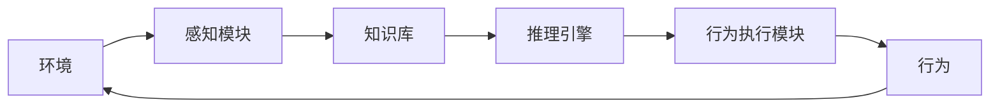

# AI人工智能 Agent：对人类思维方式的影响

## 1. 背景介绍

### 1.1 人工智能的兴起

人工智能(Artificial Intelligence, AI)是当代科技领域最具revolutionary性的创新之一。自20世纪中叶诞生以来,AI理论与应用不断突破,正在深刻影响和重塑着人类社会的方方面面。随着算力的不断提高、数据的爆炸式增长以及算法的创新,AI已经渗透到了生活的方方面面,如图像识别、自然语言处理、决策优化等,为人类的生产和生活带来了巨大便利。

### 1.2 AI Agent的概念

在人工智能领域,Agent是一个核心概念。AI Agent指的是一个感知环境并根据环境做出行为的主体。简单来说,它能够通过获取环境信息、分析决策并执行相应行为,以完成既定目标。AI Agent可以是虚拟软件程序,也可以是具备感知与行为能力的机器人等物理实体。随着AI技术的飞速发展,AI Agent正在展现出越来越强大的能力,对人类思维方式产生了深远影响。

## 2. 核心概念与联系

### 2.1 AI Agent的构成

一个完整的AI Agent通常由以下几个核心模块构成:

1. **感知模块(Perception Module)**:用于获取环境信息,如视觉、听觉、触觉等传感器数据。
2. **知识库(Knowledge Base)**:存储Agent已有的知识和经验。
3. **推理引擎(Reasoning Engine)**:对获取的信息进行处理、分析和决策。
4. **行为执行模块(Action Module)**:根据决策结果执行相应的行为。



### 2.2 AI Agent的分类

根据不同的应用场景和功能,AI Agent可以分为以下几种类型:

1. **反应型Agent**:只根据当前感知到的环境信息做出反应,没有内部状态。
2. **基于模型的Agent**:利用内部状态跟踪环境的变化,并根据环境模型做出决策。
3. **基于目标的Agent**:具有明确的目标,并采取行为以达成目标。
4. **基于效用的Agent**:根据行为可能带来的效用(Utility)大小来做出决策。
5. **学习型Agent**:能够从过往经验中学习,并不断优化自身的决策过程。

## 3. 核心算法原理具体操作步骤

AI Agent的核心在于如何根据获取的环境信息做出合理的决策和行为。这个过程通常遵循以下步骤:

### 3.1 状态表示

首先需要将环境信息转化为Agent可以理解的状态表示形式。常见的状态表示方法有:

- **特征向量(Feature Vector)**: 将环境信息映射为一个多维特征向量。
- **符号逻辑(Symbolic Logic)**: 使用逻辑语句对环境进行形式化描述。

### 3.2 状态转移函数

接下来需要定义状态转移函数,描述Agent执行某个行为后,环境状态如何转移。设当前状态为$s$,Agent执行行为$a$,转移到新状态$s'$的概率为:

$$P(s' | s, a)$$

这个函数可以是确定性的,也可以是概率分布。

### 3.3 奖赏函数

为了评估行为的好坏,需要定义奖赏函数(Reward Function)。设执行行为$a$从状态$s$转移到$s'$所获得的即时奖赏为:

$$R(s, a, s')$$

目标是最大化所有状态的累积奖赏。

### 3.4 决策过程

有了上述定义,Agent就可以根据特定的算法进行决策,选择在当前状态下执行哪个行为。常见的决策算法有:

- **贪婪算法(Greedy Algorithm)**: 选择当前能获得最大即时奖赏的行为。
- **价值迭代(Value Iteration)**: 基于贝尔曼最优方程,求解出每个状态的最优价值函数,并选择对应的最优行为。
- **策略迭代(Policy Iteration)**: 直接求解出每个状态的最优策略(行为),而不经过求解价值函数的中间步骤。
- **强化学习(Reinforcement Learning)**: 通过不断试错与学习,逐步优化策略,使累积奖赏最大化。

上述算法的具体细节在不同场景下会有所不同,是AI Agent领域的核心研究内容。

## 4. 数学模型和公式详细讲解举例说明

在AI Agent的建模过程中,数学是一个重要的工具。以下是一些常见的数学模型:

### 4.1 马尔可夫决策过程(MDP)

马尔可夫决策过程是AI Agent领域最基本和最重要的数学模型。一个MDP可以用一个五元组来表示:

$$\langle S, A, P, R, \gamma\rangle$$

其中:
- $S$是状态集合
- $A$是行为集合  
- $P(s' | s, a)$是状态转移概率函数
- $R(s, a, s')$是奖赏函数
- $\gamma \in [0, 1)$是折现因子,用于权衡即时奖赏与长期累积奖赏

在MDP中,Agent的目标是找到一个策略$\pi: S \rightarrow A$,使得每个状态的价值函数$V^{\pi}(s)$最大化,其中:

$$V^{\pi}(s) = \mathbb{E}_{\pi}\left[\sum_{t=0}^{\infty}\gamma^tR(s_t, a_t, s_{t+1}) | s_0 = s\right]$$

上式表示在策略$\pi$下,从状态$s$开始,未来累积奖赏的期望值。

例如,在国际象棋游戏中,我们可以将棋局状态看作MDP的状态$s$,可执行的走子看作行为$a$。通过定义合理的状态转移概率$P$和奖赏函数$R$(如下一步将对手将军则获得大的负奖赏),就可以将国际象棋游戏建模为一个MDP,并使用相应的算法寻找最优策略。

### 4.2 部分可观测马尔可夫决策过程(POMDP)

在现实世界中,Agent往往无法完全观测到环境的真实状态,只能获取有噪声的部分观测值。这种情况可以用部分可观测马尔可夫决策过程(Partially Observable Markov Decision Process)来描述,用一个六元组表示:

$$\langle S, A, P, R, \Omega, O\rangle$$

其中:
- $\Omega$是观测值集合
- $O(o|s',a)$是观测概率分布,表示在执行行为$a$并转移到状态$s'$时,观测值$o$的概率

在POMDP中,Agent无法直接访问真实状态$s$,只能维护一个belief状态$b(s)$,表示对当前真实状态的概率分布估计。Agent的目标是找到一个关于belief状态的策略$\pi: B \rightarrow A$,使累积奖赏最大化。

POMDP比MDP更能反映现实情况,但由于需要估计隐藏状态的分布,其计算复杂度也更高。比如在机器人导航的场景中,机器人只能通过传感器获取部分和有噪声的环境信息,就可以用POMDP来建模。

## 5. 项目实践:代码实例和详细解释说明

为了更好地理解AI Agent的工作原理,我们来看一个简单的网格世界(Gridworld)示例,并使用Python代码实现一个基于价值迭代的Agent。

### 5.1 问题描述

假设有一个4x4的网格世界,其中有一个起点(S)、一个终点(G)和两个陷阱(H)。Agent的目标是从起点出发,找到一条路径到达终点,同时避开陷阱。到达终点可获得+1的奖赏,落入陷阱获得-1的奖赏,其他情况奖赏为0。

```
+-----+-----+-----+-----+
|     |     |  H  |     |
+-----+-----+-----+-----+
|     |     |     |     |
+-----+-----+-----+-----+
|     |     |     |     |
+-----+-----+-----+-----+
|  S  |     |     |  G  |
+-----+-----+-----+-----+
```

### 5.2 状态表示

我们可以使用一个二元组$(x, y)$来表示Agent在网格世界中的位置状态。

### 5.3 状态转移和奖赏函数

在这个简单的网格世界中,Agent只有四个可选行为:上、下、左、右。状态转移函数很简单:如果新状态在网格内且不是障碍物,就转移到新状态;否则保持原状态不变。

奖赏函数也很简单:到达终点获得+1奖赏,落入陷阱获得-1奖赏,其他情况奖赏为0。

### 5.4 价值迭代算法

我们使用价值迭代算法来求解这个MDP的最优价值函数和策略。价值迭代算法的步骤如下:

1. 初始化每个状态的价值函数$V(s)=0$
2. 重复以下步骤直到收敛:
    - 对每个状态$s$,计算其价值函数:
        $$V(s) \leftarrow \max_{a}\left\{R(s, a) + \gamma\sum_{s'}P(s'|s, a)V(s')\right\}$$
    - 更新该状态的策略:
        $$\pi(s) \leftarrow \arg\max_{a}\left\{R(s, a) + \gamma\sum_{s'}P(s'|s, a)V(s')\right\}$$

### 5.5 Python实现

```python
import numpy as np

# 定义网格世界
WORLD = np.array([
    [0, 0, -1, 0],
    [0, 0, 0, 0], 
    [0, 0, 0, 0],
    [1, 0, 0, 10]
])

# 定义状态转移函数
def transition(state, action):
    x, y = state
    if action == 0: # 上
        x = max(x - 1, 0)
    elif action == 1: # 下
        x = min(x + 1, WORLD.shape[0] - 1)
    elif action == 2: # 左
        y = max(y - 1, 0)
    elif action == 3: # 右
        y = min(y + 1, WORLD.shape[1] - 1)
    new_state = (x, y)
    reward = WORLD[x, y]
    return new_state, reward

# 价值迭代算法
def value_iteration(gamma=0.9, theta=1e-8):
    V = np.zeros(WORLD.shape)
    while True:
        delta = 0
        for x in range(WORLD.shape[0]):
            for y in range(WORLD.shape[1]):
                state = (x, y)
                old_v = V[x, y]
                new_v = max([transition(state, action)[1] + gamma * np.max([V[transition(state, action)[0]] for action in range(4)]) for action in range(4)])
                V[x, y] = new_v
                delta = max(delta, abs(old_v - new_v))
        if delta < theta:
            break
    
    # 从价值函数推导出策略
    policy = np.zeros(WORLD.shape, dtype=int)
    for x in range(WORLD.shape[0]):
        for y in range(WORLD.shape[1]):
            state = (x, y)
            policy[x, y] = max(range(4), key=lambda a: transition(state, a)[1] + gamma * np.max([V[transition(state, a)[0]] for a in range(4)]))
    
    return V, policy

# 执行价值迭代算法
V, policy = value_iteration()

# 打印结果
print("价值函数:")
print(V)
print("策略:")
print(["上", "下", "左", "右"][policy[0, 0]], end=" -> ")
for x in range(1, WORLD.shape[0]):
    for y in range(WORLD.shape[1]):
        print(["上", "下", "左", "右"][policy[x, y]], end=" -> " if y < WORLD.shape[1] - 1 else "\n")
```

上述代码首先定义了网格世界的布局,以及状态转移和奖赏函数。然后实现了价值迭代算法,通过不断更新每个状态的价值函数,直到收敛。最后根据收敛后的价值函数推导出最优策略。

运行结果如下:

```
价值函数:
[[ 8.99  9.89 -1.    9.89]
 [ 8.09  9.    9.    8.99]
 [ 7.19  8.09  8.09  8.09]
 [ 1.    7.19  7.19 10.  ]]
策略: