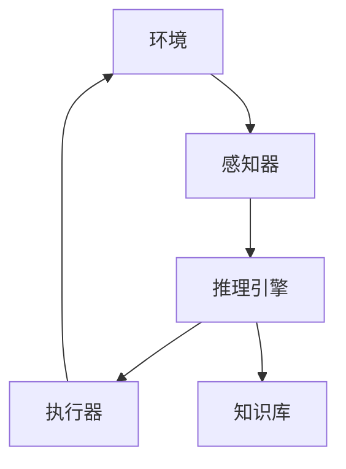

# AI人工智能 Agent：对人类思维方式的影响

## 1.背景介绍

### 1.1 人工智能的兴起

人工智能(Artificial Intelligence, AI)是当代科技发展的前沿领域,近年来受到了广泛关注和快速发展。AI技术的突破不仅推动了计算机科学和信息技术的进步,也对人类社会的方方面面产生了深远影响。其中,智能代理(Intelligent Agent)作为AI的重要组成部分,正在改变人类的思维方式和生活方式。

### 1.2 智能代理的定义

智能代理是指能够感知环境,并根据设定的目标做出决策和行动的自主系统。它们可以通过学习和推理,不断优化自身的行为策略,以更好地完成特定任务。智能代理广泛应用于机器人技术、游戏AI、个人助理等领域。

### 1.3 智能代理的重要性

随着AI技术的不断发展,智能代理将在更多领域发挥重要作用,并对人类的思维方式产生深远影响。它们不仅能够协助人类完成复杂任务,还可以通过机器学习算法发现新的知识和规律,扩展人类的认知边界。

## 2.核心概念与联系

### 2.1 智能代理的构成

一个典型的智能代理系统通常由以下几个核心组件构成:

- 感知器(Sensor):用于获取环境信息
- 执行器(Actuator):用于对环境进行操作
- 知识库(Knowledge Base):存储代理的背景知识
- 推理引擎(Inference Engine):根据知识库和感知信息进行决策



### 2.2 智能代理的分类

根据不同的决策机制,智能代理可分为以下几种类型:

- 简单反射代理(Simple Reflex Agent)
- 基于模型的代理(Model-based Agent)
- 目标驱动代理(Goal-based Agent)
- 基于效用的代理(Utility-based Agent)

### 2.3 智能代理与人类思维的关系

智能代理的核心是模拟人类的决策过程,因此它们与人类思维方式存在密切联系。通过研究智能代理的工作原理,我们可以更好地理解人类大脑的信息处理机制,并将这些认知应用于AI系统的设计和优化。

## 3.核心算法原理具体操作步骤

智能代理的决策过程可以概括为感知、规划和行动三个主要步骤。下面将详细介绍其中的核心算法原理和具体操作步骤。

### 3.1 感知算法

感知算法的目标是从环境中获取有用的信息,并将其转换为代理系统可以理解的表示形式。常见的感知算法包括:

1. **特征提取算法**
   - 步骤1:获取原始数据(图像、声音、文本等)
   - 步骤2:预处理数据(去噪、标准化等)
   - 步骤3:应用特征提取算法(如卷积神经网络、SIFT等)
   - 步骤4:获得特征向量表示

2. **状态估计算法**
   - 步骤1:获取传感器数据
   - 步骤2:使用滤波算法(如卡尔曼滤波)估计系统状态
   - 步骤3:将状态估计结果输入决策模块

### 3.2 规划算法

规划算法的目标是根据当前状态和目标,生成一系列行动序列。常见的规划算法包括:

1. **启发式搜索算法**
   - 步骤1:定义问题状态和目标状态
   - 步骤2:设计合适的启发式函数
   - 步骤3:使用A*或其他启发式搜索算法寻找最优路径

2. **强化学习算法**
   - 步骤1:定义状态空间、行动空间和奖励函数
   - 步骤2:初始化策略或价值函数
   - 步骤3:通过试错学习,不断优化策略或价值函数

### 3.3 行动执行算法

行动执行算法的目标是根据规划得到的行动序列,控制执行器对环境进行操作。常见的行动执行算法包括:

1. **运动规划算法**
   - 步骤1:获取机器人当前位置和目标位置
   - 步骤2:构建环境模型(障碍物信息等)
   - 步骤3:使用采样/优化等方法计算无碰撞路径
   - 步骤4:沿路径控制机器人运动

2. **控制算法**
   - 步骤1:获取系统当前状态和目标状态
   - 步骤2:使用PID、LQR等控制算法计算控制量
   - 步骤3:将控制量施加到执行器上

## 4.数学模型和公式详细讲解举例说明

智能代理系统中广泛使用了各种数学模型和公式,下面将对其中的几个核心模型进行详细讲解和举例说明。

### 4.1 马尔可夫决策过程(MDP)

马尔可夫决策过程(Markov Decision Process, MDP)是智能代理决策的基本数学模型。一个MDP可以用一个五元组 $(S, A, P, R, \gamma)$ 来表示,其中:

- $S$ 是状态集合
- $A$ 是行动集合
- $P(s'|s,a)$ 是状态转移概率,表示在状态 $s$ 执行行动 $a$ 后,转移到状态 $s'$ 的概率
- $R(s,a)$ 是奖励函数,表示在状态 $s$ 执行行动 $a$ 获得的即时奖励
- $\gamma \in [0,1)$ 是折现因子,用于权衡即时奖励和长期奖励

在MDP中,代理的目标是找到一个策略 $\pi: S \rightarrow A$,使得期望的累积折现奖励最大化:

$$
\max_\pi \mathbb{E}\left[\sum_{t=0}^\infty \gamma^t R(s_t, a_t)\right]
$$

其中 $s_t$ 和 $a_t$ 分别表示第 $t$ 个时刻的状态和行动。

### 4.2 值函数和Bellman方程

值函数是MDP中另一个重要概念,它表示在给定策略下,从某个状态出发能获得的期望累积折现奖励。状态值函数 $V^\pi(s)$ 和行动值函数 $Q^\pi(s,a)$ 分别定义如下:

$$
\begin{aligned}
V^\pi(s) &= \mathbb{E}_\pi\left[\sum_{t=0}^\infty \gamma^t R(s_t, a_t) \mid s_0 = s\right] \\
Q^\pi(s,a) &= \mathbb{E}_\pi\left[\sum_{t=0}^\infty \gamma^t R(s_t, a_t) \mid s_0 = s, a_0 = a\right]
\end{aligned}
$$

值函数满足著名的Bellman方程:

$$
\begin{aligned}
V^\pi(s) &= \sum_{a \in A} \pi(a|s) \left(R(s,a) + \gamma \sum_{s' \in S} P(s'|s,a) V^\pi(s')\right) \\
Q^\pi(s,a) &= R(s,a) + \gamma \sum_{s' \in S} P(s'|s,a) \sum_{a' \in A} \pi(a'|s') Q^\pi(s',a')
\end{aligned}
$$

通过求解Bellman方程,我们可以获得最优策略对应的值函数,进而得到最优策略本身。

### 4.3 Q-Learning算法

Q-Learning是一种常用的基于模型无关的强化学习算法,它可以直接从环境交互中学习最优策略,无需事先知道MDP的精确模型。Q-Learning的核心更新规则如下:

$$
Q(s_t, a_t) \leftarrow Q(s_t, a_t) + \alpha \left[r_t + \gamma \max_{a'} Q(s_{t+1}, a') - Q(s_t, a_t)\right]
$$

其中 $\alpha$ 是学习率, $r_t$ 是在时刻 $t$ 获得的即时奖励。通过不断更新 $Q$ 函数,算法最终可以收敛到最优行动值函数 $Q^*$,对应的贪婪策略就是最优策略。

以下是一个简单的Q-Learning示例,用于求解一个格子世界(GridWorld)问题:

```python
import numpy as np

# 初始化Q表
Q = np.zeros((6, 6, 4))

# 设置参数
alpha = 0.1  # 学习率
gamma = 0.9  # 折现因子
episodes = 1000  # 训练回合数

# 定义奖励和终止状态
rewards = np.full((6, 6), -1.0)
rewards[0, 5] = 100.0  # 目标状态
terminals = [(0, 5)]  # 终止状态集合

# Q-Learning算法
for episode in range(episodes):
    state = (5, 0)  # 起始状态
    while state not in terminals:
        # 选择行动
        action = np.argmax(Q[state])
        
        # 执行行动,获取下一状态和奖励
        next_state, reward = step(state, action)
        
        # 更新Q值
        Q[state][action] += alpha * (reward + gamma * np.max(Q[next_state]) - Q[state][action])
        
        state = next_state
        
# 输出最优策略
print("Optimal policy:")
for i in range(6):
    for j in range(6):
        if (i, j) not in terminals:
            action = np.argmax(Q[i, j])
            print(f"({i}, {j}): {action}", end=" ")
    print()
```

在这个示例中,我们首先初始化Q表,然后进行多轮训练。在每一轮中,代理从起始状态出发,根据当前Q值选择行动,并根据获得的奖励和下一状态更新Q值。最终,我们可以从Q表中读取出最优策略。

## 5.项目实践:代码实例和详细解释说明

为了更好地理解智能代理的工作原理,我们将通过一个实际项目案例,展示如何使用Python构建一个简单的智能代理系统。

### 5.1 项目概述

在这个项目中,我们将构建一个基于Q-Learning的智能代理,用于解决一个简单的格子世界(GridWorld)问题。代理的目标是从起始位置出发,找到一条到达目标位置的最短路径,同时避开障碍物。

### 5.2 环境设置

首先,我们需要定义格子世界的环境,包括状态空间、行动空间、奖励函数和终止条件。

```python
import numpy as np

# 定义状态空间
ROWS = 5
COLS = 5
STATE_SPACE = [(i, j) for i in range(ROWS) for j in range(COLS)]

# 定义行动空间
ACTIONS = [(-1, 0), (1, 0), (0, -1), (0, 1)]  # 上下左右

# 定义奖励函数
REWARDS = np.full((ROWS, COLS), -1.0)
REWARDS[0, 0] = 100.0  # 目标状态
REWARDS[3, 3] = -100.0  # 障碍物

# 定义终止条件
TERMINALS = [(0, 0), (3, 3)]
```

在这个例子中,我们定义了一个5x5的格子世界,代理可以在四个方向移动。目标状态位于(0,0),障碍物位于(3,3)。代理到达目标状态会获得100的奖励,到达障碍物会获得-100的惩罚,其他状态都有-1的小惩罚,以鼓励代理尽快到达目标。

### 5.3 Q-Learning实现

接下来,我们实现Q-Learning算法,用于训练智能代理。

```python
import random

# 初始化Q表
Q = np.zeros((ROWS, COLS, len(ACTIONS)))

# 设置参数
alpha = 0.1  # 学习率
gamma = 0.9  # 折现因子
epsilon = 0.1  # 探索率
episodes = 1000  # 训练回合数

# Q-Learning算法
for episode in range(episodes):
    state = random.choice(STATE_SPACE)  # 随机初始状态
    while state not in TERMINALS:
        # 选择行动
        if random.uniform(0, 1) < epsilon:
            action = random.choice(ACTIONS)  # 探索
        else:
            action = np.argmax(Q[state])  # 利用
        
        # 执行行动,获取下一状态和奖励
        next_state = (state[0] + action[0], state[1] + action[1])
        next_state = max(min(next_state[0], ROWS - 1), 0), max(min(next