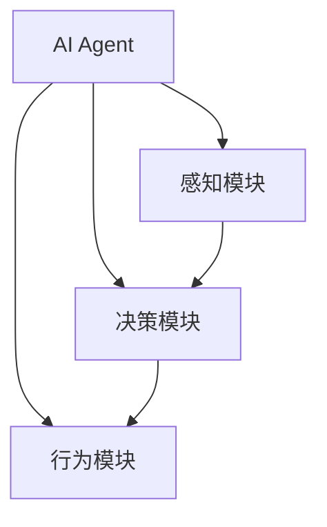
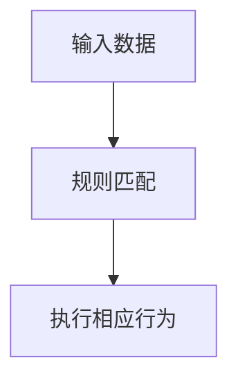
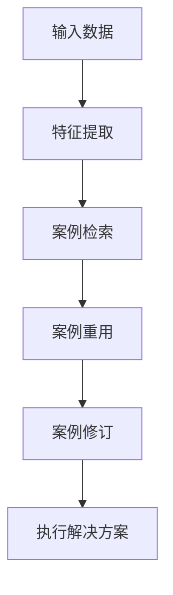
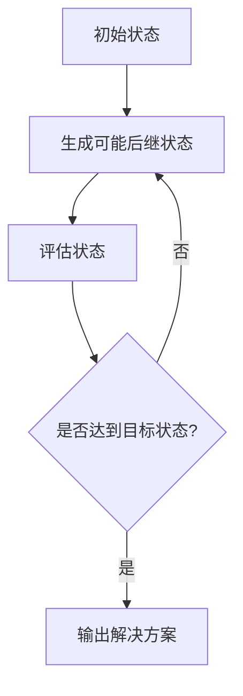
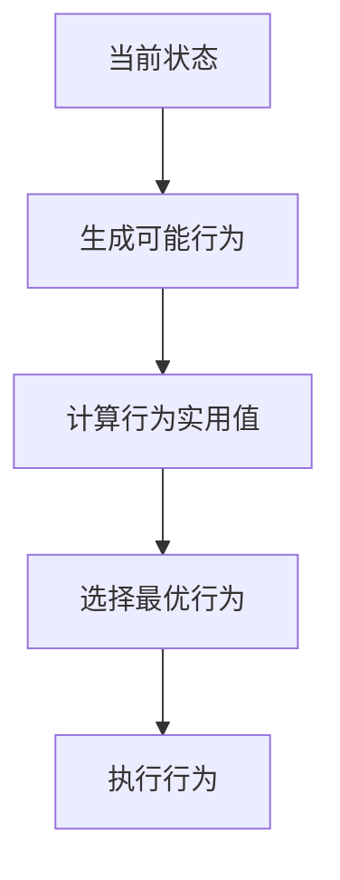
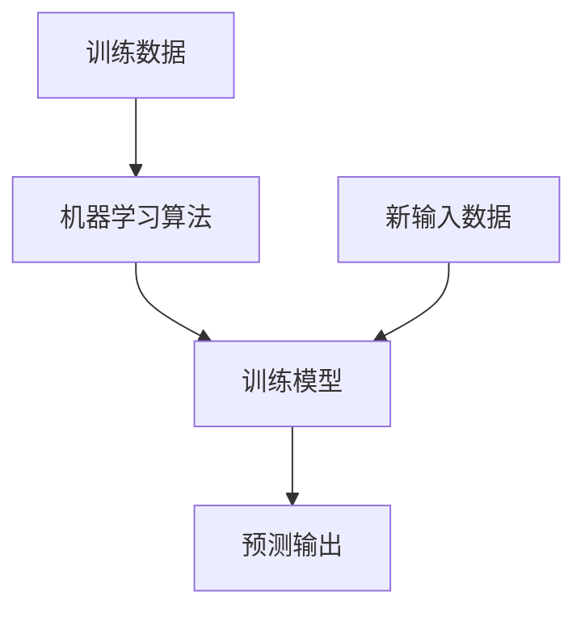

# AI人工智能 Agent：对教育的影响

## 1.背景介绍

### 1.1 人工智能的兴起

人工智能(AI)是当代科技发展的热点领域,近年来受到了广泛关注和快速发展。AI技术的突破不仅为我们带来了智能硬件和软件,更重要的是赋予了计算机以智能,使其能够模拟人类的认知过程,如学习、推理、感知和决策等。

### 1.2 教育领域的挑战

教育是人类社会的基石,对于个人成长和国家发展都至关重要。然而,传统的教育模式面临着诸多挑战,如教育资源分配不均、教学方式单一、个性化学习支持不足等。这些问题阻碍了教育公平性和质量的提高。

### 1.3 AI在教育中的应用

AI技术为解决教育领域的难题带来了新的契机。AI智能代理(Agent)作为AI技术的重要组成部分,正在为教育领域注入新的活力。AI Agent可以模拟教师的部分功能,为学生提供个性化的学习支持、自适应的教学内容以及智能的评估反馈。

## 2.核心概念与联系

### 2.1 什么是AI Agent?

AI Agent是一种具有自主性、反应性、主动性和持续时间概念的软件实体。它能够感知环境,并根据设定的目标做出理性决策和行为。AI Agent通常由以下几个核心模块组成:



1. **感知模块**:接收来自环境的数据输入,对输入数据进行预处理和特征提取。
2. **决策模块**:基于感知模块的输出和Agent的目标,运行决策算法做出行为决策。
3. **行为模块**:执行决策模块的决策,对环境产生影响或作出响应。

### 2.2 AI Agent在教育中的作用

在教育领域,AI Agent可以扮演多种角色,主要包括:

1. **智能教学助手**:提供个性化的学习资源推荐、解答问题、评估学习进度等辅助教学功能。
2. **智能学习伙伴**:模拟人类学习者,与学生进行互动学习、讨论和实践。
3. **课程管理员**:管理课程内容、安排教学进度、组织在线考试等。
4. **教学质量分析师**:分析学生学习数据,评估教学效果,为教学优化提供决策支持。

通过AI Agent,教育可以更加智能化、个性化和高效化,从而提高教育质量和学习体验。

## 3.核心算法原理具体操作步骤

AI Agent的核心是其决策模块,决定了Agent的行为和智能水平。常见的决策算法包括:

### 3.1 基于规则的决策

基于规则的决策系统由一系列条件-行为规则组成,遵循"如果...那么..."的模式。这种方法简单直观,但缺乏灵活性和可扩展性。



### 3.2 基于案例的决策

该方法基于过去解决类似问题的案例,通过案例库查找与当前问题最相似的案例,并适当调整以得到新的解决方案。



### 3.3 基于目标的决策

该方法将问题建模为一个由初始状态、目标状态和可执行操作组成的状态空间。Agent通过搜索算法在状态空间中寻找能够达到目标状态的操作序列。



### 3.4 基于实用函数的决策

该方法为每个可能的行为定义一个实用函数,表示该行为对于达成目标的价值。Agent选择具有最大期望实用值的行为执行。



### 3.5 基于机器学习的决策

通过从大量数据中学习,AI Agent可以自主发现数据模式并做出决策。常见的机器学习算法包括监督学习、非监督学习、强化学习等。



不同的决策算法适用于不同的场景和任务。在实际应用中,AI Agent通常会结合多种算法,形成复杂的混合决策系统。

## 4.数学模型和公式详细讲解举例说明

AI Agent的决策过程通常涉及数学建模和计算。以下是一些常见的数学模型和公式:

### 4.1 马尔可夫决策过程(MDP)

马尔可夫决策过程是强化学习中常用的数学框架,用于描述一个完全可观测的、随机决策过程。MDP通常由一个五元组 $(S, A, P, R, \gamma)$ 定义:

- $S$ 是有限的状态集合
- $A$ 是有限的行为集合
- $P(s' | s, a)$ 是状态转移概率,表示在状态 $s$ 执行行为 $a$ 后,转移到状态 $s'$ 的概率
- $R(s, a, s')$ 是奖励函数,表示在状态 $s$ 执行行为 $a$ 后,转移到状态 $s'$ 获得的即时奖励
- $\gamma \in [0, 1)$ 是折现因子,用于权衡即时奖励和长期累积奖励

在MDP中,Agent的目标是找到一个策略 $\pi: S \rightarrow A$,使得期望的累积折现奖励最大化:

$$
\max_\pi \mathbb{E}\left[ \sum_{t=0}^\infty \gamma^t R(s_t, a_t, s_{t+1}) \right]
$$

其中 $s_0$ 是初始状态, $a_t = \pi(s_t)$, $s_{t+1} \sim P(s_{t+1} | s_t, a_t)$。

### 4.2 Q-Learning算法

Q-Learning是一种常用的强化学习算法,用于在MDP中学习最优策略。它维护一个Q函数 $Q(s, a)$,表示在状态 $s$ 执行行为 $a$ 后,可获得的期望累积奖励。Q函数通过以下迭代式进行更新:

$$
Q(s_t, a_t) \leftarrow Q(s_t, a_t) + \alpha \left[ r_t + \gamma \max_{a'} Q(s_{t+1}, a') - Q(s_t, a_t) \right]
$$

其中 $\alpha$ 是学习率, $r_t$ 是立即奖励, $\gamma$ 是折现因子。通过不断更新Q函数,Agent可以逐步学习到最优策略 $\pi^*(s) = \arg\max_a Q(s, a)$。

### 4.3 多臂老虎机问题

多臂老虎机问题是一个经典的探索与利用权衡问题。假设有 $K$ 个老虎机臂,每个臂 $k$ 的奖励 $X_k$ 服从未知的概率分布 $\nu_k$,目标是最大化期望累积奖励 $\mathbb{E}[\sum_{t=1}^T X_{I_t}]$。其中 $I_t$ 表示在时间 $t$ 选择的臂。

一种常用的解决方案是Upper Confidence Bound (UCB)算法。UCB在每个时间步 $t$ 选择具有最大置信上界的臂:

$$
I_t = \arg\max_{1 \leq k \leq K} \left[ \bar{X}_{n_k(t-1), k} + \sqrt{\frac{2\ln t}{n_k(t-1)}} \right]
$$

其中 $\bar{X}_{n_k(t-1), k}$ 是在时间 $t-1$ 之前,臂 $k$ 的平均奖励, $n_k(t-1)$ 是在时间 $t-1$ 之前,臂 $k$ 被选择的次数。UCB算法在探索(选择未知的臂)和利用(选择已知的高奖励臂)之间达成了良好的权衡。

这些数学模型和算法为AI Agent的决策提供了理论基础,是实现智能行为的关键。

## 5.项目实践:代码实例和详细解释说明

为了更好地理解AI Agent的工作原理,我们将通过一个简单的示例项目来实践基于Q-Learning的强化学习Agent。

### 5.1 项目概述

我们将构建一个基于Q-Learning的Agent,使其能够在一个简单的网格世界中找到从起点到终点的最短路径。网格世界由一个二维数组表示,其中0表示可走区域,1表示障碍物。Agent可以执行上下左右四个动作,到达终点后获得奖励。

### 5.2 环境设置

```python
import numpy as np

# 网格世界
WORLD = np.array([[0, 0, 0, 0],
                  [0, 1, 0, 0],
                  [0, 0, 0, 0],
                  [0, 0, 0, 0]])

# 起点和终点
START = (0, 0)
GOAL = (3, 3)

# 动作
ACTIONS = ['up', 'down', 'left', 'right']

# 奖励
REWARD = {
    'goal': 100,
    'blocked': -10,
    'step': -1
}
```

### 5.3 Q-Learning Agent实现

```python
import random

class QLearningAgent:
    def __init__(self, world, actions, alpha=0.1, gamma=0.9, epsilon=0.1):
        self.world = world
        self.actions = actions
        self.alpha = alpha  # 学习率
        self.gamma = gamma  # 折现因子
        self.epsilon = epsilon  # 探索率
        self.q_table = {}  # Q表

    def get_q_value(self, state, action):
        key = str(state) + action
        return self.q_table.get(key, 0.0)

    def update_q_value(self, state, action, reward, next_state):
        key = str(state) + action
        next_max_q = max([self.get_q_value(next_state, a) for a in self.actions])
        new_q = reward + self.gamma * next_max_q
        self.q_table[key] = self.get_q_value(state, action) + self.alpha * (new_q - self.get_q_value(state, action))

    def get_action(self, state):
        if random.random() < self.epsilon:
            return random.choice(self.actions)  # 探索
        else:
            return max((self.get_q_value(state, a), a) for a in self.actions)[1]  # 利用

    def run(self, start, goal, max_episodes=1000):
        for episode in range(max_episodes):
            state = start
            done = False
            while not done:
                action = self.get_action(state)
                next_state, reward, done = self.step(state, action, goal)
                self.update_q_value(state, action, reward, next_state)
                state = next_state

    def step(self, state, action, goal):
        row, col = state
        if action == 'up':
            next_state = (max(row - 1, 0), col)
        elif action == 'down':
            next_state = (min(row + 1, self.world.shape[0] - 1), col)
        elif action == 'left':
            next_state = (row, max(col - 1, 0))
        elif action == 'right':
            next_state = (row, min(col + 1, self.world.shape[1] - 1))

        if self.world[next_state] == 1:  # 障碍物
            reward = REWARD['blocked']
            return state, reward, False

        if next_state == goal:  # 到达终点
            reward = REWARD['goal']
            return next_state, reward, True

        reward = REWARD['step']
        return next_state, reward, False
```

### 5.4 运行结果

```python
agent = QLearningAgent(WORLD, ACTIONS)
agent.run(START, GOAL)

# 打印Q表
for state in [(0, 0), (0, 1), (0, 2), (0, 3),
              (1, 0), (1, 2), (1, 3),
              (2, 0), (2, 1), (2, 2), (2, 3),
              (3, 0), (3, 1), (3,