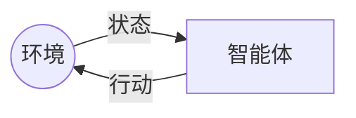
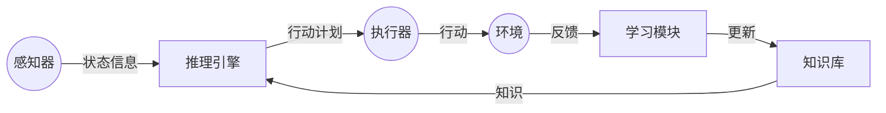

# AI人工智能 Agent：智能体与环境的交互理论

## 1.背景介绍

### 1.1 什么是智能体

在人工智能领域中,智能体(Agent)是指能够感知环境、处理信息、做出决策并采取行动的实体。智能体可以是软件程序、机器人或其他具有一定智能的系统。它们通过与环境进行交互来实现特定的目标或任务。

智能体的概念源于对智能行为的研究,旨在模拟和理解生物智能系统(如人类和动物)是如何感知、思考和行动的。智能体理论为构建智能系统提供了一种通用框架和方法论。

### 1.2 智能体与环境的交互

智能体与环境之间存在着持续的交互过程。智能体通过感知器(Sensors)获取环境状态信息,并基于这些信息做出决策,然后通过执行器(Actuators)对环境采取相应的行动。环境的变化又会反过来影响智能体的感知,形成一个闭环过程。

这种交互过程可以用一个简单的模型来描述:



智能体与环境的交互是一个动态的、持续的过程,智能体需要不断地感知、决策和行动,以适应环境的变化并实现自身的目标。

## 2.核心概念与联系

### 2.1 智能体的结构

一个典型的智能体系统由以下几个核心组件组成:

1. **感知器(Sensors)**: 用于获取环境状态信息,如视觉、听觉、触觉等传感器。
2. **执行器(Actuators)**: 用于执行智能体的行动,如机器人的机械臂、电机等执行机构。
3. **知识库(Knowledge Base)**: 存储智能体所拥有的知识,包括事实、规则、模型等。
4. **推理引擎(Inference Engine)**: 根据知识库和感知信息,进行推理和决策,生成行动计划。
5. **学习模块(Learning Module)**: 通过与环境的交互,不断更新和优化智能体的知识和决策策略。

这些组件相互协作,构成了一个完整的智能体系统。



### 2.2 智能体与环境的属性

为了更好地理解和设计智能体系统,我们需要考虑智能体和环境的各种属性:

- **环境的属性**:
  - 可观测性(Observability): 智能体是否能完全观测到环境的状态。
  - 确定性(Determinism): 环境的变化是否具有确定性。
  - 序贯性(Sequentiality): 环境的变化是否依赖于智能体的行动历史。
  - 静态性(Staticness): 环境在智能体行动之外是否会发生变化。
  - 离散性(Discreteness): 环境的状态、行动空间是否是离散的。

- **智能体的属性**:
  - 自主性(Autonomy): 智能体是否能够独立做出决策和行动。
  - 理性性(Rationality): 智能体是否能够采取最优的行动来实现目标。
  - 学习能力(Learning Ability): 智能体是否能够通过经验来改进自身的行为。
  - 移动性(Mobility): 智能体是否能够在环境中移动。
  - 持续性(Continuity): 智能体是否持续运行,还是一次性任务。

根据这些属性的不同组合,我们可以设计出不同类型的智能体系统,以适应不同的应用场景和需求。

## 3.核心算法原理具体操作步骤

### 3.1 智能体决策过程

智能体的核心任务是根据感知到的环境状态做出合理的决策,并采取相应的行动。这个决策过程可以概括为以下几个步骤:

1. **状态表示(State Representation)**: 将感知到的原始环境信息转换为内部状态表示,以便进行处理和推理。
2. **状态评估(State Evaluation)**: 根据智能体的目标和知识,评估当前状态的价值或效用。
3. **行动选择(Action Selection)**: 基于状态评估结果,选择最优的行动或行动序列。
4. **行动执行(Action Execution)**: 通过执行器执行选定的行动,对环境产生影响。
5. **学习更新(Learning and Updating)**: 根据行动的结果和环境的反馈,更新智能体的知识库和决策策略。

这个过程是一个循环的过程,智能体需要不断地感知、决策、行动和学习,以适应环境的变化并优化自身的行为。

### 3.2 常见决策算法

在智能体决策过程中,常见的算法有:

1. **搜索算法(Search Algorithms)**: 在状态空间中搜索最优解,如深度优先搜索、广度优先搜索、A*算法等。
2. **规划算法(Planning Algorithms)**: 生成一系列行动来实现目标,如情景规划、层次任务网络规划等。
3. **马尔可夫决策过程(Markov Decision Processes, MDPs)**: 基于概率模型进行决策,如价值迭代、策略迭代等。
4. **强化学习算法(Reinforcement Learning Algorithms)**: 通过与环境的交互来学习最优策略,如Q-Learning、深度Q网络等。
5. **启发式算法(Heuristic Algorithms)**: 使用经验知识和规则进行决策,如专家系统、fuzzy逻辑等。

不同的算法适用于不同的场景和问题,需要根据具体情况进行选择和组合。例如,在完全可观测的确定性环境中,搜索算法和规划算法可能更有效;而在部分可观测或随机环境中,强化学习算法可能更加合适。

## 4.数学模型和公式详细讲解举例说明

### 4.1 马尔可夫决策过程(MDP)

马尔可夫决策过程(Markov Decision Process, MDP)是一种广泛应用于智能体决策的数学框架。它描述了一个智能体在一个随机环境中做出序列决策的过程。

一个MDP可以用一个元组 $\langle S, A, T, R, \gamma \rangle$ 来表示,其中:

- $S$ 是有限的状态集合
- $A$ 是有限的行动集合
- $T(s, a, s')$ 是状态转移概率,表示在状态 $s$ 下执行行动 $a$ 后转移到状态 $s'$ 的概率
- $R(s, a, s')$ 是即时奖励函数,表示在状态 $s$ 下执行行动 $a$ 后转移到状态 $s'$ 所获得的奖励
- $\gamma \in [0, 1)$ 是折现因子,用于平衡即时奖励和未来奖励的权重

智能体的目标是找到一个策略 $\pi: S \rightarrow A$,使得期望的累积折现奖励最大化:

$$
\max_\pi \mathbb{E}\left[ \sum_{t=0}^\infty \gamma^t R(s_t, a_t, s_{t+1}) \right]
$$

其中 $s_0$ 是初始状态, $a_t = \pi(s_t)$ 是在状态 $s_t$ 下执行的行动。

### 4.2 价值函数和贝尔曼方程

在MDP中,我们定义状态价值函数 $V^\pi(s)$ 为在状态 $s$ 下执行策略 $\pi$ 所能获得的期望累积折现奖励:

$$
V^\pi(s) = \mathbb{E}_\pi\left[ \sum_{t=0}^\infty \gamma^t R(s_t, a_t, s_{t+1}) \mid s_0 = s \right]
$$

同样,我们定义行动价值函数 $Q^\pi(s, a)$ 为在状态 $s$ 下执行行动 $a$,然后按照策略 $\pi$ 执行所能获得的期望累积折现奖励:

$$
Q^\pi(s, a) = \mathbb{E}_\pi\left[ \sum_{t=0}^\infty \gamma^t R(s_t, a_t, s_{t+1}) \mid s_0 = s, a_0 = a \right]
$$

价值函数和行动价值函数满足以下贝尔曼方程:

$$
\begin{aligned}
V^\pi(s) &= \sum_{a \in A} \pi(s, a) \sum_{s' \in S} T(s, a, s') \left[ R(s, a, s') + \gamma V^\pi(s') \right] \\
Q^\pi(s, a) &= \sum_{s' \in S} T(s, a, s') \left[ R(s, a, s') + \gamma \sum_{a' \in A} \pi(s', a') Q^\pi(s', a') \right]
\end{aligned}
$$

这些方程为我们提供了一种计算价值函数和行动价值函数的方法,同时也为寻找最优策略提供了基础。

### 4.3 价值迭代和策略迭代

价值迭代(Value Iteration)和策略迭代(Policy Iteration)是两种常用的求解MDP的算法。

**价值迭代**通过不断更新状态价值函数 $V(s)$,直到收敛到最优价值函数 $V^*(s)$:

$$
V_{k+1}(s) = \max_{a \in A} \sum_{s' \in S} T(s, a, s') \left[ R(s, a, s') + \gamma V_k(s') \right]
$$

然后根据最优价值函数得到最优策略 $\pi^*(s) = \arg\max_a \sum_{s'} T(s, a, s') \left[ R(s, a, s') + \gamma V^*(s') \right]$。

**策略迭代**则先初始化一个策略 $\pi_0$,然后不断评估和改进策略,直到收敛到最优策略 $\pi^*$:

1. 策略评估: 计算当前策略 $\pi_i$ 下的状态价值函数 $V^{\pi_i}$
2. 策略改进: 对于每个状态 $s$,找到一个行动 $a$ 使得 $Q^{\pi_i}(s, a) \geq V^{\pi_i}(s)$,构造新策略 $\pi_{i+1}(s) = a$
3. 如果 $\pi_{i+1} = \pi_i$,则停止迭代,否则继续下一轮迭代

这两种算法都能够找到MDP的最优解,但在不同情况下有不同的优缺点和适用性。

## 5.项目实践:代码实例和详细解释说明

为了更好地理解智能体与环境的交互,我们可以通过一个简单的网格世界(Gridworld)示例来实践。在这个示例中,智能体需要在一个二维网格中找到目标位置。

### 5.1 环境设置

我们定义一个 $4 \times 4$ 的网格世界,其中包含以下元素:

- 起始位置 (S)
- 目标位置 (G)
- 障碍物 (X)
- 空白格子 (-)

示例环境如下:

```
-----
-SX--
--XG-
-----
```

智能体可以执行四种行动:上、下、左、右,每次移动一个格子。如果移动到障碍物或边界,则保持原位置不动。到达目标位置即获得奖励,并重置环境。

### 5.2 智能体实现

我们使用强化学习算法来训练智能体,具体采用 Q-Learning 算法。Q-Learning 通过不断与环境交互,学习状态-行动对的价值函数 $Q(s, a)$,并根据这个价值函数来选择行动。

以下是 Python 代码实现:

```python
import numpy as np

# 环境设置
WORLD = np.array([
    [0, 0, 0, 0],
    [0, 1, 2, 0],
    [0, 2, 3, 0],
    [0, 0, 0, 0]
])

# 定义行动
ACTIONS = ['up', 'down', 'left', 'right']

# 初始化 Q 表
Q = np.zeros((WORLD.size, len(ACTIONS)))

# 超参数
ALPHA = 0.1     # 学习率
GAMMA = 0.9     # 折现因子
EPSILON = 0.1   # 探索概率

# 训练函数
def train(episodes):
    for _ in range(episodes):
        # 初始化状态
        state = 1
        done =