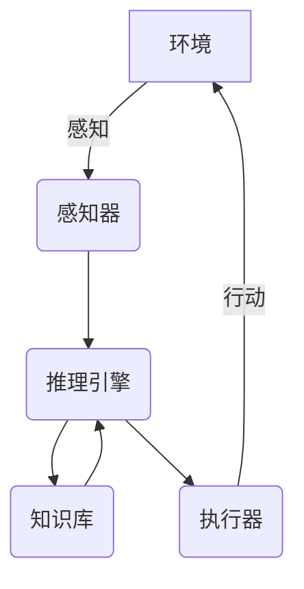

# AI人工智能 Agent：真实世界的智能体应用案例

## 1.背景介绍

### 1.1 人工智能的崛起

人工智能(AI)已经成为当今科技发展的核心驱动力,正在深刻改变着我们的生活、工作和社会。随着算力的不断增长、数据量的激增以及算法的不断创新,AI技术在诸多领域取得了令人瞩目的进展,展现出前所未有的能力。

### 1.2 智能体(Agent)的重要性

在人工智能的大环境下,智能体(Agent)作为能够感知环境、学习并采取行动以实现既定目标的自主系统,扮演着至关重要的角色。智能体可以是软件代理、机器人、智能助手等,它们需要具备一定的感知、决策和行动能力,以便在复杂的环境中高效运行。

### 1.3 智能体应用的挑战

尽管智能体技术取得了长足进步,但在真实世界的应用中仍面临诸多挑战,例如:

- 环境复杂性:真实环境往往是高度动态、不确定和多变的,需要智能体具备强大的适应性。
- 实时决策:智能体通常需要在有限时间内作出准确决策,对其实时响应能力提出了很高要求。
- 可解释性:智能体的决策过程应当具有可解释性,以获得人类的信任和接受。
- 安全性和伦理性:确保智能体在应用过程中的安全性和符合伦理原则,是一个亟待解决的重大课题。

## 2.核心概念与联系

### 2.1 智能体(Agent)

智能体是指能够感知环境、学习并采取行动以实现既定目标的自主系统。智能体通常由以下几个核心组件构成:

- 感知器(Sensor):用于获取环境信息。
- 执行器(Actuator):用于在环境中执行动作。
- 知识库(Knowledge Base):存储智能体的知识和经验。
- 推理引擎(Reasoning Engine):根据感知信息和知识库,决策下一步行动。



### 2.2 强化学习(Reinforcement Learning)

强化学习是训练智能体的一种重要范式,通过与环境的互动来学习如何采取最优行动。在强化学习中,智能体(Agent)与环境(Environment)交互,根据采取的行动(Action)获得奖励(Reward),目标是最大化预期的累积奖励。


### 2.3 深度学习在智能体中的应用

深度学习技术在智能体系统中发挥着重要作用,尤其是在感知、决策和控制等方面:

- 计算机视觉:用于目标检测、图像分类等视觉任务。
- 自然语言处理:用于语音识别、机器翻译、对话系统等。
- 决策制定:通过强化学习等技术优化决策过程。
- 运动控制:在机器人等领域用于精确控制。

## 3.核心算法原理具体操作步骤  

### 3.1 Q-Learning算法

Q-Learning是强化学习中最著名和最广泛使用的算法之一,它允许智能体在与环境交互的过程中学习如何最大化预期的累积奖励。算法的核心思想是估计一个Q函数,该函数将状态-行动对映射到预期的累积奖励。

算法步骤:

1. 初始化Q函数,通常将所有状态-行动对的值设置为0或小的常数值。
2. 对于每个时间步:
    - 观察当前状态s
    - 选择行动a(通常使用ε-贪婪策略,在探索和利用之间进行权衡)
    - 执行行动a,观察奖励r和下一个状态s'
    - 更新Q(s,a)值:
        $$Q(s,a) \leftarrow Q(s,a) + \alpha[r + \gamma\max_{a'}Q(s',a') - Q(s,a)]$$
        其中,α是学习率,γ是折扣因子。

3. 重复步骤2,直到收敛或满足停止条件。

通过不断更新Q函数,智能体最终可以学习到一个近似最优的策略,即在每个状态下选择具有最大Q值的行动。

### 3.2 策略梯度算法(Policy Gradient)

策略梯度算法是另一种常用的强化学习算法,它直接学习一个策略函数,该函数将状态映射到行动的概率分布。与Q-Learning不同,策略梯度算法不需要估计Q函数,而是通过梯度上升来优化策略函数的参数。

算法步骤:

1. 初始化策略函数π(a|s;θ),其中θ是参数向量。
2. 对于每个时间步:
    - 观察当前状态s
    - 根据策略函数π(a|s;θ)采样行动a
    - 执行行动a,观察奖励r和下一个状态s'
    - 累积奖励R
3. 更新策略参数θ,使用梯度上升:
    $$\theta \leftarrow \theta + \alpha\nabla_\theta\log\pi(a|s;\theta)R$$
    其中,α是学习率。

4. 重复步骤2和3,直到收敛或满足停止条件。

策略梯度算法的优点是能够直接学习随机策略,并且可以处理连续的行动空间。但它也面临着高方差和收敛缓慢等挑战。

## 4.数学模型和公式详细讲解举例说明

在智能体系统中,数学模型和公式扮演着重要角色,用于描述和优化智能体的行为。以下是一些常见的数学模型和公式:

### 4.1 马尔可夫决策过程(Markov Decision Process, MDP)

马尔可夫决策过程是强化学习中最基本的数学框架,它将智能体与环境的交互建模为一个离散时间随机过程。MDP由以下几个组成部分构成:

- 状态集合S
- 行动集合A
- 转移概率P(s'|s,a),表示在状态s下执行行动a后,转移到状态s'的概率
- 奖励函数R(s,a,s'),表示在状态s下执行行动a并转移到状态s'时获得的奖励

在MDP中,智能体的目标是找到一个策略π,使得预期的累积奖励最大化:

$$\max_\pi \mathbb{E}\left[\sum_{t=0}^\infty \gamma^t R(s_t, a_t, s_{t+1})\right]$$

其中,γ是折扣因子,用于平衡即时奖励和长期奖励。

### 4.2 值函数(Value Function)

值函数是MDP中另一个重要概念,它表示在给定策略π下,从某个状态s开始执行后,预期能获得的累积奖励。有两种常见的值函数:

- 状态值函数V(s):
    $$V^\pi(s) = \mathbb{E}_\pi\left[\sum_{t=0}^\infty \gamma^t R(s_t, a_t, s_{t+1})\mid s_0=s\right]$$
- 行动值函数Q(s,a):
    $$Q^\pi(s,a) = \mathbb{E}_\pi\left[\sum_{t=0}^\infty \gamma^t R(s_t, a_t, s_{t+1})\mid s_0=s, a_0=a\right]$$

值函数满足以下递推关系,也称为Bellman方程:

$$V^\pi(s) = \sum_{a\in A}\pi(a|s)\sum_{s'\in S}P(s'|s,a)\left[R(s,a,s') + \gamma V^\pi(s')\right]$$
$$Q^\pi(s,a) = \sum_{s'\in S}P(s'|s,a)\left[R(s,a,s') + \gamma \sum_{a'\in A}\pi(a'|s')Q^\pi(s',a')\right]$$

通过求解Bellman方程,我们可以获得最优值函数V*和Q*,从而导出最优策略π*。

### 4.3 策略梯度定理(Policy Gradient Theorem)

策略梯度定理为直接优化策略函数提供了理论基础。假设策略π由参数θ参数化,则目标是最大化预期的累积奖励J(θ):

$$J(\theta) = \mathbb{E}_{\tau\sim\pi_\theta}\left[\sum_{t=0}^\infty \gamma^t R(s_t, a_t, s_{t+1})\right]$$

其中,τ表示一个轨迹序列(s_0, a_0, r_0, s_1, a_1, r_1, ...)。

根据策略梯度定理,J(θ)关于θ的梯度可以表示为:

$$\nabla_\theta J(\theta) = \mathbb{E}_{\tau\sim\pi_\theta}\left[\sum_{t=0}^\infty \nabla_\theta\log\pi_\theta(a_t|s_t)Q^{\pi_\theta}(s_t,a_t)\right]$$

这个公式为我们提供了一种无偏估计,可以用于通过梯度上升来优化策略参数θ。

以上是一些常见的数学模型和公式,在实际应用中,还可能需要引入其他更复杂的模型和技术,如深度神经网络、蒙特卡罗树搜索等。

## 5.项目实践:代码实例和详细解释说明

为了更好地理解智能体系统的实现,我们将通过一个简单的网格世界示例,演示如何使用Python和强化学习库来训练一个智能体。

### 5.1 问题描述

考虑一个4x4的网格世界,智能体(Agent)的目标是从起点(0,0)到达终点(3,3)。每一步,智能体可以选择上下左右四个方向中的一个进行移动。如果移动到了障碍物格子,则会停留在原地。智能体获得的奖励为:

- 到达终点:+1
- 其他情况:-0.04(小惩罚,鼓励智能体尽快到达终点)

我们将使用Q-Learning算法训练智能体,以学习一个最优策略。

### 5.2 代码实现

```python
import numpy as np
import matplotlib.pyplot as plt
from matplotlib import colors
import random

# 定义网格世界
WORLD_SIZE = 4
OBSTACLE_COORDS = [(1,1), (2,1), (3,2)]
START_STATE = (0, 0)
GOAL_STATE = (3, 3)

# 定义动作
ACTIONS = ['up', 'down', 'left', 'right']
ACTION_VECTORS = {'up': (-1, 0), 'down': (1, 0), 'left': (0, -1), 'right': (0, 1)}

# 定义Q-Learning参数
ALPHA = 0.1  # 学习率
GAMMA = 0.9  # 折扣因子
EPSILON = 0.1  # 探索率
MAX_EPISODES = 10000  # 最大训练回合数

# 初始化Q表
Q = np.zeros((WORLD_SIZE, WORLD_SIZE, len(ACTIONS)))

# 定义奖励函数
def get_reward(state):
    if state == GOAL_STATE:
        return 1
    elif state in OBSTACLE_COORDS:
        return -1
    else:
        return -0.04

# 定义状态转移函数
def get_next_state(state, action):
    row, col = state
    row_step, col_step = ACTION_VECTORS[action]
    new_row = max(0, min(row + row_step, WORLD_SIZE - 1))
    new_col = max(0, min(col + col_step, WORLD_SIZE - 1))
    new_state = (new_row, new_col)
    return new_state

# Q-Learning训练
for episode in range(MAX_EPISODES):
    state = START_STATE
    done = False
    while not done:
        # 选择行动
        if random.uniform(0, 1) < EPSILON:
            action = random.choice(ACTIONS)  # 探索
        else:
            action = ACTIONS[np.argmax(Q[state])]  # 利用

        # 执行行动并获取下一个状态和奖励
        next_state = get_next_state(state, action)
        reward = get_reward(next_state)

        # 更新Q值
        Q[state][ACTIONS.index(action)] += ALPHA * (reward + GAMMA * np.max(Q[next_state]) - Q[state][ACTIONS.index(action)])

        # 更新状态
        state = next_state

        # 检查是否到达终点
        if state == GOAL_STATE:
            done = True

# 可视化最优策略
fig, ax = plt.subplots(figsize=(5, 5))
cmap = colors.ListedColormap(['white', 'black', 'green', 'red'])
bounds = [-1, -0.5, 0,