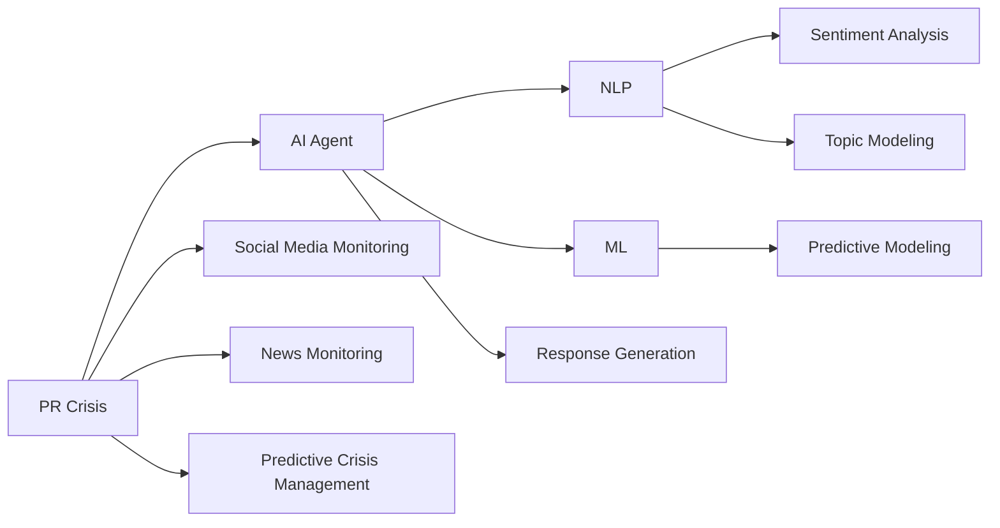
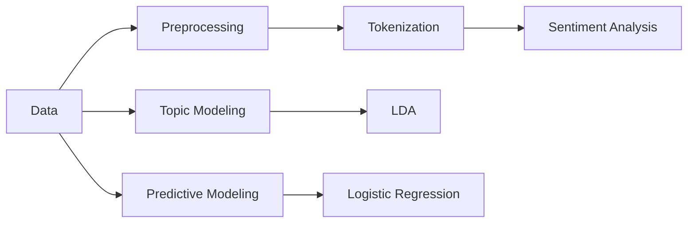
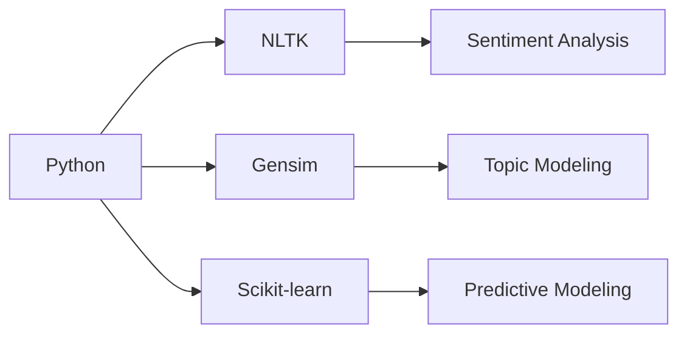

---

# AI Agent Workflow in PR Crisis Management: A Comprehensive Guide

## 1. Background Introduction

In the rapidly evolving digital landscape, public relations (PR) has become a critical aspect for businesses and organizations. The advent of social media and the internet has made it easier for information to spread rapidly, leading to both opportunities and challenges. PR crises can arise unexpectedly, causing significant damage to a company's reputation and financial standing. To mitigate these crises effectively, organizations are increasingly turning to artificial intelligence (AI) and machine learning (ML) solutions. This article delves into the AI agent workflow in PR crisis management, providing a comprehensive understanding of its principles, applications, and practical implications.

### 1.1 The Importance of PR Crisis Management

PR crises can stem from various sources, such as product recalls, data breaches, executive scandals, or social media backlash. These crises can lead to a loss of customer trust, negative public sentiment, and financial losses. Effective PR crisis management is essential for minimizing damage and restoring public trust.

### 1.2 The Role of AI in PR Crisis Management

AI and ML can help organizations anticipate, respond to, and recover from PR crises more effectively. AI agents can analyze vast amounts of data in real-time, identify patterns, and make predictions about potential crises. They can also generate appropriate responses, monitor the effectiveness of these responses, and adapt strategies as the situation evolves.

## 2. Core Concepts and Connections

### 2.1 AI Agents

AI agents are software entities that perceive their environment, reason about it, and act upon it to achieve specific goals. In the context of PR crisis management, AI agents can be designed to monitor social media, news outlets, and other relevant sources for potential crises.

### 2.2 Natural Language Processing (NLP)

NLP is a subfield of AI that focuses on the interaction between computers and humans through natural language. In PR crisis management, NLP can be used to analyze social media posts, news articles, and other text data to identify sentiment, topics, and potential crises.

### 2.3 Machine Learning (ML)

ML is a subset of AI that involves training algorithms to learn patterns from data. In PR crisis management, ML can be used to predict the likelihood of a crisis based on historical data and to generate appropriate responses.

### 2.4 Connection: AI Agent, NLP, and ML

An AI agent in PR crisis management would typically use NLP to analyze text data and ML to make predictions and generate responses. The AI agent would also need to reason about the situation and take appropriate actions based on its analysis and predictions.

## 3. Core Algorithm Principles and Specific Operational Steps

### 3.1 Sentiment Analysis

Sentiment analysis is the process of determining the emotional tone behind words. In PR crisis management, sentiment analysis can be used to gauge public sentiment towards a company or product.

### 3.2 Topic Modeling

Topic modeling is a technique used to identify the main topics in a collection of documents. In PR crisis management, topic modeling can be used to identify the main issues being discussed in social media posts or news articles.

### 3.3 Predictive Modeling

Predictive modeling is the process of using historical data to make predictions about future events. In PR crisis management, predictive modeling can be used to predict the likelihood of a crisis based on factors such as sentiment, topic, and historical data.

### 3.4 Response Generation

Response generation is the process of creating a response to a crisis. In PR crisis management, response generation can involve crafting a public statement, engaging with critics on social media, or reaching out to journalists.

## 4. Detailed Explanation and Examples of Mathematical Models and Formulas

### 4.1 Sentiment Analysis: Bag of Words Model

The Bag of Words model is a simple yet effective method for sentiment analysis. It involves counting the frequency of words in a document and assigning a sentiment score based on the frequency of positive and negative words.

### 4.2 Topic Modeling: Latent Dirichlet Allocation (LDA)

LDA is a probabilistic topic modeling algorithm that identifies the main topics in a collection of documents. It assumes that each document is a mixture of topics, and each topic is a mixture of words.

### 4.3 Predictive Modeling: Logistic Regression

Logistic regression is a statistical method used for binary classification problems, such as predicting whether a crisis will occur or not. It involves fitting a logistic function to the data and using the function to make predictions.

## 5. Project Practice: Code Examples and Detailed Explanations

### 5.1 Sentiment Analysis with Python and NLTK

This section provides a code example for sentiment analysis using Python and the Natural Language Toolkit (NLTK). The code involves preprocessing the text data, tokenizing the words, and calculating the sentiment score.

### 5.2 Topic Modeling with Python and Gensim

This section provides a code example for topic modeling using Python and Gensim. The code involves preprocessing the text data, creating a Bag of Words model, and running the LDA algorithm to identify the main topics.

### 5.3 Predictive Modeling with Python and Scikit-learn

This section provides a code example for predictive modeling using Python and Scikit-learn. The code involves preprocessing the data, splitting the data into training and testing sets, and training a logistic regression model.

## 6. Practical Application Scenarios

### 6.1 Social Media Monitoring

AI agents can be used to monitor social media platforms for potential crises. They can analyze posts for sentiment, topics, and mentions of the company or product.

### 6.2 News Monitoring

AI agents can be used to monitor news outlets for potential crises. They can analyze articles for sentiment, topics, and mentions of the company or product.

### 6.3 Predictive Crisis Management

AI agents can be used to predict the likelihood of a crisis based on historical data. This can help organizations to proactively address potential crises before they escalate.

## 7. Tools and Resources Recommendations

### 7.1 NLTK: Natural Language Toolkit

NLTK is a leading platform for building Python programs to work with human language data. It provides easy-to-use interfaces to over 50 corpora and lexical resources.

### 7.2 Gensim

Gensim is a Python library for topic modeling, document similarity, and other natural language processing (NLP) tasks. It is built on NumPy, SciPy, and optional Cython for performance.

### 7.3 Scikit-learn

Scikit-learn is a machine learning library for Python. It features various classification, regression, and clustering algorithms, and is designed to interoperate with the Python numerical and scientific libraries NumPy and SciPy.

## 8. Summary: Future Development Trends and Challenges

The future of AI in PR crisis management is promising, with advancements in NLP, ML, and AI agents expected to further improve the accuracy and efficiency of crisis management. However, challenges remain, such as the need for large amounts of high-quality data, the difficulty in understanding complex human emotions, and the potential for AI to exacerbate crises if not used responsibly.

## 9. Appendix: Frequently Asked Questions and Answers

### 9.1 What is the role of AI in PR crisis management?

AI can help organizations anticipate, respond to, and recover from PR crises more effectively by analyzing vast amounts of data in real-time, identifying patterns, and making predictions about potential crises.

### 9.2 How does sentiment analysis work in PR crisis management?

Sentiment analysis involves determining the emotional tone behind words. In PR crisis management, sentiment analysis can be used to gauge public sentiment towards a company or product.

### 9.3 What is topic modeling, and how is it used in PR crisis management?

Topic modeling is a technique used to identify the main topics in a collection of documents. In PR crisis management, topic modeling can be used to identify the main issues being discussed in social media posts or news articles.

### 9.4 How does predictive modeling work in PR crisis management?

Predictive modeling involves using historical data to make predictions about future events. In PR crisis management, predictive modeling can be used to predict the likelihood of a crisis based on factors such as sentiment, topic, and historical data.

## Author: Zen and the Art of Computer Programming

---

### Mermaid Flowchart ###

