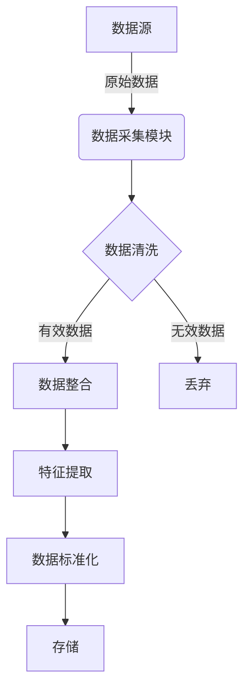
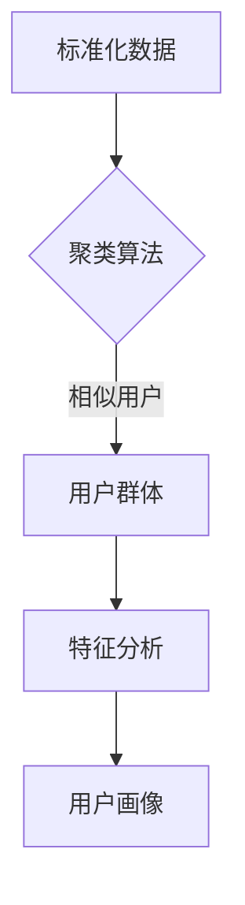
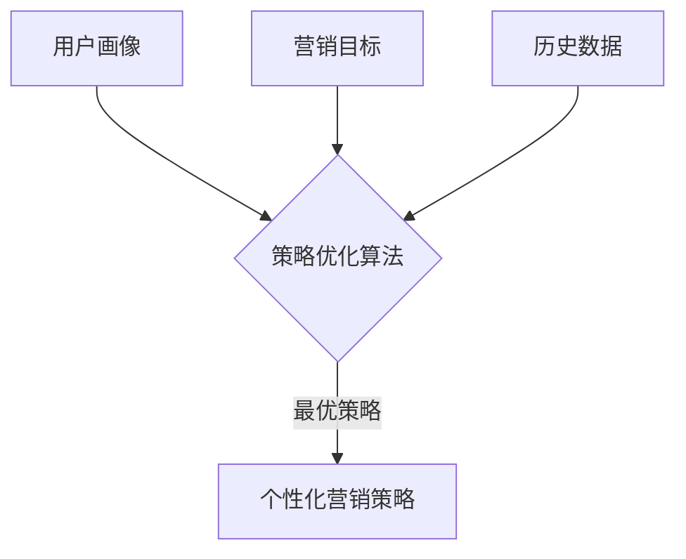
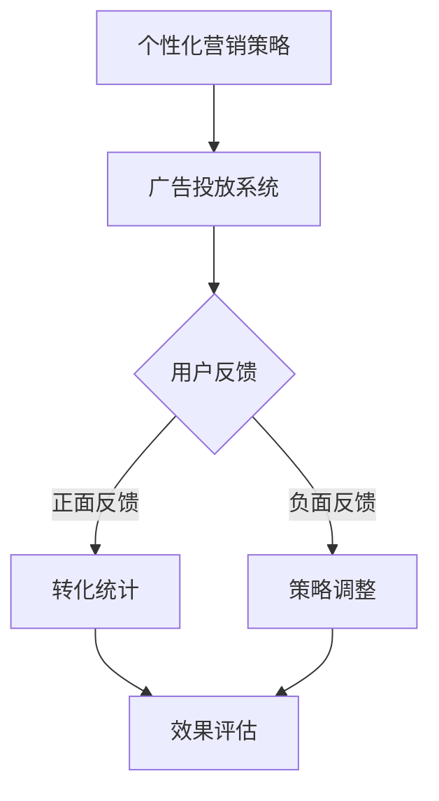

# AI人工智能代理工作流 AI Agent WorkFlow：在广告细分市场中的应用

## 1.背景介绍

### 1.1 广告细分市场的重要性

在当今竞争激烈的商业环境中,精准营销和有效的广告投放对企业的成功至关重要。通过将目标受众细分为更小的群体,企业可以更好地了解每个群体的需求和偏好,从而设计出更有针对性和吸引力的营销策略。广告细分市场正是实现这一目标的关键所在。

### 1.2 广告细分市场面临的挑战

然而,广告细分市场也面临着诸多挑战。首先,收集和处理大量用户数据是一项艰巨的任务,需要强大的数据处理能力。其次,准确识别和细分目标受众群体需要复杂的算法和模型。最后,制定个性化的营销策略并及时调整也需要高效的决策系统。

### 1.3 AI代理工作流的应用前景

AI人工智能技术在广告细分市场中的应用可以帮助企业更好地应对这些挑战。AI代理工作流(AI Agent Workflow)作为一种先进的AI系统,能够自主地收集和处理海量数据、构建精准的用户画像、制定个性化营销策略,并根据实时反馈进行动态调整,从而大幅提高广告投放的效率和转化率。

## 2.核心概念与联系

### 2.1 AI代理(AI Agent)

AI代理是AI系统中的核心组成部分,负责感知环境、决策行动并执行任务。在广告细分市场中,AI代理需要具备以下关键能力:

1. 数据采集和处理
2. 用户画像构建
3. 营销策略制定
4. 实时调整和优化

### 2.2 工作流(Workflow)

工作流描述了AI代理完成特定任务所需执行的一系列有序操作。在广告细分市场中,AI代理工作流通常包括以下几个主要步骤:

1. 数据收集和预处理
2. 用户细分和画像构建
3. 营销策略生成
4. 策略执行和效果监控
5. 反馈收集和工作流优化

### 2.3 核心概念关联

AI代理工作流将AI代理的各项能力有机结合,形成一个高效、智能的系统,用于解决广告细分市场中的各种挑战。其中,AI代理负责具体的数据处理、决策和执行任务,而工作流则确保这些操作按照合理的顺序高效地进行,并根据反馈进行持续优化。

## 3.核心算法原理具体操作步骤

### 3.1 数据收集和预处理



1. 从各种数据源(网站、移动应用、社交媒体等)收集原始用户数据
2. 对原始数据进行清洗,去除无效数据和重复数据
3. 将有效数据进行整合,构建统一的数据集
4. 从数据集中提取有用的特征,如人口统计、兴趣爱好、浏览习惯等
5. 对提取的特征数据进行标准化处理,消除量纲影响
6. 将处理后的数据存储到数据库或数据仓库中,为后续分析做准备

### 3.2 用户细分和画像构建



1. 利用聚类算法(如K-Means、DBSCAN等)对标准化数据进行分析,将相似用户划分到同一个群体
2. 分析每个用户群体的特征分布,确定该群体的典型特征
3. 根据典型特征构建用户画像,描述该群体的人口统计学、兴趣爱好、行为习惯等特点

### 3.3 营销策略生成



1. 根据构建的用户画像,结合营销目标(如提高转化率、增加收入等)和历史营销数据,利用策略优化算法(如强化学习、多臂老虎机等)生成个性化的营销策略
2. 营销策略包括广告创意、投放渠道、定价策略、促销活动等多个方面的内容,旨在最大化营销效果

### 3.4 策略执行和效果监控



1. 将生成的个性化营销策略部署到广告投放系统中执行
2. 监控用户对广告的反馈,包括点击、购买等正面反馈,以及关闭、投诉等负面反馈
3. 统计正面反馈所带来的转化效果,如销售额、注册用户数等
4. 对策略效果进行评估,如果效果不理想,则根据反馈对策略进行调整
5. 持续优化策略,形成闭环,不断提高营销效率

## 4.数学模型和公式详细讲解举例说明

在AI代理工作流中,涉及了多种数学模型和算法,下面将详细介绍其中的几个核心模型。

### 4.1 K-Means聚类算法

K-Means是一种常用的无监督聚类算法,广泛应用于用户细分和画像构建。算法的目标是将n个数据点划分到k个聚类中,使得每个数据点到其所属聚类中心的距离平方和最小。

算法步骤:

1. 随机选择k个初始聚类中心
2. 对每个数据点,计算它与k个聚类中心的距离,将其划分到距离最近的聚类
3. 重新计算每个聚类的中心点
4. 重复步骤2和3,直到聚类中心不再发生变化

目标函数:

$$J = \sum_{i=1}^{k}\sum_{x \in C_i} \left \| x - \mu_i \right \|^2$$

其中,$C_i$是第i个聚类,$\mu_i$是第i个聚类的中心点。

通过迭代优化目标函数$J$,算法可以找到最优的聚类划分。

### 4.2 多臂老虎机算法

多臂老虎机(Multi-Armed Bandit)算法是一种强化学习算法,常用于营销策略优化。它模拟了一个拉动老虎机手柄的过程,旨在最大化期望回报。

设有K个老虎机手柄,每次拉动后会获得相应的奖励,奖励值服从某种未知分布。目标是通过有限次尝试,找到奖励期望值最大的那个手柄。

常用的算法包括:

- $\epsilon$-Greedy算法:以$\epsilon$的概率随机选择一个手柄,以$1-\epsilon$的概率选择当前期望奖励最大的手柄。
- UCB算法:选择上置信界最大的手柄,上置信界定义为$\overline{X}_j + \sqrt{\frac{2\ln n}{n_j}}$,其中$\overline{X}_j$是手柄j的平均奖励,$n_j$是尝试次数,$n$是总尝试次数。

通过不断尝试和更新,算法可以逐步确定最优的营销策略。

### 4.3 协同过滤算法

协同过滤(Collaborative Filtering)算法是一种常用的推荐系统算法,可用于个性化营销策略生成。基于用户的协同过滤算法计算用户之间的相似度,为目标用户推荐与其相似的其他用户喜欢的产品。

用户相似度可以使用余弦相似度、皮尔逊相关系数等方法计算。对于用户u和v,余弦相似度定义为:

$$\text{sim}(u,v) = \cos(\vec{r_u}, \vec{r_v}) = \frac{\vec{r_u} \cdot \vec{r_v}}{\left \| \vec{r_u} \right \| \left \| \vec{r_v} \right \|}$$

其中,$\vec{r_u}$和$\vec{r_v}$分别是用户u和v的评分向量。

预测目标用户u对产品i的评分为:

$$\hat{r}_{u,i} = \overline{r_u} + \frac{\sum\limits_{v \in N(u,i)}(r_{v,i} - \overline{r_v})\text{sim}(u,v)}{\sum\limits_{v \in N(u,i)}\left | \text{sim}(u,v) \right |}$$

其中,$\overline{r_u}$是用户u的平均评分,$N(u,i)$是对产品i有评分的、与用户u相似的用户集合。

根据预测评分,可以为目标用户推荐合适的产品,实现个性化营销。

## 5.项目实践：代码实例和详细解释说明

为了更好地理解AI代理工作流在广告细分市场中的应用,我们将通过一个基于Python的实例项目进行实践。该项目包括数据处理、用户画像构建、营销策略生成和优化等多个模块,涵盖了整个工作流的核心环节。

### 5.1 数据处理模块

```python
import pandas as pd
from sklearn.preprocessing import StandardScaler

# 加载原始数据
data = pd.read_csv('user_data.csv')

# 数据清洗
data = data.dropna() # 删除缺失值
data = data.drop_duplicates() # 删除重复数据

# 特征提取
features = ['age', 'gender', 'location', 'interests', 'browsing_history']
X = data[features]

# 数据标准化
scaler = StandardScaler()
X_scaled = scaler.fit_transform(X)

# 存储处理后的数据
pd.DataFrame(X_scaled, columns=features).to_csv('processed_data.csv', index=False)
```

上述代码实现了数据收集、清洗、特征提取和标准化等预处理步骤。首先从CSV文件中加载原始用户数据,然后删除缺失值和重复数据。接下来,提取年龄、性别、地理位置、兴趣爱好和浏览历史等特征,并使用StandardScaler对数据进行标准化处理。最后,将处理后的数据保存到新的CSV文件中,为后续分析做准备。

### 5.2 用户画像构建模块

```python
import pandas as pd
from sklearn.cluster import KMeans

# 加载处理后的数据
data = pd.read_csv('processed_data.csv')

# K-Means聚类
kmeans = KMeans(n_clusters=5, random_state=0).fit(data)
labels = kmeans.labels_

# 构建用户画像
user_profiles = pd.DataFrame()
for cluster in range(5):
    cluster_data = data[labels == cluster]
    profile = cluster_data.mean()
    user_profiles = user_profiles.append(profile, ignore_index=True)

# 保存用户画像
user_profiles.to_csv('user_profiles.csv', index=False)
```

这部分代码利用K-Means聚类算法对处理后的用户数据进行聚类,将相似的用户划分到同一个群体。然后,计算每个群体的特征均值,作为该群体的用户画像。最终,将5个群体的用户画像保存到CSV文件中,为后续营销策略生成提供基础。

### 5.3 营销策略生成模块

```python
import pandas as pd
from sklearn.linear_model import LogisticRegression
from sklearn.model_selection import train_test_split

# 加载用户画像和历史营销数据
user_profiles = pd.read_csv('user_profiles.csv')
marketing_data = pd.read_csv('marketing_data.csv')

# 划分训练集和测试集
X = marketing_data.drop('conversion', axis=1)
y = marketing_data['conversion']
X_train, X_test, y_train, y_test = train_test_split(X, y, test_size=0.2, random_state=0)

# 训练逻辑回归模型
model = LogisticRegression()
model.fit(X_train, y_train)

# 生成营销策略
strategies = []
for profile in user_profiles.iterrows():
    features = profile[1]
    probability = model.predict_proba(features.reshape(1, -1))[0, 1]
    if probability > 