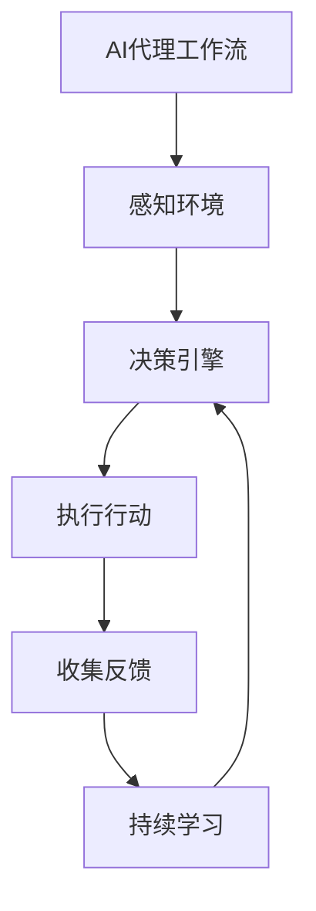

# AI人工智能代理工作流 AI Agent Workflow：在教育科技中的应用

## 1.背景介绍

### 1.1 教育科技的发展趋势

随着信息技术的快速发展,教育领域正在经历前所未有的变革。传统的教学模式已无法满足当代学习者的需求,因此教育科技(EdTech)应运而生。教育科技旨在利用先进的技术手段,提高教育的质量和效率,创造更加个性化和互动的学习体验。

在这一背景下,人工智能(AI)技术在教育领域的应用日益受到重视。AI可以通过大数据分析和机器学习算法,为学习者提供个性化的学习路径和内容推荐,实现因材施教。同时,AI还可以辅助教师进行教学管理和评估,减轻他们的工作负担。

### 1.2 AI代理工作流的重要性

AI代理工作流(AI Agent Workflow)是指利用AI技术构建智能化的工作流程系统,以实现自动化、优化和智能化的目标。在教育科技领域,AI代理工作流可以帮助实现以下目标:

1. 自动化教学管理流程,如课程安排、作业批改、考试组织等。
2. 优化学习资源的分配和利用,为学习者推荐个性化的学习内容和路径。
3. 智能化学习分析和评估,及时发现学习者的知识短板并提供针对性反馈。
4. 提高教学效率,减轻教师的工作负担,让他们专注于教学设计和师生互动。

因此,研究和应用AI代理工作流对于推动教育科技的发展至关重要。

## 2.核心概念与联系

### 2.1 AI代理

AI代理(AI Agent)是指能够感知环境,并根据感知做出决策和行动的智能体。在教育科技中,AI代理可以扮演多种角色,如:

1. 智能教学助手,协助教师完成教学管理和评估工作。
2. 个性化学习导师,为学习者提供个性化的学习内容和路径推荐。
3. 智能问答系统,解答学习者的疑问,提供及时的反馈和指导。

### 2.2 工作流

工作流(Workflow)是指将一系列任务按照特定的逻辑顺序组织起来,以实现某个目标的过程。在教育科技中,工作流可以涵盖以下方面:

1. 教学管理流程,如课程安排、作业发布、考试组织等。
2. 学习流程,如学习内容推荐、知识点梳理、作业完成等。
3. 评估流程,如知识测评、学习分析、反馈机制等。

### 2.3 AI代理工作流

AI代理工作流是指将AI代理技术与工作流管理相结合,构建智能化的工作流程系统。在教育科技中,AI代理工作流可以实现以下功能:

1. 自动化流程执行,减少人工干预,提高效率。
2. 基于数据和算法进行决策,实现个性化和智能化。
3. 持续优化和调整流程,适应动态变化的需求。

AI代理工作流的核心在于将AI技术(如机器学习、自然语言处理等)与工作流引擎相结合,形成一个闭环的智能系统。这种系统可以自主感知环境,做出决策并执行相应的行动,同时通过持续学习不断优化自身。

## 3.核心算法原理具体操作步骤

### 3.1 机器学习算法

机器学习算法是AI代理工作流的核心算法,它可以从大量数据中发现隐藏的模式和规律,并用于做出决策和预测。在教育科技中,常用的机器学习算法包括:

1. **监督学习算法**:
    - 分类算法(如决策树、逻辑回归等),用于学习者知识水平的分类和预测。
    - 回归算法(如线性回归、支持向量回归等),用于学习效果的评估和预测。

2. **无监督学习算法**:
    - 聚类算法(如K-Means、层次聚类等),用于学习内容和学习者的分组。
    - 关联规则挖掘算法(如Apriori、FP-Growth等),用于发现学习行为模式。

3. **强化学习算法**:
    - Q-Learning、Deep Q-Network等,用于优化个性化学习路径的决策。

4. **深度学习算法**:
    - 卷积神经网络(CNN)、递归神经网络(RNN)等,用于自然语言处理和计算机视觉任务。

这些算法可以通过对历史数据(如学习行为数据、成绩数据等)进行训练,从而获得对未来情况的预测能力。

### 3.2 算法具体操作步骤

以监督学习算法为例,其在AI代理工作流中的具体操作步骤如下:

1. **数据预处理**:
    - 数据清洗:处理缺失值、异常值等问题。
    - 数据转换:对特征进行编码、归一化等转换。
    - 数据分割:将数据集分为训练集和测试集。

2. **模型训练**:
    - 选择合适的算法(如决策树、逻辑回归等)。
    - 设置算法超参数(如决策树深度、正则化系数等)。
    - 在训练集上训练模型,优化模型参数。

3. **模型评估**:
    - 在测试集上评估模型性能,计算指标(如准确率、F1分数等)。
    - 进行交叉验证,估计泛化性能。

4. **模型调优**:
    - 根据评估结果,调整算法超参数或特征工程。
    - 重复训练和评估,直至满足性能要求。

5. **模型部署**:
    - 将训练好的模型集成到AI代理工作流系统中。
    - 利用模型对新数据进行预测和决策。

6. **持续优化**:
    - 收集新的数据,定期重训练模型。
    - 根据实际效果调整模型和工作流。

这种基于机器学习的方法,可以充分利用历史数据,构建出智能化的决策模型,从而提高AI代理工作流的效率和准确性。

## 4.数学模型和公式详细讲解举例说明

在AI代理工作流中,数学模型和公式扮演着重要的角色。以下是一些常见的数学模型和公式,以及它们在教育科技中的应用场景。

### 4.1 决策树模型

决策树是一种常用的监督学习模型,它可以用于分类和回归任务。决策树的构建过程可以用信息增益或基尼系数作为选择特征的标准,从而最大化每个节点的纯度。

对于二元分类问题,给定训练数据集 $D=\{(x_1,y_1),(x_2,y_2),...,(x_n,y_n)\}$,其中 $x_i$ 为特征向量, $y_i \in \{0,1\}$ 为类别标记。我们希望构建一个决策树模型 $f(x)$,使得对于任意输入 $x$,模型输出的预测值 $\hat{y}=f(x)$ 尽可能接近真实标记 $y$。

决策树的构建可以通过递归的方式进行,在每个节点选择一个最优特征进行分裂,直到满足停止条件(如达到最大深度、节点纯度足够高等)。特征选择的标准通常是信息增益或基尼系数,它们分别定义如下:

$$
\begin{aligned}
\text{Gain}(D,a) &= \text{Entropy}(D) - \sum_{v\in\text{Values}(a)}\frac{|D^v|}{|D|}\text{Entropy}(D^v) \\
\text{Gini}(D,a) &= \sum_{v\in\text{Values}(a)}\frac{|D^v|}{|D|}(1-\sum_{k\in\text{Classes}}\left(\frac{|D^v_k|}{|D^v|}\right)^2)
\end{aligned}
$$

其中, $D$ 表示当前节点的数据集, $a$ 表示特征, $D^v$ 表示根据特征 $a$ 的值 $v$ 分割后的子数据集, $\text{Entropy}(D)$ 表示数据集 $D$ 的信息熵, $\text{Classes}$ 表示所有可能的类别集合。

在教育科技中,决策树模型可以用于以下任务:

- 预测学习者的知识掌握情况,为个性化学习提供依据。
- 分析影响学习效果的关键因素,优化教学策略。
- 根据学习者的特征,推荐合适的学习资源和路径。

### 4.2 逻辑回归模型

逻辑回归是一种广泛使用的分类模型,它可以输出一个概率值,表示样本属于某个类别的可能性。对于二元分类问题,逻辑回归模型的数学形式如下:

$$
P(y=1|x) = \sigma(w^Tx+b) = \frac{1}{1+e^{-(w^Tx+b)}}
$$

其中, $x$ 为特征向量, $y\in\{0,1\}$ 为类别标记, $w$ 和 $b$ 为模型参数, $\sigma(\cdot)$ 为sigmoid函数。

模型参数 $w$ 和 $b$ 可以通过最大似然估计或最小化交叉熵损失函数的方式进行学习,具体如下:

$$
\begin{aligned}
\mathcal{L}(w,b) &= -\frac{1}{N}\sum_{i=1}^N\big[y_i\log P(y_i=1|x_i) + (1-y_i)\log(1-P(y_i=1|x_i))\big] \\
&= -\frac{1}{N}\sum_{i=1}^N\big[y_i\log\sigma(w^Tx_i+b) + (1-y_i)\log(1-\sigma(w^Tx_i+b))\big]
\end{aligned}
$$

其中, $N$ 为训练样本数量。通过梯度下降等优化算法,可以求解出最优的 $w$ 和 $b$,从而获得逻辑回归模型。

在教育科技中,逻辑回归模型可以用于以下任务:

- 预测学习者是否掌握某个知识点,为个性化学习提供支持。
- 分析影响学习效果的关键因素,优化教学策略。
- 根据学习者的特征,推荐合适的课程或学习路径。

### 4.3 聚类算法

聚类是一种常见的无监督学习任务,它旨在将相似的样本聚集在一起,形成不同的簇。在教育科技中,聚类算法可以用于发现学习者的不同群体,为个性化教学提供依据。

一种常用的聚类算法是K-Means算法,它的目标是最小化所有样本到最近聚类中心的距离之和,即:

$$
J = \sum_{i=1}^{k}\sum_{x\in C_i}\|x-\mu_i\|^2
$$

其中, $k$ 为聚类数量, $C_i$ 表示第 $i$ 个聚类, $\mu_i$ 为第 $i$ 个聚类中心。

K-Means算法的具体步骤如下:

1. 随机初始化 $k$ 个聚类中心 $\mu_1,\mu_2,...,\mu_k$。
2. 对每个样本 $x$,计算它与所有聚类中心的距离,将它分配到最近的那一个聚类中。
3. 对每个聚类 $C_i$,重新计算它的聚类中心 $\mu_i$,即聚类内所有样本的均值。
4. 重复步骤2和3,直至聚类中心不再发生变化。

在教育科技中,聚类算法可以用于以下任务:

- 根据学习者的特征和行为,将他们划分为不同的群体,为个性化教学提供依据。
- 发现学习资源之间的相似性,为推荐系统提供支持。
- 分析不同群体的学习效果,优化教学策略。

除了K-Means算法,其他常用的聚类算法还包括层次聚类、密度聚类等,它们各有优缺点,需要根据具体场景进行选择。

通过上述数学模型和公式,我们可以看到AI代理工作流是如何利用机器学习算法来实现智能化决策