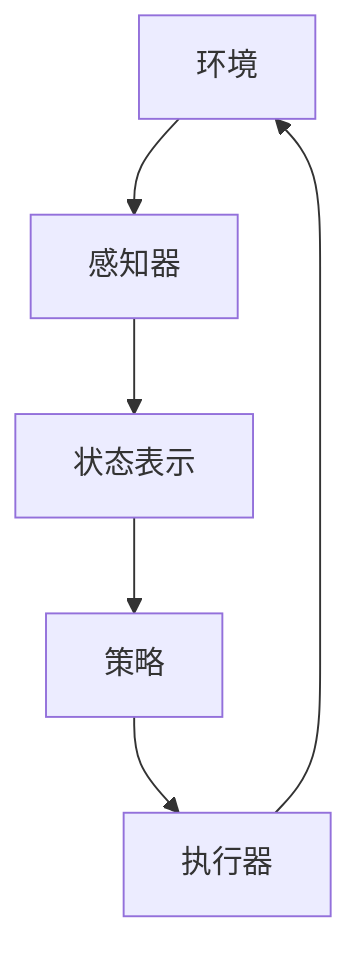
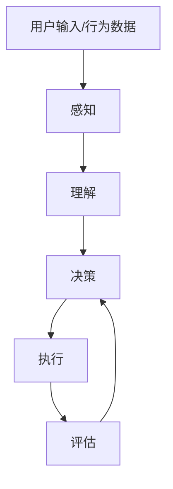

# AI人工智能代理工作流 AI Agent WorkFlow：在电子商务中的应用

## 1.背景介绍

### 1.1 电子商务的发展与挑战

随着互联网技术的快速发展,电子商务已经成为一种主流的商业模式。根据统计数据,2022年全球电子商务市场规模已达到5.7万亿美元,预计到2025年将超过8万亿美元。电子商务为消费者带来了极大的便利,但与此同时也面临着一些新的挑战。

首先,电子商务平台上商品种类繁多,消费者很难快速找到自己需要的商品。其次,由于缺乏实物体验,消费者难以全面了解商品的细节信息。再者,不同消费者的需求存在差异,传统的推荐系统难以做到个性化服务。此外,电子商务中还存在一些欺诈行为,如虚假评论、刷单等,这些都影响了消费者的体验和信任度。

### 1.2 AI人工智能技术的应用前景

为了应对上述挑战,人工智能(AI)技术在电子商务领域展现出了巨大的应用潜力。AI技术可以通过大数据分析和机器学习算法,实现个性化推荐、智能搜索、虚拟试衣等功能,从而提升用户体验。同时,AI还可以辅助发现欺诈行为,维护电子商务的公平公正。

其中,AI代理(Agent)技术是一种新兴的人工智能范式,可以模拟人类的决策和行为,为用户提供智能化的服务。AI代理可以作为虚拟助手、智能客服等角色,通过自然语言交互的方式,为用户解答问题、处理订单等。

本文将重点介绍AI代理工作流(AI Agent Workflow)技术在电子商务中的应用,包括其核心概念、关键技术、实现方法等,并探讨其发展趋势和挑战。

## 2.核心概念与联系

### 2.1 AI代理(Agent)

AI代理是一种自主的软件实体,能够感知环境、做出决策并采取行动来实现特定目标。AI代理通常由以下几个核心组件组成:

- 感知器(Sensor):用于获取环境信息
- 状态表示(State Representation):描述代理当前的状态
- 策略(Policy):根据状态选择行动的规则或函数
- 执行器(Actuator):执行选定的行动,影响环境

AI代理可以基于不同的学习方法,如强化学习、监督学习等,来优化其策略,从而做出更好的决策。



### 2.2 AI代理工作流(Workflow)

AI代理工作流描述了代理与环境交互的过程,包括感知、决策和执行等步骤。在电子商务场景中,AI代理工作流可以概括为以下几个阶段:

1. **感知阶段**: 代理从用户输入(如文本、语音等)、用户行为数据、商品信息等渠道获取相关信息。
2. **理解阶段**: 代理对获取的信息进行处理和理解,构建用户需求的语义表示。
3. **决策阶段**: 代理根据用户需求、商品信息等,运行决策算法(如推荐系统、对话策略等),选择合适的行动。
4. **执行阶段**: 代理执行选定的行动,如回复用户查询、推荐商品、下单等。
5. **评估阶段**: 代理根据用户反馈(如点击、购买等)评估执行行动的效果,并优化决策策略。



上述工作流是一个循环过程,代理通过不断地感知、理解、决策、执行和评估,来优化自身的策略,为用户提供更好的服务体验。

## 3.核心算法原理具体操作步骤

### 3.1 自然语言处理

自然语言处理(Natural Language Processing, NLP)是AI代理工作流中的关键技术,用于理解用户的自然语言输入。主要步骤包括:

1. **文本预处理**: 对原始文本进行分词、去除停用词、词形还原等预处理,将文本转换为易于处理的形式。
2. **词向量表示**: 将文本中的词语映射为向量表示,如Word2Vec、GloVe等方法。
3. **语义表示**: 基于词向量,构建句子或段落的语义表示,如序列模型(RNN、LSTM等)、Transformer等。
4. **意图识别和槽填充**: 识别用户的对话意图(如查询、购买等),并从语义表示中提取关键信息(如商品类型、数量等)。

以"我想买一件红色的T恤"为例,NLP模块可以识别出意图是"购买",槽位包括"商品类型=T恤"、"颜色=红色"等。

### 3.2 推荐系统

推荐系统是电子商务中的核心功能,通过分析用户偏好和商品特征,为用户推荐感兴趣的商品。常用算法包括:

1. **协同过滤**(Collaborative Filtering, CF)
    - **基于用户**:找到与目标用户有相似兴趣的其他用户,根据他们的偏好进行推荐。
    - **基于物品**:找到与目标物品相似的其他物品,根据用户对这些物品的偏好进行推荐。
2. **基于内容**(Content-based)
    - 基于商品内容特征(如标题、描述等)与用户偏好的相似度进行推荐。
3. **组合推荐**
    - 将协同过滤和基于内容的方法结合,综合考虑用户偏好和商品特征。

以基于用户的协同过滤为例,算法步骤如下:

1. 计算用户之间的相似度,如基于两个用户对相同商品的评分计算余弦相似度或皮尔逊相关系数。
2. 找到与目标用户最相似的K个用户,作为最近邻用户。
3. 根据最近邻用户对其他商品的评分,预测目标用户对这些商品的兴趣程度。
4. 将兴趣程度最高的商品推荐给目标用户。

### 3.3 对话策略

对话策略(Dialogue Policy)决定了AI代理在与用户对话时的响应方式,是构建智能对话系统的关键。常用方法包括:

1. **基于规则**(Rule-based)
    - 根据预定义的规则和模板生成响应,适用于简单、确定性的场景。
2. **检索式**(Retrieval-based)
    - 从预先构建的响应库中检索与用户输入最相关的响应,常用TF-IDF、BM25等相似度模型。
3. **生成式**(Generation-based)
    - 基于序列到序列(Seq2Seq)模型,从输入生成新的响应,具有更大的灵活性和多样性。

以生成式对话策略为例,算法步骤如下:

1. 将用户输入和对话历史编码为向量表示。
2. 使用Seq2Seq模型(如Transformer)对编码向量进行解码,生成响应序列。
3. 使用beam search等策略从候选响应中选择最优响应。
4. 根据响应对话策略进行调整,如重复惩罚、反馈控制等。

## 4.数学模型和公式详细讲解举例说明

### 4.1 Word2Vec词向量

Word2Vec是一种流行的词嵌入(Word Embedding)技术,可以将词语映射到低维连续的向量空间,使得语义相似的词语在向量空间中距离更近。Word2Vec包含两种模型:CBOW(Continuous Bag-of-Words)和Skip-Gram。

以Skip-Gram为例,其目标是根据中心词 $w_t$ 预测其上下文词 $w_{t-n}, \dots, w_{t-1}, w_{t+1}, \dots, w_{t+n}$ ,其中 $n$ 为窗口大小。给定词汇表 $V$ ,对于每个词 $w \in V$ ,Skip-Gram模型学习两个向量:

- 输入向量 $v_w \in \mathbb{R}^d$
- 输出向量 $u_w \in \mathbb{R}^d$

其中 $d$ 为词向量维度。对于中心词 $w_t$ 及其上下文词 $w_c$ ,Skip-Gram模型使用softmax函数计算 $w_c$ 为 $w_t$ 的上下文词的条件概率:

$$P(w_c|w_t) = \frac{e^{u_{w_c}^Tv_{w_t}}}{\sum_{w \in V}e^{u_w^Tv_{w_t}}}$$

模型的目标是最大化语料库中所有中心词及其上下文词的对数似然:

$$\max_{\theta} \frac{1}{T}\sum_{t=1}^T\sum_{-n \leq j \leq n, j \neq 0}\log P(w_{t+j}|w_t;\theta)$$

其中 $\theta$ 为模型参数(输入向量和输出向量)。通过梯度下降等优化算法学习 $\theta$ ,即可获得词向量表示。

### 4.2 矩阵分解

矩阵分解是协同过滤推荐系统中常用的技术,可以将用户-物品评分矩阵分解为用户矩阵和物品矩阵的乘积,从而学习用户和物品的低维向量表示。

假设有 $m$ 个用户和 $n$ 个物品,用户 $u$ 对物品 $i$ 的评分为 $r_{ui}$ ,则评分矩阵 $R \in \mathbb{R}^{m \times n}$ 中的元素 $r_{ui}$ 可以近似表示为:

$$r_{ui} \approx q_i^Tp_u$$

其中 $q_i \in \mathbb{R}^k$ 为物品 $i$ 的 $k$ 维向量表示, $p_u \in \mathbb{R}^k$ 为用户 $u$ 的 $k$ 维向量表示。矩阵分解的目标是通过优化以下目标函数来学习 $P$ 和 $Q$ :

$$\min_{P,Q}\sum_{(u,i) \in \kappa}(r_{ui} - q_i^Tp_u)^2 + \lambda(||P||_F^2 + ||Q||_F^2)$$

其中 $\kappa$ 为已观测的评分集合, $||\cdot||_F$ 为矩阵的Frobenius范数,用于避免过拟合。通过随机梯度下降等优化算法可以求解 $P$ 和 $Q$ 。

在推荐过程中,对于目标用户 $u$ ,可以计算所有物品 $i$ 的预测评分 $\hat{r}_{ui} = q_i^Tp_u$ ,并推荐评分最高的物品。

## 5.项目实践：代码实例和详细解释说明

### 5.1 Word2Vec实现

以下是使用Gensim库实现Word2Vec的Python代码示例:

```python
import gensim.models

# 加载语料库
sentences = [['this', 'is', 'the', 'first', 'sentence'], 
             ['this', 'is', 'the', 'second', 'sentence']]

# 创建Word2Vec模型
model = gensim.models.Word2Vec(sentences, vector_size=100, window=5, min_count=1)

# 获取词向量
print(model.wv['this'])

# 计算相似词
print(model.wv.most_similar(positive=['woman', 'king'], negative=['man']))

# 保存模型
model.save('word2vec.model')

# 加载模型
model = gensim.models.Word2Vec.load('word2vec.model')
```

代码解释:

1. 导入Gensim库,创建一个样例语料库`sentences`。
2. 使用`gensim.models.Word2Vec`创建Word2Vec模型,设置向量维度`vector_size`、窗口大小`window`和最小词频`min_count`等参数。
3. 通过`model.wv['word']`获取词`'word'`的词向量。
4. 使用`model.wv.most_similar`函数计算与`'woman'`和`'king'`相似,但与`'man'`不太相似的词。
5. 使用`model.save`和`Word2Vec.load`保存和加载模型。

### 5.2 协同过滤推荐系统

以下是使用Surprise库实现基于用户的协同过滤算法的Python代码示例:

```python
import surprise
from surprise import Reader, Dataset, SVD

# 加