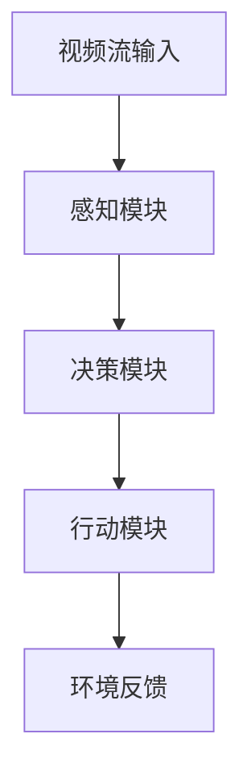

# AI人工智能代理工作流 AI Agent WorkFlow：在视频监控中的应用

## 1.背景介绍

### 1.1 视频监控系统的重要性

在当今社会,视频监控系统无处不在,在公共场所、交通系统、商业区域等多个领域发挥着至关重要的作用。视频监控不仅能够提高公共安全,还可以用于交通管理、犯罪预防和调查等多个方面。然而,传统的视频监控系统存在一些明显的缺陷:

1. 人工监控效率低下且容易疲劳
2. 大量视频数据难以高效处理和分析
3. 缺乏智能化的异常行为检测和响应机制

### 1.2 AI技术的兴起

近年来,人工智能(AI)技术的快速发展为解决上述问题提供了新的契机。计算机视觉、模式识别、深度学习等AI技术可以赋予视频监控系统"智能化"的能力,自动化地执行目标检测、行为分析、异常识别等复杂任务,大幅提高监控效率和精度。

### 1.3 AI代理工作流概念

AI代理工作流(AI Agent Workflow)是一种将AI技术seamlessly集成到视频监控系统中的架构和流程,旨在实现端到端的智能化视频分析和决策。在这个工作流中,AI代理扮演着核心角色,负责感知环境(视频流)、分析数据、做出决策并执行相应的操作。

## 2.核心概念与联系

### 2.1 AI代理(Agent)

AI代理是AI代理工作流的核心组件,可视为一个具备感知、决策和行动能力的智能体。代理通过计算机视觉、模式识别等算法从视频流中提取相关信息,并基于此做出判断和决策,最终执行相应的操作(如发出警报、调度执法人员等)。

代理可以是单个智能体,也可以是多个协作的智能体组成的多代理系统。多代理系统中的各个代理可以分工协作,完成更加复杂的任务。

### 2.2 环境(Environment)

环境指代理所处的外部世界,在视频监控场景中即为视频流及其所反映的真实世界。代理需要从环境中获取感知数据(视频流),并将决策的结果反馈回环境(如发出警报)。

### 2.3 感知(Perception)

感知是代理获取环境信息的过程。在视频监控中,感知主要是通过计算机视觉算法从视频流中提取目标对象、运动轨迹、行为模式等信息。这是代理决策的基础。

常用的感知技术包括目标检测(Object Detection)、目标跟踪(Object Tracking)、行为识别(Action Recognition)等。

### 2.4 决策(Decision Making)

决策是代理的核心功能,即根据感知到的环境信息做出相应的判断和选择。在视频监控中,决策主要包括:

1. 异常行为检测:判断视频中是否存在违规、可疑或危险的行为。
2. 情景分析:综合分析视频中的多个目标、行为、环境信息,对整个场景做出理解和判断。
3. 策略制定:根据分析结果,决定采取何种行动(如发出警报、调度执法人员等)。

常用的决策技术包括规则引擎(Rule Engine)、机器学习模型等。

### 2.5 行动(Action)

行动是代理对环境的反馈,是决策的执行过程。在视频监控中,代理的行动可能包括:

1. 发出警报(声音/视觉)
2. 记录日志
3. 调度执法人员
4. 控制相机视角/焦距
5. 与其他系统集成(如门禁系统、通讯系统等)

### 2.6 Mermaid流程图

以下是AI代理工作流的核心流程:

代理首先从视频流中获取感知数据,然后进行决策分析,最终对环境做出相应的行动,并接收环境的反馈,形成一个闭环过程。

## 3.核心算法原理具体操作步骤

### 3.1 目标检测算法

目标检测是视频分析的基础,旨在从视频帧中识别并定位感兴趣的目标对象(如人、车辆等)。常用的目标检测算法有:

#### 3.1.1 基于深度学习的目标检测

这类算法利用卷积神经网络(CNN)从视频帧中提取目标的特征,并将其与预先训练好的模型进行匹配,从而识别和定位目标对象。

典型的算法有:

1. **YOLO(You Only Look Once)**
2. **Faster R-CNN**
3. **SSD(Single Shot MultiBox Detector)**

这些算法的基本流程如下:

1. 对输入图像进行预处理(缩放、归一化等)
2. 将预处理后的图像输入CNN模型
3. 模型输出目标边界框(bounding box)及对应的类别概率
4. 使用非极大值抑制(NMS)算法去除重复的边界框
5. 根据置信度阈值过滤结果

#### 3.1.2 基于传统机器学习的目标检测

这类算法通常采用背景建模、特征提取和分类器相结合的方式进行目标检测。

一种典型的流程是:

1. 使用高斯混合模型(GMM)或者核Ridge回归(KRR)等方法对背景进行建模
2. 通过背景减除等方式分割出前景目标
3. 对前景目标使用HOG、Haar等特征提取算法提取特征
4. 使用SVM、AdaBoost等分类器对目标进行分类

这类算法计算量较小,适合在低功耗设备上运行,但检测精度通常低于基于深度学习的算法。

### 3.2 目标跟踪算法

目标跟踪的目的是在连续的视频帧中对运动目标进行跟踪,获取其运动轨迹。常用算法有:

#### 3.2.1 基于滤波的目标跟踪

这类算法通常基于卡尔曼滤波或粒子滤波等滤波方法,根据目标的先验运动模型预测目标在下一帧的位置,然后结合观测值对预测值进行修正。

典型的算法有:

1. **卡尔曼滤波(Kalman Filter)**
2. **粒子滤波(Particle Filter)**
3. **均值位移(Mean Shift)**

算法基本流程:

1. 获取上一帧目标的状态(位置、速度等)
2. 使用运动模型预测目标在当前帧的状态
3. 在当前帧附近区域内搜索目标
4. 使用观测值对预测值进行修正
5. 更新目标状态

#### 3.2.2 基于discriminative correlation filters的目标跟踪

这类算法通过训练一个相关滤波器(correlation filter),根据滤波器响应值在图像中定位目标。由于相关滤波器具有较强的鲁棒性,因此这类算法对光照变化、遮挡等情况有较好的适应能力。

典型的算法有:

1. **MOSSE(Minimum Output Sum of Squared Error)** 
2. **CSRDCF(Discriminative Correlation Filter with Channel and Spatial Reliability)**
3. **ECO(Efficient Convolution Operators for Tracking)**

算法基本流程:

1. 使用第一帧初始化训练样本
2. 根据样本训练相关滤波器
3. 在当前帧上对滤波器进行滑动窗口卷积,得到响应值图
4. 在响应值图上寻找峰值,即为目标位置
5. 根据新的目标位置更新训练样本,重新训练滤波器

### 3.3 行为识别算法

行为识别的目的是从视频中识别出特定的动作或活动,如走路、打架、拥抱等。常用的行为识别算法有:

#### 3.3.1 基于人体姿态估计的行为识别

这类算法首先从视频帧中估计出人体的姿态(关键点位置),然后将姿态序列输入到机器学习模型(如RNN、LSTM等)中进行行为分类。

算法基本流程:

1. 使用人体姿态估计算法(如OpenPose)检测视频帧中人体关键点的位置
2. 将关键点序列作为输入,输入到RNN/LSTM等模型中
3. 模型输出行为类别

#### 3.3.2 基于光流的行为识别

这类算法利用视频帧之间的光流信息(运动矢量场)来表征运动模式,然后输入到机器学习模型中进行分类。

算法基本流程:

1. 计算相邻视频帧之间的光流
2. 将光流信息编码为特征向量
3. 将特征向量序列输入到RNN/LSTM等模型中
4. 模型输出行为类别

### 3.4 异常行为检测算法

异常行为检测是视频监控中一项关键任务,旨在自动识别出违规、可疑或危险的行为,并发出警报。常用的异常检测算法有:

#### 3.4.1 基于规则的异常检测

这种方法首先定义一系列规则来描述正常行为模式,如"人员不得进入禁区"、"车辆不得超速行驶"等。如果检测到违反这些规则的行为,则被判定为异常。

算法基本流程:

1. 定义规则集合
2. 从视频中提取相关的目标、轨迹等信息
3. 对提取的信息与规则集合进行匹配
4. 如果匹配到违规行为,则报警

#### 3.4.2 基于统计模型的异常检测

这种方法通过建立正常行为的统计模型(如高斯混合模型GMM),将偏离该模型的行为判定为异常。

算法基本流程:

1. 收集大量正常行为样本,训练统计模型
2. 对新的行为进行采样,计算其与模型的差异
3. 如果差异超过阈值,则判定为异常

#### 3.4.3 基于深度学习的异常检测

这种方法利用深度神经网络(如自编码器AE、生成对抗网络GAN等)对正常行为进行建模,将难以被模型重构的行为判定为异常。

算法基本流程:

1. 收集大量正常行为样本,训练深度模型
2. 对新的行为输入模型,计算重构误差
3. 如果误差超过阈值,则判定为异常

## 4.数学模型和公式详细讲解举例说明

### 4.1 卡尔曼滤波

卡尔曼滤波是一种常用的目标跟踪算法,它通过构建目标运动的状态空间模型,并结合观测值对目标状态进行最优估计。

设目标在时刻$t$的状态为$\mathbf{x}_t$,观测值为$\mathbf{z}_t$,则卡尔曼滤波的状态空间模型可表示为:

$$
\begin{aligned}
\mathbf{x}_t &= \mathbf{F}_t\mathbf{x}_{t-1} + \mathbf{B}_t\mathbf{u}_t + \mathbf{w}_t\\
\mathbf{z}_t &= \mathbf{H}_t\mathbf{x}_t + \mathbf{v}_t
\end{aligned}
$$

其中:

- $\mathbf{F}_t$是状态转移矩阵,描述目标状态的变化
- $\mathbf{B}_t$是控制矩阵,描述控制量对状态的影响
- $\mathbf{u}_t$是控制量向量
- $\mathbf{w}_t$是过程噪声,服从高斯分布$\mathcal{N}(0, \mathbf{Q}_t)$
- $\mathbf{H}_t$是观测矩阵,描述状态到观测值的映射关系
- $\mathbf{v}_t$是观测噪声,服从高斯分布$\mathcal{N}(0, \mathbf{R}_t)$

卡尔曼滤波由预测(prediction)和更新(update)两个步骤组成:

**预测步骤:**
$$
\begin{aligned}
\hat{\mathbf{x}}_{t|t-1} &= \mathbf{F}_t\hat{\mathbf{x}}_{t-1|t-1} + \mathbf{B}_t\mathbf{u}_t\\
\mathbf{P}_{t|t-1} &= \mathbf{F}_t\mathbf{P}_{t-1|t-1}\mathbf{F}_t^T + \