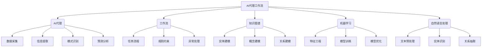

# AI人工智能代理工作流 AI Agent WorkFlow：在重大事件预测中的应用

## 1.背景介绍

### 1.1 重大事件预测的重要性

在当今快节奏的世界中,重大事件如自然灾害、金融危机、疫情爆发等往往会对社会、经济和人类生活产生深远影响。及时准确地预测这些事件的发生及其潜在影响,对于政府、企业和个人来说都是至关重要的。有效的预测不仅可以帮助制定应对策略,减轻负面影响,还可以为决策者提供宝贵的时间来做好准备。

### 1.2 传统预测方法的局限性

传统的重大事件预测方法主要依赖于人工分析和统计建模,存在以下局限性:

- 数据量有限,难以全面考虑所有相关因素
- 分析过程主观性强,容易受到认知偏差影响
- 响应速度较慢,难以及时捕捉事件信号

### 1.3 AI代理工作流在预测中的作用

随着人工智能(AI)技术的不断发展,AI代理工作流(AI Agent Workflow)应运而生,为重大事件预测提供了新的解决方案。AI代理工作流是一种智能系统,它集成了多种AI技术,如自然语言处理(NLP)、机器学习(ML)、知识图谱等,能够高效地从海量异构数据中提取有价值的信息,并进行智能分析和决策。

AI代理工作流在重大事件预测中的主要作用包括:

- 快速高效地收集和处理大规模多源异构数据
- 自动识别事件相关信号,提取关键信息和模式
- 基于知识图谱和机器学习模型进行智能分析和预测
- 及时生成预测报告,为决策者提供决策支持

## 2.核心概念与联系

### 2.1 AI代理(AI Agent)

AI代理是AI代理工作流的核心组成部分,是一种具有智能行为的虚拟实体。它能够感知环境,并根据预定目标做出合理决策和行动。在重大事件预测中,AI代理负责执行各种任务,如数据采集、信息提取、模式识别、预测分析等。

### 2.2 工作流(Workflow)

工作流是一系列有序的任务活动,用于实现特定目标。在AI代理工作流中,工作流定义了AI代理执行任务的流程和规则,确保预测过程高效有序。工作流还包括了异常处理、并行执行、监控等机制,提高了系统的鲁棒性和可扩展性。

### 2.3 知识图谱(Knowledge Graph)

知识图谱是一种结构化的知识表示形式,它将实体、概念及其关系以图形的方式组织起来。在重大事件预测中,知识图谱用于建模事件相关的实体、概念及其语义关联,为AI代理提供背景知识和推理能力。

### 2.4 机器学习(Machine Learning)

机器学习是AI的一个重要分支,它赋予AI代理从数据中自动学习和改进的能力。在重大事件预测中,机器学习算法可以从历史数据中发现隐藏的模式和规律,构建预测模型,并不断优化模型性能。

### 2.5 自然语言处理(Natural Language Processing)

自然语言处理(NLP)是AI的另一个关键技术,它使AI代理能够理解和处理人类自然语言。在重大事件预测中,NLP用于从非结构化文本数据(如新闻报道、社交媒体等)中提取有价值的信息,为预测提供重要线索。

上述核心概念相互关联、互为支撑,共同构建了AI代理工作流的智能预测能力。AI代理根据工作流执行任务,利用知识图谱的背景知识和机器学习模型进行分析推理,并通过NLP技术处理非结构化数据,最终实现准确高效的重大事件预测。

## 3.核心算法原理具体操作步骤 

AI代理工作流在重大事件预测中的核心算法原理主要包括以下几个方面:

### 3.1 数据采集与预处理

#### 3.1.1 数据采集

AI代理工作流需要从各种异构数据源(如新闻报道、社交媒体、政府公告、经济数据等)持续采集相关数据。常用的数据采集方法包括:

1. **Web爬虫**: 使用爬虫技术从网站上抓取结构化和非结构化数据。
2. **API集成**: 通过调用第三方数据提供商的API接口获取数据。
3. **数据流订阅**: 订阅并接收实时数据流,如社交媒体数据流、金融行情数据流等。

#### 3.1.2 数据预处理

采集到的原始数据通常需要进行预处理,以提高后续处理的效率和质量。常用的预处理操作包括:

1. **数据清洗**: 去除重复数据、填充缺失值、处理异常值等。
2. **标准化**: 将数据转换为统一的格式和单位。
3. **特征提取**: 从原始数据中提取有价值的特征,如文本数据的TF-IDF向量等。

### 3.2 知识图谱构建

知识图谱是AI代理工作流的重要知识库,它对事件相关的实体、概念及其关系进行了形式化建模。构建知识图谱的主要步骤包括:

#### 3.2.1 实体抽取

从非结构化数据(如新闻报道、社交媒体等)中识别出与事件相关的实体,如人物、地点、组织机构等。常用的实体抽取方法包括:

1. **基于规则的方法**: 使用一系列预定义的规则来识别实体。
2. **基于统计的方法**: 利用大规模标注语料训练序列标注模型,实现实体识别。
3. **基于深度学习的方法**: 使用BERT、BiLSTM-CRF等深度学习模型进行实体抽取。

#### 3.2.2 概念抽取

从非结构化数据中识别出与事件相关的概念,如事件类型、主题等。常用的概念抽取方法包括:

1. **基于词典的方法**: 使用预定义的概念词典进行匹配。
2. **基于主题模型的方法**: 使用LDA、BTM等主题模型从文本中发现潜在的概念主题。
3. **基于深度学习的方法**: 使用序列标注模型或文本分类模型进行概念抽取。

#### 3.2.3 关系抽取

识别实体与概念之间、实体与实体之间的语义关系。常用的关系抽取方法包括:

1. **基于规则的方法**: 使用一系列预定义的模式规则来识别关系。
2. **基于监督学习的方法**: 使用标注语料训练关系分类模型进行关系抽取。
3. **基于远程监督的方法**: 利用已有的知识库作为远程监督信号,进行迁移学习。
4. **基于深度学习的方法**: 使用CNN、BERT等深度学习模型自动学习关系表示。

#### 3.2.4 知识融合

将从不同数据源抽取的实体、概念和关系进行融合和去重,构建统一的知识图谱。常用的知识融合方法包括:

1. **基于规则的方法**: 使用一系列预定义的规则进行实体消歧、关系对齐等操作。
2. **基于embedding的方法**: 将实体、概念和关系映射到低维向量空间,利用向量相似性进行融合。
3. **基于图算法的方法**: 将知识图谱视为异构图,使用图算法(如PageRank)进行节点排序和融合。

### 3.3 机器学习建模

基于已构建的知识图谱和历史数据,AI代理工作流使用机器学习算法构建预测模型,实现事件的智能预测。常用的机器学习算法包括:

#### 3.3.1 监督学习

利用标注的历史事件数据训练分类或回归模型,对未来事件进行预测。常用的监督学习算法包括:

1. **逻辑回归**: 对事件发生与否进行二元分类预测。
2. **支持向量机(SVM)**: 对事件类型或影响程度等进行多分类预测。
3. **随机森林**: 集成多个决策树,提高预测的鲁棒性。
4. **神经网络**: 使用DNN、CNN、RNN等深度学习模型进行端到端的事件预测。

#### 3.3.2 非监督学习

从未标注的原始数据中发现隐藏的模式和规律,对事件进行聚类或异常检测。常用的非监督学习算法包括:

1. **K-Means聚类**: 根据事件特征对事件进行聚类,发现潜在的事件类型。
2. **高斯混合模型(GMM)**: 对事件特征进行概率密度估计,发现异常事件。
3. **主成分分析(PCA)**: 对高维事件特征进行降维,提取主要的特征模式。

#### 3.3.3 强化学习

将事件预测建模为马尔可夫决策过程,通过试错学习获得最优的预测策略。常用的强化学习算法包括:

1. **Q-Learning**: 学习状态-行为值函数,选择最优的预测行为序列。
2. **策略梯度**: 直接优化预测策略的参数,提高预测准确率。
3. **深度强化学习**: 结合深度神经网络,端到端地学习预测策略。

### 3.4 预测与决策支持

基于机器学习模型的预测结果,AI代理工作流生成预测报告,为决策者提供决策支持。主要步骤包括:

#### 3.4.1 预测结果解释

使用可解释的AI(XAI)技术,解释机器学习模型的预测结果及其原因,提高预测的可信度和透明度。常用的解释方法包括:

1. **SHAP值**: 通过计算每个特征对预测结果的贡献,解释预测原因。
2. **LIME**: 通过构建局部可解释模型,解释单个预测实例的原因。
3. **注意力机制**: 在深度学习模型中引入注意力机制,直观展示模型关注的重点信息。

#### 3.4.2 风险评估

根据预测结果,评估事件发生的可能性及其潜在影响,为后续决策提供依据。常用的风险评估方法包括:

1. **概率模型**: 使用贝叶斯网络、马尔可夫模型等对事件发生概率进行建模。
2. **情景分析**: 构建多种可能的情景,分析每种情景下的影响。
3. **蒙特卡罗模拟**: 通过重复随机抽样,模拟事件发生的概率分布及其影响。

#### 3.4.3 决策优化

基于风险评估结果,优化决策方案,最大限度地减轻事件的负面影响。常用的决策优化方法包括:

1. **多目标优化**: 同时考虑多个目标(如成本、效益、风险等),求解最优决策方案。
2. **鲁棒优化**: 在最坏情况下,寻找最优的决策方案。
3. **在线学习**: 根据实时反馈,不断优化和调整决策策略。

## 4.数学模型和公式详细讲解举例说明

在AI代理工作流的各个环节中,都涉及了一些重要的数学模型和公式,下面将对其进行详细讲解和举例说明。

### 4.1 文本表示

在自然语言处理任务中,需要将文本转换为数值向量,以便进行后续的建模和计算。常用的文本表示方法包括:

#### 4.1.1 One-Hot编码

One-Hot编码是最