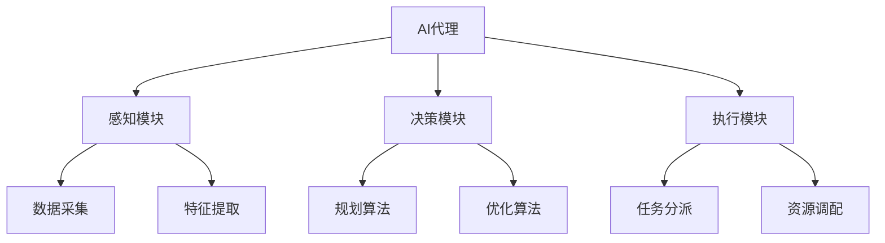
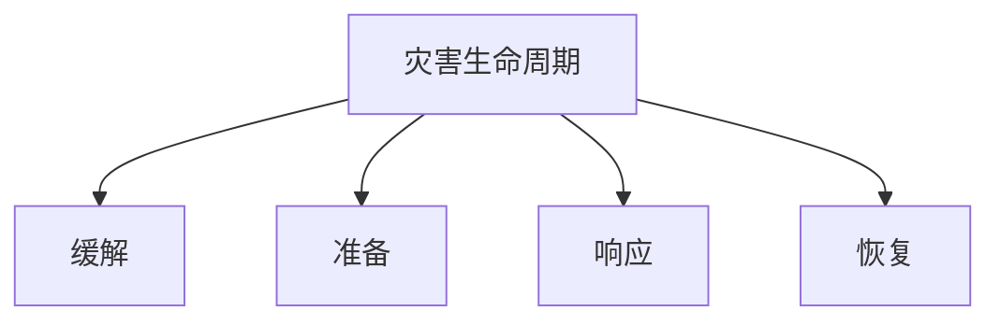

# AI人工智能代理工作流AI Agent WorkFlow：AI代理在防灾减灾系统中的作用

## 1.背景介绍

### 1.1 自然灾害的威胁

自然灾害一直是人类社会面临的重大挑战之一。从地震、海啸到台风、洪水,这些自然力量不仅造成了巨大的人员伤亡和经济损失,更是对人类赖以生存的环境造成了严重破坏。根据联合国统计,过去20年间,自然灾害造成了140万人死亡,影响了40亿人口,直接经济损失高达2.9万亿美元。

### 1.2 防灾减灾的重要性

面对日益严峻的自然灾害形势,加强防灾减灾工作迫在眉睫。通过提高灾害预警能力、完善应急响应机制、加强基础设施建设等措施,可以最大程度降低灾害风险,保护人民生命财产安全。然而,传统的防灾减灾方式面临诸多挑战,如数据采集困难、决策过程低效、资源调配不足等,迫切需要引入先进技术来提升防灾减灾的整体水平。

### 1.3 人工智能在防灾减灾中的作用

人工智能(AI)技术在防灾减灾领域展现出巨大潜力。AI代理可以通过大数据分析、机器学习等技术,实现对灾害的精准预测、高效决策和智能调度,为防灾减灾工作提供有力支撑。本文将重点探讨AI代理在防灾减灾系统中的工作流程,阐述其在灾害预警、应急指挥、资源调配等环节的具体应用,并对未来发展趋势进行展望。

## 2.核心概念与联系

在深入探讨AI代理在防灾减灾系统中的作用之前,有必要先了解几个核心概念及其相互关系。

### 2.1 AI代理(AI Agent)

AI代理是指能够感知环境、处理信息、做出决策并采取行动的智能系统。在防灾减灾场景中,AI代理可以集成多种AI技术,如计算机视觉、自然语言处理、机器学习等,从而实现对灾害的预测、监测、决策和响应。

### 2.2 灾害生命周期

灾害生命周期描述了灾害发生、发展和恢复的全过程,通常包括以下四个阶段:

1. **缓解(Mitigation)**: 采取措施减少潜在灾害风险,如加固基础设施、制定应急预案等。
2. **准备(Preparedness)**: 提高应对灾害的能力,如建立预警系统、开展培训演练等。
3. **响应(Response)**: 在灾害发生时,立即采取行动保护生命财产安全,如疏散撤离、救援救灾等。
4. **恢复(Recovery)**: 灾后重建工作,如修复基础设施、提供临时住房等。

### 2.3 AI代理与灾害生命周期的关系

AI代理可以在灾害生命周期的各个阶段发挥重要作用:

1. **缓解阶段**: 通过大数据分析和模拟,评估潜在灾害风险,为制定缓解措施提供决策支持。
2. **准备阶段**: 建立基于AI的预警系统,提高灾害监测和预测能力;开发虚拟现实训练系统,提高应急人员的响应能力。
3. **响应阶段**: 实时监控灾情,快速做出救援决策,优化资源调配,提高救援效率。
4. **恢复阶段**: 评估灾后损失,规划重建方案,协调各方资源,加快恢复重建进程。

通过将AI代理融入到防灾减灾的各个环节,可以极大提高整个系统的智能化水平,实现更加高效、精准的防灾减灾。

## 3.核心算法原理具体操作步骤

AI代理在防灾减灾系统中的应用,离不开一系列核心算法的支撑。下面将介绍其中几种关键算法的原理和具体操作步骤。

### 3.1 基于机器学习的灾害预测算法

机器学习算法可以通过分析历史数据,建立灾害预测模型,从而实现对未来灾害的预测和预警。常用的机器学习算法包括决策树、支持向量机、神经网络等。

以基于决策树的洪水预测算法为例,其操作步骤如下:

1. **数据收集**: 收集包括降雨量、河流水位、地形数据等相关数据。
2. **数据预处理**: 对缺失值进行填充,对异常值进行处理,将数据标准化。
3. **特征工程**: 从原始数据中提取与洪水相关的特征,如累计降雨量、河床坡度等。
4. **模型训练**: 使用决策树算法,基于历史数据训练洪水预测模型。
5. **模型评估**: 在测试集上评估模型的预测性能,根据需要调整参数或算法。
6. **模型部署**: 将训练好的模型部署到AI代理中,用于实时预测。

### 3.2 基于优化算法的资源调度算法

在灾害响应阶段,合理调配有限的救援资源是至关重要的。优化算法可以根据实时情况,计算出最优的资源分配方案。

以基于遗传算法的救援队伍调度算法为例,其操作步骤如下:

1. **建立数学模型**: 将救援队伍调度问题形式化为一个优化问题,目标函数为最小化总出动时间。
2. **生成初始种群**: 随机生成一定数量的可行解(调度方案)作为初始种群。
3. **计算适应度**: 对每个个体(调度方案)计算其适应度(目标函数值)。
4. **选择**: 根据适应度大小,选择部分个体作为父代。
5. **交叉和变异**: 通过交叉和变异操作,生成新的子代个体。
6. **终止条件检查**: 若满足终止条件(如达到最大迭代次数),则输出当前最优解;否则回到步骤3,继续进化。

通过不断进化,算法可以得到一个近似最优的资源调度方案。

### 3.3 基于规则的决策算法

在一些特定场景下,基于规则的决策算法也可以发挥重要作用。这种算法根据预先定义的规则集,对输入数据进行推理,得到相应的决策结果。

以基于规则的疏散路线规划算法为例,其操作步骤如下:

1. **知识库构建**: 构建包含疏散规则的知识库,如"避开受灾区域"、"选择距离较近的疏散点"等。
2. **数据输入**: 获取实时灾情数据,如受灾区域范围、人员分布、交通状况等。
3. **前向链推理**: 基于输入数据,对知识库中的规则进行匹配,推导出疏散路线方案。
4. **规则优先级处理**: 若存在多个可行方案,根据规则的优先级进行排序,选择最优方案。
5. **方案执行**: 将规划好的疏散路线发布给相关人员,指导实施疏散行动。

基于规则的决策算法简单高效,适用于一些结构化、确定性强的决策场景。

## 4.数学模型和公式详细讲解举例说明

在防灾减灾系统中,数学模型和公式可以帮助我们更好地描述和解决实际问题。下面将介绍几种常见的数学模型,并结合具体案例进行详细讲解。

### 4.1 灾害扩散模型

灾害扩散模型用于描述和预测灾害(如火灾、疫情等)在时间和空间上的传播规律。常见的数学模型包括反应-扩散模型、元胞自动机模型等。

以反应-扩散模型为例,它通过偏微分方程来描述灾害在空间上的扩散过程:

$$
\frac{\partial u}{\partial t} = D\nabla^2u + f(u)
$$

其中:
- $u(x, y, t)$表示时间$t$时,位置$(x, y)$处的灾害强度
- $D$是扩散系数,反映灾害扩散的速率
- $f(u)$是反应项,描述灾害在该位置的生长或衰减

通过数值方法求解该方程,我们可以获得灾害在未来任意时空点的强度值,从而预测其传播趋势。

例如,在森林火灾场景中,我们可以将火场看作一个二维平面,每个网格代表一小块区域。通过建立反应-扩散模型,并结合当前火情、地形、气象数据等,就可以模拟出火势在未来的蔓延情况,为制定灭火策略提供依据。

### 4.2 疏散模型

疏散模型旨在描述人群在紧急情况下的疏散行为,以优化疏散路线、提高疏散效率。常见的数学模型包括社会力模型、细胞自动机模型等。

以社会力模型为例,它将人群疏散视为一种类似于物理学中的"运动"过程,每个个体受到若干"社会力"的作用而做出相应运动。模型的核心方程为:

$$
m_i\frac{d^2\vec{r}_i}{dt^2} = \vec{f}_i^{driv} + \sum_{j\neq i}\vec{f}_{ij}^{ped} + \sum_{W}\vec{f}_{iW}^{wall} + \vec{\xi}_i
$$

其中:
- $m_i$是个体$i$的质量
- $\vec{r}_i$是个体$i$的位置
- $\vec{f}_i^{driv}$是个体$i$的驱动力,表示前进的意愿
- $\vec{f}_{ij}^{ped}$是个体$i$与其他个体$j$之间的排斥力
- $\vec{f}_{iW}^{wall}$是个体$i$与障碍物$W$之间的排斥力
- $\vec{\xi}_i$是随机扰动力,反映个体行为的随机性

通过数值求解该模型,我们可以模拟出人群在疏散过程中的运动轨迹,进而优化疏散路线、识别潜在的拥堵点等,从而提高整体疏散效率。

例如,在大型活动场馆的疏散规划中,我们可以构建社会力模型,将场馆的出入口、过道等作为边界条件,模拟不同疏散方案下的人流动态,找出最优的疏散路线和疏散顺序。

### 4.3 供给-需求匹配模型

在灾害响应阶段,合理分配救援资源(如医疗物资、食品等)至关重要。供给-需求匹配模型旨在最大化满足受灾人员的需求,同时最小化运输成本。

设有$m$个供给点和$n$个需求点,供给点$i$的供给量为$s_i$,需求点$j$的需求量为$d_j$,运输单位成本为$c_{ij}$。我们需要确定每个供给点向每个需求点运输的数量$x_{ij}$,使得总运输成本最小化:

$$
\begin{aligned}
\min \quad & \sum_{i=1}^m\sum_{j=1}^nc_{ij}x_{ij} \\
\text{s.t.} \quad & \sum_{j=1}^nx_{ij} \leq s_i, \quad i=1,2,\ldots,m \\
& \sum_{i=1}^mx_{ij} \geq d_j, \quad j=1,2,\ldots,n \\
& x_{ij} \geq 0, \quad \forall i,j
\end{aligned}
$$

该问题可以通过线性规划或网络流算法等方法求解。

例如,在地震救援中,我们可以将各个救援物资仓库视为供给点,将受灾城镇视为需求点,根据各地的实际需求和运输成本,计算出最优的物资调配方案,从而提高救援效率。

## 5.