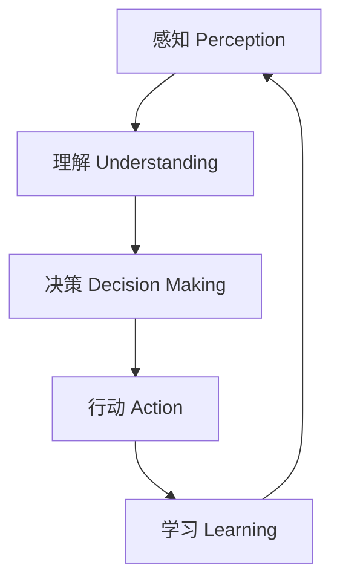

# AI人工智能代理工作流AI Agent WorkFlow：智能代理在智慧城市中的实践

## 1.背景介绍

### 1.1 智慧城市的兴起

随着城市化进程的不断加快,传统城市面临着日益严峻的挑战,如交通拥堵、环境污染、能源浪费等。为了应对这些挑战,构建智慧城市成为了城市发展的必然选择。智慧城市是利用物联网、云计算、大数据、人工智能等新兴信息技术,将城市的各种资源进行整合,实现城市规划、建设、管理和服务的智能化。

### 1.2 人工智能在智慧城市中的作用

人工智能作为智慧城市的核心驱动力之一,在智慧城市的各个领域发挥着越来越重要的作用。从交通管理、环境监测到公共安全,人工智能技术都可以提供智能化的解决方案,提高城市运营效率,优化资源配置,为市民提供更加便捷、舒适的生活体验。

### 1.3 智能代理的概念

智能代理(Intelligent Agent)是人工智能领域的一个重要概念,指的是一种能够感知环境、处理信息、做出决策并采取行动的自主系统。智能代理具有自主性、反应性、主动性和社会性等特点,可以根据环境变化做出智能响应,并与其他代理进行协作。

## 2.核心概念与联系

### 2.1 智能代理的工作流程

智能代理的工作流程通常包括以下几个关键步骤:

1. **感知(Perception)**: 通过各种传感器收集环境信息,如视频、图像、声音等数据。
2. **理解(Understanding)**: 对收集到的数据进行处理和分析,提取有用的信息和知识。
3. **决策(Decision Making)**: 基于理解的结果,结合预定目标和约束条件,做出相应的决策。
4. **行动(Action)**: 根据决策结果,采取相应的行动,如控制执行器完成任务。
5. **学习(Learning)**: 根据行动的结果,更新知识库,优化决策模型,提高系统性能。

这个工作流程形成了一个闭环,使得智能代理能够持续地感知环境、学习和优化自身,以更好地完成任务。



### 2.2 智能代理在智慧城市中的应用

智能代理可以广泛应用于智慧城市的各个领域,如交通管理、环境监测、公共安全、医疗卫生、能源管理等。它们可以通过感知环境数据、分析处理、智能决策和执行行动,实现城市运营的自动化和智能化。

例如,在交通管理领域,智能代理可以通过感知实时交通数据,分析交通状况,智能调度信号灯时间和路线,缓解交通拥堵;在环境监测领域,智能代理可以通过感知环境数据,分析污染源和扩散趋势,制定应对策略,减少污染物排放。

## 3.核心算法原理具体操作步骤

智能代理的核心算法原理主要包括以下几个方面:

### 3.1 感知与数据预处理

感知模块负责从各种传感器获取原始数据,如视频流、图像、声音等。数据预处理则是对这些原始数据进行清洗、标准化、特征提取等操作,为后续的理解和决策提供高质量的输入数据。

常用的数据预处理技术包括:

1. **数据清洗**: 去除噪声、异常值和缺失值等。
2. **数据标准化**: 将数据转换到同一量纲,便于模型训练和计算。
3. **特征提取**: 从原始数据中提取有用的特征,如图像的边缘、纹理等。

### 3.2 理解与知识表示

理解模块的主要任务是对预处理后的数据进行分析和理解,提取有用的信息和知识。常用的技术包括:

1. **机器学习算法**: 如深度学习、支持向量机等,用于从数据中学习模式和规律。
2. **知识图谱**: 将结构化和非结构化数据表示为实体和关系的知识图谱,方便存储和推理。
3. **自然语言处理**: 用于理解和生成自然语言,如文本分类、机器翻译等。

### 3.3 决策与规划

决策模块需要根据理解得到的知识,结合预定目标和约束条件,做出合理的决策。常用的技术包括:

1. **规则引擎**: 基于预定义的规则进行决策,适用于确定性问题。
2. **优化算法**: 如线性规划、动态规划等,用于求解最优解。
3. **智能规划**: 如马尔可夫决策过程、强化学习等,用于求解序列决策问题。

### 3.4 行动与控制

行动模块负责根据决策结果,控制执行器(如机器人手臂、无人机等)完成实际任务。常用的技术包括:

1. **运动规划**: 计算机器人的运动轨迹,避免障碍物。
2. **控制理论**: 如PID控制、自适应控制等,用于精确控制执行器。
3. **多智能体协作**: 多个智能代理之间的协调与协作。

### 3.5 学习与优化

学习模块通过分析行动的结果,更新知识库,优化决策模型,提高系统性能。常用的技术包括:

1. **监督学习**: 从带标签的数据中学习,如分类、回归等。
2. **无监督学习**: 从无标签数据中发现潜在模式,如聚类、降维等。
3. **强化学习**: 通过试错和奖惩,学习获取最大累计奖励的策略。

## 4.数学模型和公式详细讲解举例说明

智能代理中涉及了许多数学模型和公式,下面将详细介绍其中的一些核心内容。

### 4.1 马尔可夫决策过程(MDP)

马尔可夫决策过程是一种描述序列决策问题的数学框架,广泛应用于智能规划和强化学习领域。一个MDP可以用一个五元组 $(S, A, P, R, \gamma)$ 来表示,其中:

- $S$ 是状态集合
- $A$ 是行动集合
- $P(s'|s,a)$ 是状态转移概率,表示在状态 $s$ 下执行行动 $a$ 后转移到状态 $s'$ 的概率
- $R(s,a)$ 是即时奖励函数,表示在状态 $s$ 下执行行动 $a$ 获得的即时奖励
- $\gamma \in [0,1)$ 是折现因子,用于权衡即时奖励和长期累计奖励

目标是找到一个策略 $\pi: S \rightarrow A$,使得期望的累计折现奖励最大:

$$
\max_\pi \mathbb{E}\left[\sum_{t=0}^\infty \gamma^t R(s_t, a_t)\right]
$$

其中 $s_t$ 和 $a_t$ 分别表示第 $t$ 个时间步的状态和行动。

### 4.2 Q-Learning算法

Q-Learning是一种常用的强化学习算法,用于求解MDP问题。它的核心思想是通过不断试错,学习一个行动价值函数 $Q(s,a)$,表示在状态 $s$ 下执行行动 $a$ 后可获得的期望累计奖励。

Q-Learning算法的更新规则如下:

$$
Q(s_t, a_t) \leftarrow Q(s_t, a_t) + \alpha \left[r_t + \gamma \max_{a'} Q(s_{t+1}, a') - Q(s_t, a_t)\right]
$$

其中:

- $\alpha$ 是学习率,控制更新幅度
- $r_t$ 是在时间步 $t$ 获得的即时奖励
- $\gamma$ 是折现因子
- $\max_{a'} Q(s_{t+1}, a')$ 是下一状态 $s_{t+1}$ 下可获得的最大行动价值

通过不断更新 $Q$ 函数,最终可以得到一个最优策略 $\pi^*(s) = \arg\max_a Q(s,a)$。

### 4.3 深度Q网络(DQN)

传统的Q-Learning算法需要维护一个巨大的Q表,存储所有状态-行动对的行动价值,在状态空间和行动空间很大时会遇到维数灾难的问题。深度Q网络(Deep Q-Network, DQN)则是将Q函数用一个深度神经网络来拟合,可以有效解决维数灾难问题。

DQN的核心思想是使用一个卷积神经网络 $Q(s,a;\theta)$ 来近似行动价值函数,其中 $\theta$ 是网络参数。在每一个时间步,我们根据当前状态 $s_t$ 选取一个行动 $a_t = \arg\max_a Q(s_t, a;\theta)$,执行该行动后获得即时奖励 $r_t$ 和下一状态 $s_{t+1}$,然后使用下式更新网络参数:

$$
\theta \leftarrow \theta + \alpha \left(r_t + \gamma \max_{a'} Q(s_{t+1}, a';\theta^-) - Q(s_t, a_t;\theta)\right) \nabla_\theta Q(s_t, a_t;\theta)
$$

其中 $\theta^-$ 是一个目标网络的参数,用于估计 $\max_{a'} Q(s_{t+1}, a';\theta^-)$,以提高训练稳定性。

DQN算法通过经验回放和目标网络等技巧,可以有效提高训练效率和稳定性,在许多任务上取得了卓越的表现。

## 5.项目实践:代码实例和详细解释说明

为了更好地理解智能代理的工作原理,我们将通过一个具体的项目实践来演示如何使用Python和相关库构建一个简单的智能代理系统。

### 5.1 项目概述

在这个项目中,我们将构建一个简单的智能代理,用于控制一辆小车在二维网格世界中导航。小车的目标是从起点到达终点,同时避开障碍物。我们将使用Q-Learning算法训练智能代理,使其能够学习到一个最优策略。

### 5.2 环境设置

首先,我们需要导入必要的Python库:

```python
import numpy as np
import matplotlib.pyplot as plt
from collections import defaultdict
```

然后,定义网格世界的大小和障碍物位置:

```python
WORLD_SIZE = 6
OBSTACLES = [(2, 2), (3, 3), (4, 4)]
```

接下来,定义小车的起点和终点:

```python
START = (0, 0)
GOAL = (5, 5)
```

### 5.3 智能代理实现

我们将使用Q-Learning算法实现智能代理。首先,定义状态空间和行动空间:

```python
STATES = [(x, y) for x in range(WORLD_SIZE) for y in range(WORLD_SIZE)]
ACTIONS = ['up', 'down', 'left', 'right']
```

然后,初始化Q表:

```python
Q = defaultdict(lambda: np.zeros(len(ACTIONS)))
```

定义奖励函数和状态转移函数:

```python
def get_reward(state):
    if state == GOAL:
        return 1
    elif state in OBSTACLES:
        return -1
    else:
        return 0

def get_next_state(state, action):
    x, y = state
    if action == 'up':
        next_state = (x, y + 1)
    elif action == 'down':
        next_state = (x, y - 1)
    elif action == 'left':
        next_state = (x - 1, y)
    else:
        next_state = (x + 1, y)
    
    next_state = tuple(np.clip(next_state, (0, 0), (WORLD_SIZE - 1, WORLD_SIZE - 1)))
    return next_state
```

实现Q-Learning算法:

```python
import random

ALPHA = 0.1
GAMMA = 0.9
EPSILON = 0.1
NUM_EPISODES = 10000

for episode in range(NUM_EPISODES):
    state = START
    done = False
    while not done:
        if random.uniform(0, 1) < EPSILON:
            action = random.choice(ACTIONS)
        else:
            action = max(Q[state], key=Q[state].get)
        
        next_state = get_next_state(state, action)
        reward = get_reward(next_state)
        
        Q[state][ACTIONS.index(action)] += ALPHA * (reward + GAMMA * max(Q[next_state].values()) - Q[state][