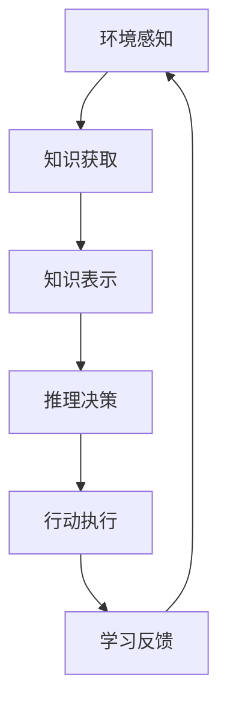

# AI人工智能代理工作流AI Agent WorkFlow：智能代理在重大事件预测系统中的应用

## 1.背景介绍

### 1.1 重大事件预测的重要性

在当今快节奏的世界中,重大事件如自然灾害、金融危机、疫情爆发等不可预测的情况时有发生,这些事件往往会对社会、经济和人民生活产生深远影响。及时准确地预测和应对这些重大事件,对于减轻负面影响、保护人民生命财产安全至关重要。然而,由于这些事件的复杂性和不确定性,传统的预测方法往往效果有限。

### 1.2 人工智能在重大事件预测中的作用

近年来,人工智能技术的飞速发展为重大事件预测提供了新的解决方案。人工智能系统能够从海量数据中发现隐藏的模式和关联,并基于这些发现做出预测和决策。特别是智能代理技术,通过模拟人类专家的决策过程,能够高效地处理复杂的决策问题,为重大事件预测提供了强大的支持。

## 2.核心概念与联系  

### 2.1 智能代理

智能代理(Intelligent Agent)是一种自主的软件实体,能够感知环境、处理信息、做出决策并采取行动以实现特定目标。智能代理通常由以下几个核心组件构成:

- 感知器(Sensors):用于从环境中获取信息
- 效能器(Actuators):用于对环境产生影响或执行行动
- 知识库(Knowledge Base):存储代理所拥有的知识
- 推理引擎(Inference Engine):根据知识库中的知识和感知到的信息做出决策

智能代理可以分为不同类型,如反应型代理、基于模型的代理、基于目标的代理等,具有不同的特点和应用场景。

### 2.2 智能代理工作流

智能代理工作流(AI Agent Workflow)描述了智能代理在特定任务或问题中的工作过程,包括以下几个关键步骤:

1. 环境感知
2. 知识获取
3. 知识表示
4. 推理决策
5. 行动执行
6. 学习反馈

智能代理通过这一工作流循环,不断从环境中获取信息、更新知识库、优化决策模型,最终实现高效智能的决策和行动。



### 2.3 重大事件预测系统

重大事件预测系统是一种基于人工智能技术的决策支持系统,旨在预测和应对各种重大事件。它通常包括以下几个关键模块:

- 数据采集模块:从多源异构数据源采集相关数据
- 数据预处理模块:对采集的数据进行清洗、整合和标准化
- 特征工程模块:从预处理后的数据中提取有价值的特征
- 预测模型模块:基于特征数据训练预测模型
- 决策模块:根据预测结果做出决策并采取相应行动

智能代理可以作为重大事件预测系统的核心决策模块,基于知识库和推理引擎做出高效智能的决策。

## 3.核心算法原理具体操作步骤

智能代理在重大事件预测系统中的核心算法原理可以概括为以下几个步骤:

### 3.1 知识库构建

知识库是智能代理的核心部分,存储了代理所拥有的领域知识。在重大事件预测场景中,知识库通常包括以下几个部分:

1. **事件本体**:对重大事件的类型、属性、关系等进行形式化描述
2. **规则库**:存储用于推理决策的规则,如"如果...那么..."形式的条件规则
3. **案例库**:存储历史重大事件案例及其处理方案
4. **领域知识**:与重大事件相关的背景知识,如气象、经济、政治等领域知识

知识库的构建通常需要领域专家的参与,将他们的专业知识形式化并存储在知识库中。同时,也可以利用机器学习等技术从历史数据中自动提取知识。

### 3.2 环境感知与信息融合

智能代理需要从多源异构数据源中采集相关信息,包括新闻报道、社交媒体、监测数据等。由于这些数据源的异构性,需要进行信息融合,将不同来源的信息整合在一起,形成统一的信息视图。

常用的信息融合技术包括:

- 数据清洗和标准化
- 实体链接
- 主题建模
- 跨源关联分析

通过信息融合,智能代理可以获得全面准确的环境感知,为后续的决策提供支持。

### 3.3 推理决策

推理决策是智能代理的核心功能,需要基于知识库中的知识和当前的环境信息做出决策。常用的推理技术包括:

1. **规则推理**:基于知识库中的规则进行前向或后向推理
2. **案例推理**:将当前情况与知识库中的历史案例进行匹配,并借鉴相似案例的处理方案
3. **模型推理**:基于机器学习等技术构建决策模型,对当前情况进行预测和决策
4. **规划推理**:根据目标和约束条件生成行动计划

推理过程通常需要综合运用多种推理技术,以提高决策的准确性和可解释性。

### 3.4 行动执行与反馈学习

根据推理决策的结果,智能代理需要采取相应的行动,如发布预警、调配资源等。同时,智能代理还需要持续监测行动的效果,并根据反馈信息对知识库和决策模型进行更新和优化,以提高未来决策的准确性。

这个过程可以看作是一个闭环的学习过程,智能代理通过不断地获取新知识、优化决策模型,逐步提高自身的决策能力。

## 4.数学模型和公式详细讲解举例说明

在重大事件预测系统中,常常需要利用数学模型对事件发生的概率或影响程度进行量化预测。以下是一些常用的数学模型和公式:

### 4.1 贝叶斯网络

贝叶斯网络是一种基于概率论的图形模型,可以有效地表示事件之间的因果关系和条件概率。在重大事件预测中,可以将事件及其影响因素构建成一个贝叶斯网络,然后根据观测到的证据计算事件发生的概率。

贝叶斯网络的核心公式是贝叶斯定理:

$$P(A|B) = \frac{P(B|A)P(A)}{P(B)}$$

其中,P(A|B)表示在已知B的条件下,A发生的条件概率;P(B|A)表示在已知A的条件下,B发生的条件概率;P(A)和P(B)分别表示A和B的先验概率。

在构建贝叶斯网络时,需要确定网络结构(即事件之间的依赖关系)和各个节点的条件概率分布。这些参数可以通过专家知识或历史数据进行估计。

### 4.2 马尔可夫模型

马尔可夫模型是一种描述随机过程的数学模型,它假设系统的未来状态只依赖于当前状态,与过去状态无关。在重大事件预测中,可以将事件的发展过程建模为一个马尔可夫过程,并利用马尔可夫模型预测事件的未来演化趋势。

马尔可夫模型的核心公式是状态转移概率:

$$P(X_{t+1}=j|X_t=i,X_{t-1}=i_{t-1},...,X_0=i_0) = P(X_{t+1}=j|X_t=i)$$

其中,X_t表示时刻t的系统状态,P(X_{t+1}=j|X_t=i)表示在时刻t处于状态i的条件下,时刻t+1转移到状态j的概率。

在构建马尔可夫模型时,需要确定状态空间和状态转移概率矩阵。这些参数可以通过对历史数据进行统计估计。

### 4.3 时间序列模型

时间序列模型是描述随时间变化的数据序列的数学模型,在重大事件预测中可以用于预测事件相关指标(如经济、环境等)的未来走势。常用的时间序列模型包括自回归移动平均模型(ARMA)、指数平滑模型等。

以ARMA(p,q)模型为例,其公式为:

$$X_t = \phi_1X_{t-1} + \phi_2X_{t-2} + ... + \phi_pX_{t-p} + \epsilon_t + \theta_1\epsilon_{t-1} + \theta_2\epsilon_{t-2} + ... + \theta_q\epsilon_{t-q}$$

其中,X_t表示时刻t的观测值,φ_i和θ_j分别表示自回归和移动平均部分的系数,ε_t表示时刻t的随机误差项。

在构建时间序列模型时,需要确定模型阶数(如ARMA模型的p和q值)以及各个系数的值。这些参数可以通过对历史数据进行拟合估计。

### 4.4 机器学习模型

除了上述传统的数学模型,机器学习模型也被广泛应用于重大事件预测。常用的机器学习模型包括逻辑回归、决策树、支持向量机、神经网络等。

以逻辑回归模型为例,其公式为:

$$\ln\left(\frac{p}{1-p}\right) = \beta_0 + \beta_1x_1 + \beta_2x_2 + ... + \beta_nx_n$$

其中,p表示事件发生的概率,x_i表示第i个特征变量,β_i表示对应的回归系数。

在构建机器学习模型时,需要从历史数据中提取特征变量,并利用训练数据估计模型参数。常用的训练算法包括梯度下降、随机梯度下降等优化算法。

无论采用何种数学模型,都需要根据实际问题和数据特点进行选择和调优,以获得最佳的预测效果。

## 5.项目实践:代码实例和详细解释说明

为了更好地理解智能代理在重大事件预测系统中的应用,我们以一个简化的案例为例,通过代码实现来说明其核心流程。

假设我们需要构建一个简单的智能代理系统,用于预测某种自然灾害事件的发生概率。我们将采用贝叶斯网络作为推理模型,并使用Python中的PyMC3库进行实现。

### 5.1 知识库构建

首先,我们需要定义事件本体和规则库,作为智能代理的知识库。在这个简化案例中,我们假设自然灾害事件的发生概率与以下几个因素相关:

- 降雨量
- 气温
- 地质构造
- 历史记录

我们可以使用PyMC3中的随机变量来表示这些因素,并定义它们之间的依赖关系:

```python
import pymc3 as pm

# 定义随机变量
rainfall = pm.Normal('rainfall', mu=0, sigma=1)
temperature = pm.Normal('temperature', mu=0, sigma=1)
geology = pm.Bernoulli('geology', 0.5)
history = pm.Bernoulli('history', 0.5)

# 定义事件发生概率
disaster_prob = pm.Deterministic('disaster_prob', pm.math.sigmoid(
    2 * rainfall + 3 * temperature - 4 * geology + 5 * history))
```

在上面的代码中,我们使用正态分布和伯努利分布分别表示连续型和离散型的随机变量。`disaster_prob`是一个确定性变量,表示自然灾害事件发生的概率,它是一个sigmoid函数,取决于其他四个随机变量的值。

### 5.2 推理决策

接下来,我们需要基于观测到的证据(如实际的降雨量、气温等)来推断事件发生概率。PyMC3提供了基于马尔可夫蒙特卡罗(MCMC)采样的推理方法:

```python
with pm.Model() as disaster_model:
    # 定义模型
    ...

    # 观测数据
    rainfall_data = 1.5
    temperature_data = 0.8
    geology_data = 1
    history_data = 0

    # 观测证据
    pm.Normal('rainfall_obs', mu=rainfall, sigma=1, observed=rainfall_data)
    pm.Normal('