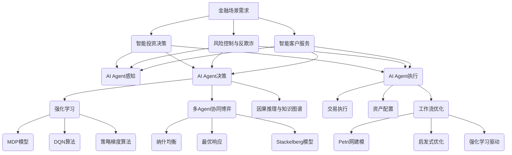

# AI人工智能代理工作流AI Agent WorkFlow：智能代理在金融系统中的应用

## 1. 背景介绍
### 1.1 人工智能在金融领域的应用现状
#### 1.1.1 智能投资顾问和交易系统
#### 1.1.2 风险控制与反欺诈
#### 1.1.3 客户服务与智能助理
### 1.2 AI Agent的概念与优势
#### 1.2.1 AI Agent的定义与特点 
#### 1.2.2 AI Agent相对传统系统的优势
### 1.3 金融系统对AI Agent的需求
#### 1.3.1 提高效率与自动化程度
#### 1.3.2 增强决策支持能力
#### 1.3.3 优化用户体验

## 2. 核心概念与联系
### 2.1 AI Agent的组成要素
#### 2.1.1 感知模块
#### 2.1.2 决策模块
#### 2.1.3 执行模块
### 2.2 工作流的概念与特点
#### 2.2.1 工作流的定义
#### 2.2.2 工作流的基本要素
#### 2.2.3 工作流的优势
### 2.3 AI Agent与工作流的结合
#### 2.3.1 AI Agent驱动的智能工作流
#### 2.3.2 工作流赋能AI Agent的决策与执行

## 3. 核心算法原理与具体操作步骤
### 3.1 强化学习算法
#### 3.1.1 马尔可夫决策过程
#### 3.1.2 Q-Learning算法
#### 3.1.3 Deep Q-Network (DQN)算法
### 3.2 多Agent协同算法
#### 3.2.1 博弈论基础
#### 3.2.2 多Agent强化学习
#### 3.2.3 分布式优化算法
### 3.3 工作流建模与优化算法
#### 3.3.1 Petri网工作流建模
#### 3.3.2 基于约束优化的工作流优化
#### 3.3.3 启发式工作流优化算法

## 4. 数学模型和公式详细讲解举例说明
### 4.1 马尔可夫决策过程(MDP)模型
#### 4.1.1 MDP的定义与组成要素
#### 4.1.2 Bellman最优性方程
#### 4.1.3 值迭代与策略迭代算法
### 4.2 强化学习中的数学模型 
#### 4.2.1 Q-Learning的更新公式
#### 4.2.2 DQN的损失函数与优化目标
#### 4.2.3 策略梯度定理
### 4.3 博弈论中的数学模型
#### 4.3.1 纳什均衡的定义与求解
#### 4.3.2 最优响应与最优策略
#### 4.3.3 stackelberg博弈模型

## 5. 项目实践：代码实例和详细解释说明
### 5.1 单Agent强化学习交易系统
#### 5.1.1 环境与状态空间设计
#### 5.1.2 DQN算法实现
#### 5.1.3 训练过程与结果分析
### 5.2 多Agent协同的智能投资系统
#### 5.2.1 多Agent博弈环境构建
#### 5.2.2 分布式多Agent强化学习算法
#### 5.2.3 实验结果与性能评估
### 5.3 基于AI Agent的金融工作流优化
#### 5.3.1 金融工作流的Petri网建模
#### 5.3.2 强化学习驱动的工作流优化
#### 5.3.3 仿真实验与结果分析

## 6. 实际应用场景
### 6.1 智能投资决策系统
#### 6.1.1 多因子选股策略
#### 6.1.2 资产配置与动态再平衡
#### 6.1.3 交易执行优化
### 6.2 金融风控与反欺诈
#### 6.2.1 实时异常交易检测
#### 6.2.2 用户行为分析与风险评估
#### 6.2.3 图神经网络反欺诈模型
### 6.3 智能客户服务
#### 6.3.1 个性化投资组合推荐
#### 6.3.2 智能投顾助理
#### 6.3.3 客户情绪分析与服务优化

## 7. 工具和资源推荐
### 7.1 强化学习平台与工具包
#### 7.1.1 OpenAI Gym
#### 7.1.2 TensorFlow Agent
#### 7.1.3 RLlib
### 7.2 多Agent协同框架
#### 7.2.1 MADDPG
#### 7.2.2 MARL Frameworks
#### 7.2.3 Ray
### 7.3 工作流建模与优化工具
#### 7.3.1 YAWL
#### 7.3.2 Bonita
#### 7.3.3 Activiti

## 8. 总结：未来发展趋势与挑战
### 8.1 AI Agent与金融系统深度融合
#### 8.1.1 端到端的智能化金融服务
#### 8.1.2 数字孪生驱动的金融决策优化
#### 8.1.3 AI Agent赋能的智慧金融生态
### 8.2 AI Agent工作流的可解释性与可信性
#### 8.2.1 可解释AI在金融领域的重要性
#### 8.2.2 因果推理与知识图谱增强的可解释性
#### 8.2.3 区块链提升AI Agent的可信性
### 8.3 AI治理与伦理挑战
#### 8.3.1 算法公平性与非歧视性
#### 8.3.2 数据隐私保护与安全
#### 8.3.3 AI治理框架与伦理准则

## 9. 附录：常见问题与解答
### 9.1 如何选择适合的强化学习算法？
### 9.2 多Agent系统如何处理通信与协作？
### 9.3 如何平衡AI Agent的探索与利用？
### 9.4 金融领域应用AI Agent需要注意哪些风险？ 
### 9.5 AI Agent的决策可解释性如何提升？

人工智能技术正在深刻影响和重塑金融行业的方方面面。从智能投资决策、个性化财富管理到风控合规与反欺诈，AI赋能的智能代理系统为金融机构提供了全新的解决方案与服务模式。本文聚焦AI Agent在金融领域的工作流设计与优化，探讨如何通过强化学习、多Agent博弈等前沿算法，构建高效、灵活、智能的金融服务流程与决策机制。

金融领域对AI Agent的核心需求主要体现在三个方面：智能投研决策、风险控制，以及智能客户服务。智能投研决策要求AI Agent能够基于海量的市场数据、行业资讯、宏观政经环境等多源异构信息，实时生成投资策略、选股择时、资产配置方案。这对Agent的信息感知、语义理解、决策优化能力都提出了很高的要求。风险控制与反欺诈则需要Agent能够及时发现异常交易行为，评估交易对象的信用风险，识别潜在的金融欺诈。这不仅需要强大的数据挖掘与关联分析能力，还需要因果推理与知识图谱等可解释AI技术的加持。智能客户服务则是要通过对用户画像、行为轨迹、情绪倾向等信息的分析，为客户提供个性化的投资组合推荐、智能投顾辅助等增值服务。

针对金融场景需求，一个典型的AI Agent驱动的工作流包括三个关键组件：感知、决策、执行。感知模块负责从环境中获取信息，并将多模态数据转化为Agent内部的状态表征。决策模块在此基础上通过算法模型生成具体的动作策略。执行模块则负责策略的落地，驱动下游系统进行实际的交易执行、资产配置、流程优化等任务。

在决策优化层面，强化学习可以说是AI Agent的核心大脑。通过将复杂的金融决策抽象为马尔可夫决策过程(MDP)，我们可以利用Q-Learning、DQN等成熟的强化学习算法，让Agent学会根据环境状态自主采取最优动作，并通过不断的试错来持续优化策略。在多Agent协同博弈的场景下，博弈论中的纳什均衡、最优响应等理论也为构建理性的Agent互动机制提供了重要的数学基础。

为了进一步提升AI Agent决策与执行的可解释性和可信性，因果推理与知识图谱技术也在金融领域得到广泛应用。通过对Agent推理过程中的因果关系进行建模，并利用领域知识图谱对决策结果进行可解释性分析，我们可以更好地理解Agent的内在逻辑，增强系统的透明度。区块链技术则为打造可信的Agent执行机制提供了新的思路，利用智能合约可以对Agent行为进行约束和审计，提升系统的安全性和可靠性。

在具体的项目实践中，我们通过案例剖析了AI Agent在智能投研、多Agent协同、金融工作流优化等场景下的应用。单Agent强化学习交易系统通过DQN算法实现了端到端的策略学习优化，多Agent投资系统则利用分布式强化学习实现了多个理性Agent的博弈均衡，金融工作流优化则综合利用了Petri网建模、启发式搜索、强化学习等技术，大幅提升了流程的灵活性与效率。

展望未来，AI Agent必将与金融系统深度融合，驱动金融服务模式的智能化变革。端到端的智能化金融服务、数字孪生驱动的决策优化、AI赋能的智慧金融生态将成为大势所趋。与此同时，AI治理与伦理问题也日益凸显。算法歧视、隐私安全、可解释性不足等挑战亟需产学研各界通力合作，在发展AI赋能金融的同时，也要构建科学的治理框架和伦理规范，确保AI造福人类社会的初心不改。

作者：禅与计算机程序设计艺术 / Zen and the Art of Computer Programming