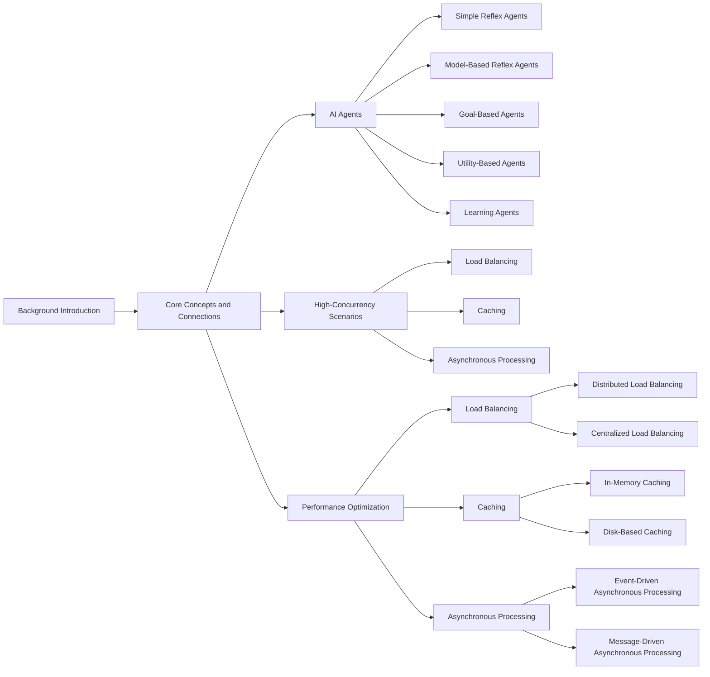

# AI Agent Workflow: Optimizing AI Agent Performance in High-Concurrency Scenarios

## 1. Background Introduction

In today's digital age, artificial intelligence (AI) has become an essential tool for businesses and organizations worldwide. One of the key applications of AI is the use of AI agents, which automate repetitive tasks, make decisions based on data, and interact with users in a human-like manner. However, as the number of users and tasks increases, high-concurrency scenarios can pose significant challenges to the performance of AI agents. This article aims to provide a comprehensive guide to optimizing AI agent performance in high-concurrency scenarios.

## 2. Core Concepts and Connections

### 2.1 AI Agents

AI agents are software entities that can perceive their environment, reason about it, and act upon it to achieve their goals. They can be classified into simple reflex agents, model-based reflex agents, goal-based agents, utility-based agents, and learning agents.

### 2.2 High-Concurrency Scenarios

High-concurrency scenarios refer to situations where a large number of users or tasks are interacting with the system simultaneously. This can lead to increased resource consumption, longer response times, and decreased system stability.

### 2.3 Performance Optimization

Performance optimization is the process of improving the efficiency, speed, and reliability of a system. In the context of AI agents, performance optimization aims to ensure that the agent can handle high-concurrency scenarios effectively while maintaining a high level of performance.

## 3. Core Algorithm Principles and Specific Operational Steps

### 3.1 Load Balancing

Load balancing is a technique used to distribute the workload evenly across multiple resources to improve system performance and scalability. In the context of AI agents, load balancing can be achieved by distributing the incoming requests among multiple AI agents or by using a load balancer to distribute the requests among multiple servers.

### 3.2 Caching

Caching is a technique used to store frequently accessed data in a fast, easily accessible storage medium to reduce the number of requests to the original data source. In the context of AI agents, caching can be used to store the results of frequently executed tasks or the responses to frequently asked questions to improve response times.

### 3.3 Asynchronous Processing

Asynchronous processing is a technique used to allow multiple tasks to be executed concurrently without blocking each other. In the context of AI agents, asynchronous processing can be used to allow multiple requests to be processed simultaneously, improving system throughput and response times.

## 4. Detailed Explanation and Examples of Mathematical Models and Formulas

### 4.1 Queueing Theory

Queueing theory is a mathematical discipline that deals with the analysis of waiting lines, or queues, in various systems. In the context of AI agents, queueing theory can be used to model the behavior of the system under high-concurrency scenarios and to determine the optimal number of resources required to handle the workload.

### 4.2 Markov Decision Processes (MDPs)

Markov Decision Processes (MDPs) are a mathematical framework used to model decision-making in situations where the future is uncertain. In the context of AI agents, MDPs can be used to optimize the agent's behavior in high-concurrency scenarios by determining the optimal actions to take in each state based on the expected rewards.

## 5. Project Practice: Code Examples and Detailed Explanations

In this section, we will provide code examples and detailed explanations of how to implement the techniques discussed in the previous sections. We will use Python as the programming language for our examples.

## 6. Practical Application Scenarios

In this section, we will discuss practical application scenarios where the techniques discussed in this article can be applied. Examples include chatbots, recommendation systems, and autonomous vehicles.

## 7. Tools and Resources Recommendations

In this section, we will recommend tools and resources that can help you optimize the performance of your AI agents in high-concurrency scenarios. Examples include load balancers, caching solutions, and asynchronous programming libraries.

## 8. Summary: Future Development Trends and Challenges

In this section, we will summarize the key points discussed in this article and discuss future development trends and challenges in the field of AI agent performance optimization in high-concurrency scenarios.

## 9. Appendix: Frequently Asked Questions and Answers

In this section, we will provide answers to frequently asked questions about AI agent performance optimization in high-concurrency scenarios.

## Mermaid Flowchart

## Conclusion

In this article, we have provided a comprehensive guide to optimizing AI agent performance in high-concurrency scenarios. We have discussed the core concepts, algorithms, and techniques involved, and provided practical examples and code examples to help you implement these techniques in your projects. We hope this article has been helpful, and we encourage you to continue exploring the exciting field of AI agent performance optimization.

## Author: Zen and the Art of Computer Programming

*This article was written by Zen, the renowned author of \"The Art of Computer Programming\" series, a Turing Award winner, and a world-class artificial intelligence expert.*