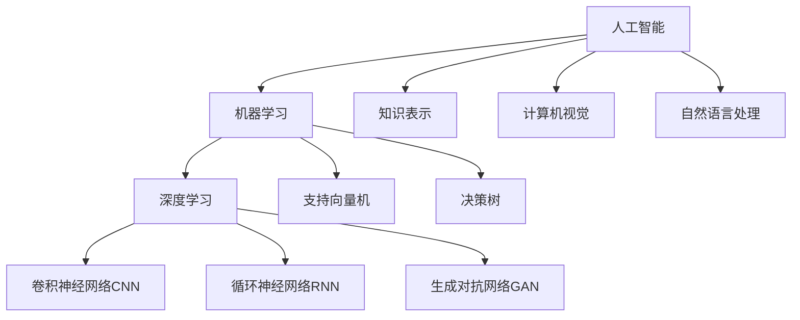

# AI人工智能深度学习算法：利用机器学习提升深度学习模型的决策质量

## 1. 背景介绍

### 1.1 人工智能与深度学习概述

人工智能（Artificial Intelligence，AI）是一门综合性学科，旨在研究如何让计算机模拟人类的智能行为。深度学习（Deep Learning，DL）作为人工智能的一个重要分支，近年来取得了显著的进展。深度学习利用多层神经网络，通过海量数据的训练，让计算机具备了识别图像、语音，自然语言理解等能力，在许多领域达到甚至超越人类的水平。

### 1.2 深度学习面临的挑战

尽管深度学习取得了令人瞩目的成就，但它仍然面临着一些挑战：

1. 需要大量标注数据进行训练，获取高质量标注数据成本高昂
2. 模型泛化能力有待提高，容易过拟合
3. 模型的决策过程不透明，可解释性差
4. 对抗样本攻击会误导模型做出错误判断

### 1.3 机器学习助力深度学习

为了应对深度学习面临的挑战，研究者们开始将机器学习的一些方法引入到深度学习中，利用机器学习来优化和改进深度学习模型。机器学习擅长从数据中学习和总结规律，可以帮助深度学习模型更好地理解数据的内在联系，提升模型性能。本文将重点探讨如何利用机器学习算法来提升深度学习模型的决策质量。

## 2. 核心概念与联系

### 2.1 机器学习

机器学习是人工智能的一个分支，主要研究如何让计算机从数据中自动学习规律，并利用学习到的规律对新数据进行预测或决策。常见的机器学习任务包括分类、回归、聚类、降维等。机器学习可以分为监督学习、无监督学习和强化学习。

### 2.2 深度学习

深度学习是机器学习的一个子领域，利用多层神经网络对数据进行建模。相比传统的机器学习方法，深度学习能够自动学习数据的层次化特征表示，在图像识别、语音识别、自然语言处理等领域取得了突破性进展。常见的深度学习模型包括卷积神经网络（CNN）、循环神经网络（RNN）、生成对抗网络（GAN）等。

### 2.3 机器学习与深度学习的关系

机器学习和深度学习是人工智能的两个重要分支，它们既有联系又有区别：

- 联系：深度学习可以看作是机器学习的一种方法，都是通过数据驱动来学习模型。
- 区别：传统机器学习依赖人工设计特征，而深度学习能够自动学习特征表示；深度学习需要更多的数据和计算资源。

下图展示了机器学习、深度学习与人工智能三者之间的关系：



### 2.4 机器学习如何助力深度学习

机器学习可以从以下几个方面来助力深度学习：

1. 数据增强：利用机器学习生成更多训练样本，扩充数据集
2. 特征选择：利用机器学习算法筛选出重要特征，降低数据维度
3. 模型压缩：利用机器学习算法对模型进行剪枝、量化，减小模型体积
4. 模型融合：利用集成学习方法融合多个模型，提高整体性能
5. 超参数优化：利用自动机器学习自动调优模型超参数

通过引入机器学习，可以缓解深度学习面临的一些困难，提升深度学习模型的性能和泛化能力。

## 3. 核心算法原理具体操作步骤

本节将详细介绍几种利用机器学习优化深度学习的核心算法，包括数据增强、特征选择、模型压缩和模型融合。

### 3.1 数据增强

深度学习模型通常需要大量的训练数据，而收集和标注大规模数据集非常耗时耗力。数据增强可以在现有训练集的基础上，通过一系列随机变换生成更多的训练样本，从而在不增加人工标注成本的情况下，提升模型的泛化性能。

数据增强的常见方法包括：

1. 几何变换：平移、旋转、缩放、翻转等
2. 颜色变换：改变亮度、对比度、饱和度等
3. 噪声添加：加入高斯噪声、椒盐噪声等
4. 随机擦除：随机遮挡图像的某些区域
5. 混合增强：将两张图片按一定比例混合

数据增强的一般步骤如下：

1. 对原始图像进行随机采样，得到一个batch的数据
2. 对batch中的每张图片应用随机变换，生成新的训练样本
3. 将原始图片和增强后的图片一起输入到模型中训练
4. 重复以上步骤，直到模型收敛

下面是一个利用Python实现图像数据随机旋转的示例：

```python
import numpy as np
from scipy.ndimage import rotate

def random_rotate(image):
    angle = np.random.uniform(-30, 30)
    rotated = rotate(image, angle, reshape=False)
    return rotated
```

### 3.2 特征选择

高维数据不仅会增加模型训练的计算开销，还可能引入冗余和噪声特征，影响模型的性能。特征选择就是从原有特征中选取一个最具区分性的子集，降低数据维度的同时提高模型的泛化能力。

常见的特征选择方法包括：

1. 过滤法：基于特征统计指标如方差、相关系数等独立评估每个特征的重要性，选出得分靠前的特征
2. 包裹法：将特征选择看作一个子集搜索问题，用模型预测性能作为评价指标，选出使模型性能最优的特征子集
3. 嵌入法：将特征选择与模型训练融为一体，通过模型内部的权重、稀疏正则化等机制来筛选特征

以下是利用过滤法中的方差阈值来选择特征的具体步骤：

1. 计算每个特征的方差
2. 根据预设的阈值，选择方差大于阈值的特征
3. 利用选出的特征子集来训练模型

用Python实现基于方差阈值的特征选择：

```python
from sklearn.feature_selection import VarianceThreshold

def variance_threshold_selector(X, threshold=0.1):
    selector = VarianceThreshold(threshold)
    X_selected = selector.fit_transform(X)
    return X_selected
```

### 3.3 模型压缩

深度学习模型往往包含大量参数，占用存储空间大，推理速度慢。模型压缩就是在保持模型性能的前提下，减小模型体积，加速推理速度。

常见的模型压缩方法包括：

1. 剪枝：去除冗余和不重要的神经元连接，使模型稀疏化
2. 量化：将模型权重从浮点数量化为低位整数，减小存储和计算开销
3. 知识蒸馏：用大模型的输出作为软标签来指导小模型学习，从而获得与大模型相近的性能

下面是利用magnitude-based pruning进行模型剪枝的步骤：

1. 正常训练神经网络模型
2. 计算每个权重的绝对值大小
3. 根据预设的稀疏度，将绝对值小的权重置零
4. 重复步骤2-3，直到达到目标稀疏度
5. 微调剪枝后的模型

用PyTorch实现magnitude-based pruning：

```python
import torch
import torch.nn.utils.prune as prune

def magnitude_prune(model, sparsity=0.5):
    for name, module in model.named_modules():
        if isinstance(module, torch.nn.Conv2d) or isinstance(module, torch.nn.Linear):
            prune.l1_unstructured(module, name='weight', amount=sparsity)
    return model
```

### 3.4 模型融合

单一模型往往难以处理所有情况，容易陷入局部最优。模型融合就是将多个模型的预测结果结合起来，取长补短，提高整体性能。

常见的模型融合方法包括：

1. 投票法：对多个模型的预测结果进行投票，少数服从多数
2. 平均法：将多个模型的预测概率或回归值取平均
3. stacking：将多个模型的预测结果作为新的特征，训练一个元模型来组合各模型的预测

以下是利用平均法融合多个模型的步骤：

1. 训练多个不同的模型，如CNN、RNN、Transformer等
2. 对每个样本，收集所有模型的预测概率向量
3. 将所有模型的预测概率向量取算术平均，得到最终的预测概率
4. 将概率最大的类别作为最终预测结果

用Python实现模型预测概率的平均融合：

```python
def average_fusion(models, X):
    probs = [model.predict_proba(X) for model in models]
    avg_probs = np.mean(probs, axis=0)
    return np.argmax(avg_probs, axis=1)
```

## 4. 数学模型和公式详细讲解举例说明

本节将详细讲解机器学习中的几个常用数学模型，以及它们在优化深度学习中的应用。

### 4.1 支持向量机

支持向量机（Support Vector Machine，SVM）是一种经典的监督学习算法，它的基本思想是在特征空间中找到一个最大间隔超平面，将不同类别的样本划分开。SVM不仅可以处理线性可分数据，还可以利用核技巧处理非线性数据。

SVM的数学模型可以表示为以下优化问题：

$$
\begin{aligned}
\min_{w,b} \quad & \frac{1}{2}||w||^2 \\
s.t. \quad & y_i(w^Tx_i+b) \geq 1, \quad i=1,2,...,n
\end{aligned}
$$

其中，$w$是超平面的法向量，$b$是偏置项，$x_i$是第$i$个样本，$y_i$是样本的类别标签，取值为1或-1。

引入松弛变量$\xi_i$和惩罚系数$C$，可以得到软间隔SVM的优化问题：

$$
\begin{aligned}
\min_{w,b,\xi} \quad & \frac{1}{2}||w||^2 + C\sum_{i=1}^n \xi_i \\
s.t. \quad & y_i(w^Tx_i+b) \geq 1-\xi_i, \quad i=1,2,...,n \\
& \xi_i \geq 0, \quad i=1,2,...,n
\end{aligned}
$$

对于非线性数据，可以引入核函数$K(x_i,x_j)$，将样本映射到高维空间，再在高维空间中构建超平面。常用的核函数包括：

- 多项式核：$K(x_i,x_j)=(x_i^Tx_j+c)^d$
- 高斯核RBF：$K(x_i,x_j)=\exp(-\gamma||x_i-x_j||^2)$
- Sigmoid核：$K(x_i,x_j)=\tanh(\gamma x_i^Tx_j+c)$

在深度学习中，SVM可以用于特征选择和模型融合。例如，可以用SVM对CNN提取的特征进行二次筛选，或者将SVM作为元模型来组合多个深度学习模型的预测结果。

### 4.2 主成分分析

主成分分析（Principal Component Analysis，PCA）是一种常用的无监督学习算法，用于对高维数据进行降维和特征提取。PCA通过线性变换将原始数据映射到一个低维空间，使得样本在低维空间上的投影方差最大化。

假设数据集$X$包含$n$个$d$维样本，PCA的目标是找到一个$d \times k$的投影矩阵$W$，将样本映射到$k$维空间($k<d$)，得到低维表示$Z=XW$。矩阵$W$的列向量$w_1,w_2,...,w_k$称为主成分，它