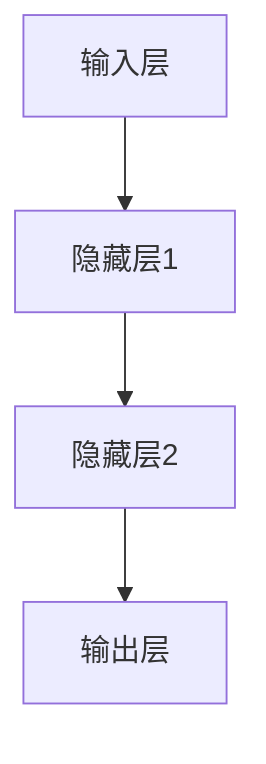
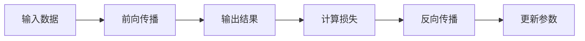
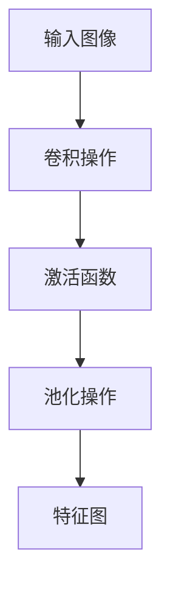
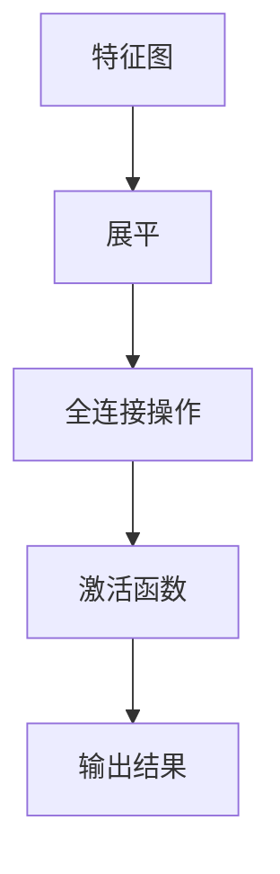
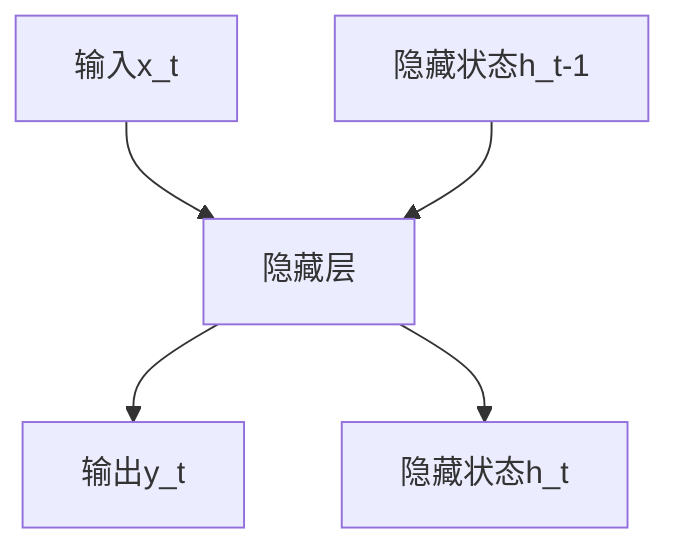
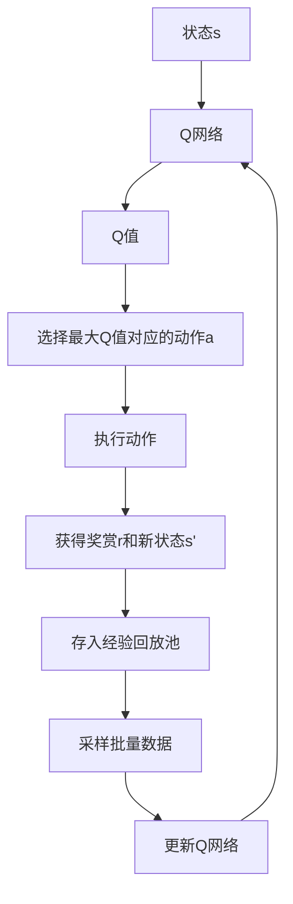

# AI人工智能深度学习算法：在产业机器人中的应用

## 1. 背景介绍

### 1.1 产业机器人的重要性

在现代化的制造业中,产业机器人扮演着至关重要的角色。它们可以执行重复性的任务,提高生产效率,降低人力成本,并确保一致的产品质量。随着技术的不断进步,产业机器人变得越来越智能化,能够完成更加复杂的任务。

### 1.2 人工智能在产业机器人中的应用

人工智能(AI)技术的发展为产业机器人带来了新的可能性。通过将深度学习算法应用于产业机器人,它们可以获得更强大的感知、决策和控制能力,从而实现更高级别的自动化。

### 1.3 深度学习在产业机器人中的作用

深度学习是人工智能的一个重要分支,它模仿人脑的工作原理,通过对大量数据的学习,自动获取特征并进行模式识别。在产业机器人中,深度学习可以用于视觉识别、运动规划、故障诊断等多个领域,大大提高了机器人的智能水平。

## 2. 核心概念与联系

### 2.1 深度学习基本概念

深度学习是机器学习的一种,它通过构建神经网络模型对数据进行学习和预测。神经网络由多层节点组成,每层节点对输入数据进行加权求和和非线性变换,最终输出预测结果。

#### 2.1.1 神经网络结构

一个典型的神经网络包括输入层、隐藏层和输出层。隐藏层可以有多层,层数越多,网络的表达能力就越强。



#### 2.1.2 前向传播与反向传播

在神经网络的训练过程中,输入数据经过前向传播得到输出,然后将输出与标签进行对比,计算损失函数。根据损失函数,通过反向传播算法更新网络参数,使得损失函数值最小化。



### 2.2 深度学习在产业机器人中的应用

深度学习在产业机器人中有广泛的应用,主要包括以下几个方面:

#### 2.2.1 计算机视觉

通过深度卷积神经网络(CNN)对图像进行处理,可以实现目标检测、物体识别、缺陷检测等功能,为机器人提供视觉感知能力。

#### 2.2.2 运动控制

利用深度强化学习算法,机器人可以自主学习最优的运动策略,实现精准的运动控制。

#### 2.2.3 故障诊断

基于深度学习的异常检测模型,可以对机器人的运行状态进行实时监控,及时发现并诊断故障。

#### 2.2.4 人机交互

通过深度学习处理语音、图像和文本数据,实现自然语言处理和计算机视觉,从而实现人机之间的自然交互。

## 3. 核心算法原理具体操作步骤  

### 3.1 卷积神经网络(CNN)

卷积神经网络是深度学习在计算机视觉领域的核心算法,它具有局部连接、权值共享和池化操作等特点,可以有效地提取图像的特征。

#### 3.1.1 卷积层

卷积层是CNN的核心部分,它通过卷积核对输入图像进行卷积操作,提取不同的特征。

卷积操作步骤:

1. 初始化卷积核权重
2. 对输入图像进行卷积操作,得到特征图
3. 对特征图进行激活函数处理(如ReLU)
4. 对特征图进行池化操作(如最大池化)



#### 3.1.2 全连接层

全连接层将卷积层提取的特征进行整合,并输出最终的分类或回归结果。

全连接层操作步骤:

1. 将卷积层输出的特征图展平为一维向量
2. 对向量进行全连接操作,得到输出向量
3. 对输出向量进行激活函数处理(如Softmax)



### 3.2 循环神经网络(RNN)

循环神经网络是处理序列数据(如语音、文本)的有力工具,它能够捕捉序列数据中的长期依赖关系。

#### 3.2.1 RNN基本原理

RNN在每个时间步都会接收当前输入和上一时间步的隐藏状态,并输出当前时间步的隐藏状态和输出。

$$
h_t = f_W(x_t, h_{t-1})
$$

其中,$h_t$表示当前时间步的隐藏状态,$x_t$表示当前输入,$h_{t-1}$表示上一时间步的隐藏状态,$f_W$表示神经网络的非线性映射函数。



#### 3.2.2 长短期记忆网络(LSTM)

LSTM是RNN的一种变体,它通过引入门控机制和记忆细胞,能够更好地捕捉长期依赖关系。

LSTM的核心公式为:

$$
\begin{aligned}
f_t &= \sigma(W_f\cdot[h_{t-1}, x_t] + b_f) & \text{(遗忘门)} \\
i_t &= \sigma(W_i\cdot[h_{t-1}, x_t] + b_i) & \text{(输入门)} \\
\tilde{C}_t &= \tanh(W_C\cdot[h_{t-1}, x_t] + b_C) & \text{(候选记忆细胞)} \\
C_t &= f_t * C_{t-1} + i_t * \tilde{C}_t & \text{(记忆细胞)} \\
o_t &= \sigma(W_o\cdot[h_{t-1}, x_t] + b_o) & \text{(输出门)} \\
h_t &= o_t * \tanh(C_t) & \text{(隐藏状态)}
\end{aligned}
$$

其中,$\sigma$表示sigmoid激活函数,$\tanh$表示双曲正切激活函数。

### 3.3 深度强化学习

深度强化学习将深度学习与强化学习相结合,使得智能体能够通过与环境的交互,自主学习最优策略。

#### 3.3.1 强化学习基本概念

强化学习是一种基于奖赏的学习方式,智能体通过与环境交互,获得奖赏或惩罚信号,并根据这些信号调整自身的策略,最终达到最大化奖赏的目标。

强化学习的基本元素包括:

- 状态(State): 环境的当前状态
- 动作(Action): 智能体采取的行为
- 奖赏(Reward): 环境给予的反馈信号
- 策略(Policy): 智能体在各个状态下采取行动的策略

#### 3.3.2 深度Q网络(DQN)

DQN是将深度学习应用于Q学习的一种方法,它使用神经网络来近似Q值函数,从而能够处理高维状态空间。

DQN的核心思想是使用经验回放池(Experience Replay)和目标网络(Target Network)来提高训练的稳定性和效率。



## 4. 数学模型和公式详细讲解举例说明

### 4.1 卷积神经网络中的卷积操作

卷积操作是CNN的核心操作,它通过卷积核对输入图像进行特征提取。设输入图像为$I$,卷积核为$K$,卷积操作可以表示为:

$$
S(i, j) = (I * K)(i, j) = \sum_{m}\sum_{n}I(i+m, j+n)K(m, n)
$$

其中,$S(i, j)$表示输出特征图在$(i, j)$位置的值,$I(i, j)$表示输入图像在$(i, j)$位置的像素值,$K(m, n)$表示卷积核在$(m, n)$位置的权重值。

例如,对于一个$3\times 3$的卷积核和一个$5\times 5$的输入图像,卷积操作的过程如下:

```
输入图像:
 1  2  3  4  5
 6  7  8  9 10
11 12 13 14 15
16 17 18 19 20
21 22 23 24 25

卷积核:
 1  0 -1
 0  1  0
-1  0  1

卷积操作:
 1*1 + 2*0 + 3*(-1) + 6*0 + 7*1 + 8*0 + 11*(-1) + 12*0 + 13*1 = 4
 2*1 + 3*0 + 4*(-1) + 7*0 + 8*1 + 9*0 + 12*(-1) + 13*0 + 14*1 = 1
 ...

输出特征图:
 4  1 -2 -3 -2
 3  6  3 -2 -5
-1  2  4  1 -4
-3 -2  0  2 -1
-5 -6 -3  1  4
```

### 4.2 循环神经网络中的LSTM

LSTM是RNN的一种变体,它通过引入门控机制和记忆细胞,能够更好地捕捉长期依赖关系。LSTM的核心公式为:

$$
\begin{aligned}
f_t &= \sigma(W_f\cdot[h_{t-1}, x_t] + b_f) & \text{(遗忘门)} \\
i_t &= \sigma(W_i\cdot[h_{t-1}, x_t] + b_i) & \text{(输入门)} \\
\tilde{C}_t &= \tanh(W_C\cdot[h_{t-1}, x_t] + b_C) & \text{(候选记忆细胞)} \\
C_t &= f_t * C_{t-1} + i_t * \tilde{C}_t & \text{(记忆细胞)} \\
o_t &= \sigma(W_o\cdot[h_{t-1}, x_t] + b_o) & \text{(输出门)} \\
h_t &= o_t * \tanh(C_t) & \text{(隐藏状态)}
\end{aligned}
$$

其中,$\sigma$表示sigmoid激活函数,$\tanh$表示双曲正切激活函数。

以一个简单的序列"Hello World"为例,假设我们将每个字符编码为一个one-hot向量,输入到LSTM中,LSTM的计算过程如下:

1. 在时间步$t=1$时,输入"H"的one-hot向量$x_1$,计算得到$f_1, i_1, \tilde{C}_1, C_1, o_1, h_1$。
2. 在时间步$t=2$时,输入"e"的one-hot向量$x_2$,以及上一时间步的隐藏状态$h_1$,计算得到$f_2, i_2, \tilde{C}_2, C_2, o_2, h_2$。
3. 依次类推,直到处理完整个序列。

通过LSTM的门控机制和记忆细胞,它能够很好地捕捉序列数据中的长期依赖关系,从而在自然语言处理、语音识别等序列数据处理任务中表现出色。

### 4.3 深度Q网络中的Q值函数近似

在深度Q网络(DQN)中,我们使用神经网络来近似Q值函数$Q(s, a)$,即在状态$s$下采取动作$a$的期望累积奖赏。

设神经网络的参数为$\theta$,输入为状态$s$,输出为各个动作的Q值,则Q值函数可以表示