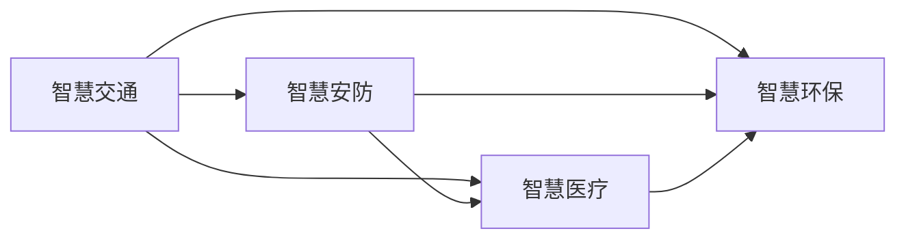

# AI人工智能深度学习算法：智能深度学习代理在智慧城市中的实践

## 1. 背景介绍

随着人工智能技术的飞速发展,深度学习算法在各个领域得到了广泛的应用。特别是在智慧城市的建设中,智能深度学习代理扮演着越来越重要的角色。智慧城市旨在利用先进的信息和通信技术,优化城市管理和服务,改善市民生活质量,实现可持续发展。而智能深度学习代理则是实现智慧城市愿景的关键技术之一。

### 1.1 智慧城市的概念与特点

智慧城市是指充分利用信息和通信技术,感测、分析、整合城市运行核心系统的各项关键信息,从而对包括民生、环保、公共安全、城市服务、工商业活动在内的各种需求做出智能的响应,为人类创造更美好的城市生活。智慧城市的特点包括:

- 信息高度融合,实现城市各系统的互联互通
- 数据资源开放共享,提供个性化、精准化服务
- 应用智能技术,提高城市管理和决策的效率
- 以人为本,切实改善市民生活品质

### 1.2 深度学习在智慧城市中的应用前景

深度学习是人工智能的一个重要分支,通过构建多层神经网络,模拟人脑的学习过程,从海量数据中自主学习和提取特征,具有强大的感知、理解、决策等智能能力。将深度学习应用于智慧城市,可以极大地提升城市管理和服务的智能化水平。一些主要的应用场景包括:

- 智能交通:优化交通信号灯时序,减少拥堵;预测交通流量,合理调配公交线路;智能调度出租车等。 
- 智慧安防:利用计算机视觉技术,实现人脸识别、行为分析等,加强社会治安管控。
- 智慧医疗:辅助医生进行疾病诊断,提供个性化治疗方案;预测疾病流行趋势等。
- 智能环保:分析空气质量数据,溯源污染源;优化城市能源系统,提高能效等。

### 1.3 智能深度学习代理的兴起

传统的深度学习应用大多是离线的、单一任务的,难以适应智慧城市的复杂动态环境。而智能深度学习代理则是一种更高级的人工智能系统,具备自主感知、持续学习、主动决策、协同进化等智能化特征,可以更好地理解和适应环境,解决复杂问题。智能代理一般由感知、决策、执行等模块组成,通过深度强化学习、多智能体协作等技术,不断提升自身能力,实现多个子任务的协同优化。将智能深度学习代理引入智慧城市,对于提升城市智能化和自动化水平,具有重要意义。

## 2. 核心概念与联系

在探讨智能深度学习代理在智慧城市中的实践之前,有必要先明确一些核心概念,理清它们之间的联系。

### 2.1 智能代理

智能代理(Intelligent Agent)是人工智能领域的一个重要概念。它是一个可以感知环境并采取行动以实现目标的自治系统。智能代理通常具有以下特征:

- 自主性:能够独立地执行任务,无需人工干预。
- 社会性:能够与环境、人、其他代理进行交互。 
- 反应性:能够及时响应环境的变化。
- 主动性:能够主动地执行目标导向的行为。
- 学习性:能够从经验中学习,不断提升性能。

### 2.2 深度学习

深度学习(Deep Learning)是机器学习的一个分支,其特点是利用多层神经网络对数据进行表征学习。通过逐层提取特征,深度学习能够学习到数据的高层次抽象表示,从而对复杂模式进行建模。深度学习常用的模型包括:

- 卷积神经网络(CNN):主要用于图像识别等场景。
- 循环神经网络(RNN):主要用于序列数据处理,如自然语言理解等。
- 生成对抗网络(GAN):主要用于生成逼真的图像、视频等。

### 2.3 强化学习

强化学习(Reinforcement Learning)是机器学习的另一个重要分支,主要关注智能体与环境的交互过程。通过试错和反馈,智能体学习如何采取最优行动以获得最大累积奖励。深度强化学习则是将深度学习与强化学习相结合,利用深度神经网络作为价值函数或策略函数的近似,从而可以处理高维观察空间和连续动作空间。一些代表性的深度强化学习算法包括:

- DQN(Deep Q-Network):使用深度神经网络逼近Q值函数。
- DDPG(Deep Deterministic Policy Gradient):一种基于行动者-评论家(Actor-Critic)框架的深度强化学习算法,适用于连续动作空间。
- A3C(Asynchronous Advantage Actor-Critic):一种异步的行动者-评论家算法,可以并行训练多个智能体。

### 2.4 多智能体系统

多智能体系统(Multi-Agent System)是由多个智能代理组成的分布式人工智能系统。每个智能体根据局部观察独立决策,通过相互协作完成整体任务。多智能体系统的特点包括:

- 分布式感知与决策
- 智能体间的通信与协作
- 涌现出整体智能行为

多智能体强化学习是将强化学习应用于多智能体系统,旨在解决智能体间的协同优化问题。一些代表性算法包括:

- 独立Q学习:每个智能体独立学习自己的最优策略。
- 联合行动学习:智能体学习联合行动值函数,考虑其他智能体的策略。
- 分层学习:将智能体组织成层次结构,不同层次的智能体负责不同粒度的决策。

### 2.5 智能深度学习代理

结合以上概念,我们可以给出智能深度学习代理的定义:智能深度学习代理是一种基于深度学习和强化学习的高级自主智能体,通过持续的感知、学习、决策、协同,可以适应复杂动态环境,解决多个子任务的优化问题,实现整体目标。它继承了智能代理的自主性、社会性、反应性、主动性和学习性,同时利用深度学习提供强大的表征和决策能力,利用强化学习实现从环境反馈中不断进化。

在智慧城市场景下,智能深度学习代理可以内置于各类传感器、控制器、机器人、软件系统中,通过分布式部署和多智能体协同,构建全方位、多层次、动态适应的智慧城市智能化体系。下图展示了智能深度学习代理在智慧城市不同领域的应用以及它们之间的交互与协同关系。



## 3. 核心算法原理具体操作步骤

智能深度学习代理的核心是深度强化学习算法,它结合了深度学习和强化学习的优点,可以在复杂环境中学习最优策略。下面我们以一种典型的深度强化学习算法——DQN为例,介绍其原理和操作步骤。

### 3.1 DQN算法原理

DQN全称为Deep Q-Network,其核心思想是用深度神经网络来逼近最优Q值函数。Q值函数定义为在状态s下采取动作a可以获得的最大累积奖励的期望,形式化表示为:

$$Q(s,a)=\mathbb{E}[R_t|s_t=s,a_t=a]$$

其中$R_t$表示从t时刻开始的累积折扣奖励:

$$R_t=\sum_{k=0}^{\infty}\gamma^kr_{t+k}$$

$\gamma$是折扣因子,用于平衡当前奖励和未来奖励的重要性。

如果我们知道了最优Q值函数$Q^*(s,a)$,则最优策略就是在每个状态下选择Q值最大的动作:

$$\pi^*(s)=\arg\max_aQ^*(s,a)$$

但是在实际问题中,状态和动作空间往往非常大,无法穷举所有可能的Q值。因此,DQN利用深度神经网络$Q(s,a;\theta)$来近似最优Q值函数,其中$\theta$为网络参数。网络的输入为状态s,输出为各个动作的Q值。

DQN的训练过程是不断改进Q网络使其输出接近真实Q值。根据贝尔曼方程,最优Q值函数满足如下关系:

$$Q^*(s,a)=\mathbb{E}_{s'}[r+\gamma\max_{a'}Q^*(s',a')|s,a]$$

因此,我们可以用如下的损失函数来训练Q网络:

$$L(\theta)=\mathbb{E}_{(s,a,r,s')\sim D}[(r+\gamma\max_{a'}Q(s',a';\theta^-)-Q(s,a;\theta))^2]$$

其中$D$为经验回放缓冲区,用于存储智能体与环境交互的转移样本$(s,a,r,s')$。$\theta^-$为目标网络的参数,它是一个较老版本的Q网络,每隔一段时间从当前Q网络复制得到,用于计算目标Q值,以保证训练的稳定性。

### 3.2 DQN算法操作步骤

基于以上原理,DQN算法的具体操作步骤如下:

1. 初始化Q网络参数$\theta$,目标网络参数$\theta^-=\theta$,经验回放缓冲区$D$。
2. 对于每个episode:
   1. 初始化初始状态$s_0$。
   2. 对于每个时间步$t$:
      1. 根据$\epsilon-greedy$策略选择动作$a_t$,即以$\epsilon$的概率随机选择动作,否则选择Q值最大的动作。
      2. 执行动作$a_t$,观察奖励$r_t$和下一状态$s_{t+1}$。
      3. 将转移样本$(s_t,a_t,r_t,s_{t+1})$存入$D$。
      4. 从$D$中随机采样一个批次的转移样本。
      5. 对于每个样本$(s,a,r,s')$,计算目标Q值:
         - 若$s'$为终止状态,则$y=r$。
         - 否则,$y=r+\gamma\max_{a'}Q(s',a';\theta^-)$。
      6. 更新Q网络参数$\theta$以最小化损失函数$L(\theta)$。
      7. 每隔一定步数,将目标网络参数$\theta^-$更新为当前Q网络参数$\theta$。
   3. 更新$\epsilon$,使其随时间衰减。

以上就是DQN算法的核心原理和操作步骤。在实际应用中,还有一些改进版本,如Double DQN、Dueling DQN、Priority Replay等,可以进一步提升算法的性能和稳定性。

## 4. 数学模型和公式详细讲解举例说明

在上一节中,我们介绍了DQN算法的核心原理,本节将对其中涉及的一些数学模型和公式进行更详细的讲解和举例说明。

### 4.1 马尔可夫决策过程

强化学习问题一般被建模为马尔可夫决策过程(Markov Decision Process, MDP)。一个MDP由以下元素组成:

- 状态空间$\mathcal{S}$:所有可能的状态的集合。
- 动作空间$\mathcal{A}$:所有可能的动作的集合。
- 转移概率$\mathcal{P}$:定义了在状态$s$下执行动作$a$后转移到状态$s'$的概率,形式化表示为$\mathcal{P}(s'|s,a)$。
- 奖励函数$\mathcal{R}$:定义了在状态$s$下执行动作$a$后获得的即时奖励的期望,形式化表示为$\mathcal{R}(s,a)$。
- 折扣因子$\gamma$:一个位于$[0,1]$之间的数,用于平衡当前奖励和未来奖励的重要性。

MDP的动力学可以用如下的状态转移图来表示:

```mermai