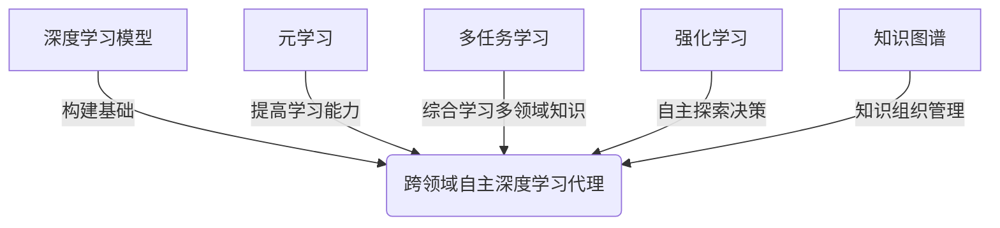
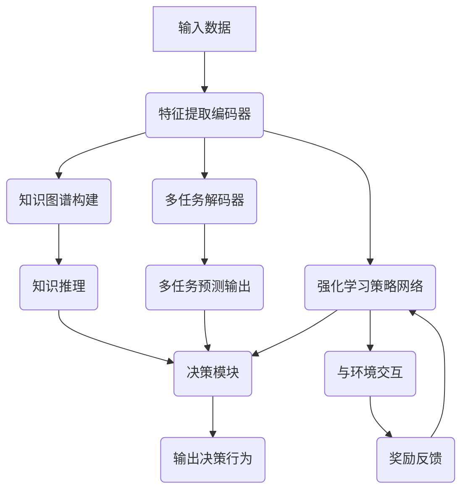

# AI人工智能深度学习算法：跨领域自主深度学习代理的集成

## 1.背景介绍

### 1.1 人工智能的发展历程

人工智能(Artificial Intelligence, AI)是当代科技领域最具变革性的技术之一,它模拟人类的认知功能,旨在创造出能够执行特定任务的智能系统。人工智能的发展经历了几个阶段:

- 1950年代,人工智能概念被正式提出,主要集中在博弈、逻辑推理等领域。
- 1980年代,专家系统和机器学习技术兴起,推动了人工智能的发展。
- 1990年后,随着计算能力的提高和大数据时代的到来,机器学习算法取得了突破性进展。
- 2010年后,深度学习技术的兴起,使得人工智能在语音识别、图像识别等领域取得了突破性进展。

### 1.2 深度学习的重要性

深度学习(Deep Learning)是机器学习的一个新的研究领域,它模仿人脑的机制来解释数据,能够捕捉数据的高层次抽象特征。深度学习的核心思想是通过构建神经网络来学习数据特征,并用于分类、预测等任务。

深度学习在图像识别、语音识别、自然语言处理等领域取得了巨大成功,极大推动了人工智能技术的发展。随着算力的不断提高和大数据的积累,深度学习在更多领域展现出广阔的应用前景。

### 1.3 跨领域自主深度学习代理的需求

尽管深度学习取得了巨大成就,但现有的深度学习模型大多局限于特定领域,难以跨领域迁移和综合应用。为了充分发挥深度学习的潜力,需要一种能够自主学习、跨领域应用的智能体系,即跨领域自主深度学习代理。

这种代理能够根据不同场景自主学习相关知识,并将所学知识综合应用于多个领域,实现智能决策和行为。它具有自主学习、知识迁移、跨领域推理等能力,有望推动人工智能向通用人工智能(Artificial General Intelligence, AGI)迈进。

## 2.核心概念与联系  

### 2.1 深度学习模型

深度学习模型是构建跨领域自主深度学习代理的基础。常见的深度学习模型包括:

1. 卷积神经网络(Convolutional Neural Network, CNN)
2. 递归神经网络(Recurrent Neural Network, RNN)
3. 长短期记忆网络(Long Short-Term Memory, LSTM)
4. 门控循环单元(Gated Recurrent Unit, GRU)
5. 生成对抗网络(Generative Adversarial Network, GAN)
6. 变分自编码器(Variational Autoencoder, VAE)
7. transformer模型(Transformer)

这些模型在不同领域有着广泛的应用,如计算机视觉、自然语言处理、语音识别等。

### 2.2 元学习(Meta-Learning)

元学习旨在提高机器学习模型在新任务上的学习能力,使模型能够快速适应新环境、新任务。常见的元学习方法包括:

1. 优化器学习(Optimizer Learning)
2. 度量学习(Metric Learning)
3. 模型不可知学习(Model-Agnostic Learning)

通过元学习,跨领域自主深度学习代理可以更快地习得新知识,实现跨领域知识迁移。

### 2.3 多任务学习(Multi-Task Learning)

多任务学习是指在同一个模型中同时学习多个相关任务,利用不同任务之间的相关性提高整体学习效果。通过多任务学习,跨领域自主深度学习代理可以综合学习多个领域的知识,实现跨领域推理和决策。

### 2.4 强化学习(Reinforcement Learning)

强化学习是一种基于环境交互的学习方式,智能体通过与环境的互动来学习如何采取最优行为策略。强化学习可以赋予跨领域自主深度学习代理自主探索和决策的能力。

### 2.5 知识图谱(Knowledge Graph)

知识图谱是用于表示实体及其关系的语义网络,能够有效组织和管理知识。跨领域自主深度学习代理可以基于知识图谱进行知识推理和决策,实现跨领域知识的综合应用。

### 2.6 概念关联图

上述核心概念之间的关联可以用下图表示:

这些概念相互关联、相辅相成,共同推动了跨领域自主深度学习代理的发展。接下来我们将详细介绍这一智能体系的核心算法原理。

## 3.核心算法原理具体操作步骤

构建跨领域自主深度学习代理需要将上述多种技术有机结合,本节将介绍其核心算法原理和具体操作步骤。

### 3.1 基于元学习的快速知识习得

快速习得新知识是跨领域自主深度学习代理的关键能力。我们采用基于优化器学习的元学习方法,使得代理能够基于少量示例快速习得新任务。

具体步骤如下:

1. 构建元学习器网络,输入为任务示例,输出为对应任务的优化器参数。
2. 在元训练阶段,使用一系列源任务训练元学习器,使其学习到有效的优化器参数生成策略。
3. 在元测试阶段,对于新的目标任务,元学习器生成相应的优化器参数。
4. 使用生成的优化器参数在目标任务上快速训练模型,实现快速习得新知识。

该方法使得代理能够通过少量示例快速习得新领域知识,为后续的多任务学习和知识迁移奠定基础。

### 3.2 基于多任务学习的知识综合

为了实现跨领域知识的综合应用,我们采用多任务学习框架,在同一个模型中同时学习多个相关任务。具体步骤如下:

1. 构建共享编码器网络,对输入数据进行特征提取和编码。
2. 为每个任务构建相应的解码器网络,解码器共享编码器的特征表示。
3. 在训练阶段,同时优化所有任务的损失函数,实现多任务联合学习。
4. 在推理阶段,输入新的数据,共享编码器提取特征,不同解码器给出各自任务的预测结果。

通过多任务学习,代理可以学习多个领域的知识,并在共享的特征空间中捕获不同任务之间的相关性,实现知识的综合和迁移。

### 3.3 基于强化学习的自主决策

为了赋予代理自主探索和决策的能力,我们引入强化学习机制。具体步骤如下:

1. 构建代理与环境的交互模型,定义状态空间、行为空间和奖励函数。
2. 使用深度神经网络作为代理的策略网络和值网络。
3. 采用基于策略梯度的强化学习算法(如PPO、A3C等)训练策略网络。
4. 代理与环境交互,根据策略网络输出的行为概率分布选择行为。
5. 根据获得的奖励,优化策略网络和值网络的参数。

通过强化学习,代理能够在与环境的交互中不断优化自身的策略,实现自主探索和决策,适应复杂多变的环境。

### 3.4 基于知识图谱的推理决策

为了有效组织和管理代理所学的知识,我们构建了一个基于知识图谱的推理决策模块。具体步骤如下:

1. 从代理所学的多领域知识中提取实体、关系等信息,构建知识图谱。
2. 在知识图谱上定义推理规则,用于推导新的知识。
3. 将知识图谱与深度学习模型相结合,引入图神经网络等机制。
4. 在决策时,综合考虑深度学习模型的预测结果和知识图谱推理的结果。

通过知识图谱,代理可以有效管理和推理所学的知识,实现知识的迁移和综合应用,为决策提供更全面的依据。

### 3.5 算法流程图

将上述核心算法步骤整合,我们可以用下图表示跨领域自主深度学习代理的总体算法流程:

该流程图展示了代理的核心模块之间的交互关系,实现了快速知识习得、知识综合、自主决策等关键功能。接下来,我们将对其中的数学模型进行详细阐述。

## 4.数学模型和公式详细讲解举例说明

### 4.1 元学习优化器学习

在优化器学习中,我们的目标是学习一个能够快速生成有效优化器参数的元学习器网络。设任务分布为$\mathcal{P}(\mathcal{T})$,对于每个任务$\mathcal{T}_i\sim\mathcal{P}(\mathcal{T})$,其目标是学习模型参数$\theta_i$,使得损失函数$\mathcal{L}_{\mathcal{T}_i}(\theta_i)$最小化。

我们定义元学习器$f_\phi$,其输入为任务示例$\mathcal{D}_i^{tr}$,输出为优化器参数$\lambda_i$。元学习器的目标是最小化所有任务的损失函数:

$$\min_\phi \sum_{\mathcal{T}_i\sim\mathcal{P}(\mathcal{T})}\mathcal{L}_{\mathcal{T}_i}(\theta_i^*)$$

其中$\theta_i^*$是使用元学习器生成的优化器参数$\lambda_i=f_\phi(\mathcal{D}_i^{tr})$在任务$\mathcal{T}_i$上进行优化得到的模型参数。

通过梯度下降法优化元学习器参数$\phi$,我们可以获得一个能够快速生成有效优化器参数的元学习器网络,从而实现快速习得新任务的能力。

### 4.2 多任务学习

在多任务学习中,我们的目标是同时学习$N$个相关任务$\{\mathcal{T}_1,\mathcal{T}_2,...,\mathcal{T}_N\}$,每个任务对应一个损失函数$\mathcal{L}_{\mathcal{T}_i}$。我们定义一个共享的编码器网络$f_\theta$和$N$个任务特定的解码器网络$\{g_{\phi_1},g_{\phi_2},...,g_{\phi_N}\}$。

对于输入数据$x$,编码器网络$f_\theta$提取特征表示$h=f_\theta(x)$,然后每个解码器网络$g_{\phi_i}$根据特征表示$h$预测对应任务的输出$y_i=g_{\phi_i}(h)$。我们的目标是最小化所有任务的加权损失函数:

$$\min_{\theta,\{\phi_i\}}\sum_{i=1}^N\alpha_i\mathcal{L}_{\mathcal{T}_i}(y_i,\hat{y}_i)$$

其中$\alpha_i$是任务$\mathcal{T}_i$的权重,用于平衡不同任务的重要性。通过联合优化所有任务的损失函数,模型可以学习到一个共享的特征表示,捕获不同任务之间的相关性,实现知识的综合和迁移。

### 4.3 强化学习策略梯度

在强化学习中,我们的目标是学习一个策略$\pi_\theta$,使得在环境$\mathcal{M}$中采取该策略能够最大化期望回报$\mathbb{E}_{\pi_\theta}[R]$。我们定义状态空间$\mathcal{S}$、行为空间$\mathcal{A}$和