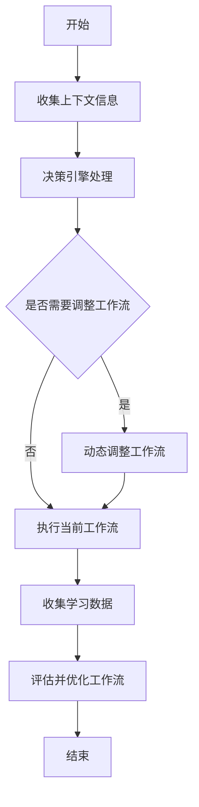
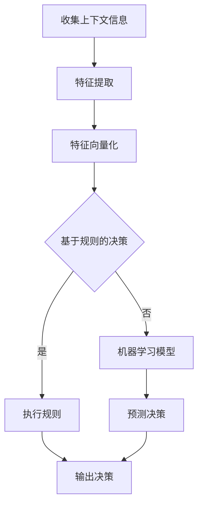
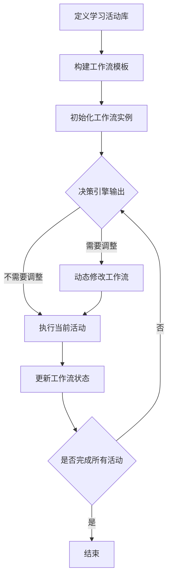

# AI代理在教育技术中的适应性工作流案例

## 1.背景介绍

### 1.1 教育领域的新趋势和挑战

在当今快节奏的数字时代,教育行业正面临着前所未有的变革和挑战。传统的教学模式已经难以满足学生们对个性化、互动式和富有吸引力的学习体验的需求。同时,教育资源的不平等分布、师资力量的短缺以及教学效率的低下等问题也亟待解决。

为了应对这些挑战,教育技术(EdTech)应运而生,它致力于利用人工智能(AI)、大数据、云计算等先进技术来改革和优化教育过程,提高教学质量,缩小教育鸿沟。在这一背景下,AI代理(AI Agent)作为一种智能化的虚拟助手,凭借其强大的自适应能力和人机交互能力,正在教育技术领域大显身手。

### 1.2 AI代理的优势及作用

AI代理是一种基于人工智能技术构建的软件系统,能够感知环境、学习并作出智能化决策和行为。它们具有以下优势:

1. **个性化学习支持**:AI代理可以根据每个学生的知识水平、学习风格和兴趣爱好,提供定制化的学习资源和路径,实现真正的因材施教。

2. **24/7无缝辅助**:不受时间和地点的限制,AI代理可以随时随地为学生提供学习辅导、解答疑问,缓解师资短缺的压力。

3. **情感认知能力**:AI代理能够通过语音、表情和肢体语言等渠道感知学生的情绪状态,并做出相应的反应,增强学习体验的人性化程度。

4. **数据驱动优化**:AI代理可以实时收集和分析学生的学习数据,持续优化教学策略,提高教学效率和质量。

因此,AI代理在教育技术中扮演着关键角色,有望为学生提供更加个性化、高效和富有吸引力的学习体验。

## 2.核心概念与联系

### 2.1 适应性工作流

适应性工作流(Adaptive Workflow)是一种能够根据环境变化和用户需求动态调整流程的工作流模型。它是AI代理在教育场景中发挥作用的核心概念。

适应性工作流由以下几个关键要素组成:

1. **上下文感知**:通过各种传感器(如摄像头、麦克风等)收集学生的学习环境、行为和情绪数据。

2. **决策引擎**:基于上下文信息和预定义的规则或机器学习模型,做出相应的决策和行为调整。

3. **工作流管理**:动态组织和协调各个学习活动的执行顺序和方式,形成一个连贯的个性化学习路径。

4. **反馈与优化**:持续收集学习过程数据,评估工作流的有效性,并进行必要的调整和优化。

适应性工作流赋予了AI代理灵活的决策能力和自我优化能力,使其能够根据不同学生的需求提供量身定制的学习支持。

### 2.2 AI代理与适应性工作流的关系

AI代理作为教育技术中的关键组成部分,与适应性工作流存在紧密的联系:

1. AI代理承载了适应性工作流的核心功能,如上下文感知、决策引擎和工作流管理等。

2. AI代理通过执行适应性工作流,实现了对学习过程的动态调整和优化。

3.适应性工作流为AI代理提供了一种标准化的架构和操作模式,使其能够更高效地完成教学任务。

4. AI代理和适应性工作流的融合,构建了一个智能化、个性化和高效的教育技术生态系统。

因此,AI代理和适应性工作流是相辅相成的关系,共同推动了教育技术的创新发展。

## 3.核心算法原理具体操作步骤

### 3.1 适应性工作流的基本流程

适应性工作流的基本流程可以概括为以下几个步骤:

1. **收集上下文信息**:通过各种传感器(如摄像头、麦克风等)收集学生的学习环境、行为和情绪数据。

2. **决策引擎处理**:将收集到的上下文信息输入预先定义的规则或机器学习模型,做出相应的决策。

3. **动态调整工作流**:根据决策引擎的输出,判断是否需要调整当前的工作流。如果需要,则动态组织和协调各个学习活动的执行顺序和方式。

4. **执行工作流**:执行调整后的工作流,或继续执行当前工作流。

5. **收集学习数据**:在工作流执行过程中,持续收集学生的学习数据,如学习进度、知识掌握程度等。

6. **评估并优化工作流**:基于收集的学习数据,评估当前工作流的有效性,并进行必要的调整和优化,形成一个闭环的反馈机制。

这个流程循环往复,不断根据学生的实时需求调整学习路径,从而提供更加个性化和高效的学习体验。

### 3.2 决策引擎的工作原理

决策引擎是适应性工作流中的关键组件,其工作原理可以概括为以下几个步骤:

1. **收集上下文信息**:从各种传感器获取学生的学习环境、行为和情绪数据。

2. **特征提取**:从原始数据中提取出对决策有价值的特征,如学生的注意力水平、情绪状态等。

3. **特征向量化**:将提取的特征转换为机器可读的数值向量形式。

4. **基于规则的决策**:检查是否存在匹配的预定义规则,如果存在,则直接执行相应的决策逻辑。

5. **机器学习模型**:如果没有匹配的规则,则将特征向量输入预先训练好的机器学习模型(如决策树、神经网络等),由模型预测出最佳决策。

6. **输出决策**:将规则引擎或机器学习模型的输出作为最终决策,并执行相应的行为调整。

决策引擎的工作原理结合了基于规则的方法和基于机器学习的方法,从而实现了更加灵活和智能化的决策能力。

### 3.3 工作流管理的实现

工作流管理是适应性工作流中另一个关键组件,它负责动态组织和协调各个学习活动的执行。其实现过程可以概括为以下几个步骤:

1. **定义学习活动库**:根据教学大纲和目标,预先定义一系列可重用的学习活动,如视频课程、练习题、测验等。

2. **构建工作流模板**:基于学习活动库,构建初始的工作流模板,定义活动的执行顺序和条件。

3. **初始化工作流实例**:为每个学生创建一个工作流实例,作为个性化学习路径的起点。

4. **决策引擎输出**:根据决策引擎的输出,判断是否需要调整当前工作流。

5. **动态修改工作流**:如果需要调整,则从学习活动库中选择合适的活动,插入或替换当前工作流中的活动。

6. **执行当前活动**:执行工作流中的当前学习活动。

7. **更新工作流状态**:根据学生的学习进度和反馈,更新工作流的执行状态。

8. **判断是否完成**:检查是否已经完成了工作流中的所有学习活动。如果完成,则结束当前工作流;否则,返回决策引擎进行下一轮决策。

通过这种动态的工作流管理方式,AI代理可以根据学生的实时需求和学习表现,灵活调整学习路径,提供更加个性化和高效的学习支持。

## 4.数学模型和公式详细讲解举例说明

在适应性工作流中,数学模型和公式扮演着重要的角色,尤其是在决策引擎和工作流优化等环节。下面将详细介绍一些常用的数学模型和公式。

### 4.1 马尔可夫决策过程(MDP)

马尔可夫决策过程(Markov Decision Process, MDP)是一种广泛应用于决策问题的数学框架。在适应性工作流中,MDP可用于建模学生的学习过程,并寻找最优的学习路径。

MDP由以下几个要素组成:

- 状态集合 $\mathcal{S}$:表示学生可能处于的不同学习状态,如知识掌握程度、注意力水平等。
- 行为集合 $\mathcal{A}$:表示AI代理可以采取的不同行为,如推荐视频课程、布置练习题等。
- 转移概率 $P(s'|s,a)$:表示在状态 $s$ 下采取行为 $a$ 后,转移到状态 $s'$ 的概率。
- 奖励函数 $R(s,a,s')$:表示在状态 $s$ 下采取行为 $a$ 并转移到状态 $s'$ 时获得的即时奖励。

MDP的目标是找到一个最优策略 $\pi^*$,使得在执行该策略时,可以最大化预期的累积奖励:

$$
\pi^* = \arg\max_\pi \mathbb{E}\left[\sum_{t=0}^\infty \gamma^t R(s_t, a_t, s_{t+1})\right]
$$

其中 $\gamma \in [0,1]$ 是折现因子,用于权衡即时奖励和长期奖励的重要性。

通过使用强化学习算法(如Q-Learning、策略梯度等),AI代理可以从历史数据中学习出最优策略,并在执行适应性工作流时做出最佳决策。

### 4.2 协同过滤算法

在适应性工作流中,协同过滤算法可用于基于学生之间的相似性,为他们推荐合适的学习资源和路径。

假设有 $N$ 个学生和 $M$ 个学习资源,我们可以构建一个 $N \times M$ 的评分矩阵 $R$,其中 $R_{ij}$ 表示第 $i$ 个学生对第 $j$ 个资源的评分(如果没有评分,则为缺失值)。协同过滤算法的目标是预测缺失的评分,从而为学生推荐潜在感兴趣的资源。

一种常用的协同过滤算法是基于邻域的方法,其核心思想是:对于目标学生 $u$,找到与其最相似的 $k$ 个邻居学生,然后基于这些邻居的评分,预测 $u$ 对资源 $i$ 的评分:

$$
\hat{r}_{ui} = \overline{r}_u + \frac{\sum\limits_{v \in N_k(u)}{\rm sim}(u,v)(r_{vi} - \overline{r}_v)}{\sum\limits_{v \in N_k(u)}|{\rm sim}(u,v)|}
$$

其中 $\overline{r}_u$ 和 $\overline{r}_v$ 分别表示学生 $u$ 和 $v$ 的平均评分, $N_k(u)$ 表示与 $u$ 最相似的 $k$ 个邻居集合, ${\rm sim}(u,v)$ 表示 $u