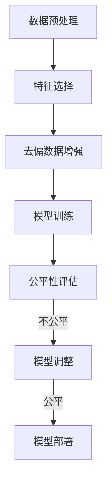

# AI伦理与算法公平性原理与代码实战案例讲解

## 1.背景介绍

### 1.1 AI伦理的重要性

随着人工智能(AI)技术的快速发展和广泛应用,AI系统对我们的生活产生了深远影响。然而,AI系统并非完美无缺,它们可能会受到设计者的偏见、训练数据的偏差以及算法本身的局限性等因素的影响,从而导致不公平的结果。这种算法偏差可能会加剧社会不平等,侵犯个人隐私,甚至危及生命安全。因此,确保AI系统的公平性和道德性至关重要。

### 1.2 算法公平性的重要性

算法公平性是指算法在做出决策时,不会对特定群体产生系统性的不利影响。公平的算法应该避免基于种族、性别、年龄等受保护属性而做出歧视性决策。然而,由于训练数据的偏差、模型的局限性等原因,算法可能会产生意料之外的不公平结果。因此,我们需要采取有效措施来识别和缓解算法偏差,确保算法的公平性。

### 1.3 AI伦理与算法公平性的关系

AI伦理和算法公平性密切相关。AI伦理旨在确保AI系统的设计、开发和应用符合道德和伦理原则,而算法公平性是AI伦理中的一个重要方面。只有当算法公平性得到保证时,AI系统才能真正符合伦理标准,为人类社会带来公平和正义。

## 2.核心概念与联系

### 2.1 AI伦理的核心概念

AI伦理涉及多个核心概念,包括但不限于:

1. **透明度(Transparency)**: AI系统应该具有可解释性,使用户能够理解其决策过程和结果。
2. **问责制(Accountability)**: AI系统的开发者和使用者应对系统的行为和影响负责。
3. **隐私保护(Privacy Protection)**: AI系统应该尊重个人隐私,并采取适当措施保护个人数据。
4. **公平性(Fairness)**: AI系统应该避免对特定群体产生不利影响,确保决策的公平性。
5. **安全性(Safety)**: AI系统应该是安全的,不会对人类或环境造成伤害。
6. **人类控制(Human Control)**: AI系统应该受到适当的人类监督和控制,以确保其行为符合预期。

### 2.2 算法公平性的核心概念

算法公平性也包含多个核心概念,例如:

1. **群体公平性(Group Fairness)**: 算法对不同群体的决策应该是公平的,不应该存在系统性的偏差。
2. **个体公平性(Individual Fairness)**: 算法对于相似的个体应该做出相似的决策。
3. **因果推理(Causal Reasoning)**: 通过因果推理来识别和消除算法偏差的根源。
4. **反馈循环(Feedback Loops)**: 算法的决策可能会加剧现有的偏差,形成恶性循环。
5. **代表性偏差(Representation Bias)**: 训练数据可能无法很好地代表整个人口,导致算法对某些群体的决策存在偏差。
6. **度量标准(Fairness Metrics)**: 用于评估算法公平性的各种度量标准,如统计率差异、离散化等。

### 2.3 AI伦理与算法公平性的联系

AI伦理和算法公平性紧密相连,它们共同构成了AI系统的道德基础。算法公平性是实现AI伦理的关键步骤之一,只有确保算法的公平性,AI系统才能真正符合伦理标准。同时,AI伦理也为算法公平性提供了指导方向,帮助我们确定什么是公平,以及如何实现公平。

## 3.核心算法原理具体操作步骤

为了实现算法公平性,我们需要采取一系列措施,从数据预处理到模型训练,再到模型评估和调整,每一个步骤都至关重要。下面是实现算法公平性的核心算法原理和具体操作步骤:

### 3.1 数据预处理

数据预处理是确保算法公平性的第一步。我们需要检查训练数据是否存在偏差,例如某些群体的代表性不足或存在标签噪声等。常见的数据预处理技术包括:

1. **数据审计(Data Auditing)**: 通过统计分析和可视化技术,识别数据中的偏差和噪声。
2. **重新采样(Resampling)**: 对于代表性不足的群体,可以通过过采样或欠采样来平衡数据。
3. **数据清洗(Data Cleaning)**: 移除或修正数据中的异常值和噪声。

### 3.2 特征选择

特征选择也是一个关键步骤。一些看似无关的特征可能会引入算法偏差,因此我们需要仔细选择特征。常见的特征选择技术包括:

1. **相关性分析(Correlation Analysis)**: 通过相关性分析,识别与目标变量相关的特征。
2. **敏感特征移除(Sensitive Feature Removal)**: 移除可能引入偏差的敏感特征,如种族、性别等。
3. **特征重要性评估(Feature Importance Evaluation)**: 使用机器学习模型评估每个特征对预测结果的重要性,选择重要特征。

### 3.3 去偏数据增强

即使经过数据预处理和特征选择,训练数据中仍可能存在一些隐藏的偏差。为了进一步减少偏差,我们可以采用去偏数据增强技术,例如:

1. **对抗性数据增强(Adversarial Data Augmentation)**: 通过对抗性训练,生成能够减少模型偏差的新数据。
2. **重新加权(Reweighting)**: 对训练数据进行重新加权,增加代表性不足群体的权重。
3. **数据合成(Data Synthesis)**: 使用生成对抗网络(GAN)等技术,合成新的无偏数据。

### 3.4 模型训练

在训练公平的机器学习模型时,我们可以采用以下技术:

1. **约束优化(Constrained Optimization)**: 在模型优化过程中,加入公平性约束,确保模型满足公平性要求。
2. **正则化(Regularization)**: 在损失函数中加入公平性正则项,惩罚不公平的模型。
3. **对抗性去偏(Adversarial Debiasing)**: 通过对抗性训练,使模型无法从输入数据中推断出敏感属性。

### 3.5 公平性评估

训练完成后,我们需要评估模型的公平性。常用的公平性评估指标包括:

1. **统计率差异(Statistical Parity Difference)**: 不同群体的预测正例率之差。
2. **等机会差异(Equal Opportunity Difference)**: 不同群体的真正例率之差。
3. **平均绝对差异(Average Absolute Difference)**: 不同个体之间预测值的平均绝对差异。

### 3.6 模型调整

如果模型的公平性评估结果不理想,我们需要对模型进行调整。常见的调整方法包括:

1. **后处理(Post-processing)**: 对模型的输出进行调整,以满足公平性要求。
2. **模型蒸馏(Model Distillation)**: 将公平模型的知识转移到新模型中,提高新模型的公平性。
3. **重新训练(Retraining)**: 使用去偏数据或调整训练算法,重新训练模型。

### 3.7 模型部署

经过上述步骤,我们可以得到一个公平的机器学习模型。在部署模型之前,我们还需要进行一些额外的工作,例如:

1. **模型解释(Model Interpretation)**: 提高模型的可解释性,让用户了解模型的决策过程。
2. **持续监控(Continuous Monitoring)**: 持续监控模型的表现,及时发现和纠正任何新出现的偏差。
3. **人工审计(Human Auditing)**: 由人工专家定期审计模型的决策,确保其符合伦理标准。

## 4.数学模型和公式详细讲解举例说明

在算法公平性领域,有许多数学模型和公式被广泛使用。下面我们将详细讲解其中几个重要的模型和公式,并给出具体的例子说明。

### 4.1 统计率差异(Statistical Parity Difference)

统计率差异是一种常用的公平性度量标准,它衡量不同群体的预测正例率之差。对于二元分类问题,统计率差异可以定义为:

$$
\text{SP} = P(\hat{Y}=1|A=0) - P(\hat{Y}=1|A=1)
$$

其中,$ \hat{Y} $是模型的预测输出,$ A $是敏感属性(如种族或性别),取值为0或1。当$ \text{SP}=0 $时,模型在不同群体之间的预测正例率相同,满足统计率盈余。

**例子**:假设我们有一个贷款审批模型,其中$ A=0 $表示申请人为白人,$ A=1 $表示申请人为非裔美国人。如果模型对白人申请人的批准率为60%,对非裔美国人的批准率为50%,那么统计率差异为:

$$
\text{SP} = 0.6 - 0.5 = 0.1
$$

这表明模型对非裔美国人存在一定程度的偏差。

### 4.2 等机会差异(Equal Opportunity Difference)

等机会差异是另一种常用的公平性度量标准,它衡量不同群体的真正例率之差。对于二元分类问题,等机会差异可以定义为:

$$
\text{EOD} = P(\hat{Y}=1|Y=1, A=0) - P(\hat{Y}=1|Y=1, A=1)
$$

其中,$ Y $是真实标签。当$ \text{EOD}=0 $时,模型在不同群体的真正例率相同,满足等机会原则。

**例子**:继续使用上面的贷款审批模型示例。假设在所有合格申请人($ Y=1 $)中,模型对白人的批准率为80%,对非裔美国人的批准率为70%,那么等机会差异为:

$$
\text{EOD} = 0.8 - 0.7 = 0.1
$$

这表明模型在审批合格申请人时,对非裔美国人存在一定程度的偏差。

### 4.3 平均绝对差异(Average Absolute Difference)

平均绝对差异是一种衡量个体公平性的指标,它计算不同个体之间预测值的平均绝对差异。对于回归问题,平均绝对差异可以定义为:

$$
\text{AAD} = \mathbb{E}_{x, x'} \big[ \big| f(x) - f(x') \big| \big]
$$

其中,$ f(x) $是模型对输入$ x $的预测值,$ \mathbb{E} $表示期望值。当$ \text{AAD}=0 $时,模型对所有个体的预测值相同,满足个体公平性。

**例子**:假设我们有一个预测员工薪资的回归模型。如果对于两位相似的员工$ x $和$ x' $(具有相同的工作经验、职位等),模型的预测值分别为$ f(x)=50000 $和$ f(x')=55000 $,那么平均绝对差异为:

$$
\text{AAD} = \big| 50000 - 55000 \big| = 5000
$$

这表明模型对于相似的个体存在一定程度的不公平性。

### 4.4 约束优化(Constrained Optimization)

约束优化是一种常用的算法公平性技术,它在模型优化过程中加入公平性约束,确保模型满足公平性要求。对于二元分类问题,我们可以将模型训练formalized为以下约束优化问题:

$$
\begin{aligned}
\min_\theta & \quad \mathcal{L}(f_\theta, \mathcal{D}) \\
\text{s.t.} & \quad \big| \text{SP}(f_\theta, \mathcal{D}) \big| \leq \epsilon \\
       & \quad \big| \text{EOD}(f_\theta, \mathcal{D}) \big| \leq \delta
\end{aligned}
$$

其中,$ \mathcal{L} $是模型的损失函数,$ f_\theta $是模型的参