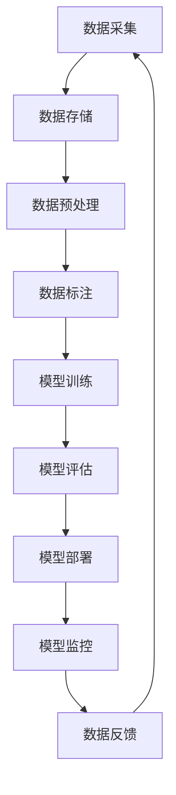

# AI数据管理原理与代码实战案例讲解

## 1. 背景介绍

### 1.1 数据爆炸时代

在当今时代，数据正以前所未有的速度和规模呈爆炸式增长。无论是个人还是企业,都产生着大量的结构化和非结构化数据。这些数据来源广泛,包括社交媒体、物联网设备、电子商务平台、金融交易记录等。有效管理和利用这些海量数据,已经成为各行业面临的重大挑战。

### 1.2 人工智能的兴起

与此同时,人工智能(AI)技术在近年来取得了长足进步,在图像识别、自然语言处理、决策优化等领域展现出巨大潜力。AI算法能够从大规模数据中发现隐藏的模式和洞见,为数据赋予新的价值。将人工智能与数据管理相结合,将为企业带来前所未有的竞争优势。

### 1.3 AI数据管理的重要性

有效的AI数据管理不仅关乎数据的存储和组织,更重要的是如何为AI算法提供高质量、可访问的数据,并确保AI系统的可解释性、公平性和隐私安全。这对于建立值得信赖的AI系统至关重要。因此,探索AI数据管理的原理和最佳实践,将有助于企业释放数据的全部潜能,推动AI技术的应用和创新。

## 2. 核心概念与联系

### 2.1 数据管理生命周期

AI数据管理遵循一个循环的生命周期,包括以下关键步骤:

1. **数据采集**: 从各种来源收集原始数据,如日志文件、传感器读数、社交媒体等。
2. **数据存储**: 将采集的数据存储在适当的存储系统中,如关系数据库、NoSQL数据库或数据湖。
3. **数据预处理**: 对原始数据进行清洗、转换和规范化,以准备用于模型训练。
4. **数据标注**: 为训练数据添加标签或标记,以指导监督学习算法。
5. **模型训练**: 使用标注的数据训练AI模型,如深度神经网络或决策树。
6. **模型评估**: 评估模型的性能和准确性,并根据需要进行调整和优化。
7. **模型部署**: 将训练好的模型部署到生产环境中,用于实际应用。
8. **模型监控**: 持续监控模型的性能,并在必要时进行重新训练或更新。
9. **数据反馈**: 从模型的实际应用中收集反馈数据,用于改进后续的数据采集和模型训练。

这个生命周期强调了数据管理在AI系统中的核心作用,并体现了AI数据管理的动态和迭代性质。

### 2.2 AI数据管理的关键挑战

实施有效的AI数据管理面临着诸多挑战,包括:

1. **数据质量**: 确保数据的完整性、准确性和一致性,减少噪声和异常值。
2. **数据标注**: 标注高质量的训练数据是一项耗时且昂贵的过程。
3. **数据隐私**: 保护个人隐私和敏感数据,同时利用这些数据进行模型训练。
4. **数据偏差**: 训练数据可能存在代表性偏差,导致模型在实际应用中表现不佳。
5. **数据版本控制**: 跟踪数据集的变更历史,确保模型训练和评估的可重复性。
6. **数据访问和共享**: 在不同团队和组织之间安全地共享和访问数据。
7. **计算资源**: 训练大型AI模型需要大量的计算资源,如GPU和TPU。
8. **数据管道自动化**: 自动化数据管理流程,提高效率和可扩展性。

有效应对这些挑战,需要采用适当的技术、工具和最佳实践。

## 3. 核心算法原理具体操作步骤

### 3.1 数据预处理算法

#### 3.1.1 缺失值处理

缺失值是数据集中常见的问题,可能会影响模型的性能。常用的缺失值处理方法包括:

1. **删除**: 删除包含缺失值的行或列。适用于缺失值较少的情况。
2. **平均值/中位数/众数插补**: 用相应的统计值替换缺失值。适用于数值型特征。
3. **最近邻插补**: 使用相似样本的值来填充缺失值。适用于结构化数据。
4. **模型插补**: 构建机器学习模型来预测缺失值。适用于复杂的缺失值模式。

#### 3.1.2 特征缩放

由于不同特征的数值范围可能差异很大,这可能会影响模型的收敛速度和性能。特征缩放旨在将所有特征缩放到相似的范围,常用方法包括:

1. **标准化 (Standardization)**: 将特征值缩放到均值为0、标准差为1的范围。公式: $z = \frac{x - \mu}{\sigma}$
2. **归一化 (Normalization)**: 将特征值缩放到0到1的范围。公式: $x' = \frac{x - x_{min}}{x_{max} - x_{min}}$
3. **对数变换**: 对数据进行对数变换,以减小异常值的影响。公式: $x' = \log(x + 1)$

#### 3.1.3 编码分类特征

对于分类特征,需要将其转换为数值形式,以供机器学习模型使用。常用的编码方法包括:

1. **一热编码 (One-Hot Encoding)**: 将每个类别映射为一个二进制向量。
2. **标签编码 (Label Encoding)**: 将每个类别映射为一个整数值。
3. **目标编码 (Target Encoding)**: 根据目标变量的平均值或其他统计量对类别进行编码。

#### 3.1.4 特征选择

在高维数据集中,不是所有特征都对模型预测有贡献。特征选择旨在识别和保留最相关的特征子集,以提高模型性能和可解释性。常用的特征选择方法包括:

1. **过滤方法**: 根据特征与目标变量的相关性评分进行排序,选择评分最高的特征。
2. **包裹方法**: 使用机器学习模型评估不同特征子集的性能,选择表现最佳的子集。
3. **嵌入方法**: 在模型训练过程中自动进行特征选择,如LASSO回归和决策树。

### 3.2 数据标注算法

#### 3.2.1 主动学习 (Active Learning)

主动学习是一种智能数据标注策略,旨在使用最少的标注样本来训练高质量的模型。算法步骤如下:

1. 从未标注的数据池中选择一小部分样本进行初始标注。
2. 使用标注的样本训练初始模型。
3. 使用该模型对未标注的样本进行预测,并计算每个样本的不确定性分数。
4. 选择不确定性分数最高的样本进行人工标注。
5. 将新标注的样本添加到训练集中,重复步骤2-4,直到达到预期性能或耗尽标注预算。

主动学习可以显著减少标注成本,但需要仔细设计不确定性度量和采样策略。

#### 3.2.2 半监督学习 (Semi-Supervised Learning)

半监督学习同时利用少量标注数据和大量未标注数据进行训练。常用的半监督算法包括:

1. **自训练 (Self-Training)**: 使用标注数据训练初始模型,然后使用该模型对未标注数据进行伪标注,并将高置信度的伪标注样本添加到训练集中,重复训练。
2. **协同训练 (Co-Training)**: 在两个不同视图的特征子集上分别训练两个模型,并使用每个模型在另一个视图上的预测来扩充训练集。
3. **生成对抗网络 (Generative Adversarial Networks, GANs)**: 使用生成模型捕获数据分布,并与判别模型对抗训练,以生成高质量的合成数据进行半监督学习。

半监督学习可以充分利用未标注数据,提高模型性能,但需要谨慎处理噪声标签和确保模型收敛。

### 3.3 隐私保护算法

#### 3.3.1 差分隐私 (Differential Privacy)

差分隐私是一种数据隐私保护技术,它通过在数据上引入精心设计的噪声,使得单个记录的存在或缺失对输出结果的影响很小。差分隐私算法的步骤如下:

1. 定义隐私预算 $\epsilon$,它控制了噪声的强度。$\epsilon$ 越小,隐私保护越强,但噪声也越大。
2. 选择一个随机机制 $\mathcal{M}$,如拉普拉斯机制或指数机制,用于引入噪声。
3. 对原始数据集 $D$ 应用随机机制 $\mathcal{M}$,得到带噪声的输出 $\mathcal{M}(D)$。

差分隐私可以保证个人隐私,同时允许从加噪数据中获取有用的统计信息和模式。它广泛应用于机器学习、数据分析和数据发布等领域。

#### 3.3.2 同态加密 (Homomorphic Encryption)

同态加密是一种允许在加密数据上直接进行计算的加密技术。它使得数据可以在不解密的情况下进行处理,从而保护了数据的隐私和机密性。同态加密算法的步骤如下:

1. 使用同态加密算法(如Paillier或BGV)对原始数据进行加密,得到加密数据 $E(x)$。
2. 在加密数据上执行同态运算,如同态加法 $E(x) \oplus E(y) = E(x + y)$或同态乘法 $E(x) \otimes E(y) = E(xy)$。
3. 将计算结果 $E(z)$ 发送给授权方进行解密,得到明文结果 $z$。

同态加密可以保护数据隐私,同时支持在加密数据上进行有限的计算,如机器学习训练和预测。但它的计算效率较低,并且只支持特定的同态运算。

通过差分隐私和同态加密等隐私保护技术,AI数据管理可以在保护个人隐私的同时,充分利用数据进行模型训练和推理。

## 4. 数学模型和公式详细讲解举例说明

### 4.1 主成分分析 (Principal Component Analysis, PCA)

主成分分析是一种常用的无监督降维技术,它通过线性变换将原始高维数据投影到一个低维子空间,同时尽可能保留数据的方差。PCA的数学原理如下:

给定一个 $n \times p$ 的数据矩阵 $X$,其中 $n$ 是样本数,  $p$ 是特征数。PCA的目标是找到一个 $p \times k$ 的投影矩阵 $W$,使得投影后的低维数据 $Z = XW$ 最大化投影方向上的方差:

$$\max_{W} \text{Var}(Z) = \max_{W} \frac{1}{n} \sum_{i=1}^n \|z_i\|_2^2 = \max_{W} \frac{1}{n} \text{tr}(W^T X^T X W)$$

其中 $\text{tr}(\cdot)$ 表示矩阵的迹。

通过特征值分解,可以证明最优投影矩阵 $W^*$ 由数据协方差矩阵 $\Sigma = \frac{1}{n}X^T X$ 的前 $k$ 个最大特征值对应的特征向量构成。投影后的低维数据 $Z$ 即为原始数据在这 $k$ 个主成分方向上的投影。

PCA可以有效降低数据维度,提高计算效率和模型可解释性。它广泛应用于图像压缩、噪声去除和可视化等领域。

### 4.2 逻辑回归 (Logistic Regression)

逻辑回归是一种常用的监督学习算法,用于解决二分类问题。它通过对数几率(log odds)建模,将输入特征