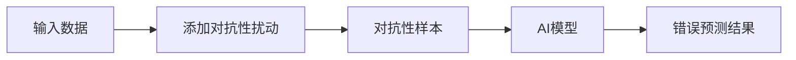
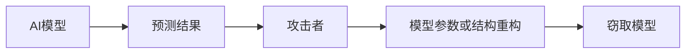
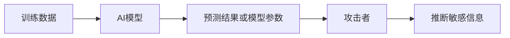
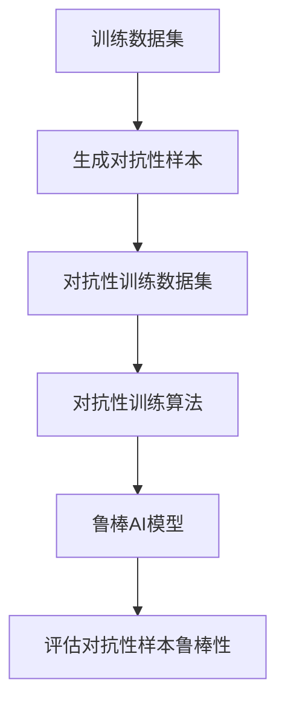
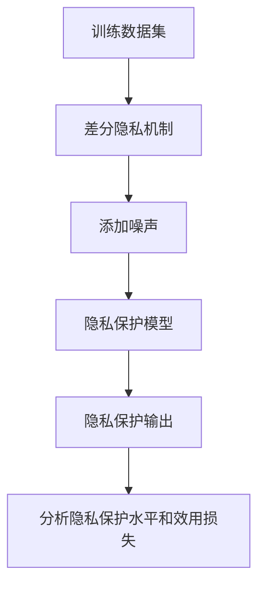
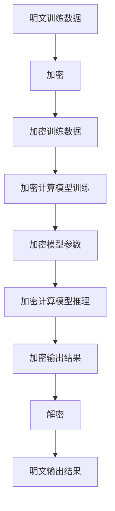

# AI模型安全与隐私保护原理与代码实战案例讲解

## 1. 背景介绍

### 1.1 AI模型安全与隐私保护的重要性

随着人工智能(AI)技术的快速发展和广泛应用,AI模型的安全性和隐私保护问题日益受到关注。AI模型在各个领域发挥着越来越重要的作用,但同时也面临着潜在的安全风险和隐私泄露问题。确保AI模型的安全性和隐私保护不仅是技术上的挑战,也是道德和法律上的责任。

### 1.2 AI模型面临的安全威胁

AI模型可能遭受各种形式的攻击,包括对抗性样本攻击、模型窃取攻击、隐私攻击等。这些攻击可能导致AI模型的预测结果被恶意篡改、模型参数被盗取或者训练数据中的敏感信息被泄露。

### 1.3 隐私保护的重要性

隐私是个人和组织的基本权利,保护个人隐私不仅是法律要求,也是社会责任。在AI模型的训练和应用过程中,可能会涉及大量的个人数据,如果处理不当,可能会导致隐私泄露,给个人和组织带来严重后果。

## 2. 核心概念与联系

### 2.1 对抗性样本攻击

对抗性样本攻击是指通过对输入数据进行精心设计的微小扰动,使得AI模型产生错误的预测结果。这种攻击可能导致AI模型在关键任务中失效,造成严重后果。



### 2.2 模型窃取攻击

模型窃取攻击是指攻击者试图从AI模型的预测结果中重构出模型的参数或结构。成功的模型窃取攻击可能导致知识产权被盗、商业机密被泄露等严重后果。



### 2.3 隐私攻击

隐私攻击是指攻击者试图从AI模型的预测结果或模型参数中推断出训练数据中的敏感信息。这种攻击可能导致个人隐私被侵犯,造成严重的社会影响。



### 2.4 AI模型安全与隐私保护的关系

AI模型安全性和隐私保护是相互关联的。提高AI模型的安全性可以有效防止对抗性样本攻击和模型窃取攻击,从而间接保护了隐私;同时,加强隐私保护也可以减少隐私攻击的风险,提高AI模型的整体安全性。

## 3. 核心算法原理具体操作步骤

### 3.1 对抗性训练

对抗性训练是一种提高AI模型对抗性样本攻击鲁棒性的有效方法。其基本思想是在训练过程中引入对抗性样本,使模型学习到对抗性扰动的特征,从而提高对抗性样本的鲁棒性。

1. 生成对抗性样本
   - 基于梯度的方法(FGSM、PGD等)
   - 基于优化的方法(C&W攻击等)
   - 基于生成对抗网络的方法(GAN)

2. 将对抗性样本加入训练数据集

3. 使用对抗性训练算法(如对抗性正则化)训练模型

4. 评估模型对抗性样本的鲁棒性



### 3.2 差分隐私

差分隐私是一种提供隐私保护的理论框架和算法技术。它通过在训练数据或模型输出中引入一定程度的噪声,使得单个数据记录对最终结果的影响被限制在一个可控的范围内,从而实现隐私保护。

1. 定义隐私预算 $\epsilon$ 和 $\delta$

2. 选择合适的差分隐私机制
   - 拉普拉斯机制
   - 指数机制
   - 高斯机制

3. 在训练过程或模型输出中添加噪声

4. 分析隐私保护水平和效用损失



### 3.3 加密计算

加密计算是一种在不解密数据的情况下对加密数据进行计算的技术。它可以用于保护AI模型的隐私和安全,防止模型窃取攻击和隐私攻击。

1. 选择合适的加密计算方案
   - 全同态加密
   - 部分同态加密
   - 安全多方计算

2. 对训练数据和模型参数进行加密

3. 在加密域中进行模型训练和推理

4. 解密模型输出结果



## 4. 数学模型和公式详细讲解举例说明

### 4.1 对抗性样本生成

对抗性样本生成是对抗性训练的关键步骤。常用的对抗性样本生成方法包括基于梯度的方法和基于优化的方法。

#### 4.1.1 基于梯度的方法

基于梯度的方法利用模型输出相对于输入的梯度信息来构造对抗性扰动。其中,FGSM(Fast Gradient Sign Method)是一种简单而有效的方法。

FGSM的公式如下:

$$
x^{adv} = x + \epsilon \cdot \text{sign}(\nabla_x J(x, y_{true}))
$$

其中:
- $x$ 是原始输入样本
- $y_{true}$ 是样本的真实标签
- $J(x, y_{true})$ 是模型的损失函数
- $\nabla_x J(x, y_{true})$ 是损失函数相对于输入 $x$ 的梯度
- $\epsilon$ 是扰动的大小
- $\text{sign}(\cdot)$ 是符号函数

#### 4.1.2 基于优化的方法

基于优化的方法将对抗性样本的生成问题建模为一个优化问题,通过优化算法求解。其中,C&W攻击(Carlini & Wagner Attack)是一种常用的方法。

C&W攻击的目标函数如下:

$$
\begin{aligned}
\min_{\delta} &\quad \|\delta\|_p + c \cdot f(x+\delta) \\
\text{s.t.} &\quad x+\delta \in [0, 1]^n
\end{aligned}
$$

其中:
- $x$ 是原始输入样本
- $\delta$ 是对抗性扰动
- $\|\cdot\|_p$ 是 $L_p$ 范数
- $f(x+\delta)$ 是一个损失函数,用于指导对抗性扰动的生成
- $c$ 是一个权重参数,用于平衡扰动大小和损失函数

通过求解上述优化问题,可以得到对抗性样本 $x^{adv} = x + \delta$。

### 4.2 差分隐私机制

差分隐私机制通过在输出中引入噪声来实现隐私保护。常用的差分隐私机制包括拉普拉斯机制和指数机制。

#### 4.2.1 拉普拉斯机制

拉普拉斯机制是一种添加拉普拉斯噪声的差分隐私机制。它适用于数值型查询函数,可以保证 $(\epsilon, 0)$-差分隐私。

拉普拉斯机制的公式如下:

$$
M(D) = f(D) + \text{Lap}(\Delta f / \epsilon)
$$

其中:
- $D$ 是输入数据集
- $f$ 是查询函数
- $\Delta f$ 是查询函数的敏感性(全局敏感性或局部敏感性)
- $\text{Lap}(\lambda)$ 是拉普拉斯分布,其概率密度函数为 $\frac{1}{2\lambda}e^{-|x|/\lambda}$
- $\epsilon$ 是隐私预算参数,决定了噪声的大小

#### 4.2.2 指数机制

指数机制是一种添加指数噪声的差分隐私机制。它适用于非数值型查询函数,可以保证 $(\epsilon, 0)$-差分隐私。

指数机制的公式如下:

$$
M(D, \mathcal{R}, u) = \begin{cases}
r & \text{with probability } \frac{e^{\epsilon u(D, r) / 2\Delta u}}{\sum_{r' \in \mathcal{R}} e^{\epsilon u(D, r') / 2\Delta u}} \\
\bot & \text{otherwise}
\end{cases}
$$

其中:
- $D$ 是输入数据集
- $\mathcal{R}$ 是输出范围
- $u$ 是实用函数,用于评估输出的质量
- $\Delta u$ 是实用函数的敏感性
- $\epsilon$ 是隐私预算参数,决定了噪声的大小
- $\bot$ 表示机制返回空值

指数机制通过对输出进行概率抽样,使得高质量输出被选中的概率更大,从而在保证隐私的同时尽可能保留效用。

## 5. 项目实践: 代码实例和详细解释说明

在本节中,我们将提供一些代码示例,展示如何在实践中应用上述算法和技术。

### 5.1 对抗性训练示例

以下是一个使用PyTorch实现对抗性训练的示例代码:

```python
import torch
import torch.nn as nn
import torch.optim as optim

# 定义模型
model = nn.Sequential(
    nn.Conv2d(1, 16, 3, padding=1),
    nn.ReLU(),
    nn.MaxPool2d(2, 2),
    nn.Conv2d(16, 32, 3, padding=1),
    nn.ReLU(),
    nn.MaxPool2d(2, 2),
    nn.Flatten(),
    nn.Linear(32 * 7 * 7, 10)
)

# 定义对抗性训练函数
def adv_train(model, device, train_loader, optimizer, attack, epsilon):
    model.train()
    for data, target in train_loader:
        data, target = data.to(device), target.to(device)
        
        # 生成对抗性样本
        data_adv = attack(model, data, target, epsilon)
        
        # 清空梯度
        optimizer.zero_grad()
        
        # 前向传播
        output = model(data_adv)
        loss = nn.CrossEntropyLoss()(output, target)
        
        # 反向传播
        loss.backward()
        optimizer.step()

# 定义对抗性攻击方法(FGSM)
def fgsm_attack(model, data, target, epsilon):
    data.requires_grad = True
    output = model(data)
    loss = nn.CrossEntropyLoss()(output, target)
    model.zero_grad()
    loss.backward()
    data_grad = data.grad.data
    adv_data = data + epsilon * data_grad.sign()
    adv_data = torch.clamp(adv_data, 0, 1)
    return adv_data

# 训练模型
device = torch.device("cuda" if torch.cuda.is_available() else "cpu")
model = model.to(device)
optimizer = optim.SGD(model.parameters(), lr=0.01, momentum=0.9)
epsilon = 0.3
attack = fgsm_attack

for epoch in range(10):
    adv_train(model, device, train_loader, optimizer, attack, epsilon)
```

在上述示例中,我们定义了一个简单的卷积神经网络模型,并使用FGSM攻击生成对抗性样本进行对抗性训练。`adv_train`函数实现了对抗性训练的核心逻辑,包括生成对抗性样本、计算损失、反向传播和优化器更新