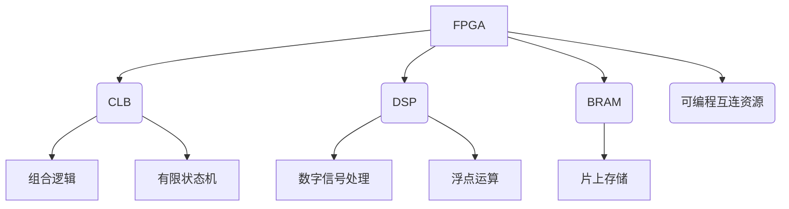
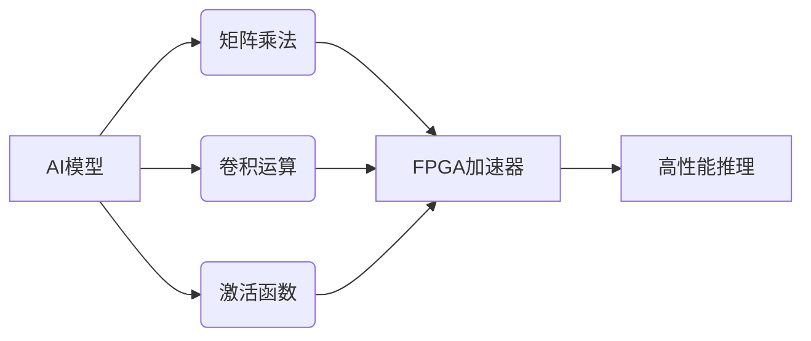
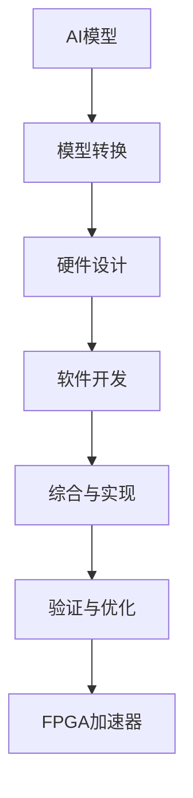
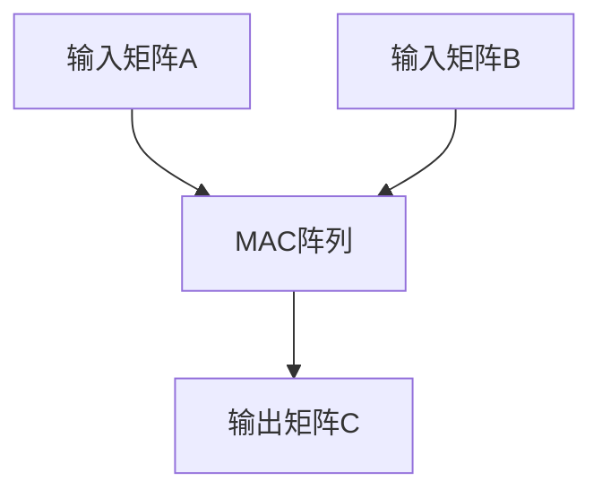
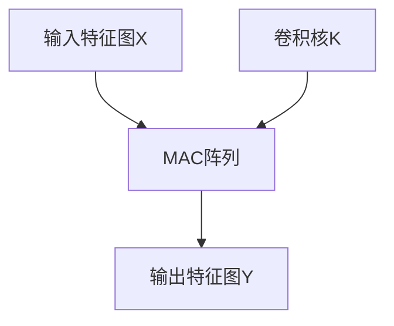

# AI模型部署到FPGA原理与代码实战案例讲解

## 1.背景介绍

### 1.1 人工智能的兴起

人工智能(AI)已经成为当今科技领域最热门的话题之一。随着算力的不断提升和大数据的积累,AI技术在诸多领域展现出了巨大的潜力,包括计算机视觉、自然语言处理、决策系统等。越来越多的企业和组织开始将AI技术应用于实际场景,以提高效率、降低成本并获得竞争优势。

### 1.2 AI模型的挑战

然而,训练出高质量的AI模型只是第一步。将这些模型成功部署到生产环境中并从中获益,是一个更加艰巨的挑战。传统的CPU和GPU虽然可以执行推理任务,但在处理大规模并行计算时存在瓶颈。此外,AI模型通常需要大量的计算资源,导致能耗和部署成本较高。

### 1.3 FPGA的优势

现场可编程门阵列(FPGA)作为一种可重构硬件,在AI模型加速和部署方面展现出了独特的优势。FPGA可以实现高度并行化的定制计算,能高效执行AI推理任务。与CPU和GPU相比,FPGA具有更高的能效比、更低的延迟和更好的可编程灵活性。

### 1.4 本文概述

本文将探讨如何将AI模型部署到FPGA上,重点介绍其核心原理、算法实现、数学模型、代码实例、应用场景等内容。我们将深入了解FPGA在AI加速方面的优势,并通过实际案例说明如何利用FPGA来提高AI模型的性能和效率。

## 2.核心概念与联系

在深入探讨AI模型在FPGA上的部署之前,我们需要了解一些核心概念及其之间的联系。

### 2.1 FPGA架构

FPGA由可编程逻辑块(CLB)、数字信号处理(DSP)块、块RAM(BRAM)和可编程互连资源组成。CLB是FPGA的基本逻辑单元,用于实现组合逻辑和有限状态机等功能。DSP块专门用于加速数字信号处理和浮点运算。BRAM提供了片上存储资源,而可编程互连资源则负责将各个模块连接在一起。

### 2.2 AI模型与FPGA加速

AI模型通常由大量的矩阵乘法、卷积运算和激活函数等操作组成。这些操作涉及大量的并行计算,正好契合了FPGA的硬件特性。利用FPGA上的并行计算资源,可以实现高度定制化的AI加速器,从而显著提高模型的推理性能。

### 2.3 FPGA开发流程

将AI模型部署到FPGA上需要经历以下几个主要步骤:

1. **模型转换**: 将训练好的AI模型(通常为浮点格式)转换为FPGA可以高效执行的定点或量化格式。
2. **硬件设计**: 使用硬件描述语言(HDL)或高级综合(HLS)工具,设计AI加速器的硬件架构。
3. **软件开发**: 编写软件程序,用于控制FPGA加速器、进行数据传输和后处理等。
4. **综合与实现**: 使用FPGA供应商提供的工具,将硬件设计综合并实现到FPGA芯片上。
5. **验证与优化**: 在FPGA开发板上验证加速器的功能和性能,并进行必要的优化。

通过上述步骤,我们可以将AI模型高效地部署到FPGA上,充分利用FPGA的并行计算能力,实现高性能的AI推理加速。

## 3.核心算法原理具体操作步骤

在将AI模型部署到FPGA上时,核心算法主要包括模型量化、硬件加速器设计和数据流优化等几个方面。

### 3.1 模型量化

由于FPGA的硬件资源有限,通常无法直接在FPGA上执行浮点运算。因此,我们需要将训练好的AI模型从浮点格式量化为定点格式。量化的过程包括以下几个步骤:

1. **确定量化范围**: 分析模型参数和激活值的分布,确定合适的量化范围。
2. **选择量化方法**: 常见的量化方法包括线性量化、对数量化和非均匀量化等。
3. **执行量化**: 根据选定的量化方法,将模型参数和激活值映射到定点表示。
4. **微调模型**: 在量化后,可以对模型进行微调训练,以减小量化误差对模型精度的影响。

量化后的模型不仅可以在FPGA上高效执行,而且还能显著减小模型的存储和带宽需求,从而降低部署成本。

### 3.2 硬件加速器设计

设计高效的FPGA加速器是部署AI模型的关键。常见的加速器架构包括流水线、并行和分层等。具体的设计步骤如下:

1. **分析计算模式**: 分析AI模型中的计算模式,如矩阵乘法、卷积运算等。
2. **选择加速器架构**: 根据计算模式和资源约束,选择合适的加速器架构。
3. **设计计算单元**: 使用HDL或HLS工具,设计并行的计算单元,如乘累加器(MAC)阵列。
4. **设计数据路径**: 设计高效的数据路径,包括数据缓存、流控制等。
5. **资源映射**: 将计算单元和数据路径映射到FPGA的硬件资源上。
6. **时序优化**: 进行时序优化,确保设计满足时钟频率和时序约束。

通过上述步骤,我们可以设计出高度优化的FPGA加速器,充分利用FPGA的并行计算能力,实现高吞吐量和低延迟的AI推理。

### 3.3 数据流优化

为了充分发挥FPGA加速器的性能,我们需要优化数据流,确保数据能够高效地传输到加速器并获取计算结果。常见的数据流优化技术包括:

1. **数据重用**: 通过在芯片上复用数据,减少外部存储器访问,从而降低带宽需求。
2. **数据流水线**: 将数据流划分为多个阶段,实现流水线操作,提高吞吐量。
3. **数据压缩**: 对输入数据进行压缩,减小传输带宽需求。
4. **DMA传输**: 使用直接内存访问(DMA)技术,实现高效的数据传输。
5. **异构计算**: 将计算任务分配到不同的计算单元(CPU、GPU、FPGA等),充分利用异构系统的优势。

通过上述优化技术,我们可以最大限度地提高FPGA加速器的性能,实现高效的端到端AI推理流程。

## 4.数学模型和公式详细讲解举例说明

在AI模型中,常见的数学模型和公式包括矩阵乘法、卷积运算、激活函数等。下面我们将详细讲解这些模型和公式,并给出在FPGA上的实现方式。

### 4.1 矩阵乘法

矩阵乘法是AI模型中最基本的运算之一,广泛应用于全连接层和注意力机制等模块。给定两个矩阵$A$和$B$,它们的乘积$C$可以表示为:

$$C = A \times B$$

其中,$A$是$m \times n$矩阵,$B$是$n \times p$矩阵,$C$是$m \times p$矩阵。矩阵乘法的计算过程可以用如下公式表示:

$$c_{ij} = \sum_{k=1}^{n}a_{ik}b_{kj}$$

在FPGA上实现矩阵乘法时,我们可以使用乘累加器(MAC)阵列进行并行计算。每个MAC单元负责计算一个乘积项,多个MAC单元并行工作,可以显著提高计算吞吐量。

### 4.2 卷积运算

卷积运算是神经网络中另一种常见的运算,尤其在卷积神经网络(CNN)中被广泛使用。给定一个输入特征图$X$和卷积核$K$,卷积运算可以表示为:

$$Y_{ij} = \sum_{m}\sum_{n}X_{i+m,j+n}K_{mn}$$

其中,$X$是输入特征图,$K$是卷积核,$Y$是输出特征图。卷积运算可以看作是在输入特征图上滑动卷积核,并对每个位置进行加权求和。

在FPGA上实现卷积运算时,我们可以使用线性体系结构或窗口体系结构。线性体系结构使用多个MAC单元按顺序计算每个输出像素,而窗口体系结构则使用多个MAC单元同时计算多个输出像素,从而提高吞吐量。

### 4.3 激活函数

激活函数是神经网络中另一个重要的组成部分,用于引入非线性,增强模型的表达能力。常见的激活函数包括ReLU、Sigmoid、Tanh等。

ReLU(整流线性单元)函数的数学表达式为:

$$f(x) = \max(0, x)$$

它将输入值小于0的部分截断为0,保留大于0的部分不变。ReLU函数在FPGA上的实现相对简单,只需要比较输入值与0的大小即可。

Sigmoid函数的数学表达式为:

$$f(x) = \frac{1}{1 + e^{-x}}$$

它将输入值映射到(0,1)范围内,常用于二分类任务的输出层。在FPGA上实现Sigmoid函数时,我们可以使用查找表或者近似计算的方式。

Tanh函数的数学表达式为:

$$f(x) = \frac{e^x - e^{-x}}{e^x + e^{-x}}$$

它将输入值映射到(-1,1)范围内,常用于生成值域有限的输出。Tanh函数的实现方式与Sigmoid函数类似,可以使用查找表或近似计算。

通过上述数学模型和公式,我们可以在FPGA上高效实现AI模型中的各种运算,从而实现高性能的推理加速。

## 5.项目实践:代码实例和详细解释说明

为了更好地理解如何将AI模型部署到FPGA上,我们将通过一个实际案例来进行说明。在这个案例中,我们将使用Vitis AI工具链,将一个简单的卷积神经网络模型部署到Xilinx FPGA开发板上。

### 5.1 环境准备

首先,我们需要准备以下开发环境:

- Xilinx Vitis AI 2022.1
- Xilinx Vivado 2022.1
- Xilinx Alveo U50 FPGA开发板

Vitis AI是Xilinx推出的一套AI推理加速工具链,支持在FPGA、GPU和CPU上部署AI模型。Vivado是Xilinx的FPGA设计工具套件,用于硬件设计、综合和实现。Alveo U50是一款基于Xilinx UltraScale+ FPGA的加速卡,适用于数据中心和边缘计算场景。

### 5.2 模型准备

我们将使用一个简单的卷积神经网络模型,用于对MNIST手写数字图像进行分类。该模型包含两个卷积层和两个全连接层,使用ReLU作