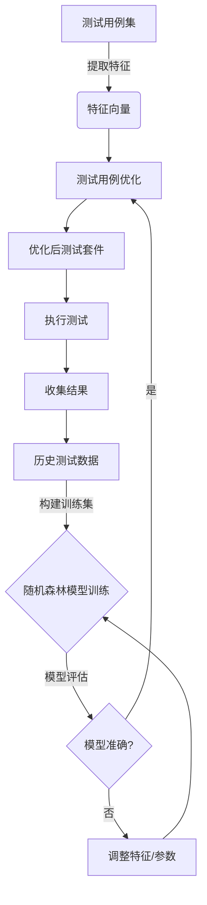
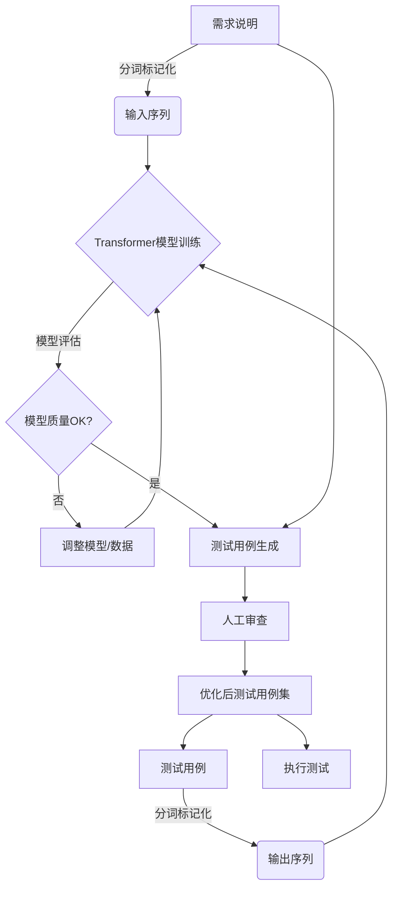
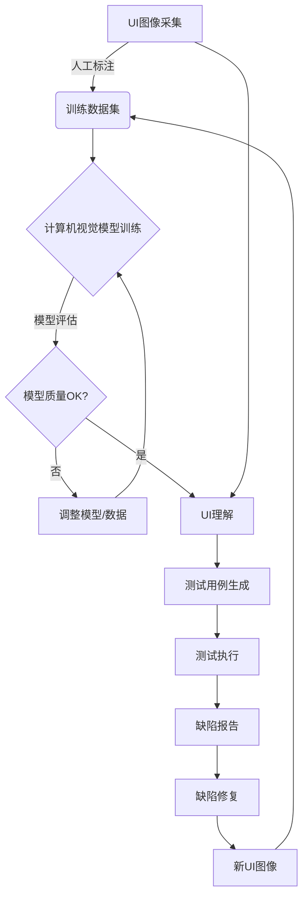

# AI测试与质量保证原理与代码实战案例讲解

## 1.背景介绍

### 1.1 软件测试的重要性

在当今快节奏的软件开发环境中,软件测试扮演着至关重要的角色。随着系统复杂性的不断增加,以及对软件质量和可靠性要求的提高,有效的测试策略和方法变得越来越关键。传统的手动测试方法已经无法满足现代软件开发的需求,因此自动化测试和人工智能(AI)测试技术应运而生。

### 1.2 AI测试的兴起

AI测试是将人工智能技术应用于软件测试过程的一种新兴方法。它利用机器学习、自然语言处理、计算机视觉等技术来优化和自动化测试活动,从而提高测试的效率、覆盖率和有效性。AI测试有望解决传统测试方法面临的诸多挑战,如测试用例设计、测试执行自动化、缺陷检测和预测等。

### 1.3 质量保证的重要性

软件质量保证(SQA)是确保软件产品满足预期质量标准的一系列活动和过程。它贯穿于整个软件开发生命周期,包括需求分析、设计、编码、测试和部署等阶段。有效的质量保证策略能够降低软件缺陷风险,提高客户满意度,并最终降低软件开发和维护成本。

## 2.核心概念与联系  

### 2.1 AI测试的核心概念

1. **机器学习在测试中的应用**:机器学习算法可用于自动生成测试用例、预测缺陷、优化测试套件等。常见的机器学习技术包括监督学习、非监督学习、强化学习等。

2. **自然语言处理在测试中的应用**:NLP技术可用于从需求规格说明中自动生成测试用例、分析用户反馈等。

3. **计算机视觉在测试中的应用**:计算机视觉技术可用于自动化GUI测试、识别UI缺陷等。

4. **测试用例优化**:利用AI技术优化测试用例集,提高测试覆盖率和发现缺陷的能力。

5. **自动化测试执行**:使用AI技术自动执行测试用例,减少人工干预。

6. **缺陷检测和预测**:利用机器学习模型检测和预测潜在的软件缺陷。

7. **测试报告自动生成**:基于AI技术自动生成可读性强的测试报告。

### 2.2 AI测试与质量保证的联系

AI测试技术与软件质量保证密切相关,它们的目标都是提高软件质量和可靠性。AI测试可以在质量保证的各个阶段发挥作用:

- **需求分析阶段**:NLP技术可以帮助从需求说明中自动生成测试用例。
- **设计阶段**:机器学习模型可以预测设计缺陷,并提供优化建议。  
- **编码阶段**:静态代码分析工具可以检测代码缺陷。
- **测试阶段**:AI技术可以优化测试用例、自动化测试执行、检测UI缺陷等。
- **部署阶段**:AI模型可以预测生产环境中可能出现的问题。
- **维护阶段**:AI辅助分析用户反馈,快速定位和修复缺陷。

综上所述,AI测试为软件质量保证提供了强有力的支持,有助于提高测试效率、减少人工错误、降低开发成本。

## 3.核心算法原理具体操作步骤

AI测试涉及多种算法和技术,本节将介绍其中几种核心算法的原理和具体操作步骤。

### 3.1 机器学习在测试用例优化中的应用

#### 3.1.1 原理介绍

测试用例优化旨在从大量测试用例中选择一个最小的高覆盖率子集,以降低测试执行时间和成本。这可以看作是一个组合优化问题,传统方法通常使用贪婪算法或进化算法等启发式方法来近似求解。

机器学习方法则将测试用例优化建模为一个监督学习问题。给定一组历史测试用例及其对应的覆盖信息,我们可以训练一个机器学习模型来预测新的测试用例是否应该被选入优化后的测试套件。常用的机器学习模型包括决策树、随机森林、支持向量机等。

#### 3.1.2 算法步骤

以随机森林算法为例,测试用例优化的步骤如下:

1. **数据预处理**:从历史测试数据中提取特征,如测试用例的长度、复杂度、执行时间等,并将其转换为模型可识别的数值向量。

2. **训练数据构建**:将历史测试用例及其对应的覆盖信息作为训练数据,其中覆盖信息作为标签。

3. **模型训练**:使用随机森林算法在训练数据上训练模型,得到一个能够预测测试用例是否应被选入优化集的分类器。

4. **模型评估**:在保留的测试数据上评估模型的性能,确保模型具有较高的预测准确率。

5. **测试用例优化**:对新的测试用例集,提取特征并使用训练好的模型进行预测,将预测为"应选入"的测试用例加入优化后的测试套件。

6. **反馈收集**:收集优化后测试套件的执行结果,作为新的训练数据,持续优化模型。

该算法的优点是可以自动学习测试用例的优化策略,无需人工设计复杂的启发式规则。缺点是需要大量高质量的历史数据作为训练集,且模型的性能很大程度上依赖于特征的选择和数据的质量。

### 3.2 NLP在测试用例生成中的应用

#### 3.2.1 原理介绍  

从需求规格说明中自动生成测试用例是NLP在测试中的一个重要应用。这个问题可以建模为一个序列到序列(Sequence-to-Sequence)的生成任务。

常用的技术方案是基于编码器-解码器(Encoder-Decoder)框架,使用递归神经网络(RNN)或transformer等神经网络模型。编码器将需求说明编码为语义向量表示,解码器则基于该语义向量生成对应的测试用例。

#### 3.2.2 算法步骤

以transformer模型为例,测试用例生成的步骤如下:

1. **数据预处理**:收集需求说明和对应的测试用例作为语料库,进行分词、标记化等预处理。

2. **训练数据构建**:将需求说明作为输入序列,测试用例作为输出序列,构建训练数据集。

3. **模型训练**:使用transformer模型在训练数据上进行训练,得到一个能够将需求说明转换为测试用例的序列生成模型。

4. **模型评估**:在保留的测试数据上评估模型的性能,确保模型具有较高的生成质量。

5. **测试用例生成**:对新的需求说明,使用训练好的模型进行推理,生成对应的测试用例。

6. **人工审查**:由测试人员审查生成的测试用例,对错误或遗漏的部分进行补充和修正。

7. **数据增量**:将人工审查后的数据加入语料库,用于持续优化模型。

该算法的优点是可以自动学习需求说明到测试用例的映射关系,减少了手工编写测试用例的工作量。缺点是生成质量很大程度上依赖于训练数据的质量和覆盖范围,且需要人工审查以确保生成结果的正确性。

### 3.3 计算机视觉在GUI测试中的应用

#### 3.3.1 原理介绍

GUI测试是软件测试的一个重要组成部分,旨在验证图形用户界面的功能、可用性和外观等方面。传统的GUI测试方法需要编写大量脚本代码来模拟用户交互,费时费力且容易出错。

计算机视觉技术为GUI测试带来了新的解决方案。通过对UI界面进行图像识别和理解,我们可以自动检测UI元素、识别UI状态变化,并基于此生成和执行测试用例。这种方法无需访问应用程序的内部代码,只需根据UI图像的视觉特征进行测试,因此具有更强的通用性和可移植性。

常用的计算机视觉技术包括目标检测、语义分割、光学字符识别(OCR)等。结合机器学习算法,我们可以训练出能够高效识别和理解UI界面的模型。

#### 3.3.2 算法步骤  

GUI测试的计算机视觉算法步骤如下:

1. **UI采集**:使用屏幕捕获或其他方式获取应用程序的UI界面图像。

2. **数据标注**:由人工标注UI图像中的元素、文本等关键信息,构建训练数据集。

3. **模型训练**:使用目标检测、实例分割等算法在训练数据上训练计算机视觉模型,得到能够识别UI元素的模型。

4. **UI理解**:将新的UI图像输入到训练好的模型中,识别和定位UI元素、读取文本内容等,建立UI的语义表示。

5. **测试用例生成**:根据UI的语义表示,结合预定义的测试策略,自动生成GUI测试用例。

6. **测试执行**:执行生成的测试用例,对UI进行交互式测试,检测UI缺陷。

7. **缺陷报告**:将检测到的UI缺陷信息记录下来,生成缺陷报告。

8. **数据增量**:将新的UI图像和缺陷信息加入训练数据集,用于持续优化模型。

该方法的优点是无需访问应用程序内部代码,可以对任意第三方应用进行GUI测试。缺点是需要大量的人工标注数据,且目前的计算机视觉技术在处理复杂UI时仍有一定的局限性。

## 4.数学模型和公式详细讲解举例说明

AI测试中使用了多种数学模型和算法,本节将重点介绍其中几种常用模型的数学原理和公式。

### 4.1 随机森林算法

随机森林是一种常用的机器学习算法,在测试用例优化、缺陷预测等任务中有广泛应用。它基于决策树的集成学习方法,通过构建多个决策树并将它们的预测结果进行组合,从而提高了模型的准确性和鲁棒性。

随机森林的数学模型可以表示为:

$$
H(x) = \text{majority\_vote} \{ h_i(x) \}_{i=1}^{n}
$$

其中,$H(x)$是随机森林的预测函数,$h_i(x)$是第$i$棵决策树的预测结果,$n$是决策树的总数。majority_vote表示对所有决策