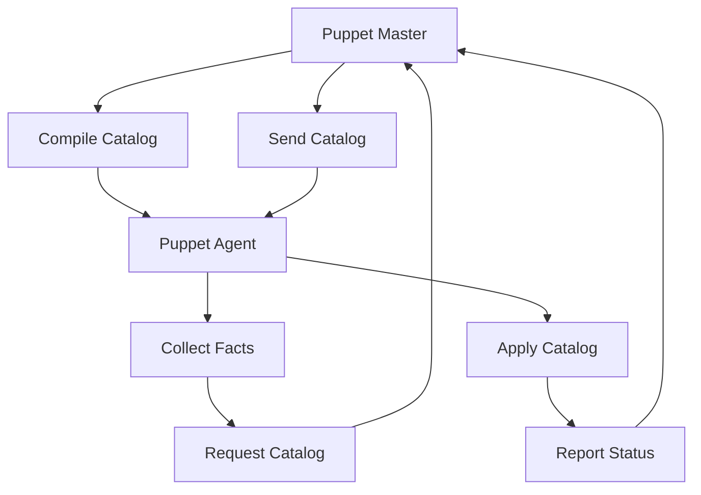

# AI系统Puppet原理与代码实战案例讲解

## 1. 背景介绍
### 1.1 人工智能系统概述
### 1.2 Puppet系统的兴起
### 1.3 Puppet在AI系统中的重要性

## 2. 核心概念与联系
### 2.1 Puppet系统的定义
### 2.2 Puppet与其他AI系统的区别
### 2.3 Puppet系统的主要组成部分
#### 2.3.1 Puppet Master
#### 2.3.2 Puppet Agent
#### 2.3.3 Facter
#### 2.3.4 Manifest
#### 2.3.5 Module

## 3. 核心算法原理具体操作步骤
### 3.1 Puppet系统的工作流程
### 3.2 资源抽象化与编排
### 3.3 Puppet DSL语言
### 3.4 Puppet编译过程
### 3.5 Catalog应用与执行

## 4. 数学模型和公式详细讲解举例说明
### 4.1 有向无环图(DAG)模型
### 4.2 资源依赖关系建模
### 4.3 Puppet配置状态机模型
### 4.4 配置收敛性证明

## 5. 项目实践：代码实例和详细解释说明 
### 5.1 搭建Puppet实验环境
### 5.2 编写Puppet Manifest配置
#### 5.2.1 文件资源示例
#### 5.2.2 软件包资源示例
#### 5.2.3 服务资源示例
#### 5.2.4 用户与组资源示例
### 5.3 自定义Facter Facts
### 5.4 创建Puppet模块
### 5.5 Hiera分层数据查找
### 5.6 使用PuppetDB存储配置数据

## 6. 实际应用场景
### 6.1 基础设施即代码(IaC)
### 6.2 配置漂移检测与自动修复
### 6.3 多环境配置管理
### 6.4 持续交付流水线集成
### 6.5 容器编排与配置管理

## 7. 工具和资源推荐
### 7.1 Puppet Enterprise版本
### 7.2 Puppet Forge模块仓库
### 7.3 Puppet Bolt任务编排工具
### 7.4 Puppet VSCode插件
### 7.5 社区支持与学习资源

## 8. 总结：未来发展趋势与挑战
### 8.1 Puppet在云原生时代的发展
### 8.2 Puppet与其他配置管理工具的融合 
### 8.3 声明式配置管理的局限性
### 8.4 大规模复杂系统的挑战
### 8.5 AI技术赋能的机遇

## 9. 附录：常见问题与解答
### 9.1 Puppet Agent无法与Master通信
### 9.2 资源冲突与循环依赖
### 9.3 Facter自定义fact无法生效
### 9.4 Puppet模块依赖解析失败
### 9.5 配置应用后系统状态与期望不一致

Puppet是一款功能强大的开源配置管理工具，在人工智能系统的构建和维护中发挥着关键作用。本文将深入探讨Puppet的核心原理，并结合实际的代码案例，全面讲解如何应用Puppet实现AI系统的自动化配置管理。

Puppet采用了声明式配置的思想，用户通过编写Puppet DSL语言来描述系统的目标状态，而无需关注具体的实现步骤。Puppet的核心组件包括Puppet Master和Puppet Agent。Puppet Master负责编译配置代码，生成Catalog并下发给Agent节点。Agent节点通过Facter组件收集系统的各种状态信息，并根据收到的Catalog执行相应的配置操作，最终使得系统达到期望的状态。

在Puppet的工作流程中，有向无环图(DAG)发挥了重要作用。Puppet使用DAG模型来表示资源之间的依赖关系，确保配置按照正确的顺序执行。同时，Puppet还引入了配置状态机模型，通过数学证明保障了配置的收敛性和一致性。

本文还将通过一系列的代码实例，演示如何使用Puppet DSL语言定义各种系统资源，包括文件、软件包、服务、用户等。读者可以学习如何创建自定义的Facter Facts、Puppet模块，以及如何使用Hiera进行分层数据查找。此外，我们还将讨论如何将Puppet集成到持续交付流水线中，实现配置管理的自动化。

在实际应用方面，Puppet被广泛用于基础设施即代码(IaC)的实践中。通过将基础设施抽象为代码，可以使用版本控制系统跟踪配置变更，并实现自动化测试和部署。Puppet还能够有效地检测和修复配置漂移，确保系统长期处于期望的状态。

展望未来，Puppet正在不断演进以适应云原生时代的需求。它与容器编排平台如Kubernetes的结合，为云环境下的配置管理提供了新的解决方案。同时，Puppet也面临着声明式配置管理的局限性，以及大规模复杂系统带来的挑战。AI技术的发展为Puppet注入了新的活力，智能化的配置分析和优化有望进一步提升Puppet的效率和可靠性。

总之，作为AI系统配置管理领域的佼佼者，Puppet凭借其强大的功能和灵活的扩展性，为我们构建和运维高度自动化、可靠且可扩展的人工智能系统提供了坚实的基础。通过学习和掌握Puppet的原理和实践，我们可以更加高效地应对AI系统配置管理的复杂性，加速人工智能的发展进程。

作者：禅与计算机程序设计艺术 / Zen and the Art of Computer Programming