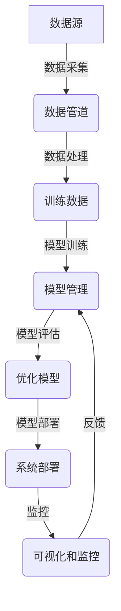

# AI系统Salt原理与代码实战案例讲解

## 1.背景介绍

### 1.1 人工智能系统的重要性

在当今时代,人工智能(AI)已经渗透到了我们生活的方方面面。从语音助手到自动驾驶汽车,从推荐系统到医疗诊断,AI系统无处不在。它们通过处理海量数据、发现隐藏模式并做出智能决策,为我们提供了前所未有的便利和能力。

随着数据的快速增长和计算能力的不断提高,AI系统变得越来越复杂和强大。然而,构建一个高效、可靠且安全的AI系统仍然是一个巨大的挑战。我们需要一个统一的框架来管理AI系统的整个生命周期,从数据采集到模型训练,再到系统部署和监控。

### 1.2 Salt AI系统介绍

Salt是一个全栈式AI系统,旨在简化AI应用的开发、部署和管理。它提供了一个端到端的解决方案,涵盖了数据处理、模型训练、系统部署和监控等各个环节。Salt的核心理念是"简单、高效、可扩展",它为开发人员提供了一个统一的界面,让他们能够专注于算法和模型的开发,而不必过多关注基础设施和运维方面的细节。

Salt的主要特点包括:

- **模块化设计**: Salt采用模块化设计,将不同的功能划分为独立的模块,如数据处理模块、模型训练模块、部署模块等。这种设计使得系统具有很好的扩展性和可维护性。

- **自动化流水线**: Salt提供了一个自动化的端到端流水线,涵盖了从数据采集到模型部署的整个过程。这大大简化了AI应用的开发和部署流程。

- **可视化监控**: Salt内置了一个强大的监控和可视化系统,让开发人员能够实时监控模型的性能和系统的运行状态,及时发现和解决问题。

- **开源和可定制**: Salt是一个开源项目,用户可以根据自己的需求对其进行定制和扩展。同时,Salt也欢迎社区的贡献和参与。

在接下来的章节中,我们将深入探讨Salt的核心概念、算法原理、代码实现以及实际应用场景。

## 2.核心概念与联系

在深入探讨Salt的细节之前,我们先来了解一些核心概念及它们之间的关系。这将有助于我们更好地理解Salt的整体架构和工作原理。

### 2.1 数据管道(Data Pipeline)

数据管道是Salt中一个重要的概念,它负责将原始数据转换为模型可以理解和处理的格式。一个典型的数据管道包括以下几个步骤:

1. **数据采集(Data Ingestion)**: 从各种数据源(如文件、数据库、API等)收集原始数据。

2. **数据清洗(Data Cleaning)**: 处理缺失值、异常值等,确保数据的完整性和一致性。

3. **数据转换(Data Transformation)**: 对数据进行归一化、编码等转换,以适应模型的输入格式。

4. **数据分割(Data Splitting)**: 将数据划分为训练集、验证集和测试集,用于模型的训练和评估。

在Salt中,数据管道由多个可组合的数据处理模块构成,用户可以根据需求灵活地组合和配置这些模块。

### 2.2 模型管理(Model Management)

模型管理是Salt的另一个核心概念,它涵盖了模型的训练、评估、优化和部署等全生命周期管理。在Salt中,模型管理包括以下几个主要步骤:

1. **模型定义(Model Definition)**: 选择合适的机器学习算法,并定义模型的架构和超参数。

2. **模型训练(Model Training)**: 使用训练数据对模型进行训练,优化模型参数。

3. **模型评估(Model Evaluation)**: 在验证数据集上评估模型的性能,并根据评估指标进行模型选择和调优。

4. **模型部署(Model Deployment)**: 将训练好的模型打包并部署到生产环境中,供应用程序调用和使用。

5. **模型监控(Model Monitoring)**: 持续监控已部署模型的性能,发现潜在的漂移或退化,并及时进行重新训练或更新。

Salt提供了多种流行的机器学习算法和模型架构,同时也支持用户自定义模型。此外,Salt还内置了自动化的超参数优化和模型选择功能,以帮助用户找到最佳的模型配置。

### 2.3 系统部署(System Deployment)

系统部署是将训练好的模型和相关组件部署到生产环境中,供应用程序调用和使用的过程。在Salt中,系统部署包括以下几个主要步骤:

1. **打包(Packaging)**: 将模型及其依赖项打包为一个可部署的单元,如Docker容器或serverless函数。

2. **部署(Deployment)**: 将打包好的单元部署到目标环境中,如云平台、边缘设备等。

3. **监控(Monitoring)**: 持续监控已部署系统的性能和运行状态,发现并解决潜在的问题。

4. **更新(Updating)**: 当有新的模型版本或配置更改时,自动化地更新已部署的系统。

Salt支持多种部署目标,包括云平台(如AWS、GCP等)、边缘设备、物联网设备等。同时,Salt也提供了自动化的部署流水线,简化了部署过程并提高了效率。

### 2.4 可视化和监控(Visualization and Monitoring)

可视化和监控是Salt的另一个重要特性,它让用户能够实时监控系统的运行状态,并通过直观的可视化界面理解和分析模型的行为。

Salt提供了一套全面的监控和可视化工具,包括:

1. **系统监控(System Monitoring)**: 监控系统资源使用情况、性能指标等,并提供实时警报和通知。

2. **模型监控(Model Monitoring)**: 监控模型的预测结果、准确性等指标,发现潜在的漂移或退化。

3. **可视化(Visualization)**: 通过交互式的可视化界面展示模型的内部结构、决策过程等,帮助用户理解模型的行为。

4. **解释(Interpretation)**: 提供模型解释功能,解释模型的预测结果和决策依据,提高模型的透明度和可解释性。

通过可视化和监控,用户可以更好地理解和控制AI系统的行为,及时发现和解决潜在的问题,从而提高系统的可靠性和安全性。

### 2.5 核心概念关系总结

以上几个核心概念相互关联,共同构成了Salt的整体架构和工作流程。数据管道负责将原始数据转换为模型可以理解的格式;模型管理负责训练、评估和优化模型;系统部署则将训练好的模型部署到生产环境中;可视化和监控贯穿整个过程,帮助用户理解和控制AI系统的行为。

下面是一个简单的Mermaid流程图,展示了这些核心概念之间的关系:

## 3.核心算法原理具体操作步骤

在本节中,我们将深入探讨Salt中一些核心算法的原理和具体操作步骤。这些算法广泛应用于数据处理、模型训练和模型优化等多个环节。

### 3.1 数据处理算法

#### 3.1.1 特征工程

特征工程是数据处理中一个非常重要的步骤,它旨在从原始数据中提取出对模型训练有用的特征。常见的特征工程技术包括:

1. **One-Hot编码**: 将分类特征转换为一组二进制向量,每个向量对应一个类别。

2. **标准化(Normalization)**: 将数值特征缩放到一个固定范围内(如0-1或-1到1),以防止数值差异过大的特征对模型产生过大影响。

3. **主成分分析(PCA)**: 通过线性变换将高维特征映射到低维空间,同时保留数据的主要信息。

4. **特征选择**: 从原始特征集中选择出对模型最有贡献的一部分特征,以减少模型复杂度和训练时间。

在Salt中,特征工程是数据管道的一个重要组成部分。用户可以灵活地组合和配置不同的特征工程模块,以适应不同的数据和任务需求。

#### 3.1.2 数据增强

数据增强是一种常见的技术,通过对现有数据进行一些变换(如旋转、平移、缩放等)来生成新的训练数据,从而增加数据集的多样性和数量。这对于防止过拟合和提高模型的泛化能力非常有帮助。

在Salt中,数据增强是数据管道的可选模块之一。用户可以根据任务类型(如计算机视觉、自然语言处理等)选择合适的数据增强策略,并将其应用于训练数据。

### 3.2 模型训练算法

#### 3.2.1 梯度下降

梯度下降是机器学习中最常用的优化算法之一。它通过计算目标函数(如损失函数)相对于模型参数的梯度,并沿着梯度的反方向更新参数,从而逐步减小目标函数的值。

在Salt中,梯度下降算法被广泛应用于各种模型的训练过程中。常见的梯度下降变体包括:

1. **批量梯度下降(Batch Gradient Descent)**: 每次使用整个训练数据集计算梯度并更新参数。

2. **随机梯度下降(Stochastic Gradient Descent, SGD)**: 每次使用一个训练样本计算梯度并更新参数。

3. **小批量梯度下降(Mini-batch Gradient Descent)**: 每次使用一小批训练样本计算梯度并更新参数,是批量梯度下降和随机梯度下降的折中方案。

4. **动量梯度下降(Momentum Gradient Descent)**: 在更新参数时,不仅考虑当前梯度,还考虑了之前的更新方向和步长,以加速收敛。

5. **自适应学习率优化算法(如Adam、RMSProp等)**: 通过自适应地调整每个参数的学习率,以加速收敛并提高稳定性。

用户可以根据具体任务和数据集的特点,选择合适的梯度下降变体及相关超参数。

#### 3.2.2 正则化

正则化是一种常用的技术,旨在防止模型过拟合并提高其泛化能力。常见的正则化方法包括:

1. **L1正则化(Lasso Regularization)**: 在损失函数中加入模型参数的L1范数(绝对值之和)作为惩罚项,可以产生稀疏解,即部分参数会被压缩为0。

2. **L2正则化(Ridge Regularization)**: 在损失函数中加入模型参数的L2范数(平方和)作为惩罚项,可以使参数值趋向于较小,但通常不会压缩为0。

3. **Dropout**: 在训练过程中随机地将一部分神经元的输出设置为0,以防止神经网络过拟合。

4. **Early Stopping**: 在验证集上监控模型的性能,一旦性能开始下降,就停止训练,以避免过拟合。

在Salt中,这些正则化技术都可以通过简单的配置来应用于模型训练过程中。用户可以根据具体任务和数据集的特点,选择合适的正则化方法及相关超参数。

### 3.3 模型优化算法

#### 3.3.1 超参数优化

超参数是指在模型训练过程中需要预先设置的参数,如学习率、正则化强度等。选择合适的超参数对模型的性能有着重大影响。然而,手动调整超参数是一个耗时且容易出错的过程。

Salt内置了自动化的超参数优化功能,可以自动搜索最佳的超参数组合。常见的超参数优化算法包括:

1. **网格搜索(Grid Search)**: 在预设的一组超参数值中进行穷举搜索。

2. **随机搜索(Random Search)**: 在超参数空间中随机采