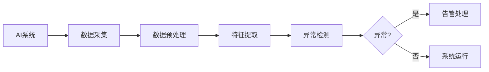

# AI系统异常检测原理与代码实战案例讲解

## 1. 背景介绍
### 1.1 异常检测的重要性
在当今高度互联和自动化的世界中,各种人工智能(AI)系统在我们的日常生活和工作中扮演着越来越重要的角色。从智能家居、自动驾驶汽车到工业制造和金融交易,AI系统无处不在。然而,随着AI系统变得更加复杂和关键,确保其稳定可靠的运行变得至关重要。异常检测技术应运而生,旨在及时发现AI系统中的异常行为和故障,以避免潜在的灾难性后果。

### 1.2 异常检测的挑战
异常检测在AI系统中面临着独特的挑战:
1. 海量高维数据:AI系统通常会生成和处理海量的高维数据,传统的异常检测方法难以有效处理。  
2. 复杂的系统行为:AI系统展现出高度非线性、动态和自适应的行为,很难建立准确的数学模型。
3. 异常的多样性:AI系统可能遇到各种未知的异常情况,无法提前定义和识别所有可能的异常模式。
4. 实时性要求:许多AI应用需要实时检测异常,对算法的效率提出了很高的要求。

### 1.3 异常检测技术的发展
为了应对这些挑战,AI领域的研究者们提出了一系列创新的异常检测技术,包括基于统计学习、深度学习、图嵌入等方法。这些技术在不同的AI应用场景中取得了显著的效果,为保障AI系统的可靠运行提供了有力的工具。

## 2. 核心概念与联系
### 2.1 异常的定义
异常(Anomaly),也称为离群点(Outlier),是指明显偏离其他数据点的罕见观测值。从统计学的角度看,异常是指生成这些数据点的机制与生成其他数据点的机制不同。在AI系统中,异常通常表现为系统行为的突变、性能的下降、资源的异常消耗等。

### 2.2 异常检测的分类
根据异常的先验知识,异常检测可分为以下三类:

1. 有监督异常检测:已知正常数据和异常数据,训练二分类模型。
2. 半监督异常检测:只有正常数据,异常数据很少或没有,学习正常行为的模型。  
3. 无监督异常检测:没有任何标记数据,通过数据的内在结构和统计规律判别异常。

### 2.3 异常检测与其他任务的关系
异常检测与其他几个常见的机器学习任务有密切联系:

1. 分类:当异常类别已知时,异常检测可以转化为二分类问题。
2. 聚类:异常数据点通常不属于任何一个正常的聚类簇。  
3. 回归:当数据呈现连续分布时,可以用回归模型拟合,残差较大的点视为异常。

下图展示了异常检测在AI系统中的关键作用:



## 3. 核心算法原理与具体步骤
本节将重点介绍几种常用的异常检测算法,包括统计学方法、基于距离和密度的方法、基于聚类的方法以及深度学习方法。

### 3.1 统计学方法
统计学方法假设数据服从某种概率分布,异常是指偏离这种分布的罕见事件。常见的做法是先估计数据的分布参数,然后根据样本点在分布中的概率密度或累积概率来判断其是否为异常。以高斯分布为例,具体步骤如下:

1. 估计数据的均值 $\mu$ 和协方差矩阵 $\Sigma$。
2. 对于每个样本点 $x$,计算其马氏距离:
   $$D_M(x)=\sqrt{(x-\mu)^T\Sigma^{-1}(x-\mu)}$$
3. 根据 $\chi^2$ 分布,确定一个阈值 $\epsilon$,当 $D_M(x)>\epsilon$ 时,判定 $x$ 为异常。

### 3.2 基于距离和密度的方法
这类方法基于一个假设:正常数据点彼此靠近,异常点远离大多数其他点或处于低密度区域。两个代表性的算法是 K-最近邻(KNN)和局部异常因子(LOF)。

以LOF为例,其核心思想是比较一个点与其邻域内其他点的局部密度,如果该点的局部密度明显低于邻居,则可能是异常点。算法步骤如下:

1. 对每个点 $p$,计算其到第 $k$ 个最近点的距离 $k\text{-}distance(p)$。
2. 定义点 $p$ 的 $k\text{-}distance$ 邻域 $N_k(p)$,包含与 $p$ 的距离不大于 $k\text{-}distance(p)$ 的所有点。
3. 计算每个点 $p$ 的局部可达密度(lrd):
   $$\text{lrd}_k(p)=1/\left(\frac{\sum_{o\in N_k(p)}k\text{-}distance(o)}{|N_k(p)|}\right)$$
4. 计算每个点 $p$ 的局部异常因子(LOF):
   $$\text{LOF}_k(p)=\frac{\sum_{o\in N_k(p)}\frac{\text{lrd}_k(o)}{\text{lrd}_k(p)}}{|N_k(p)|}$$
5. 根据LOF值排序,取 Top-n 作为异常点。

### 3.3 基于聚类的方法
聚类是将数据点划分为多个组的过程,其目标是组内相似度高而组间相似度低。异常点通常不属于任何一个聚类,或形成小而疏散的微聚类。常见的做法是先对数据进行聚类,然后根据与最近聚类中心的距离或所属聚类的大小等指标来评估某点是否异常。

以 CBLOF 算法为例,其将聚类与局部异常因子相结合,算法步骤如下:

1. 使用某种聚类算法(如 K-Means)得到 $k$ 个聚类 $\{C_1,\cdots,C_k\}$。
2. 对于每个聚类 $C_i$,计算其大小 $|C_i|$ 和中心 $\mu_i$。
3. 定义聚类 $C_i$ 的大小因子:
   $$\text{size}_i=\frac{|C_i|}{\sum_{j=1}^k|C_j|}$$
4. 对每个点 $x$,计算其聚类基LOF值:
   $$\text{CBLOF}(x)=\frac{\min_i\sqrt{(x-\mu_i)^T(x-\mu_i)}}{\text{size}_i}$$
5. 根据CBLOF值排序,取 Top-n 作为异常点。

### 3.4 深度学习方法
近年来,深度学习凭借其强大的表示学习能力在异常检测领域崭露头角。常见的思路包括自编码器重构、生成对抗等。

以自编码器为例,其学习数据的低维表示并尝试重构原始输入,重构误差大的样本可能是异常。算法步骤如下:

1. 训练自编码器 $f_\theta:X\to Z$ 和 $g_\phi:Z\to X$,最小化重构误差:
   $$\mathcal{L}(\theta,\phi)=\frac{1}{n}\sum_{i=1}^n\|x^{(i)}-g_\phi(f_\theta(x^{(i)}))\|^2$$
2. 对每个样本点 $x$,计算其重构误差:
   $$E(x)=\|x-g_\phi(f_\theta(x))\|^2$$
3. 根据重构误差排序,取 Top-n 作为异常点。

## 4. 数学模型与公式详解
本节以高斯分布为例,详细推导异常检测的数学模型。

假设数据 $X=\{x^{(1)},\cdots,x^{(n)}\}$ 独立同分布,服从 $d$ 维高斯分布 $\mathcal{N}(\mu,\Sigma)$,其中 $\mu\in\mathbb{R}^d$ 为均值向量,$\Sigma\in\mathbb{R}^{d\times d}$ 为协方差矩阵。高斯分布的概率密度函数为:

$$p(x;\mu,\Sigma)=\frac{1}{(2\pi)^{d/2}|\Sigma|^{1/2}}\exp\left(-\frac{1}{2}(x-\mu)^T\Sigma^{-1}(x-\mu)\right)$$

其中 $|\Sigma|$ 表示 $\Sigma$ 的行列式。

给定样本集 $X$,我们可以用最大似然估计(MLE)来估计高斯分布的参数:

$$\hat{\mu}=\frac{1}{n}\sum_{i=1}^nx^{(i)}$$

$$\hat{\Sigma}=\frac{1}{n}\sum_{i=1}^n(x^{(i)}-\hat{\mu})(x^{(i)}-\hat{\mu})^T$$

异常点 $x$ 在高斯分布 $\mathcal{N}(\hat{\mu},\hat{\Sigma})$ 中的概率密度很低,即:

$$p(x;\hat{\mu},\hat{\Sigma})< \epsilon$$

其中 $\epsilon$ 为异常阈值。取对数并化简,得到等价的马氏距离判定条件:

$$(x-\hat{\mu})^T\hat{\Sigma}^{-1}(x-\hat{\mu})>\eta$$

其中 $\eta=-2\ln((2\pi)^{d/2}|\hat{\Sigma}|^{1/2}\epsilon)$ 为基于 $\epsilon$ 确定的异常阈值。

在实践中,我们通常根据 $\chi^2$ 分布来确定 $\eta$ 的值。马氏距离服从自由度为 $d$ 的 $\chi^2$ 分布,给定显著性水平 $\alpha$,阈值可由下式确定:

$$\eta=F^{-1}_{\chi^2_d}(1-\alpha)$$

其中 $F^{-1}_{\chi^2_d}$ 为 $\chi^2$ 分布的反函数。

## 5. 项目实践:代码实例与详解
下面以 Python 为例,演示基于高斯分布的异常检测的代码实现。

```python
import numpy as np
from scipy.stats import chi2

class GaussianAD:
    def __init__(self, alpha=0.05):
        self.alpha = alpha
        self.mu = None
        self.sigma = None
    
    def fit(self, X):
        """估计高斯分布参数"""
        self.mu = np.mean(X, axis=0)
        self.sigma = np.cov(X.T)
    
    def predict(self, X):
        """异常检测"""
        d = X.shape[1]
        diff = X - self.mu
        dist = np.sum(diff * np.linalg.solve(self.sigma, diff.T).T, axis=1)
        thresh = chi2.ppf(1 - self.alpha, df=d)
        return dist > thresh
```

使用示例:

```python
from sklearn.datasets import make_blobs

# 生成模拟数据
X, _ = make_blobs(n_samples=100, centers=1, cluster_std=1.0, 
                  n_features=2, random_state=42)
X = np.concatenate([X, [[5, 5], [-5, -5]]])  # 添加异常点

# 训练异常检测器
ad = GaussianAD(alpha=0.05)
ad.fit(X)

# 异常检测
anomalies = ad.predict(X)
print(f"异常点索引: {np.where(anomalies)[0]}")
```

输出:
```
异常点索引: [100 101]
```

以上代码首先生成了一个包含异常点的二维高斯分布数据集,然后训练基于高斯分布的异常检测器,最后打印出检测到的异常点的索引。可以看到,异常检测器成功地识别出了人为添加的两个异常点。

## 6. 实际应用场景
异常检测在各个领域都有广泛的应用,下面列举几个典型的AI场景。

### 6.1 智能运维
在复杂的IT系统中,服务器、网络、应用等组件的 KPI 指标(如CPU利用率、内存使用量、请求延迟等)可能出现异常波动,预示着潜在的故障或安全威胁。通过异常检测,可以及时发现这些异常,触发告警和自动化处置,从而提