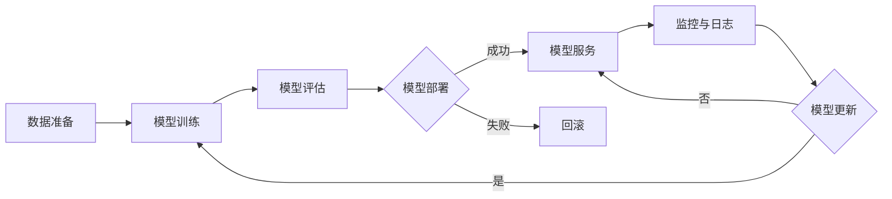

# AI系统持续交付原理与代码实战案例讲解

## 1. 背景介绍
### 1.1 AI系统开发面临的挑战
#### 1.1.1 快速迭代的需求
#### 1.1.2 模型与代码的版本管理
#### 1.1.3 部署与监控的复杂性
### 1.2 持续交付在AI系统开发中的重要性
#### 1.2.1 加速AI系统的迭代速度
#### 1.2.2 提高AI系统的质量与稳定性
#### 1.2.3 促进团队协作与效率提升

## 2. 核心概念与联系
### 2.1 持续集成(Continuous Integration, CI)
#### 2.1.1 版本控制系统(如Git)的使用
#### 2.1.2 自动化构建与测试
#### 2.1.3 代码质量检查与评估
### 2.2 持续交付(Continuous Delivery, CD) 
#### 2.2.1 自动化部署流程
#### 2.2.2 环境管理与配置
#### 2.2.3 发布策略与回滚机制
### 2.3 AI系统中CI/CD的特殊考量
#### 2.3.1 数据与模型版本管理
#### 2.3.2 模型训练与评估的自动化
#### 2.3.3 AI系统的监控与日志管理

## 3. 核心算法原理具体操作步骤
### 3.1 数据处理与特征工程
#### 3.1.1 数据清洗与预处理
#### 3.1.2 特征选择与提取
#### 3.1.3 数据增强与扩充
### 3.2 模型训练与优化
#### 3.2.1 模型选择与超参数调优
#### 3.2.2 训练数据的划分与交叉验证
#### 3.2.3 模型集成与融合技术
### 3.3 模型评估与验证
#### 3.3.1 评估指标的选择与计算
#### 3.3.2 模型性能的可视化分析
#### 3.3.3 A/B测试与在线评估

## 4. 数学模型和公式详细讲解举例说明
### 4.1 线性回归模型
#### 4.1.1 模型定义与假设
#### 4.1.2 损失函数与优化目标
#### 4.1.3 参数估计与求解方法
### 4.2 逻辑回归模型
#### 4.2.1 二分类问题的建模
#### 4.2.2 Sigmoid函数与概率解释
#### 4.2.3 极大似然估计与梯度下降法
### 4.3 支持向量机(SVM)
#### 4.3.1 最大间隔分类器
#### 4.3.2 软间隔与松弛变量
#### 4.3.3 核函数与非线性分类

## 5. 项目实践：代码实例和详细解释说明
### 5.1 使用Python实现线性回归
#### 5.1.1 数据加载与预处理
#### 5.1.2 模型定义与训练
#### 5.1.3 模型评估与预测
### 5.2 使用TensorFlow构建卷积神经网络
#### 5.2.1 数据集准备与数据增强
#### 5.2.2 网络结构设计与超参数选择
#### 5.2.3 模型训练与性能评估
### 5.3 基于Docker的模型部署
#### 5.3.1 Dockerfile编写与镜像构建
#### 5.3.2 容器化运行与服务暴露
#### 5.3.3 模型更新与版本管理

## 6. 实际应用场景
### 6.1 智能客服系统
#### 6.1.1 自然语言理解与意图识别
#### 6.1.2 对话管理与上下文理解
#### 6.1.3 知识库构建与检索
### 6.2 个性化推荐系统
#### 6.2.1 用户行为数据采集与处理
#### 6.2.2 协同过滤与基于内容的推荐
#### 6.2.3 在线学习与实时推荐
### 6.3 智能风控系统
#### 6.3.1 特征工程与数据融合
#### 6.3.2 异常检测与风险评估
#### 6.3.3 决策引擎与规则管理

## 7. 工具和资源推荐
### 7.1 数据标注与管理工具
#### 7.1.1 LabelMe
#### 7.1.2 CVAT
#### 7.1.3 Dataturks
### 7.2 模型训练与调优平台
#### 7.2.1 TensorFlow Extended(TFX)
#### 7.2.2 Kubeflow
#### 7.2.3 Amazon SageMaker
### 7.3 CI/CD工具与平台
#### 7.3.1 Jenkins
#### 7.3.2 GitLab CI/CD
#### 7.3.3 Argo CD

## 8. 总结：未来发展趋势与挑战
### 8.1 AI系统的解释性与可信性
#### 8.1.1 模型可解释性研究
#### 8.1.2 公平性与去偏见
#### 8.1.3 隐私保护与安全性
### 8.2 AI系统的持续学习与演进
#### 8.2.1 在线学习与增量学习
#### 8.2.2 知识蒸馏与模型压缩
#### 8.2.3 自适应与自动化调优
### 8.3 AI系统的标准化与生态建设
#### 8.3.1 模型与数据的标准化
#### 8.3.2 工具链与平台的互操作性
#### 8.3.3 开源社区与产业合作

## 9. 附录：常见问题与解答
### 9.1 如何选择合适的模型评估指标？
### 9.2 如何进行模型的超参数调优？
### 9.3 如何处理数据不平衡问题？
### 9.4 如何进行模型的版本管理与回滚？
### 9.5 如何监控AI系统的运行状态与性能？

AI系统持续交付是一个循环迭代的过程，涉及数据准备、模型训练、评估、部署、监控等多个环节。在这个过程中，我们需要借助版本控制系统、自动化构建与测试、容器化部署等工具与实践，来保证AI系统的快速迭代与高质量交付。

同时，我们还需要关注AI系统开发中的特殊挑战，如数据与模型的版本管理、模型训练与评估的自动化、AI系统的监控与日志管理等。通过引入适当的工具与平台，如TensorFlow Extended(TFX)、Kubeflow等，我们可以更好地应对这些挑战，提高AI系统开发的效率与质量。

在实践中，我们以线性回归、卷积神经网络等经典模型为例，详细讲解了模型的数学原理、代码实现、训练与评估过程。同时，我们还探讨了如何将训练好的模型进行容器化部署，实现模型的快速更新与版本管理。

AI系统持续交付的应用场景十分广泛，从智能客服、个性化推荐到智能风控等，都可以通过持续交付的实践来提升系统的迭代速度与稳定性。不过，我们也需要注意AI系统开发中的潜在风险，如模型的可解释性、公平性、隐私保护等问题，需要在技术实践中予以重点关注。

展望未来，AI系统持续交付还有许多发展机遇与挑战。如何实现模型的持续学习与演进、如何建立标准化的模型与数据规范、如何构建开放互通的生态体系等，都是值得持续探索的方向。只有在实践中不断积累经验、优化工具与方法，才能更好地实现AI系统的敏捷开发与高质量交付，推动AI技术在各行各业的深度应用。

作者：禅与计算机程序设计艺术 / Zen and the Art of Computer Programming