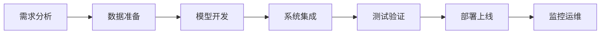
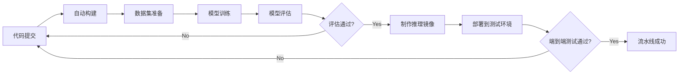

# AI系统持续集成原理与代码实战案例讲解

## 1.背景介绍
人工智能(Artificial Intelligence, AI)技术的快速发展,使得AI系统变得日益复杂。如何保证大规模、高复杂度AI系统的质量,是业界面临的重大挑战。持续集成(Continuous Integration, CI)作为一种软件工程实践,通过自动化构建、测试等手段,能够帮助开发团队尽早发现问题,提高软件质量。将CI引入AI系统开发,对于提升AI系统的鲁棒性、可靠性具有重要意义。

本文将深入探讨AI系统持续集成的原理,并通过代码实战案例,讲解如何实现AI系统的持续集成。通过本文,你将了解到:

- AI系统持续集成的核心概念与工作原理
- 如何为AI系统设计持续集成流程
- 持续集成中的关键技术与最佳实践  
- 应用持续集成提升AI系统质量的实战经验

## 2.核心概念与联系

### 2.1 人工智能系统开发生命周期
和传统软件类似,AI系统的开发也遵循一定的生命周期,主要包括:

- 需求分析:明确AI系统的目标、应用场景、性能指标等
- 数据准备:收集、标注训练数据集,进行数据预处理与特征工程
- 模型开发:选择或设计适合的AI算法和模型,进行模型训练和优化
- 系统集成:将训练好的模型集成到应用系统中,提供推理服务
- 测试验证:对AI系统进行功能、性能、可靠性等方面的测试
- 部署上线:将AI系统部署到生产环境,提供在线服务
- 监控运维:对线上AI系统进行监控、日志分析、故障诊断等运维工作



### 2.2 持续集成的定义与价值
持续集成是一种软件工程实践,倡导团队成员频繁地将代码集成到共享分支,通过自动化手段尽早发现和解决集成问题,从而保证软件质量。引入持续集成,能够为AI系统开发带来如下价值:

- 尽早发现问题,降低后期返工成本
- 保证系统的可集成性,提高团队协作效率  
- 通过持续测试,提高AI系统的质量
- 为持续交付和DevOps实践奠定基础

### 2.3 AI系统持续集成的特点
相比传统软件,AI系统在持续集成方面有其特殊性:

- 对数据的依赖性更强,需要对数据集版本进行管理
- 涉及模型训练等计算密集型任务,对计算资源要求高
- 模型评估指标多样,需要全方位评测模型性能
- 推理服务的性能和资源消耗需要重点关注

因此,AI系统的持续集成需要在流程、工具、基础设施等方面,提供专门的支持和优化。

## 3.核心算法原理与具体操作步骤

本节我们重点介绍AI系统持续集成的核心算法原理,并给出具体的操作步骤。一个典型的AI系统CI流程如下图所示:



### 3.1 代码管理与自动构建
AI系统的代码通常包括数据处理、模型定义、训练脚本、推理服务等多个部分。当开发者提交代码后,CI系统会自动拉取代码,通过构建脚本完成环境准备、依赖安装、单元测试等构建任务。这里的关键是:

- 使用版本控制系统(如Git)对代码进行管理
- 每个可独立运行的模块都要有单元测试,在构建时执行
- 使用构建工具(如Jenkins、GitLab CI等)实现自动化构建

### 3.2 数据集管理与准备
AI系统对训练数据集有很强的依赖,因此需要:

- 对数据集进行版本化管理,与代码版本相对应
- 每次构建时,自动拉取对应版本的数据集
- 执行必要的数据预处理、特征提取等数据准备步骤

常用的数据集管理工具有DVC、Pachyderm等。在CI流程中,可以通过配置DVC,在构建时自动拉取对应版本的数据集。

### 3.3 模型训练与评估
拿到代码和数据集后,就可以启动模型训练了。为了让训练过程自动化,可以:

- 将训练脚本制作成可执行的应用
- 通过构建参数来配置训练的超参数
- 训练结束后,自动对模型进行多维度的评估
- 评估结果达标后,将模型文件存档,供后续使用

在训练和评估环节,我们通常会使用TensorFlow、PyTorch等机器学习框架。可以使用MLflow等工具,管理模型的超参数、评估指标、模型文件等产出物。

### 3.4 推理服务集成测试
模型训练完成后,需要将其集成到推理服务中。为了测试推理服务的可用性,我们往往会:

- 将模型封装成标准化的推理服务镜像
- 将镜像部署到测试环境,提供RESTful API或gRPC接口
- 对推理服务进行功能、性能、稳定性等方面的自动化测试
- 测试通过后,将服务镜像存档,作为发布候选

常用的模型部署工具有Kubeflow、BentoML等,测试工具有Postman、JMeter、Locust等。通过编写自动化测试脚本,可以实现推理服务的持续集成。

## 4.数学模型和公式详细讲解举例说明

在AI系统中,各种数学模型和优化算法发挥着核心作用。下面我们通过一个具体例子,讲解持续集成中涉及的部分关键模型和公式。

### 4.1 深度神经网络模型
假设我们要构建一个图像分类模型,采用卷积神经网络(CNN)。一个简单的CNN模型结构如下:


卷积层的计算公式为:

$$ a^{l}_{i,j} = \sum_{k=1}^{K}\sum_{x=1}^{F}\sum_{y=1}^{F} w^{l}_{k,x,y} \cdot a^{l-1}_{i+x-p,j+y-p} + b^{l}_{k} $$

其中,$a^{l}_{i,j}$为第$l$层第$(i,j)$个神经元的激活值,$w^{l}_{k,x,y}$为第$l$层第$k$个卷积核的权重,$b^{l}_{k}$为偏置项,$F$为卷积核尺寸,$p$为padding尺寸。

池化层通常采用最大池化,公式为:

$$ a^{l}_{i,j} = \max_{m=1,n=1}^{s} a^{l-1}_{s(i-1)+m, s(j-1)+n} $$

其中,$s$为池化尺寸。全连接层的计算与普通的神经网络一致:

$$ a^{l}_{i} = \sigma(\sum_{j=1}^{M} w^{l}_{i,j} \cdot a^{l-1}_{j} + b^{l}_{i}) $$

$\sigma$为激活函数,$M$为上一层神经元数量。

### 4.2 模型评估指标
对于分类模型,我们通常用准确率、精确率、召回率等指标来评估模型性能。设$TP$为真正例数,$FP$为假正例数,$TN$为真负例数,$FN$为假负例数,则:

- 准确率(Accuracy): $\frac{TP+TN}{TP+FP+TN+FN}$
- 精确率(Precision): $\frac{TP}{TP+FP}$
- 召回率(Recall): $\frac{TP}{TP+FN}$

此外,我们还会用F1-score来权衡精确率和召回率:

$$ F_1 = \frac{2 \cdot Precision \cdot Recall}{Precision + Recall} $$

在持续集成流程中,我们需要在模型评估阶段,自动计算这些指标,并根据预设的阈值来判断模型是否达标。

### 4.3 推理服务性能指标
除了模型的性能,我们还需要评估推理服务的质量,主要指标有:

- 延迟(Latency):单次请求的响应时间
- 吞吐量(Throughput):单位时间内能处理的请求数
- 资源利用率:CPU、GPU、内存等资源的使用情况
- 错误率:异常请求占比

这些指标可以通过对推理服务进行性能测试来获得。例如,我们可以用JMeter构造不同并发度的请求,测试服务的吞吐量和延迟。在CI流程中,可以设置性能基准值,只有满足基准的服务版本才能发布上线。

## 5.项目实践：代码实例和详细解释说明

下面我们用一个实际的代码实例,演示如何用Python和Jenkins来实现AI系统的持续集成。

### 5.1 模型训练代码
首先,我们编写一个简单的CNN模型训练脚本`train.py`:

```python
import tensorflow as tf
from tensorflow import keras

# 加载MNIST数据集
(x_train, y_train), (x_test, y_test) = keras.datasets.mnist.load_data()
x_train = x_train / 255.0
x_test = x_test / 255.0

# 定义CNN模型
model = keras.Sequential([
    keras.layers.Conv2D(32, (3,3), activation='relu', input_shape=(28,28,1)),
    keras.layers.MaxPooling2D((2,2)),
    keras.layers.Conv2D(64, (3,3), activation='relu'),
    keras.layers.MaxPooling2D((2,2)),
    keras.layers.Conv2D(64, (3,3), activation='relu'),
    keras.layers.Flatten(),
    keras.layers.Dense(64, activation='relu'),
    keras.layers.Dense(10, activation='softmax')
])

# 编译模型
model.compile(optimizer='adam',
              loss='sparse_categorical_crossentropy',
              metrics=['accuracy'])

# 训练模型
model.fit(x_train, y_train, epochs=5, batch_size=64, validation_split=0.1)

# 评估模型
test_loss, test_acc = model.evaluate(x_test, y_test)
print(f'Test accuracy: {test_acc}')

# 保存模型
model.save('model.h5')
```

这个脚本加载MNIST手写数字数据集,定义了一个简单的CNN模型,训练5个epoch后评估模型在测试集上的准确率,最后将模型保存为`model.h5`文件。

### 5.2 模型服务代码
接下来,我们编写一个模型服务脚本`app.py`,加载训练好的模型,提供预测接口:

```python
import numpy as np
from tensorflow import keras
from flask import Flask, request, jsonify

# 加载模型
model = keras.models.load_model('model.h5')

# 创建Flask应用
app = Flask(__name__)

# 定义预测接口
@app.route('/predict', methods=['POST'])
def predict():
    # 解析请求数据
    data = request.get_json()
    image = np.array(data['image'], dtype=np.float32) / 255.0
    image = np.expand_dims(image, axis=-1)
    image = np.expand_dims(image, axis=0)
    
    # 调用模型预测
    pred = model.predict(image)[0]
    digit = np.argmax(pred)
    prob = float(pred[digit])
    
    # 返回预测结果
    result = {'digit': int(digit), 'probability': prob}
    return jsonify(result)

if __name__ == '__main__':
    app.run(host='0.0.0.0', port=8080)
```

该脚本加载训练好的模型,启动一个Flask服务。服务暴露一个`/predict`接口,接收JSON格式的请求,请求中包含一个`28x28`的手写数字灰度图像。服务调用模型对图像进行预测,返回预测的数字以及置信度。

### 5.3 Jenkins流水线配置
最后,我们在