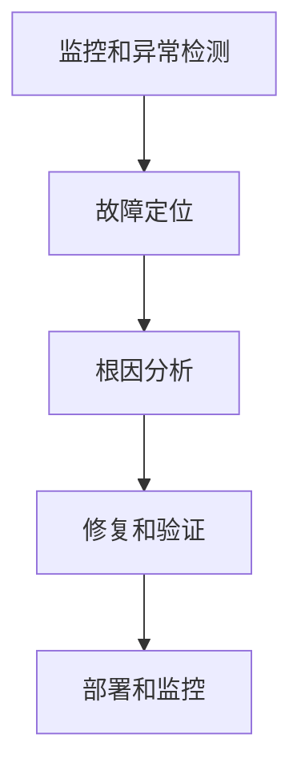

# AI系统故障诊断原理与代码实战案例讲解

## 1.背景介绍

### 1.1 人工智能系统的重要性

在当今时代,人工智能(AI)系统无处不在,从智能助手到自动驾驶汽车,再到医疗诊断和金融预测,AI已经深深融入了我们的日常生活和关键基础设施。随着AI系统的广泛应用,确保其可靠性和稳定性变得至关重要。然而,复杂的AI模型和系统也面临着各种各样的潜在故障和异常情况,这可能导致系统性能下降、不准确的输出、安全隐患,甚至完全失效。

### 1.2 AI系统故障的影响

AI系统故障可能会产生严重的后果,例如:

- **财务损失** - 在金融领域,AI模型的错误预测可能导致巨额投资损失。
- **安全隐患** - 自动驾驶汽车的AI系统故障可能危及生命安全。
- **隐私泄露** - 个人数据可能因AI系统漏洞而被非法访问。
- **生产力下降** - 工业自动化系统的故障可能导致停工和效率低下。

因此,及时发现、诊断和修复AI系统故障对于确保系统的可靠性、安全性和有效性至关重要。

### 1.3 AI系统故障诊断的挑战

诊断AI系统故障面临着许多独特的挑战:

- **黑盒特性** - 许多AI模型(如深度神经网络)是黑盒,内部工作机制难以解释。
- **数据复杂性** - AI系统通常处理大量高维度和非结构化的数据。
- **模型复杂度** - 现代AI模型可能包含数百万甚至数十亿个参数。
- **环境动态性** - AI系统通常在动态环境中运行,输入和条件不断变化。

传统的软件故障诊断技术难以直接应用于AI系统。因此,需要专门设计的AI故障诊断方法和工具来应对这些挑战。

## 2.核心概念与联系

### 2.1 AI系统故障类型

AI系统故障可分为以下几种主要类型:

1. **模型故障** - 由于模型训练不足、数据质量问题或模型设计缺陷导致的错误输出。
2. **数据故障** - 由于输入数据质量差、噪声或异常值导致的错误输出。
3. **系统故障** - 由于硬件故障、软件bug或基础设施问题导致的系统崩溃或性能下降。
4. **安全故障** - 由于对抗性攻击、数据污染或模型提取等安全漏洞导致的故障。

诊断AI系统故障需要全面考虑这些不同类型的故障及其相互影响。

### 2.2 故障诊断流程

AI系统故障诊断通常包括以下关键步骤:



1. **监控和异常检测** - 持续监控系统指标和输出,及时发现异常情况。
2. **故障定位** - 利用各种诊断技术和工具定位故障的具体位置和类型。
3. **根因分析** - 深入分析故障根源,包括数据、模型、系统和安全方面的问题。
4. **修复和验证** - 根据分析结果采取相应的修复措施,并进行全面测试和验证。
5. **部署和监控** - 将修复后的系统重新部署,并持续监控以防止故障再次发生。

### 2.3 故障诊断技术

诊断AI系统故障需要综合运用多种技术,包括但不限于:

- **监控和日志分析** - 收集和分析系统指标、日志和审计跟踪数据。
- **可解释AI** - 使用可解释的AI模型或技术(如LIME、SHAP)解释模型行为。
- **数据质量分析** - 评估输入数据的完整性、一致性、准确性和相关性。
- **模型解释** - 利用可视化和其他技术解释模型内部机制和决策过程。
- **模拟和压力测试** - 在受控环境中模拟各种异常情况和边缘案例。
- **安全分析** - 评估系统对各种攻击(如对抗性攻击)的弹性。

通过有效结合这些技术,可以全面诊断AI系统故障的各个方面。

## 3.核心算法原理具体操作步骤

在本节中,我们将介绍一些核心算法和技术的原理及其在AI系统故障诊断中的具体应用。

### 3.1 异常检测算法

异常检测是故障诊断的第一步,旨在及时发现系统输出或行为异常。常用的异常检测算法包括:

#### 3.1.1 基于统计的异常检测

这类算法通过建立系统正常输出的统计模型,然后检测新输出是否与模型显著偏离。常用算法有:

- **高斯分布模型** - 假设数据服从高斯(正态)分布,异常为分布的极值。
- **核密度估计** - 使用核函数无参数估计数据分布,异常为低概率密度区域。

$$
f(x) = \frac{1}{nh}\sum_{i=1}^{n}K\left(\frac{x-x_i}{h}\right)
$$

其中 $f(x)$ 是核密度估计函数, $K$ 是核函数, $h$ 是带宽参数。

#### 3.1.2 基于距离的异常检测

这类算法通过测量样本与其邻居样本的距离,将孤立样本标记为异常。常用算法有:

- **k-近邻(kNN)** - 如果样本与其 k 个最近邻居的平均距离较大,则标记为异常。
- **局部异常系数(LOF)** - 计算样本相对于其邻居的局部密度偏差,偏差大的为异常。

$$
\text{LOF}_k(p) = \frac{\sum_{q\in N_k(p)}\frac{\text{lrd}_k(q)}{\text{lrd}_k(p)}}{|N_k(p)|}
$$

其中 $N_k(p)$ 是样本 $p$ 的 $k$ 个最近邻居集合, $\text{lrd}_k(p)$ 是 $p$ 的局部可达密度。

#### 3.1.3 基于模型的异常检测

这类算法首先使用正常数据训练模型(如神经网络),然后将模型无法很好重构的样本标记为异常。

例如,可以使用自编码器(AutoEncoder)模型进行异常检测。训练模型最小化正常样本的重构误差,异常样本的重构误差较大。

```python
import torch
import torch.nn as nn

class AutoEncoder(nn.Module):
    def __init__(self, input_dim):
        # ...

    def forward(self, x):
        encoded = self.encoder(x)
        decoded = self.decoder(encoded)
        return decoded

# 训练
criterion = nn.MSELoss()
for epoch in range(num_epochs):
    inputs = ...  # 正常数据批次
    outputs = autoencoder(inputs)
    loss = criterion(outputs, inputs)
    # ...

# 检测异常
with torch.no_grad():
    test_input = ...  # 测试样本 
    test_output = autoencoder(test_input)
    recon_error = criterion(test_output, test_input)
    if recon_error > threshold:
        print('Anomaly detected!')
```

### 3.2 可解释AI技术

可解释AI技术旨在提高AI模型的透明度和可解释性,有助于诊断模型故障的根源。常用技术包括:

#### 3.2.1 LIME

LIME(Local Interpretable Model-Agnostic Explanations)是一种模型不可知的局部解释技术。它通过对输入数据进行扰动并观察模型输出的变化,拟合一个局部可解释的线性模型来解释模型预测。

```python
import lime
import lime.lime_tabular

# 初始化LIME解释器
explainer = lime.lime_tabular.LimeTabularExplainer(
    training_data=X_train,
    mode='classification')

# 解释单个预测
idx = 42  # 样本索引
exp = explainer.explain_instance(
    data_row=X_test[idx],
    predict_fn=model.predict_proba)

# 显示解释
exp.show_in_notebook(show_all=False)
```

#### 3.2.2 SHAP

SHAP(SHapley Additive exPlanations)是一种基于联盟游戏理论的全局解释技术。它计算每个特征对模型预测的贡献值(Shapley值),从而解释模型行为。

```python
import shap

# 计算SHAP值
explainer = shap.TreeExplainer(model)
shap_values = explainer.shap_values(X_test)

# 显示特征重要性
shap.summary_plot(shap_values, X_test)

# 显示单个预测的SHAP值
shap.force_plot(explainer.expected_value, shap_values[idx], X_test.iloc[idx])
```

### 3.3 数据质量分析

评估输入数据的质量对于诊断数据相关故障至关重要。常用技术包括:

#### 3.3.1 缺失值分析

检测并处理缺失值,避免由此导致的错误预测。可以使用统计方法(如均值/中位数插补)或机器学习模型(如多重插补)来填补缺失值。

#### 3.3.2 异常值检测

使用统计或基于模型的方法检测并处理异常值(如离群点),防止它们对模型产生不利影响。

#### 3.3.3 数据偏移检测

监测输入数据分布与训练数据分布之间的偏移,并采取相应措施(如重新收集数据、微调模型等)来缓解偏移带来的负面影响。

```python
from alibi_detect.cd import ClassifierDriftDetector

# 初始化检测器
cd = ClassifierDriftDetector(model, X_train, p_val=.05)  

# 检测数据偏移
preds_new = model.predict(X_new)
is_drift, _ = cd.predict(X_new, preds_new)
```

### 3.4 模型解释与可视化

通过解释和可视化模型内部机制,可以更好地理解模型行为,从而诊断模型故障。

#### 3.4.1 激活最大化

通过优化输入以最大化特定神经元或特征映射的激活值,从而解释这些单元对应捕获的视觉模式。

```python
import innvestigate

# 初始化解释器
analyzer = innvestigate.create_analyzer('lrp.alpha_2_beta_1_rev', model)

# 生成解释
a = innvestigate.util.model_wo_softmax(model)(X_test[0:1])
analysis = analyzer.analyze(a)

# 显示解释(热力图)
import matplotlib.pyplot as plt
plt.imshow(analysis, cmap='seismic', clim=(-1, 1))
```

#### 3.4.2 注意力可视化

对于使用注意力机制的模型(如Transformer),可视化注意力权重以了解模型关注的区域。

```python
import torch

# 前向传播并保存注意力权重
model.eval()
input_ids = ... # 输入序列
attn_weights = []
for layer in model.encoder.layers:
    _, weight = layer.attention.self_attn(input_ids)
    attn_weights.append(weight)

# 可视化注意力权重
import matplotlib.pyplot as plt
fig = plt.figure(figsize=(16, 8))
len_inp = input_ids.size(1)
for i in range(len_inp):
    ax = fig.add_subplot(2, len_inp, i+1)
    ax.matshow(attn_weights[0][0, :, i], cmap='viridis')
    ax.set_title(f"Attention from token {i}")
```

## 4.数学模型和公式详细讲解举例说明

在本节中,我们将介绍一些常用于AI系统故障诊断的数学模型和公式,并通过具体示例说明它们的应用。

### 4.1 高斯混合模型(GMM)

高斯混合模型是一种常用于异常检测的概率模型。它假设数据由多个高斯分布混合而成,每个分布对应一个"簇",异常值属于低概率密度的簇。

GMM的概率密度函数为:

$$
p(x) = \sum_{k=1}^{K} \pi_k \mathcal{N}(x|\mu_k, \Sigma_k)
$$

其中 $K$ 是混合成分的数量, $\pi_k$ 是第 $k$ 个成分的混合系数, $\mathcal{N}(x|\mu_k, \Sigma_k)$ 是第 $k$ 个成分的高斯分布密度函数。

通过期望最大化(EM)