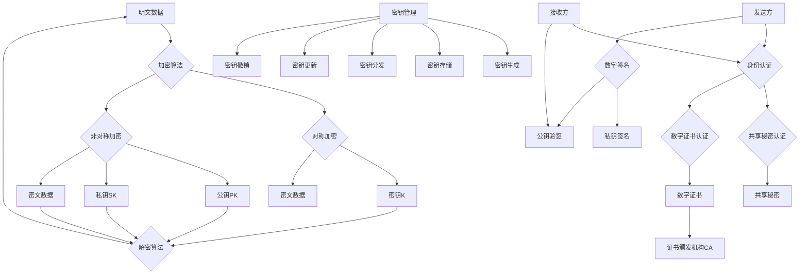

# AI系统数据加密原理与代码实战案例讲解

## 1.背景介绍
### 1.1 数据安全的重要性
在当今数字化时代,数据已经成为各行各业最宝贵的资产之一。企业和组织每天都在收集、存储和处理大量的敏感数据,包括用户个人信息、财务记录、商业机密等。然而,随着网络攻击和数据泄露事件的频发,数据安全问题日益突出,成为困扰企业和用户的重大隐患。保护数据免受未经授权的访问、篡改和窃取,已经成为AI系统乃至整个IT领域的头等大事。

### 1.2 AI系统面临的数据安全挑战
AI系统由于其数据驱动的特性,对数据的依赖程度远高于传统软件系统。机器学习算法需要大量的训练数据来学习和优化模型,而这些数据往往包含敏感信息。此外,AI模型训练完成后,也需要持续收集用户数据来进行预测和决策。因此,AI系统面临着更大的数据安全风险:

1. 训练数据泄露:攻击者可能窃取用于训练AI模型的原始数据集,从而获取敏感信息。 
2. 模型逆向工程:攻击者可能通过分析AI模型的输入输出,推测出模型结构和参数,进而窃取商业机密。
3. 对抗性攻击:攻击者可能刻意构造一些恶意输入数据,误导AI模型做出错误判断,产生安全漏洞。

### 1.3 数据加密技术概述
为了应对数据安全挑战,业界和学界提出了多种数据保护技术,其中最重要的就是数据加密。数据加密是指使用密码学算法,将明文数据转换为密文形式,使得未授权方无法直接读取其内容。只有拥有正确密钥的授权方,才能将密文解密还原为明文。常见的数据加密技术包括:

1. 对称加密:加密和解密使用同一个密钥,如AES、DES等。
2. 非对称加密:加密和解密使用不同的密钥(公钥和私钥),如RSA、ECC等。
3. 哈希函数:将任意长度的数据映射到固定长度的唯一值,可用于验证数据完整性,如SHA-256、MD5等。
4. 同态加密:允许直接对密文进行计算,获得与对明文计算相同的结果,可用于隐私保护计算。

## 2.核心概念与关联
### 2.1 对称加密与非对称加密
对称加密和非对称加密是两大类主要的加密方式,它们的区别在于加密和解密是否使用相同的密钥。

对称加密的加密和解密过程使用同一个密钥。发送方和接收方需要提前共享密钥,以便加密和解密数据。对称加密的优点是算法简单、加解密速度快,适合大量数据的加密场景。缺点是密钥管理困难,如果密钥泄露,所有用此密钥加密的数据都会受到影响。常见的对称加密算法有AES、DES、3DES、RC4等。

非对称加密使用密钥对,包含公钥和私钥。公钥可以公开,用于加密数据;私钥需要保密,用于解密数据。发送方使用接收方的公钥加密数据,接收方使用自己的私钥解密数据。非对称加密的优点是密钥管理相对简单,公钥可以公开分发。缺点是加解密速度慢,不适合大量数据加密。常见的非对称加密算法有RSA、ECC、ElGamal等。

在实践中,对称加密和非对称加密常常结合使用,发挥各自的优势。如先用非对称加密交换会话密钥,再用会话密钥对称加密通信数据。

### 2.2 身份认证与数字签名
身份认证是验证通信实体身份的过程,确保数据发送方是声称的那个人。常见的身份认证方法有:

1. 基于共享秘密的认证:通信双方共享一个秘密信息(如密码),通过交换秘密信息进行身份确认。
2. 基于数字证书的认证:由可信的证书颁发机构(CA)给通信实体颁发数字证书,证书中包含实体的公钥等身份信息。通信时出示数字证书验证身份。

数字签名是使用非对称加密中的私钥对数据进行签名,用于验证数据完整性和发送方身份。发送方使用私钥对数据哈希值签名,接收方使用发送方公钥验证签名,以确认数据未被篡改且来自签名方。

### 2.3 密钥管理与分发
密钥管理是加密系统的核心问题之一,涉及密钥的生成、存储、分发、更新、撤销等全生命周期管理。安全的密钥管理需要保证:

1. 密钥随机性:密钥需要使用安全的随机数生成器生成,避免可预测性。
2. 密钥存储:密钥需要安全存储,如使用硬件安全模块(HSM)、密钥库等。
3. 密钥分发:密钥分发需要使用安全信道,如SSL/TLS,防止密钥泄露。
4. 密钥更新:需要定期更新密钥,以降低密钥泄露风险。
5. 密钥撤销:密钥泄露时,需要能够及时撤销密钥。

### 2.4 Mermaid流程图
以下是对称加密、非对称加密、身份认证、数字签名等核心概念的Mermaid流程图:

## 3.核心算法原理与操作步骤
本节介绍几种常见加密算法的原理和操作步骤,包括AES、RSA、SHA等。

### 3.1 AES算法
AES(Advanced Encryption Standard)是一种对称加密算法,密钥长度可以是128位、192位或256位。AES算法由多轮迭代运算组成,每轮包含4个步骤:

1. 字节替换(SubBytes):使用S盒对每个字节进行非线性替换。
2. 行移位(ShiftRows):对状态矩阵的每一行进行循环移位。 
3. 列混淆(MixColumns):使用固定矩阵对状态矩阵的每一列进行线性变换。
4. 轮密钥加(AddRoundKey):将轮密钥与状态矩阵进行异或运算。

AES加密和解密的操作步骤如下:

加密:
1. 密钥扩展:根据原始密钥生成每一轮的轮密钥。
2. 初始轮密钥加:将明文与初始轮密钥进行异或。 
3. 迭代轮:重复执行字节替换、行移位、列混淆和轮密钥加,轮数取决于密钥长度。
4. 最后一轮:执行字节替换、行移位和轮密钥加,不执行列混淆。

解密:
1. 密钥扩展:根据原始密钥生成每一轮的轮密钥。
2. 初始轮密钥加:将密文与最后一轮轮密钥进行异或。
3. 迭代轮:重复执行逆行移位、逆字节替换、轮密钥加和逆列混淆,轮数取决于密钥长度。
4. 最后一轮:执行逆行移位、逆字节替换和异或初始轮密钥。

### 3.2 RSA算法
RSA是一种非对称加密算法,基于大整数因数分解的数学问题。RSA密钥对包含公钥(n,e)和私钥(n,d),其中n是两个大质数p和q的乘积,e和d满足$ed \equiv 1 \pmod{\phi(n)}$,其中$\phi(n)=(p-1)(q-1)$是欧拉函数。

RSA加密和解密、签名和验签的操作步骤如下:

加密:
1. 获取接收方的公钥(n,e)。
2. 将明文m转化为小于n的整数。
3. 计算密文$c \equiv m^e \pmod{n}$。

解密:
1. 使用私钥(n,d)。
2. 计算明文$m \equiv c^d \pmod{n}$。
3. 将m转化为原始明文。

签名:
1. 使用发送方的私钥(n,d)。
2. 对消息m的哈希值h进行签名,计算签名$s \equiv h^d \pmod{n}$。
3. 将消息m和签名s发送给接收方。

验签:
1. 获取发送方的公钥(n,e)。
2. 对收到的消息m计算哈希值h'。
3. 使用公钥对签名s进行验证,计算$h \equiv s^e \pmod{n}$。
4. 比较h和h',如果相等,则签名有效。

### 3.3 SHA算法
SHA(Secure Hash Algorithm)是一种密码学哈希函数,可以将任意长度的消息映射到固定长度的哈希值。常见的SHA算法有SHA-1、SHA-256等。以SHA-256为例,其操作步骤如下:

1. 消息填充:在消息末尾添加填充比特和长度信息,使消息长度为512比特的整数倍。
2. 初始化哈希值:初始化8个哈希值变量为固定常数。
3. 消息分块:将填充后的消息分割为512比特的块。
4. 对每个消息块进行压缩:
   a. 将消息块扩展为64个32比特字。
   b. 初始化工作变量为当前哈希值。
   c. 进行64轮压缩迭代,使用消息字和常数更新工作变量。
   d. 将压缩结果与当前哈希值相加。
5. 输出最终哈希值:将8个哈希值变量级联,得到256比特的哈希值输出。

## 4.数学模型与公式详解
本节详细讲解加密算法中涉及的数学模型和公式,并给出具体的示例说明。

### 4.1 群、环、域
群、环、域是抽象代数中的基本结构,是理解现代密码学算法的数学基础。

群是一个集合G,配备一个二元运算$\cdot$,满足以下性质:
1. 封闭性:对于任意$a,b \in G$,有$a \cdot b \in G$。
2. 结合律:对于任意$a,b,c \in G$,有$(a \cdot b) \cdot c = a \cdot (b \cdot c)$。
3. 单位元:存在一个元素$e \in G$,使得对于任意$a \in G$,有$a \cdot e = e \cdot a = a$。
4. 逆元:对于任意$a \in G$,存在$b \in G$,使得$a \cdot b = b \cdot a = e$,称b为a的逆元,记为$a^{-1}$。

常见的群有:
- 整数加法群$(\mathbb{Z},+)$
- 实数乘法群$(\mathbb{R}^*,\times)$
- 模n加法群$(\mathbb{Z}_n,+_n)$,其中$+_n$表示模n加法
- 模n乘法群$(\mathbb{Z}_n^*,\times_n)$,其中$\times_n$表示模n乘法,$\mathbb{Z}_n^*$表示模n的可逆元素集合

环是一个集合R,配备两个二元运算$+$和$\times$,满足以下性质:
1. $(R,+)$是一个交换群。
2. $\times$满足结合律,即对于任意$a