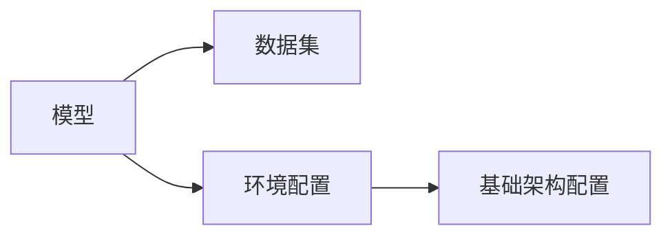

# AI系统配置管理原理与代码实战案例讲解

## 1.背景介绍

在当今快节奏的软件开发环境中,配置管理(Configuration Management)已经成为确保系统高效、可靠和一致运行的关键因素。随着人工智能(AI)系统的兴起和普及,有效管理这些复杂系统的配置变得前所未有的重要。AI系统通常由多个相互依赖的组件组成,包括模型、数据、环境和基础架构等。每个组件都有自己的配置设置,需要精心管理和协调,以确保整个系统的正常运行。

配置管理的目标是建立一个可重复、可追溯和可审计的过程,用于有效地管理系统配置的整个生命周期。它涉及识别、控制、维护和验证系统配置项的过程,以确保它们保持一致且满足预期要求。通过实施适当的配置管理实践,组织可以减少系统故障、提高可靠性、加快部署速度并促进协作。

本文将深入探讨AI系统配置管理的原理和最佳实践,并通过实际案例分析来说明如何在实践中有效应用这些概念。我们将介绍配置管理的核心概念、算法原理、数学模型,并提供代码示例和工具推荐,帮助读者全面了解这一重要主题。

## 2.核心概念与联系

### 2.1 配置项

配置项(Configuration Item,CI)是配置管理的基本单元。它是一个可识别的组件、模块或实体,需要进行单独管理和控制。在AI系统中,配置项可以包括:

- **模型文件**: 存储训练好的AI模型权重和元数据
- **数据集**: 用于训练、测试和评估AI模型的数据
- **环境配置**: 运行AI系统所需的软件依赖项和环境变量
- **基础架构配置**: 部署AI系统所需的计算资源、网络和存储配置

识别和管理这些配置项对于确保AI系统的一致性、可重复性和可追溯性至关重要。

### 2.2 基线

基线是一组经过正式审查和协议的配置项规范,用于在特定时间点作为参考。它定义了系统在该时间点的已知、可接受的配置状态。基线可用于:

- 建立一个已知的良好状态作为参考
- 允许对配置进行受控更改
- 促进系统恢复到已知状态(如出现问题时)
- 支持并行开发和测试活动

在AI系统中,基线可能包括模型版本、数据集版本、环境配置和基础架构配置的特定组合。

### 2.3 变更控制

变更控制是一个有序的过程,用于管理对基线配置所做的任何更改。它包括识别变更请求、评估影响、获取批准、实施变更以及验证和记录变更结果。有效的变更控制有助于降低意外中断的风险,并确保系统配置保持一致和受控状态。

在AI系统中,变更控制尤为重要,因为任何对模型、数据或环境的更改都可能产生意想不到的影响。通过实施严格的变更控制流程,组织可以更好地管理这些变更,降低风险并提高系统的可靠性。

### 2.4 配置审计

配置审计是一种系统性的过程,用于验证系统配置是否符合指定的要求、标准和基线。它包括收集和评估配置数据,以确定配置项的状态,并识别任何偏差或不一致之处。

在AI系统中,配置审计可用于验证模型、数据、环境和基础架构配置是否符合预期,并确保它们保持一致和完整。这对于确保系统的准确性、可重复性和可靠性至关重要。

### 2.5 版本控制

版本控制是跟踪和管理配置项变更的过程。它允许开发人员维护配置项的多个版本,并在需要时切换或回滚到特定版本。版本控制系统通常提供功能,如:

- 存储和检索配置项的历史记录
- 跟踪谁做了什么更改以及更改的原因
- 合并来自多个开发人员的更改
- 标记和标识特定版本以供将来参考

在AI系统中,版本控制对于管理模型、数据集和环境配置文件的变更至关重要。它使团队能够协作开发和迭代这些配置项,同时保持一致性和可追溯性。

这些核心概念相互关联,共同构建了一个全面的配置管理框架,用于有效管理AI系统的复杂配置。接下来,我们将探讨配置管理的核心算法原理和数学模型。

## 3.核心算法原理具体操作步骤

配置管理算法旨在自动化和优化配置管理过程,以提高效率、减少人工错误并确保一致性。以下是一些常见的配置管理算法及其具体操作步骤:

### 3.1 配置项依赖关系分析算法

配置项依赖关系分析算法用于识别和映射配置项之间的依赖关系。这对于理解配置变更的影响、避免意外中断以及确保一致性至关重要。

具体操作步骤如下:

1. **收集配置项元数据**: 收集有关配置项的元数据,包括名称、版本、类型、描述等信息。
2. **构建依赖关系图**: 使用图论概念构建一个依赖关系图,其中节点表示配置项,边表示它们之间的依赖关系。
3. **应用图遍历算法**: 应用图遍历算法(如深度优先搜索或广度优先搜索)来识别每个配置项的直接和间接依赖项。
4. **生成依赖关系报告**: 根据分析结果生成依赖关系报告,列出每个配置项及其依赖项。

这种算法可以帮助管理员在进行配置变更时评估潜在影响,并采取必要的预防措施来避免意外中断。

### 3.2 配置一致性验证算法

配置一致性验证算法用于检查系统配置是否符合预定义的规则和约束。它可以帮助识别配置漂移或不一致,从而确保系统的可靠性和正确性。

具体操作步骤如下:

1. **定义配置规则**: 根据最佳实践、安全性要求和组织政策,定义一组配置规则和约束。
2. **收集配置数据**: 从系统中收集实际配置数据,包括模型、数据、环境和基础架构配置。
3. **应用规则引擎**: 使用规则引擎或约束求解器,将收集的配置数据与预定义的规则和约束进行比较。
4. **生成合规性报告**: 根据验证结果生成合规性报告,列出任何违反规则或约束的配置项。

这种算法可以自动化配置审计过程,并提供及时的反馈,以确保系统配置保持一致和符合标准。

### 3.3 配置变更影响分析算法

配置变更影响分析算法用于评估对系统配置进行更改的潜在影响。它可以帮助管理员做出明智的决策,并采取必要的缓解措施来减轻风险。

具体操作步骤如下:

1. **识别变更请求**: 接收并记录配置变更请求,包括变更描述、原因和预期结果。
2. **构建变更影响图**: 基于配置项依赖关系图,构建一个变更影响图,显示变更请求可能影响的配置项。
3. **评估影响**: 分析变更影响图,评估变更对系统可用性、性能、安全性和合规性的潜在影响。
4. **生成影响报告**: 根据分析结果生成变更影响报告,列出受影响的配置项、风险级别和建议的缓解措施。

通过执行变更影响分析,管理员可以更好地了解变更的后果,并做出明智的决策,以确保变更过程顺利进行,并将风险降至最低。

### 3.4 配置恢复算法

配置恢复算法用于在发生故障或意外情况时,将系统配置恢复到已知的良好状态。这对于确保系统的可用性和连续性至关重要。

具体操作步骤如下:

1. **建立基线**: 在系统运行期间,定期捕获系统配置的快照,并将其存储为已知良好状态的基线。
2. **监控配置变更**: 持续监控对系统配置所做的任何变更,并记录这些变更。
3. **检测故障**: 使用监控和警报系统检测任何系统故障或异常行为。
4. **回滚配置**: 如果检测到故障,使用存储的基线和变更记录,将系统配置回滚到最近的已知良好状态。

通过实施配置恢复算法,组织可以快速响应故障情况,并将系统恢复到正常运行状态,从而最大限度地减少停机时间和业务影响。

这些核心算法为配置管理过程提供了自动化和优化支持,有助于提高效率、减少错误并确保一致性。接下来,我们将探讨配置管理中使用的数学模型和公式。

## 4.数学模型和公式详细讲解举例说明

配置管理过程中使用了多种数学模型和公式,用于描述和优化各种方面。以下是一些常见的数学模型和公式,以及它们在配置管理中的应用:

### 4.1 图论模型

图论是研究图形结构的一个数学分支,在配置管理中被广泛应用于表示和分析配置项之间的依赖关系。

一个图 $G = (V, E)$ 由一组顶点(或节点) $V$ 和一组边 $E$ 组成,其中每条边 $e \in E$ 连接两个顶点。在配置管理中,我们可以将配置项表示为顶点,而依赖关系表示为边。

例如,考虑一个AI系统,其中模型 $M$ 依赖于数据集 $D$ 和环境配置 $E$,而环境配置 $E$ 又依赖于基础架构配置 $I$。我们可以用一个图来表示这些依赖关系,如下所示:

通过构建这种依赖关系图,我们可以应用图遍历算法(如深度优先搜索或广度优先搜索)来识别每个配置项的直接和间接依赖项。这对于评估配置变更的影响、避免意外中断以及确保一致性至关重要。

### 4.2 规则引擎和约束求解

规则引擎和约束求解器是用于表示和验证配置规则和约束的数学模型。它们在配置一致性验证算法中发挥着重要作用。

规则引擎通常使用逻辑编程或基于规则的系统来表示和评估规则。例如,我们可以使用一阶逻辑来表示规则,如:

$$
\forall m \in M, \exists d \in D, e \in E: \text{dependsOn}(m, d) \land \text{dependsOn}(m, e)
$$

这个规则表示,对于每个模型 $m$,都必须存在一个数据集 $d$ 和一个环境配置 $e$,使得模型 $m$ 依赖于它们。

约束求解器则使用约束编程技术来表示和求解约束问题。例如,我们可以使用线性规划来表示和优化资源分配约束,如:

$$
\begin{aligned}
\text{minimize} \quad & \sum_{i=1}^{n} c_i x_i \\
\text{subject to} \quad & \sum_{i=1}^{n} a_{ij} x_i \leq b_j, \quad j = 1, \ldots, m \\
& x_i \geq 0, \quad i = 1, \ldots, n
\end{aligned}
$$

其中 $x_i$ 表示分配给配置项 $i$ 的资源量, $c_i$ 表示相应的成本, $a_{ij}$ 和 $b_j$ 表示资源约束。

通过使用规则引擎和约束求解器,我们可以自动化配置一致性验证过程,并确保系统配置符合预定义的规则和约束。

### 4.3 版本控制模型

版本控制模型用于管理配置项的变更历史和版本。其中一种常见的模型是基于树的版本控制模型,它使用树状结构来表示配置项的版本历史。

在这种模型中,每个节点表示配置项的一个版本,边表示从一个版