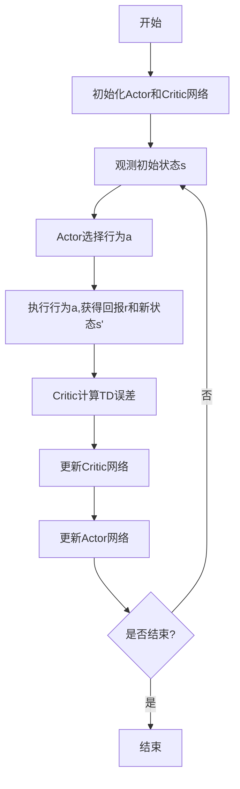

# Actor-Critic 原理与代码实例讲解

## 1.背景介绍

在强化学习领域中,Actor-Critic算法是一种非常重要和流行的算法范式。它结合了价值函数(Value Function)和策略函数(Policy Function)的优势,同时避免了它们各自的缺陷。Actor-Critic算法将智能体(Agent)分为两个部分:Actor和Critic。Actor负责根据当前状态选择行为,而Critic则评估Actor所选行为的质量,并指导Actor朝着获得更高回报的方向更新策略。

Actor-Critic算法源于控制论中的一种思想:将一个复杂系统分解为两个相对简单的部分,一个负责控制(Actor),另一个负责评估(Critic)。在强化学习中,我们将环境视为一个复杂系统,Agent的目标是学习一个最优策略来与环境进行交互并获得最大化的累积回报。

## 2.核心概念与联系

### 2.1 马尔可夫决策过程(MDP)

Actor-Critic算法建立在马尔可夫决策过程(Markov Decision Process, MDP)的框架之上。MDP是一种数学模型,用于描述一个完全可观测的、随机的、顺序决策过程。MDP由以下几个要素组成:

- 状态集合(State Space) $\mathcal{S}$
- 行为集合(Action Space) $\mathcal{A}$
- 转移概率(Transition Probability) $\mathcal{P}_{ss'}^a = \Pr(s_{t+1}=s'|s_t=s,a_t=a)$
- 回报函数(Reward Function) $\mathcal{R}_s^a = \mathbb{E}[r_{t+1}|s_t=s,a_t=a]$
- 折扣因子(Discount Factor) $\gamma \in [0, 1)$

在MDP中,智能体处于某个状态$s_t \in \mathcal{S}$,根据策略$\pi$选择一个行为$a_t \in \mathcal{A}$,然后转移到下一个状态$s_{t+1}$,并获得相应的回报$r_{t+1}$。智能体的目标是学习一个最优策略$\pi^*$,使得期望的累积折扣回报$\sum_{t=0}^{\infty} \gamma^t r_t$最大化。

### 2.2 价值函数(Value Function)

价值函数是对一个状态或状态-行为对的长期价值进行评估。在强化学习中,我们通常定义两种价值函数:

- 状态价值函数(State-Value Function) $V^{\pi}(s) = \mathbb{E}_{\pi}\left[ \sum_{t=0}^{\infty} \gamma^t r_{t+1} | s_0 = s \right]$
- 行为价值函数(Action-Value Function) $Q^{\pi}(s, a) = \mathbb{E}_{\pi}\left[ \sum_{t=0}^{\infty} \gamma^t r_{t+1} | s_0 = s, a_0 = a \right]$

其中,$\pi$表示当前的策略。价值函数可以通过动态规划或者时序差分(Temporal Difference, TD)学习等方法来近似。在Actor-Critic算法中,Critic就是用来估计和学习价值函数的部分。

### 2.3 策略函数(Policy Function)

策略函数$\pi(a|s)$描述了在给定状态$s$下,智能体选择行为$a$的概率分布。我们的目标是找到一个最优策略$\pi^*$,使得期望的累积折扣回报最大化:

$$\pi^* = \arg\max_{\pi} \mathbb{E}_{\pi}\left[ \sum_{t=0}^{\infty} \gamma^t r_{t+1} \right]$$

在Actor-Critic算法中,Actor就是用来学习和优化策略函数的部分。

### 2.4 Actor-Critic算法

Actor-Critic算法将智能体分为两个部分:Actor和Critic。Actor负责根据当前状态选择行为,而Critic则评估Actor所选行为的质量,并指导Actor朝着获得更高回报的方向更新策略。

Actor和Critic之间的交互过程如下:

1. Actor根据当前状态$s_t$和策略$\pi_{\theta}(a|s_t)$选择一个行为$a_t$。
2. 环境根据行为$a_t$转移到下一个状态$s_{t+1}$,并返回即时回报$r_{t+1}$。
3. Critic根据$(s_t, a_t, r_{t+1}, s_{t+1})$计算TD误差(Temporal Difference Error),并更新价值函数$V_{\omega}(s_t)$或$Q_{\omega}(s_t, a_t)$。
4. Actor根据Critic提供的TD误差,更新策略$\pi_{\theta}(a|s_t)$,使得选择的行为能够获得更高的期望回报。

Actor和Critic通过梯度上升(Policy Gradient)和时序差分(Temporal Difference)学习相互促进,最终收敛到一个近似最优的策略和价值函数。

## 3.核心算法原理具体操作步骤

### 3.1 Actor-Critic算法流程

Actor-Critic算法的核心流程如下:

具体步骤如下:

1. 初始化Actor网络(策略函数$\pi_{\theta}(a|s)$)和Critic网络(价值函数$V_{\omega}(s)$或$Q_{\omega}(s, a)$),通常使用神经网络来近似。
2. 从环境中观测初始状态$s_0$。
3. Actor根据当前状态$s_t$和策略$\pi_{\theta}(a|s_t)$选择一个行为$a_t$。
4. 执行选择的行为$a_t$,获得即时回报$r_{t+1}$和新的状态$s_{t+1}$。
5. Critic根据$(s_t, a_t, r_{t+1}, s_{t+1})$计算TD误差:
   - 如果是状态价值函数,TD误差为$\delta_t = r_{t+1} + \gamma V_{\omega}(s_{t+1}) - V_{\omega}(s_t)$。
   - 如果是行为价值函数,TD误差为$\delta_t = r_{t+1} + \gamma \max_{a'}Q_{\omega}(s_{t+1}, a') - Q_{\omega}(s_t, a_t)$。
6. 使用TD误差$\delta_t$更新Critic网络,最小化均方误差(Mean Squared Error, MSE):
   - 对于状态价值函数,目标是最小化$\mathcal{L}_V(\omega) = \mathbb{E}\left[ \left( V_{\omega}(s_t) - y_t^V \right)^2 \right]$,其中$y_t^V = r_{t+1} + \gamma V_{\omega}(s_{t+1})$。
   - 对于行为价值函数,目标是最小化$\mathcal{L}_Q(\omega) = \mathbb{E}\left[ \left( Q_{\omega}(s_t, a_t) - y_t^Q \right)^2 \right]$,其中$y_t^Q = r_{t+1} + \gamma \max_{a'}Q_{\omega}(s_{t+1}, a')$。
7. 使用TD误差$\delta_t$更新Actor网络,最大化期望回报:
   - 对于状态价值函数,目标是最大化$\mathcal{J}(\theta) = \mathbb{E}\left[ V_{\omega}(s_t) \right]$。
   - 对于行为价值函数,目标是最大化$\mathcal{J}(\theta) = \mathbb{E}\left[ Q_{\omega}(s_t, a_t) \right]$。
8. 重复步骤3-7,直到达到终止条件(如最大回合数或收敛)。

### 3.2 策略梯度(Policy Gradient)

Actor网络的更新通常使用策略梯度(Policy Gradient)方法。策略梯度的目标是最大化期望回报$\mathcal{J}(\theta) = \mathbb{E}_{\pi_{\theta}}\left[ \sum_{t=0}^{\infty} \gamma^t r_{t+1} \right]$。根据策略梯度定理,我们可以计算$\nabla_{\theta}\mathcal{J}(\theta)$:

$$\nabla_{\theta}\mathcal{J}(\theta) = \mathbb{E}_{\pi_{\theta}}\left[ \sum_{t=0}^{\infty} \nabla_{\theta}\log\pi_{\theta}(a_t|s_t)Q^{\pi_{\theta}}(s_t, a_t) \right]$$

其中,$Q^{\pi_{\theta}}(s_t, a_t)$是在策略$\pi_{\theta}$下的行为价值函数。由于期望的计算通常是不可行的,我们可以使用蒙特卡罗采样(Monte Carlo Sampling)或时序差分(Temporal Difference)等方法来近似计算梯度。

常见的策略梯度方法包括:

- REINFORCE: 使用蒙特卡罗采样估计$Q^{\pi_{\theta}}(s_t, a_t)$。
- Actor-Critic: 使用Critic网络估计$Q^{\pi_{\theta}}(s_t, a_t)$或$V^{\pi_{\theta}}(s_t)$。
- Advantage Actor-Critic (A2C): 使用优势函数(Advantage Function)$A^{\pi_{\theta}}(s_t, a_t) = Q^{\pi_{\theta}}(s_t, a_t) - V^{\pi_{\theta}}(s_t)$代替$Q^{\pi_{\theta}}(s_t, a_t)$,减小方差。

### 3.3 时序差分(Temporal Difference)

Critic网络的更新通常使用时序差分(Temporal Difference, TD)方法。TD方法基于贝尔曼方程(Bellman Equation)来估计价值函数。

对于状态价值函数$V^{\pi}(s)$,贝尔曼方程为:

$$V^{\pi}(s) = \mathbb{E}_{\pi}\left[ r_{t+1} + \gamma V^{\pi}(s_{t+1}) | s_t = s \right]$$

对于行为价值函数$Q^{\pi}(s, a)$,贝尔曼方程为:

$$Q^{\pi}(s, a) = \mathbb{E}_{\pi}\left[ r_{t+1} + \gamma \max_{a'}Q^{\pi}(s_{t+1}, a') | s_t = s, a_t = a \right]$$

TD方法通过不断缩小价值函数估计值与贝尔曼方程右边的差异(TD误差)来更新价值函数。常见的TD方法包括:

- TD(0): 使用单步TD误差$\delta_t = r_{t+1} + \gamma V(s_{t+1}) - V(s_t)$更新$V(s_t)$。
- TD($\lambda$): 使用$\lambda$-return(一种加权平均的n步TD误差)更新$V(s_t)$。
- Q-Learning: 使用TD误差$\delta_t = r_{t+1} + \gamma \max_{a'}Q(s_{t+1}, a') - Q(s_t, a_t)$更新$Q(s_t, a_t)$。

TD方法通常与函数逼近(如神经网络)结合使用,以估计复杂环境下的价值函数。

## 4.数学模型和公式详细讲解举例说明

### 4.1 马尔可夫决策过程(MDP)

马尔可夫决策过程(Markov Decision Process, MDP)是强化学习的基础数学模型。MDP由一个五元组$(\mathcal{S}, \mathcal{A}, \mathcal{P}, \mathcal{R}, \gamma)$定义,其中:

- $\mathcal{S}$是状态集合,表示环境的所有可能状态。
- $\mathcal{A}$是行为集合,表示智能体在每个状态下可以采取的行为。
- $\mathcal{P}_{ss'}^a = \Pr(s_{t+1}=s'|s_t=s,a_t=a)$是转移概率,表示在状态$s$下采取行为$a$后,转移到状态$s'$的概率。
- $\mathcal{R}_s^a = \mathbb{E}[r_{t+1}|s_t=s,a_t=a]$是回报函数,表示在状态$s$下采取行为$a$后,获得的期望即时回报。
- $\gamma \in [0, 1)$是折扣因子,用于权衡未来回报的重要性。

在MDP中,智能体的目标是找到一个最优策略$\pi^*$,使得期望的累积折扣回报$\sum_{t=0}^{\infty} \gamma^t r_t$最大化。

### 4.2 价值函数(Value Function)

价值函数是对一个状态或状态-行为