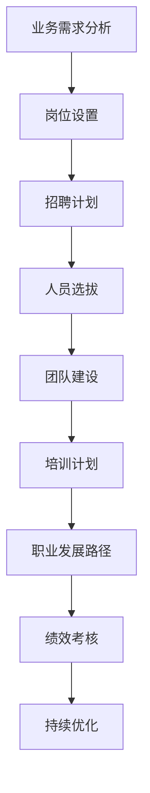

# App电商业务团队规划和人员规划与人员培养计划

## 1.背景介绍

### 1.1 电商行业概况

随着互联网和移动互联网的飞速发展,电子商务行业正在蓬勃发展。电子商务(E-commerce)是指通过互联网、移动互联网等信息网络进行商品交易活动和相关服务活动的一种新型商业运营模式。它打破了传统商业活动的时空限制,为消费者提供了更加便捷、高效的购物体验。

电商行业可分为多种类型,包括:

- B2C(Business to Customer):企业对个人消费者销售商品或服务
- C2C(Customer to Customer):个人与个人之间的交易
- B2B(Business to Business):企业与企业之间的交易
- O2O(Online to Offline):线上线下相结合的商业模式

### 1.2 移动电商(App电商)的兴起

随着智能手机的普及和移动互联网的高速发展,移动电商(App电商)应运而生并快速崛起。移动电商是指通过移动终端设备(如手机、平板电脑等)进行商品交易的一种电子商务形式。相比传统的PC端电商,移动电商具有以下优势:

- 无处不在的购物体验
- 个性化推荐和精准营销
- 支付便捷,交互体验好
- 社交分享和口碑营销

因此,移动电商正在成为电商行业的发展重心。构建高效的App电商业务团队,实施科学的人员规划和培养计划,对于企业抓住移动电商红利至关重要。

## 2.核心概念与联系

### 2.1 App电商业务团队

App电商业务团队是指专门负责移动应用(App)电子商务业务的跨职能团队,通常包括以下几个核心岗位:

- 产品经理
- 移动前端开发工程师
- 移动后端开发工程师
- 测试工程师
- 运维工程师
- 数据分析师
- 视觉设计师
- 运营人员

这些岗位相互协作,共同推进App电商业务的发展。

### 2.2 人员规划

人员规划是指根据企业发展战略和业务需求,科学合理地配置人力资源的过程。良好的人员规划可以:

- 确保团队拥有所需的人才和技能
- 优化人力资源的配置和使用
- 控制人力成本,提高效率
- 为员工职业发展制定路径

### 2.3 人员培养计划

人员培养计划是指为了提升团队整体能力,对现有员工进行系统培训和发展的计划。人员培养计划应当包括:

- 技能培训
- 职业生涯规划
- 导师制度
- 内部分享机制
- 外部学习资源

通过有效的人员培养计划,企业可以提高员工的专业水平和工作绩效,增强团队的凝聚力和创新力。

## 3.核心算法原理具体操作步骤

构建高效的App电商业务团队,制定科学的人员规划和培养计划,需要遵循一定的原理和步骤。以下是核心算法原理和具体操作步骤:



### 3.1 业务需求分析

第一步是全面分析App电商业务的发展需求,包括:

- 业务发展目标和战略
- 预期用户规模和增长趋势
- 所需的产品和服务功能
- 技术架构和基础设施需求

根据需求分析结果,确定团队的整体规模和岗位结构。

### 3.2 岗位设置

根据业务需求,设置App电商业务团队所需的岗位,明确每个岗位的职责、所需技能和人员配备数量。常见岗位包括:

- 产品经理
- 移动开发工程师
- 测试工程师
- 运维工程师
- 数据分析师
- 视觉设计师
- 运营人员

### 3.3 招聘计划

制定科学的招聘计划,包括:

- 确定招聘渠道和方式
- 设置招聘标准和要求
- 制定招聘流程和时间表
- 预算招聘成本和人力资源

### 3.4 人员选拔

根据岗位要求,通过笔试、面试等方式选拔合格的人员,重点考察其专业技能、经验背景、团队合作能力等。

### 3.5 团队建设

组建高效的App电商业务团队,包括:

- 明确团队目标和责任分工
- 建立高效的沟通协作机制
- 培养团队文化和凝聚力
- 提供必要的工具和资源支持

### 3.6 培训计划

制定全面的培训计划,包括:

- 新员工入职培训
- 专业技能培训
- 管理能力培训
- 跨职能交叉培训

### 3.7 职业发展路径

为员工制定清晰的职业发展路径,包括:

- 技术路线和管理路线
- 晋升标准和机制
- 个性化职业生涯规划

### 3.8 绩效考核

建立科学的绩效考核体系,包括:

- 设置关键绩效指标(KPI)
- 定期绩效评估和反馈
- 绩效薪酬激励机制

### 3.9 持续优化

根据业务发展和团队实际情况,持续优化人员规划和培养计划,包括:

- 定期审查和调整
- 引入新技术和新理念
- 加强内部分享和交流

通过不断优化,确保团队的高效运转和可持续发展。

## 4.数学模型和公式详细讲解举例说明

在人员规划和培养计划中,我们可以借助一些数学模型和公式来量化分析和优化决策。以下是一些常见的数学模型和公式:

### 4.1 队伍规模估算模型

估算所需的团队规模是人员规划的关键环节。我们可以使用以下公式估算所需的人员数量:

$$
N = \frac{W}{P}
$$

其中:

- $N$ 表示所需的人员数量
- $W$ 表示预期的总工作量
- $P$ 表示单个员工的平均工作效率

工作量 $W$ 可以根据业务需求和产品规模进行估算,而工作效率 $P$ 则需要基于历史数据和行业经验进行评估。

### 4.2 人员成本模型

在制定人员规划时,我们还需要考虑人力成本的因素。人员成本可以使用以下公式计算:

$$
C = \sum_{i=1}^{N} (S_i + B_i)
$$

其中:

- $C$ 表示总人力成本
- $N$ 表示人员数量
- $S_i$ 表示第 $i$ 个员工的薪资
- $B_i$ 表示第 $i$ 个员工的福利和其他附加成本

通过估算总人力成本,我们可以制定合理的预算,并在人员规划中权衡成本和效益。

### 4.3 培训效果评估模型

为了评估培训计划的效果,我们可以使用以下模型:

$$
E = \alpha \times K + \beta \times P
$$

其中:

- $E$ 表示培训的总体效果
- $K$ 表示知识和技能的提升程度
- $P$ 表示员工的工作绩效提升
- $\alpha$ 和 $\beta$ 分别表示知识技能和绩效的权重系数

通过测试和评估,我们可以量化 $K$ 和 $P$ 的值,并根据企业的实际情况调整 $\alpha$ 和 $\beta$ 的权重,从而全面评估培训计划的效果。

以上是一些常见的数学模型和公式,在实际应用中,我们还可以根据具体情况引入更加复杂的模型和算法,以提高人员规划和培养计划的科学性和精准度。

## 5.项目实践:代码实例和详细解释说明

在实际项目中,我们可以利用编程语言和相关框架来实现人员规划和培养计划的自动化和智能化。以下是一个使用 Python 和 pandas 库的简单示例:

```python
import pandas as pd

# 定义岗位信息
positions = {
    'Product Manager': {'required': 2, 'skills': ['Product Planning', 'User Research', 'Agile Development']},
    'Mobile Developer': {'required': 5, 'skills': ['iOS/Android Development', 'RESTful APIs', 'Performance Optimization']},
    'QA Engineer': {'required': 3, 'skills': ['Test Automation', 'Bug Tracking', 'Performance Testing']},
    # 其他岗位信息...
}

# 定义员工信息
employees = [
    {'name': 'Alice', 'position': 'Product Manager', 'skills': ['Product Planning', 'User Research', 'Agile Development']},
    {'name': 'Bob', 'position': 'Mobile Developer', 'skills': ['iOS Development', 'RESTful APIs', 'UI Design']},
    {'name': 'Charlie', 'position': 'QA Engineer', 'skills': ['Test Automation', 'Bug Tracking', 'Performance Testing']},
    # 其他员工信息...
]

# 将员工信息转换为 DataFrame
employees_df = pd.DataFrame(employees)

# 计算每个岗位的缺口
gaps = {}
for position, info in positions.items():
    required = info['required']
    current = len(employees_df[employees_df['position'] == position])
    gaps[position] = required - current

# 输出岗位缺口信息
print('Staffing Gaps:')
for position, gap in gaps.items():
    print(f'{position}: {gap}')

# 根据技能匹配员工和岗位
matched_employees = []
for _, employee in employees_df.iterrows():
    position = employee['position']
    required_skills = positions[position]['skills']
    employee_skills = employee['skills']
    if all(skill in employee_skills for skill in required_skills):
        matched_employees.append(employee)

# 输出匹配的员工信息
print('\nMatched Employees:')
for employee in matched_employees:
    print(f"Name: {employee['name']}, Position: {employee['position']}, Skills: {', '.join(employee['skills'])}")
```

上述代码实现了以下功能:

1. 定义了岗位信息和员工信息的数据结构。
2. 将员工信息转换为 pandas DataFrame 以便进行数据操作。
3. 计算每个岗位的人员缺口,并输出缺口信息。
4. 根据技能要求,匹配合适的员工和岗位,并输出匹配结果。

该示例仅为入门级别,在实际项目中,我们可以使用更加复杂的数据结构和算法,结合机器学习和优化技术,实现更加智能化的人员规划和培养计划系统。

## 6.实际应用场景

科学的人员规划和培养计划在各种规模的企业中都有广泛的应用场景,尤其是在快速发展的互联网和移动互联网行业。以下是一些典型的应用场景:

### 6.1 初创公司

对于初创公司来说,合理的人员规划和培养计划可以帮助他们:

- 控制人力成本,优化资源配置
- 吸引并留住优秀人才
- 建立高效的跨职能协作团队
- 为未来的快速扩张做好人才储备

### 6.2 成长期公司

处于成长期的公司,通常面临着快速扩张和业务转型的挑战。科学的人员规划和培养计划可以帮助他们:

- 根据业务发展需求调整团队结构
- 培养关键岗位的人才梯队
- 提升员工的专业能力和跨领域技能
- 建立有效的绩效考核和激励机制

### 6.3 大型企业

对于大型企业而言,人员规划和培养计划更加系统化和专业化,可以帮助他们:

- 实现人力资源的精细化管理
- 建立统一的培训体系和职业发展通道
- 促进跨部门、跨地区的人才流动和交流
- 培养具有战略眼光的管理人才

### 6.4 互联网公司

互联网公司由于业务发展迅速,对人才需求旺盛且更新换代快,因此更加重视科学的人员规划和培养计划,以:

- 吸引和留住优秀的技术人才
- 建立敏捷高效的产品研发团队
- 培养具有创新思维的领导力人才
- 快速响应新技术和