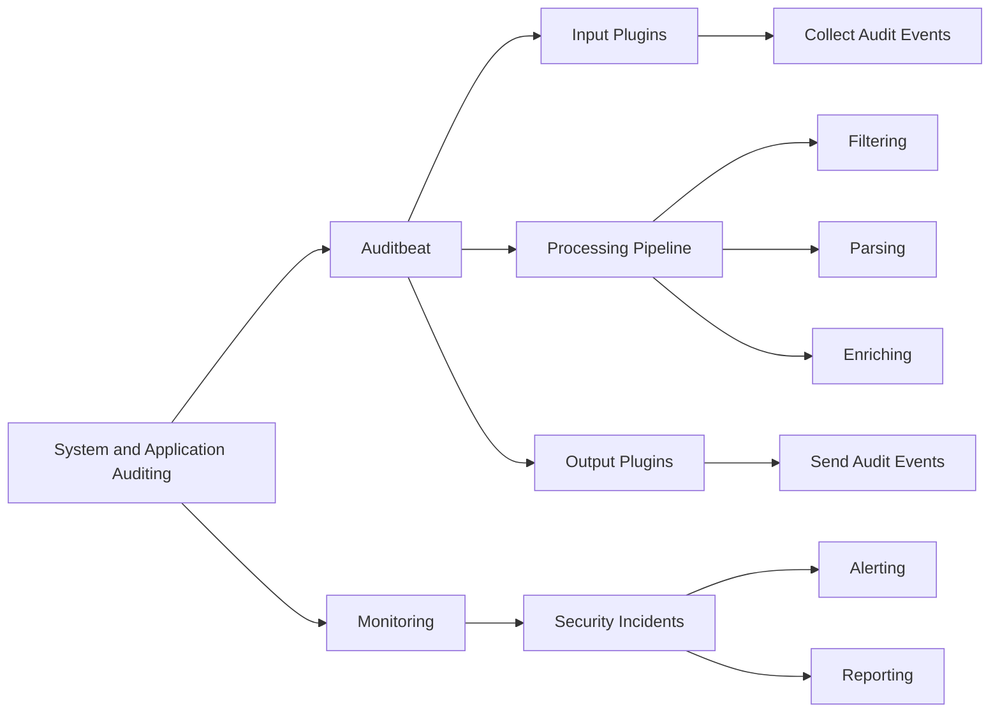

# Auditbeat: Understanding the Principles and Workings of a System and Application Audit Tool

## 1. Background Introduction

In the ever-evolving landscape of information technology, maintaining the security and integrity of systems and applications is paramount. One essential tool in this regard is Auditbeat, an open-source, lightweight, and scalable audit solution developed by Elasticsearch. This article aims to provide a comprehensive understanding of Auditbeat's principles, workings, and practical applications.

### 1.1 Importance of System and Application Auditing

Auditing plays a crucial role in identifying, analyzing, and preventing security threats, ensuring compliance with regulations, and maintaining the overall health of systems and applications.

### 1.2 Brief Overview of Auditbeat

Auditbeat is a lightweight shipper that collects and sends system and application audit events to Elasticsearch for indexing, search, and analysis. It is designed to be flexible, scalable, and easy to integrate with various systems and applications.

## 2. Core Concepts and Connections

### 2.1 Key Components of Auditbeat

- Input plugins: These plugins are responsible for collecting audit events from various sources, such as system logs, applications, and databases.
- Output plugins: These plugins are responsible for sending the collected audit events to Elasticsearch or other destinations.
- Processing pipeline: This pipeline processes the collected audit events, performing tasks such as filtering, parsing, and enriching the data.

### 2.2 Integration with Elasticsearch

Auditbeat integrates with Elasticsearch, a powerful search and analytics engine, to store, search, and analyze the collected audit events. This integration allows for real-time monitoring, alerting, and reporting of security incidents.

## 3. Core Algorithm Principles and Specific Operational Steps

### 3.1 Input Plugin Configuration

Configure input plugins to collect audit events from various sources. This involves specifying the input type, source, and any necessary filters or parsing rules.

### 3.2 Processing Pipeline Configuration

Configure the processing pipeline to perform tasks such as filtering, parsing, and enriching the collected audit events. This can include adding custom fields, normalizing data, and transforming the data into a more useful format.

### 3.3 Output Plugin Configuration

Configure output plugins to send the processed audit events to Elasticsearch or other destinations. This involves specifying the output type, destination, and any necessary settings.

## 4. Detailed Explanation and Examples of Mathematical Models and Formulas

### 4.1 Data Normalization

Data normalization is the process of transforming data into a standard format, making it easier to compare and analyze. This can involve techniques such as scaling, centering, and standardizing the data.

### 4.2 Data Enrichment

Data enrichment is the process of adding additional context or information to the collected audit events. This can include geolocation data, IP address information, and user information.

## 5. Project Practice: Code Examples and Detailed Explanations

### 5.1 Configuring Input Plugins

Provide examples and explanations of how to configure input plugins to collect audit events from various sources.

### 5.2 Configuring the Processing Pipeline

Provide examples and explanations of how to configure the processing pipeline to perform tasks such as filtering, parsing, and enriching the data.

### 5.3 Configuring Output Plugins

Provide examples and explanations of how to configure output plugins to send the processed audit events to Elasticsearch or other destinations.

## 6. Practical Application Scenarios

### 6.1 Monitoring System Logs

Demonstrate how Auditbeat can be used to monitor system logs for security incidents, such as failed login attempts, unauthorized access, and suspicious network activity.

### 6.2 Monitoring Application Logs

Demonstrate how Auditbeat can be used to monitor application logs for security incidents, such as SQL injection attacks, cross-site scripting (XSS) attacks, and unauthorized data access.

## 7. Tools and Resources Recommendations

### 7.1 Official Documentation

Recommend the official Auditbeat documentation for detailed information on configuration, usage, and troubleshooting.

### 7.2 Community Resources

Recommend community resources such as forums, blogs, and GitHub repositories for additional help and support.

## 8. Summary: Future Development Trends and Challenges

### 8.1 Future Development Trends

Discuss potential future developments in the field of system and application auditing, such as the integration of AI and machine learning, real-time threat intelligence, and automation of audit processes.

### 8.2 Challenges and Limitations

Discuss the challenges and limitations faced in the field of system and application auditing, such as data privacy concerns, false positives, and the need for continuous learning and adaptation.

## 9. Appendix: Frequently Asked Questions and Answers

### 9.1 How to Install Auditbeat?

Provide a step-by-step guide on how to install Auditbeat on various platforms, such as Linux, macOS, and Windows.

### 9.2 How to Configure Auditbeat?

Provide a guide on how to configure Auditbeat, including examples of input plugin, processing pipeline, and output plugin configurations.

### 9.3 How to Troubleshoot Common Issues?

Provide a guide on how to troubleshoot common issues that may arise when using Auditbeat, such as connection errors, data parsing issues, and performance issues.

## Conclusion

Auditbeat is a powerful tool for system and application auditing, providing real-time monitoring, alerting, and reporting of security incidents. By understanding its core concepts, algorithms, and practical applications, IT professionals can effectively maintain the security and integrity of their systems and applications.

## Author: Zen and the Art of Computer Programming

---

### Mermaid Flowchart ###

