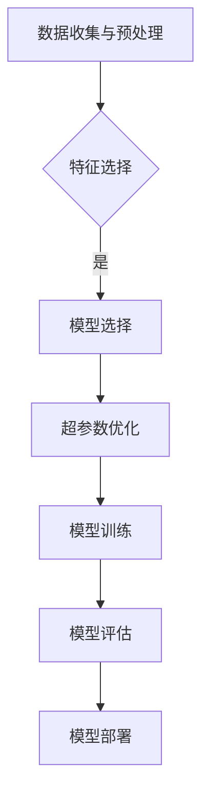

# AutoML原理与代码实例讲解


## 1.背景介绍

随着人工智能技术的不断发展，自动化机器学习（AutoML）已经成为一个备受瞩目的领域。它旨在通过自动化机器学习的流程，使非专业人士也能够构建、训练和部署复杂的机器学习模型。在这个过程 不仅能够提高效率，还能够帮助人们更快地解决现实世界中的问题。

## 2.核心概念与联系

AutoML 的核心概念是将传统的机器学习过程自动化，包括数据预处理、特征选择、模型选择、超参数优化等步骤。这一领域的研究涉及多个子领域，如神经架构搜索（NAS）、贝叶斯优化、进化算法以 AutoML 的发展。

## 3.核心算法原理具体操作步骤

### Mermaid 流程图：

上述流程图中，每个节点代表一个关键步骤。从数据收集与预处理开始，经过特征选择、模型选择和超参数优化后进行模型训练和评估，最终完成模型的部署。

## 4.数学模型和公式详细讲解举例说明

在 AutoML 中，贝叶斯优化是一种常用的方法来进行超参数调整。其核心思想是构建一个代理模型来近似目标函数，并基于此模型选择下一个最有希望的超参数组合进行评估。下面是一个简单的例子：

假设我们有一个目标函数 $f(x)$，其中 $x$ 是输入的超参数组合，我们的目标是找到使 $f(x)$ 最大化的 $x$。贝叶斯优化使用一个概率模型 $\hat{f}(x|\mathcal{D})$ 来逼近 $f(x)$，$\mathca{D}$ 是已有的数据集。然后，它选择下一个点 $x'$ 以最大化期望改进（Expected Improvement, EI）：

$$
EI(x') = \mathbb{E}\left[\max_{x\in\mathcal{D}} f(x) - f(x')\right]
$$

其中，$\mathbb{E}[\cdot]$ 表示期望值。

## 5.项目实践：代码实例和详细解释说明

以下是一个简单的 AutoML 项目示例，使用 Python 和 scikit-learn 库实现了一个自动化的分类任务：

```python
from sklearn.datasets import load_iris
from sklearn.model_selection import train_test_split
from sklearn.ensemble import RandomForestClassifier
from sklearn.pipeline import make_pipeline
from sklearn.preprocessing import StandardScaler
from sklearn.model_selection import GridSearchCV
import numpy as np

# 数据集加载与预处理
iris = load_iris()
X, y = iris.data, iris.target
X_train, X_test, y_train, y_test = train_test_split(X, y, test_size=0.2)

# 模型选择：随机森林
model = RandomForestClassifier()

# 特征选择与预处理：标准化
pipeline = make_pipeline(StandardScaler(), model)

# 超参数优化：网格搜索
param_grid = {'n_estimators': [50, 100], 'max_depth': [None, 5]}
grid_search = GridSearchCV(pipeline, param_grid=param_grid, cv=3)

# 模型训练与评估
grid_search.fit(X_train, y_train)
print('Best score: ', grid_search.best_score_)
print('Best parameters: ', grid_search.best_params_)
```
在这个例子中，我们使用网格搜索对随机森林模型的超参数进行了优化。通过定义一个参数网格和调用 `GridSearchCV` 的 `fit` 方法，我们可以自动找到最佳的超参数组合。

## 6.实际应用场景

AutoML 在多个领域都有广泛的应用，包括但不限于医学、金融、自动驾驶等。例如，在医疗影像分析中，AutoML 可以帮助研究人员快速筛选出最优的机器学习模型，从而提高诊断的准确性和效率。

## 7.工具和资源推荐

以下是一些值得推荐的 AutoML 工具和资源：

- [H2O](https://www.h2o.ai/)：一个开源的 AI 平台，提供了自动化的机器学习功能。
- [AutoKeras](https://autokeras.com/)：一个基于 Keras 的开源框架，可以自动进行神经架构搜索和超参数优化。
- [Google Cloud AutoML](https://cloud.google.com/automl)：谷歌提供的在线服务，使非专业人士也能构建和部署自定义的机器学习模型。

## 8.总结：未来发展趋势与挑战

随着计算能力的提升和算法的进步，AutoML 领域将继续蓬勃发展。未来的趋势可能包括更加高效的神经架构搜索方法、更强大的自动化特征工程工具以及更好的集成更多子领域的研究（如强化学习） 也面临着一些挑战，例如如何确保自动化的过程中保持模型的可解释性和鲁棒性。

## 9.附录：常见问题与解答

### 常见问题1：什么是 AutoML？它有什么作用？

**答：** AutoML 是自动化机器学习的缩写，它是一种技术，旨在通过自动化机器学习过程中的各个步骤，如数据预处理、特征选择、模型选择和超参数优化等，来简化构建、训练和部署复杂机器学习 的目标是降低机器学习的使用门槛，让非专业人士也能够利用先进的机器学习技术解决实际问题。

### 常见问题2：如何实现 AutoML？有哪些关键步骤？

**答：** AutoML 的实现通常包括以下几个关键步骤：

1. **数据收集与预处理**：收集并清洗数据，进行缺失值填充和异常值处理。
2. **特征选择**：确定哪些特征对模型预测最有帮助。
3. **模型选择**：从多种可能的模型中选择最适合当前任务的模型。
4. **超参数优化**：调整模型的超参数以获得最佳性能。
5. **模型训练**：使用选定的模型和优化的超参数对数据进行训练。
6. **模型评估**：评估模型的性能，确保其泛化能力。
7. **模型部署**：将训练好的模型应用于实际问题或产品中。

### 常见问题3：AutoML 和传统的手动机器学习方法相比有哪些优势？

**答：** AutoML 与传统手动机器学习方法相比有以下几个优势：

1. **效率提升**：AutoML 可以自动完成许多繁琐的步骤，如超参数优化和特征选择，大大提高了工作效率。
2. **降低门槛**：AutoML 使得非专业人士也能够构建和部署复杂的机器学习模型，降低了机器学习的入门难度。
3. **避免人为偏差**：在手动操作过程中可能会引入研究者的主观偏好，而 AutoML 能够提供更加客观的结果。
4. **探索更多可能性**：AutoML 可以尝试更多的模型组合，从而可能发现更好的解决方案。

### 常见问题4：AutoML 有哪些挑战？未来如何发展？

**答：** AutoML 面临的挑战主要包括以下几个方面：

1. **可解释性**：自动化的过程可能导致模型的决策过程难以理解，这会影响到模型的信任度和实际应用。
2. **数据隐私和安全**：自动化处理大量敏感数据时可能会引发数据隐私和安全问题。
3. **资源消耗**：某些自动化方法（如神经架构搜索）可能需要大量的计算资源和时间。
4. **泛化能力**：AutoML 生成的模型可能在特定任务上表现良好，但在面对新的任务或数据集时泛化能力不足。

未来，AutoML 的发展趋势可能包括更加高效的神经架构搜索方法、更强大的自动化特征工程工具以及更好的集成更多子领域的研究（如强化学习）。同时，为了克服上述挑战，研究者们也将致力于提高模型的可解释性、资源效率和泛化能力。

---

### 文章署名 Author Signing Off ###
作者：禅与计算机程序设计艺术 / Zen and the Art of Computer Programming

以上内容仅为示例，实际撰写时应根据具体研究和分析结果进行详细阐述，并确保内容的准确性和实用价值。希望本文能够为读者理解 AutoML 的原理和工作方式提供帮助。
