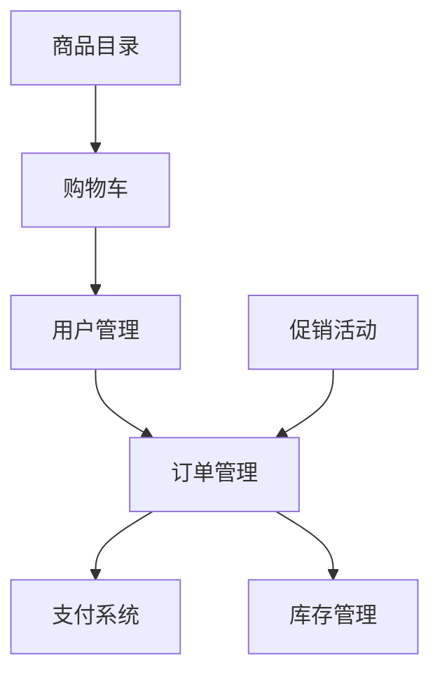

# B2C电子商务平台系统详细设计与具体代码实现

## 1. 背景介绍

### 1.1 电子商务的兴起

随着互联网技术的不断发展和普及,电子商务(E-commerce)已经成为一种全新的商业模式,深刻影响着人们的生活和企业的运营方式。电子商务是指通过互联网等数字化网络进行商品交易和相关服务活动的一种交易方式。

电子商务的出现,打破了传统商业活动的时间和空间限制,为消费者和企业提供了更加便捷、高效的交易渠道。根据交易主体的不同,电子商务可以分为多种类型,其中B2C(Business to Consumer)电子商务是指企业直接面向消费者进行商品销售和服务提供的模式。

### 1.2 B2C电子商务平台的重要性

在当今时代,B2C电子商务平台已经成为企业与消费者之间重要的连接纽带。一个高效、安全、用户友好的B2C电子商务平台,可以为企业带来巨大的商机,提高销售额和品牌知名度。同时,它也为消费者提供了更加丰富、便捷的购物体验。

设计和实现一个优秀的B2C电子商务平台,需要综合考虑多方面的因素,包括系统架构、核心功能、用户体验等。本文将详细探讨B2C电子商务平台的设计与实现,为读者提供全面的技术指导。

## 2. 核心概念与联系

在深入探讨B2C电子商务平台的设计与实现之前,我们需要先了解一些核心概念及其之间的联系。

### 2.1 核心概念

1. **商品目录(Product Catalog)**: 电子商务平台的核心是展示和销售商品,因此商品目录是整个系统的基础。它包括商品的详细信息、分类、价格等数据。

2. **购物车(Shopping Cart)**: 购物车是用户临时存储想要购买的商品的地方,它允许用户在最终结账前查看和修改购物清单。

3. **订单管理(Order Management)**: 订单管理模块负责处理用户下单、付款、发货等流程,是电子商务平台的关键环节。

4. **支付系统(Payment System)**: 支付系统与第三方支付平台(如PayPal、Alipay等)集成,为用户提供安全、便捷的支付渠道。

5. **用户管理(User Management)**: 用户管理模块负责处理用户注册、登录、个人信息管理等功能,确保用户数据的安全性和隐私性。

6. **库存管理(Inventory Management)**: 库存管理系统跟踪商品的库存水平,并根据需求进行补货或者下架操作。

7. **促销活动(Promotions)**: 促销活动模块用于管理各种促销策略,如折扣、优惠券等,吸引用户购买。

### 2.2 核心概念之间的联系

上述核心概念之间存在着紧密的联系,共同构建了一个完整的B2C电子商务平台。用户首先浏览商品目录,将感兴趣的商品加入购物车。当准备结账时,用户需要登录或注册账户,然后进入订单管理流程。在下单时,系统会检查商品库存,如果有货,用户可以选择支付方式并完成支付。如果存在促销活动,系统会自动应用相应的折扣或优惠。最后,订单管理系统会处理发货等后续流程。

通过上图,我们可以清晰地看到各个核心概念之间的关系,它们相互依赖、协同工作,共同构建了一个完整的B2C电子商务平台。

## 3. 核心算法原理具体操作步骤

在B2C电子商务平台的设计与实现过程中,涉及到多种算法和原理,下面我们将重点介绍其中几个核心算法的原理和具体操作步骤。

### 3.1 商品推荐算法

商品推荐算法是电子商务平台中非常重要的一个模块,它能够根据用户的浏览记录、购买历史等数据,为用户推荐感兴趣的商品,提高用户体验和销售转化率。常见的商品推荐算法包括:

1. **协同过滤算法(Collaborative Filtering)**

协同过滤算法是基于用户之间的相似性进行推荐。它的核心思想是:如果两个用户在过去有相似的购买或评价行为,那么他们在未来也可能会对同一商品有相似的偏好。

具体操作步骤如下:

1) 计算用户之间的相似度,常用的方法有基于欧几里得距离、皮尔逊相关系数等。
2) 根据相似度,找到与目标用户最相似的K个邻居用户。
3) 基于这K个邻居用户的历史行为,为目标用户生成推荐列表。

2. **基于内容的推荐算法(Content-based Recommendation)**

基于内容的推荐算法是根据商品的内容特征(如标题、描述、类别等)与用户的历史偏好进行匹配,推荐相似的商品。

具体操作步骤如下:

1) 提取商品的内容特征,通常使用TF-IDF等文本挖掘技术。
2) 构建用户的兴趣模型,表示用户对不同特征的偏好程度。
3) 计算商品特征与用户兴趣模型的相似度,推荐相似度最高的商品。

### 3.2 个性化排序算法

在电子商务平台中,个性化排序算法用于根据用户的偏好和行为,对搜索结果或推荐列表进行个性化排序,提高用户体验。常见的个性化排序算法包括:

1. **基于学习排序的算法(Learning to Rank)**

学习排序算法将个性化排序问题转化为机器学习问题,通过训练数据学习出一个排序模型。

具体操作步骤如下:

1) 收集用户行为数据和相关特征,构建训练数据集。
2) 选择合适的机器学习算法,如LambdaMART、RankNet等。
3) 使用训练数据训练排序模型。
4) 对新的查询结果使用训练好的模型进行个性化排序。

2. **基于线性模型的算法**

线性模型算法将用户、商品和查询的各种特征进行线性组合,得到一个排序分数,然后根据分数对结果进行排序。

具体操作步骤如下:

1) 确定需要考虑的特征,如用户年龄、性别、浏览历史等。
2) 为每个特征赋予权重,构建线性模型。
3) 对新的查询结果,使用线性模型计算排序分数。
4) 根据分数对结果进行排序。

上述算法是B2C电子商务平台中两种核心算法的原理和操作步骤,它们能够显著提高用户体验和销售转化率。在实际应用中,我们还需要根据具体场景进行算法的选择和优化。

## 4. 数学模型和公式详细讲解举例说明

在上一节中,我们介绍了商品推荐算法和个性化排序算法的原理和操作步骤。这些算法背后都涉及到一些数学模型和公式,下面我们将详细讲解其中的几个核心公式。

### 4.1 协同过滤算法中的相似度计算

在协同过滤算法中,计算用户之间的相似度是一个关键步骤。常用的相似度计算方法有欧几里得距离和皮尔逊相关系数。

1. **欧几里得距离**

欧几里得距离用于计算两个向量之间的距离,距离越小,表示两个向量越相似。对于用户 $u$ 和 $v$,它们的欧几里得距离可以表示为:

$$dist(u, v) = \sqrt{\sum_{i=1}^{n}(r_{u,i} - r_{v,i})^2}$$

其中 $n$ 是商品的总数, $r_{u,i}$ 和 $r_{v,i}$ 分别表示用户 $u$ 和 $v$ 对第 $i$ 个商品的评分。

2. **皮尔逊相关系数**

皮尔逊相关系数用于衡量两个变量之间的线性相关程度,取值范围为 $[-1, 1]$。对于用户 $u$ 和 $v$,它们的皮尔逊相关系数可以表示为:

$$sim(u, v) = \frac{\sum_{i=1}^{n}(r_{u,i} - \overline{r_u})(r_{v,i} - \overline{r_v})}{\sqrt{\sum_{i=1}^{n}(r_{u,i} - \overline{r_u})^2}\sqrt{\sum_{i=1}^{n}(r_{v,i} - \overline{r_v})^2}}$$

其中 $\overline{r_u}$ 和 $\overline{r_v}$ 分别表示用户 $u$ 和 $v$ 的平均评分。

### 4.2 TF-IDF在基于内容推荐中的应用

在基于内容的推荐算法中,我们需要提取商品的内容特征,常用的方法是 TF-IDF(Term Frequency-Inverse Document Frequency)。TF-IDF能够衡量一个词对于一个文档的重要程度。

对于一个词 $t$ 和文档 $d$,它们的 TF-IDF 值可以表示为:

$$tfidf(t, d) = tf(t, d) \times idf(t)$$

其中:

- $tf(t, d)$ 表示词 $t$ 在文档 $d$ 中出现的频率,常用的计算方式是:

$$tf(t, d) = \frac{n_{t,d}}{\sum_{t' \in d} n_{t',d}}$$

其中 $n_{t,d}$ 表示词 $t$ 在文档 $d$ 中出现的次数。

- $idf(t)$ 表示词 $t$ 的逆向文档频率,用于衡量词 $t$ 的重要程度,计算公式为:

$$idf(t) = \log\frac{N}{df_t}$$

其中 $N$ 表示文档总数, $df_t$ 表示包含词 $t$ 的文档数量。

通过计算每个词的 TF-IDF 值,我们可以构建商品的特征向量,然后与用户的兴趣模型进行匹配,实现基于内容的推荐。

### 4.3 学习排序算法中的 LambdaMART

LambdaMART 是一种常用的学习排序算法,它基于梯度提升决策树(GBDT)模型,能够有效地处理排序问题。LambdaMART 的目标函数可以表示为:

$$L = \sum_{i=1}^{n}\lambda_i \cdot l(y_i, \hat{y_i})$$

其中:

- $n$ 表示训练样本的数量
- $\lambda_i$ 表示第 $i$ 个样本的权重
- $l(y_i, \hat{y_i})$ 表示第 $i$ 个样本的损失函数,常用的损失函数有平方损失、指数损失等
- $y_i$ 表示第 $i$ 个样本的真实标签
- $\hat{y_i}$ 表示第 $i$ 个样本的预测值

LambdaMART 算法通过迭代地构建多棵决策树,每一棵树都试图减小上一棵树的残差,从而不断优化目标函数。在每一轮迭代中,LambdaMART 会根据样本的梯度值来确定样本的权重 $\lambda_i$,这样能够更好地处理排序问题中的数据不平衡问题。

通过上述数学模型和公式,我们可以更好地理解和实现商品推荐、个性化排序等核心算法,从而提高 B2C 电子商务平台的性能和用户体验。

## 5. 项目实践: 代码实例和详细解释说明

在前面几节中,我们介绍了 B2C 电子商务平台的核心概念、算法原理和数学模型。现在,我们将通过一个具体的项目实践,展示如何使用代码来实现这些功能。

### 5.1 项目概述

我们将构建一个简单的 B2C 电子商务平台,它包括以下核心模块:

1. 商品目录
2. 购物车
3. 订单管理
4. 用户管理
5.