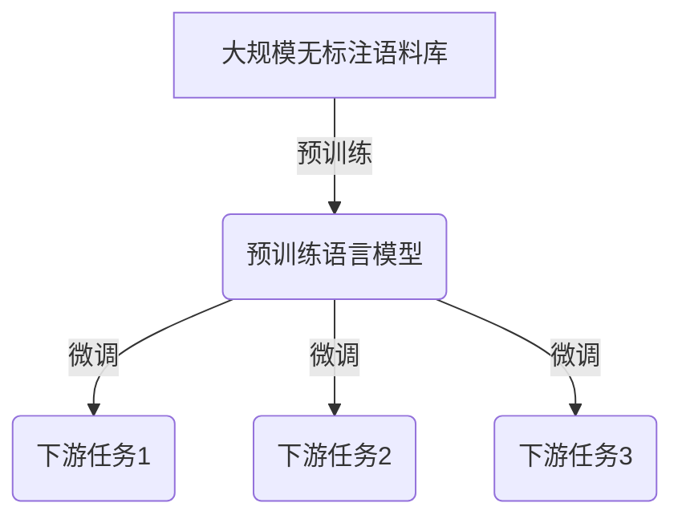
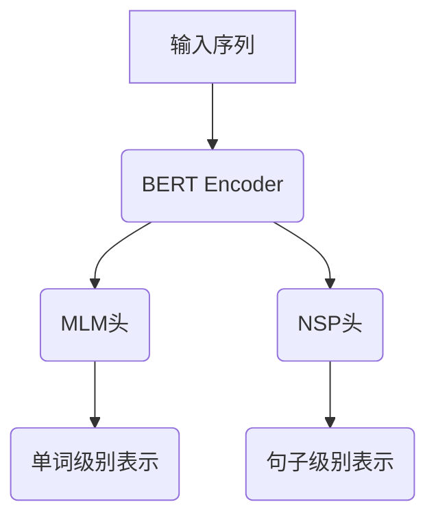
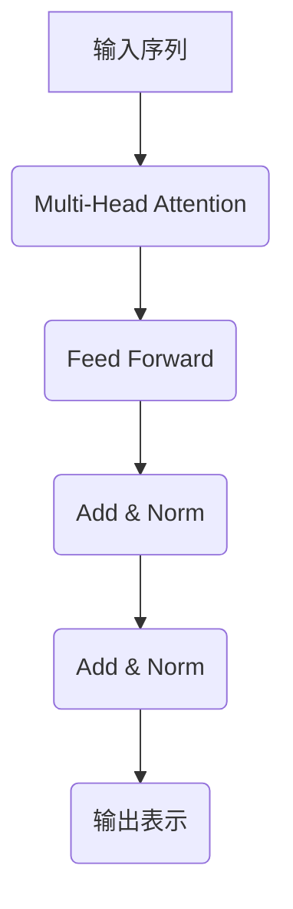

# BERT原理与代码实战案例讲解

## 1.背景介绍

### 1.1 自然语言处理的重要性

在当今的数字时代,自然语言处理(NLP)已经成为了人工智能领域中最重要和最具挑战性的任务之一。随着海量文本数据的爆炸式增长,有效地理解和处理自然语言对于各种应用程序(如机器翻译、聊天机器人、文本分类和问答系统等)至关重要。传统的NLP方法主要依赖于手工设计的特征工程,这种方法往往效率低下且难以捕捉语言的深层语义信息。

### 1.2 神经网络在NLP中的应用

近年来,benefiting from大规模标注数据和强大的计算能力,基于深度学习的神经网络模型在NLP任务中取得了突破性的进展。与传统方法相比,神经网络模型可以自动从数据中学习特征表示,避免了手工设计特征的繁琐过程。值得一提的是,2017年Transformer模型的提出,为序列到序列(Sequence-to-Sequence)建模开辟了新的道路,极大地推动了NLP领域的发展。

### 1.3 BERT模型的重要意义

在这一背景下,2018年Google的AI团队提出了BERT(Bidirectional Encoder Representations from Transformers)模型,这是一种基于Transformer的新型预训练语言模型。BERT在自然语言理解任务中取得了卓越的表现,被广泛应用于各种NLP任务,从而引发了预训练语言模型的热潮。BERT的出现不仅推动了NLP技术的发展,也为其他领域(如计算机视觉和语音识别)的预训练模型研究提供了借鉴。

## 2.核心概念与联系

### 2.1 预训练语言模型

预训练语言模型(Pre-trained Language Model)是一种基于大规模无标注语料库进行通用表示学习的模型。与从头开始训练的方式不同,预训练模型首先在大型语料库上进行预训练,学习通用的语言表示,然后在特定的下游任务上进行微调(fine-tuning),从而将预训练获得的知识迁移到目标任务。这种预训练-微调的范式大大提高了模型的性能和泛化能力。



### 2.2 BERT模型架构

BERT是一种基于Transformer的双向编码器模型,能够同时捕捉序列中每个单词的上下文信息。与传统的单向语言模型(如GPT)不同,BERT采用了Masked Language Model(MLM)和Next Sentence Prediction(NSP)两种预训练任务,分别用于捕捉单词级别和句子级别的表示。



### 2.3 Transformer编码器

Transformer编码器是BERT模型的核心部分,它基于Self-Attention机制,能够有效地捕捉长距离依赖关系。与传统的RNN和CNN不同,Transformer完全依赖于注意力机制,因此具有更好的并行计算能力和更长的依赖捕捉范围。



## 3.核心算法原理具体操作步骤

### 3.1 输入表示

BERT接受一个由单词组成的序列作为输入,每个单词首先被映射到一个embedding向量。为了提供更多的信息,BERT还添加了两种特殊的embedding:位置embedding和段落embedding。位置embedding编码了单词在序列中的位置信息,而段落embedding则表示单词所属的句子或段落。最终,输入表示是这三种embedding的总和。

$$\text{Input Representation} = \text{Word Embedding} + \text{Position Embedding} + \text{Segment Embedding}$$

### 3.2 Masked Language Model (MLM)

MLM是BERT的核心预训练任务之一。在这个任务中,输入序列中的一些单词会被随机掩码(用特殊的[MASK]标记替换),模型的目标是基于上下文预测这些被掩码的单词。通过这种方式,BERT能够学习到双向的语境表示。

具体操作步骤如下:

1. 随机选择输入序列中的15%的单词进行掩码
2. 将80%的掩码单词替换为[MASK]标记,10%替换为随机单词,剩余10%保持不变
3. 通过Transformer编码器对输入序列进行编码,得到每个单词的上下文表示
4. 对于被掩码的单词,使用其上下文表示作为输入,通过一个分类器预测原始单词
5. 最小化预测单词和实际单词之间的交叉熵损失

### 3.3 Next Sentence Prediction (NSP)

NSP是BERT的另一个预训练任务,旨在捕捉句子级别的表示。在这个任务中,模型会接收一对句子作为输入,需要预测第二个句子是否为第一个句子的下一个句子。

具体操作步骤如下:

1. 从语料库中随机选择一对句子(A, B),50%的概率保持原序,50%的概率交换A和B的顺序
2. 将这对句子作为输入传递给Transformer编码器
3. 使用特殊的[CLS]标记的输出表示作为输入,通过一个二分类器预测B是否为A的下一个句子
4. 最小化二分类交叉熵损失

通过MLM和NSP两个预训练任务的联合训练,BERT能够同时学习到单词级别和句子级别的语义表示,从而获得强大的语言理解能力。

## 4.数学模型和公式详细讲解举例说明

### 4.1 Self-Attention机制

Self-Attention是Transformer编码器的核心机制,它允许模型捕捉输入序列中任意两个单词之间的关系。给定一个输入序列$X = (x_1, x_2, \dots, x_n)$,Self-Attention的计算过程如下:

1. 计算Query、Key和Value矩阵:

$$\begin{aligned}
Q &= XW^Q\\
K &= XW^K\\
V &= XW^V
\end{aligned}$$

其中$W^Q, W^K, W^V$是可学习的权重矩阵。

2. 计算注意力分数:

$$\text{Attention}(Q, K, V) = \text{softmax}\left(\frac{QK^T}{\sqrt{d_k}}\right)V$$

其中$d_k$是缩放因子,用于防止内积过大导致的梯度饱和问题。

3. 多头注意力机制:

为了捕捉不同的关系,BERT使用了多头注意力机制,将注意力分数在不同的子空间中计算,然后将结果拼接起来。

$$\text{MultiHead}(Q, K, V) = \text{Concat}(head_1, \dots, head_h)W^O$$
$$\text{where } head_i = \text{Attention}(QW_i^Q, KW_i^K, VW_i^V)$$

其中$W_i^Q, W_i^K, W_i^V$是每个头对应的可学习权重矩阵,$W^O$是用于线性变换的权重矩阵。

通过Self-Attention机制,BERT能够有效地捕捉输入序列中任意两个单词之间的依赖关系,从而学习到更加丰富的语义表示。

### 4.2 位置编码

由于Self-Attention机制没有捕捉序列顺序的能力,BERT引入了位置编码(Positional Encoding)来提供位置信息。位置编码是一个固定的向量序列,其中每个向量对应输入序列中的一个位置。位置编码的计算公式如下:

$$\begin{aligned}
\text{PE}_{(pos, 2i)} &= \sin\left(\frac{pos}{10000^{\frac{2i}{d_\text{model}}}}\right)\\
\text{PE}_{(pos, 2i+1)} &= \cos\left(\frac{pos}{10000^{\frac{2i}{d_\text{model}}}}\right)
\end{aligned}$$

其中$pos$是单词在序列中的位置索引,从0开始计数;$i$是维度索引;$d_\text{model}$是embedding的维度大小。

通过将位置编码与单词embedding相加,BERT能够为每个单词提供其在序列中的位置信息,从而捕捉序列的顺序信息。

## 5.项目实践:代码实例和详细解释说明

在这一部分,我们将通过一个实际的代码示例,展示如何使用BERT进行文本分类任务。我们将使用Hugging Face的Transformers库,这是一个流行的NLP库,提供了对BERT和其他预训练模型的支持。

### 5.1 导入必要的库

```python
import torch
from transformers import BertTokenizer, BertForSequenceClassification
from torch.utils.data import TensorDataset, DataLoader
```

我们首先导入必要的库:PyTorch用于构建神经网络模型,Transformers库用于加载BERT模型和tokenizer。

### 5.2 加载BERT模型和tokenizer

```python
model_name = 'bert-base-uncased'
tokenizer = BertTokenizer.from_pretrained(model_name)
model = BertForSequenceClassification.from_pretrained(model_name, num_labels=2)
```

我们使用`BertTokenizer`将文本序列转换为BERT可以理解的输入形式,并加载预训练的`BertForSequenceClassification`模型。`num_labels=2`表示这是一个二分类任务。

### 5.3 准备数据

```python
texts = [
    "This movie was great!",
    "I didn't enjoy the film.",
    # ...
]
labels = [1, 0, ...]  # 1 for positive, 0 for negative

encoded_data = tokenizer.batch_encode_plus(
    texts,
    max_length=128,
    padding='max_length',
    truncation=True,
    return_tensors='pt'
)

input_ids = encoded_data['input_ids']
attention_masks = encoded_data['attention_mask']
labels = torch.tensor(labels)

dataset = TensorDataset(input_ids, attention_masks, labels)
dataloader = DataLoader(dataset, batch_size=32, shuffle=True)
```

我们准备了一个包含文本和对应标签的数据集。使用`tokenizer.batch_encode_plus`方法将文本序列转换为BERT可以理解的输入形式,包括输入id和注意力掩码。然后,我们创建一个`TensorDataset`并使用`DataLoader`对数据进行批次划分。

### 5.4 训练模型

```python
device = torch.device('cuda' if torch.cuda.is_available() else 'cpu')
model.to(device)

optimizer = torch.optim.Adam(model.parameters(), lr=2e-5)

for epoch in range(3):
    model.train()
    for batch in dataloader:
        batch = tuple(t.to(device) for t in batch)
        input_ids, attention_masks, labels = batch

        outputs = model(input_ids, attention_mask=attention_masks, labels=labels)
        loss = outputs.loss

        loss.backward()
        optimizer.step()
        optimizer.zero_grad()
```

我们将模型移动到GPU或CPU上,并使用Adam优化器进行训练。在每个epoch中,我们遍历数据加载器,将输入传递给BERT模型,计算损失值,并进行反向传播和优化器更新。

### 5.5 评估模型

```python
model.eval()
correct = 0
total = 0

with torch.no_grad():
    for batch in dataloader:
        batch = tuple(t.to(device) for t in batch)
        input_ids, attention_masks, labels = batch

        outputs = model(input_ids, attention_mask=attention_masks)
        _, predicted = torch.max(outputs.logits, 1)

        total += labels.size(0)
        correct += (predicted == labels).sum().item()

accuracy = correct / total
print(f'Accuracy: {accuracy:.2f}')
```

在评估阶段,我们将模型设置为评估模式,并在测试数据集上计算准确率。我们遍历数据加载器,将输入传递给BERT模型,获取预测结果,并与真实标签进行比较,计算准确率。

通过这个示例,您可以看到使用BERT进行文本分类任务是非常简单的。Transformers库提供了便捷的接口,使我们可以轻松加载预训练模型和进行微调。当然,在实际应用中,您可能需要进行更多的数据预处理、超参数调整和模型优化,以获得更好的性能。

## 6