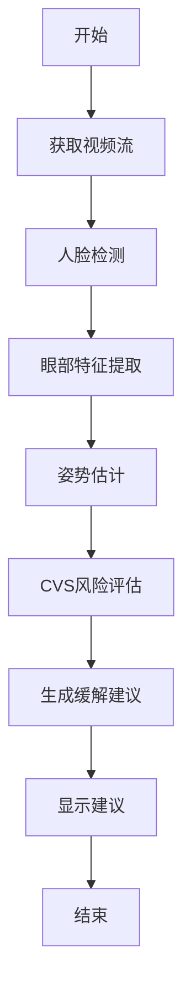

# Computer Vision Syndrome 原理与代码实战案例讲解

## 1. 背景介绍

随着计算机和数字设备的广泛使用,Computer Vision Syndrome(CVS)或称计算机视觉综合症已经成为一种新兴的健康问题。CVS是一种由长时间使用数字设备(如计算机、平板电脑和智能手机)而引起的一系列眼部和视觉相关的症状。常见症状包括眼干、眼酸痛、视觉模糊、头痛和颈部疼痛等。

这种综合症的主要原因是长时间盯着屏幕会导致眼睛疲劳,并可能引发其他身体不适。研究表明,近80%的办公室工作人员和大多数学生都经历过CVS的症状。由于现代生活方式和工作环境的改变,CVS正在逐渐成为一个日益严重的公共健康问题。

## 2. 核心概念与联系

### 2.1 计算机视觉综合症的主要症状

CVS的主要症状包括以下几个方面:

- **眼部不适**: 眼干、眼酸痛、视觉模糊、眼睛疲劳等
- **头部和颈部不适**: 头痛、头晕、颈部僵硬和疼痛
- **整体不适**: 注意力不集中、烦躁、失眠等

这些症状通常会在长时间使用数字设备后出现,并且可能会持续一段时间。

### 2.2 CVS的主要成因

导致CVS的主要原因包括:

1. **眨眼减少**: 长时间盯着屏幕会导致眨眼频率降低,从而引起眼部干燥和疲劳。
2. **眼睛聚焦问题**: 屏幕距离不当或屏幕分辨率较低,会导致眼睛持续聚焦调节,引起眼睛疲劳。
3. **光线问题**: 光线不足或光线反射会增加眼睛负担。
4. **不良姿势**: 长时间保持不良的坐姿或观看角度会导致颈部和背部肌肉紧张。
5. **精神压力**: 长时间高度集中注意力会导致精神紧张和疲劳。

### 2.3 CVS的危害

CVS不仅会影响个人的工作效率和生活质量,如果长期忽视也可能导致一些严重的眼部疾病,如干眼症、视力下降等。因此,采取有效的预防和缓解措施对于减轻CVS的危害至关重要。

## 3. 核心算法原理具体操作步骤

为了有效预防和缓解CVS,我们需要采取一些具体的策略和措施。以下是一种基于计算机视觉技术的CVS检测和缓解算法的核心原理和操作步骤。

### 3.1 算法概述

该算法利用计算机视觉技术来实时监测用户的眼部状态和姿势,并根据检测结果提供个性化的缓解建议。算法的核心思想是通过眼部特征提取和姿态估计来评估CVS风险,并采取相应的干预措施。



### 3.2 具体步骤

1. **获取视频流**:  通过计算机摄像头或外部摄像头获取用户的视频流数据。

2. **人脸检测**: 在视频帧中检测并定位用户的人脸区域。可以使用经典的Viola-Jones人脸检测算法或基于深度学习的人脸检测模型(如MTCNN)。

3. **眼部特征提取**: 在检测到的人脸区域中,进一步检测和定位眼部区域,并提取眼部特征,如眼睛开合状态、眨眼频率、眼球运动轨迹等。可以使用基于形状模型的方法(如AAM)或基于深度学习的方法(如FAN)。

4. **姿势估计**: 根据人脸和眼部的位置信息,估计用户的头部姿势和观看角度。可以使用经典的PnP算法或基于深度学习的姿态估计模型。

5. **CVS风险评估**: 基于提取的眼部特征和姿势信息,评估用户当前的CVS风险程度。可以使用机器学习模型或基于规则的方法对风险进行分级。

6. **生成缓解建议**: 根据评估的CVS风险程度,生成个性化的缓解建议,如提醒用户休息、调整姿势、调整屏幕亮度等。

7. **显示建议**: 将生成的缓解建议以合适的方式显示给用户,如弹出窗口、语音提示等。

8. **持续监测**: 算法会持续监测用户的状态,根据新的数据动态调整风险评估和缓解建议。

该算法的优点是能够实时监测用户的CVS风险,并提供个性化的缓解建议,从而有效预防和缓解CVS症状。同时,算法也可以根据具体应用场景进行定制和优化。

## 4. 数学模型和公式详细讲解举例说明

在上述算法中,有几个关键步骤涉及到数学模型和公式,下面将对它们进行详细讲解。

### 4.1 眼部特征提取

眼部特征提取是CVS检测的核心步骤之一。常用的眼部特征包括:

- 眼睛开合状态
- 眨眼频率
- 眼球运动轨迹

#### 4.1.1 眼睛开合状态检测

眼睛开合状态检测通常基于眼部区域的像素值分布。我们可以使用眼部区域的投影值(Projection Value)来表征眼睛的开合程度。

对于一个给定的眼部区域 $R$,其垂直投影值 $P_v(y)$ 和水平投影值 $P_h(x)$ 可以定义为:

$$
P_v(y) = \sum_{x \in R} I(x, y)
$$

$$
P_h(x) = \sum_{y \in R} I(x, y)
$$

其中 $I(x, y)$ 表示像素 $(x, y)$ 的灰度值。

通过分析投影值的分布,我们可以判断眼睛是否处于开放状态。例如,当垂直投影值在眼部区域中间呈现明显的峰值时,可以认为眼睛是开放的。

#### 4.1.2 眨眼频率估计

眨眼频率是另一个重要的眼部特征,它反映了眼睛疲劳程度。我们可以通过监测眼睛开合状态的变化来估计眨眼频率。

设 $s(t)$ 表示时间 $t$ 时刻眼睛的开合状态,取值为 0 (闭眼)或 1 (睁眼)。眨眼事件可以定义为从睁眼到闭眼再到睁眼的状态转换,即:

$$
B(t) = \begin{cases}
1, & \text{if } s(t-1) = 1, s(t) = 0, s(t+1) = 1\\
0, & \text{otherwise}
\end{cases}
$$

则眨眼频率 $f$ 可以通过统计单位时间内的眨眼事件数量来估计:

$$
f = \frac{1}{T} \sum_{t=1}^{T} B(t)
$$

其中 $T$ 表示观测时间窗口的长度。

#### 4.1.3 眼球运动轨迹估计

眼球运动轨迹可以反映用户的注意力分布和视觉疲劳程度。我们可以使用基于模板匹配或深度学习的方法来估计眼球的位置,并根据位置变化推断出眼球运动轨迹。

设 $\mathbf{p}_t = (x_t, y_t)$ 表示时间 $t$ 时刻眼球的位置,则眼球运动轨迹可以表示为一系列位置点的序列:

$$
\mathcal{T} = \{\mathbf{p}_1, \mathbf{p}_2, \ldots, \mathbf{p}_T\}
$$

通过分析眼球运动轨迹的特征,如轨迹长度、速度变化等,我们可以评估用户的注意力集中程度和视觉疲劳风险。

### 4.2 姿势估计

姿势估计是另一个关键步骤,它可以帮助评估用户的观看角度和姿势是否合理。常用的姿势估计方法包括基于2D特征点的PnP算法和基于3D模型拟合的方法。

#### 4.2.1 基于2D特征点的PnP算法

PnP (Perspective-n-Point) 算法是一种常用的基于2D-3D对应点的姿态估计方法。假设我们已知一组3D点 $\{\mathbf{X}_i\}$ 和它们在图像平面上的对应2D点 $\{\mathbf{x}_i\}$,我们可以通过求解以下方程组来估计相机的姿态 $[R, \mathbf{t}]$:

$$
\mathbf{x}_i = \mathbf{P} \mathbf{X}_i, \quad i = 1, 2, \ldots, n
$$

其中 $\mathbf{P} = \mathbf{K}[\mathbf{R} \; \mathbf{t}]$ 是投影矩阵, $\mathbf{K}$ 是已知的相机内参矩阵。

对于非线性方程组,我们可以使用数值优化算法(如高斯牛顿法)来求解相机姿态 $[R, \mathbf{t}]$。

#### 4.2.2 基于3D模型拟合的方法

另一种常用的姿态估计方法是基于3D模型拟合。我们首先构建一个3D模型(如人脸3D模型),然后通过优化模型参数使其在2D图像上的投影与实际观测值尽可能吻合,从而获得姿态估计结果。

设 $\mathcal{M}(\boldsymbol{\theta})$ 表示参数化的3D模型, $\mathbf{P}$ 是投影矩阵,我们需要求解以下优化问题:

$$
\min_{\boldsymbol{\theta}, \mathbf{P}} \sum_i \left\|\mathbf{x}_i - \mathbf{P} \mathcal{M}(\boldsymbol{\theta})_i\right\|^2
$$

其中 $\{\mathbf{x}_i\}$ 是观测到的2D特征点。通过优化求解模型参数 $\boldsymbol{\theta}$ 和投影矩阵 $\mathbf{P}$,我们可以获得3D模型的姿态估计结果。

这种基于3D模型拟合的方法通常比基于2D特征点的方法更加鲁棒,但计算代价也更高。在实际应用中,我们可以根据具体需求选择合适的方法。

## 5. 项目实践: 代码实例和详细解释说明

为了更好地理解上述算法的实现细节,我们提供了一个基于Python和OpenCV的代码示例。该示例实现了基本的眼部特征提取和姿势估计功能,可以作为进一步开发的基础。

### 5.1 代码结构

```
cvs_detector/
├── main.py
├── utils/
│   ├── __init__.py
│   ├── eye_utils.py
│   ├── face_utils.py
│   └── pose_utils.py
├── models/
│   ├── __init__.py
│   ├── eye_detector.py
│   ├── face_detector.py
│   └── pose_estimator.py
└── README.md
```

- `main.py`: 主程序入口
- `utils/`: 实用程序模块
  - `eye_utils.py`: 眼部特征提取相关函数
  - `face_utils.py`: 人脸检测和关键点提取相关函数
  - `pose_utils.py`: 姿态估计相关函数
- `models/`: 模型模块
  - `eye_detector.py`: 眼部检测器
  - `face_detector.py`: 人脸检测器
  - `pose_estimator.py`: 姿态估计器

### 5.2 关键代码解释

#### 5.2.1 眼部特征提取

```python
# eye_utils.py
import cv2

def extract_eye_features(eye_img):
    """
    提取眼部特征,包括眼睛开合状态、眨眼频率和眼球位置
    """
    # 1. 眼睛开合状态检测
    eye_state = detect_eye_state(eye_img)

    # 2. 