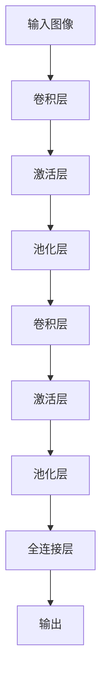
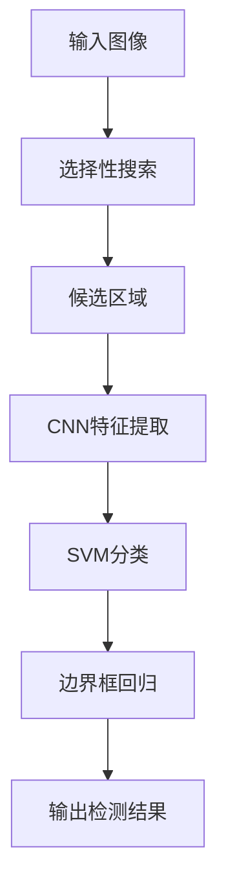
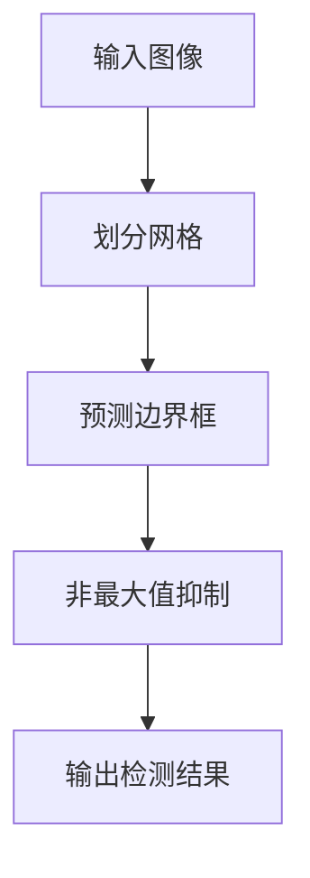
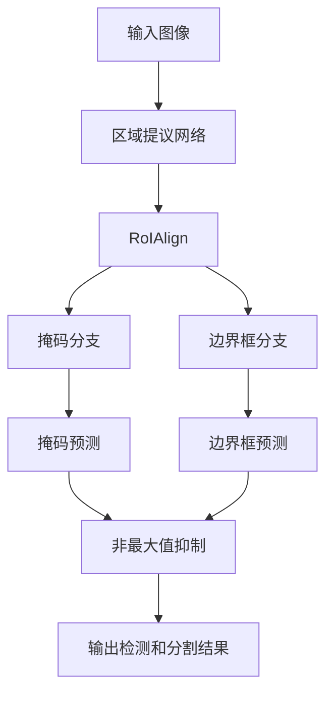

# Computer Vision Techniques 原理与代码实战案例讲解

## 1. 背景介绍

计算机视觉(Computer Vision)是人工智能领域的一个重要分支,旨在使计算机能够从数字图像或视频中获取有意义的高层次信息。随着深度学习技术的不断发展,计算机视觉已经渗透到了我们生活的方方面面,比如自动驾驶汽车、人脸识别、图像分类等领域。本文将探讨计算机视觉的核心概念、算法原理、数学模型,并通过实战案例帮助读者更好地理解和掌握这一领域。

## 2. 核心概念与联系

### 2.1 图像表示

在计算机视觉中,图像被表示为一个二维矩阵,其中每个元素代表一个像素的值。彩色图像通常使用RGB三个通道来表示,每个通道对应一个矩阵。

### 2.2 特征提取

特征提取是计算机视觉的关键步骤,旨在从图像中提取出具有区分性的特征,以便后续的处理和分析。常见的特征提取方法包括边缘检测、角点检测、SIFT、HOG等。

### 2.3 图像分类

图像分类是计算机视觉的一个重要任务,旨在根据图像的特征将其归类到预定义的类别中。常见的分类算法包括支持向量机(SVM)、决策树、随机森林等。

### 2.4 目标检测

目标检测是计算机视觉的另一个重要任务,旨在从图像中定位并识别出感兴趣的目标。常见的目标检测算法包括R-CNN、Fast R-CNN、Faster R-CNN、YOLO等。

### 2.5 语义分割

语义分割是将图像中的每个像素分配到预定义的类别中,通常用于场景理解和自动驾驶等领域。常见的语义分割算法包括FCN、SegNet、U-Net等。

### 2.6 实例分割

实例分割是将图像中的每个像素分配到相应的实例中,通常用于对象检测和跟踪等领域。常见的实例分割算法包括Mask R-CNN、FCIS等。

## 3. 核心算法原理具体操作步骤

### 3.1 卷积神经网络(CNN)

卷积神经网络是计算机视觉中最广泛使用的深度学习模型。它由多个卷积层、池化层和全连接层组成,能够自动从图像中提取特征并进行分类或回归。

卷积层的操作步骤如下:

1. 初始化卷积核(滤波器)的权重
2. 将卷积核在输入特征图上滑动,计算卷积运算
3. 对卷积结果应用激活函数(如ReLU)
4. 将激活后的特征图传递到下一层

池化层的作用是降低特征图的分辨率,减少计算量和过拟合风险。常见的池化操作包括最大池化和平均池化。

全连接层将前面层的特征映射到最终的输出,通常用于分类或回归任务。

在训练过程中,CNN通过反向传播算法更新权重,使模型在训练数据上的损失函数最小化。



### 3.2 区域卷积神经网络(R-CNN)

R-CNN是目标检测领域的一个里程碑式算法,它将目标检测任务分解为两个步骤:

1. 生成候选区域
2. 对每个候选区域进行分类和边界框回归

R-CNN的具体步骤如下:

1. 使用选择性搜索算法生成候选区域
2. 将每个候选区域扭曲成固定大小,输入CNN进行特征提取
3. 将CNN提取的特征输入SVM分类器,判断该区域是否包含目标
4. 对包含目标的区域,使用线性回归器进行边界框回归

R-CNN虽然取得了不错的性能,但速度较慢。后续的Fast R-CNN和Faster R-CNN算法对其进行了改进,提高了检测速度。



### 3.3 You Only Look Once (YOLO)

YOLO是另一种流行的目标检测算法,它将目标检测任务视为一个回归问题,直接从图像像素预测边界框坐标和类别概率。

YOLO的工作原理如下:

1. 将输入图像划分为 S×S 个网格
2. 对于每个网格,预测 B 个边界框及其置信度
3. 将边界框坐标和置信度映射到 0-1 范围内
4. 使用非最大值抑制(NMS)去除重叠的边界框

YOLO的优点是速度快,能够实时处理视频流。但它在小目标检测方面表现不佳。



### 3.4 掩码区域卷积神经网络(Mask R-CNN)

Mask R-CNN是实例分割领域的经典算法,它在Faster R-CNN的基础上增加了一个分支,用于预测每个目标实例的像素级掩码。

Mask R-CNN的工作流程如下:

1. 使用Faster R-CNN的网络结构生成候选区域及其类别和边界框
2. 对每个候选区域,使用RoIAlign层提取对应的特征图
3. 将特征图输入两个并行的全连接层,分别预测掩码和边界框
4. 使用非最大值抑制合并检测结果

Mask R-CNN能够同时完成目标检测和实例分割任务,在许多基准测试中取得了领先的性能。



## 4. 数学模型和公式详细讲解举例说明

### 4.1 卷积运算

卷积运算是CNN中的核心操作,它通过在输入特征图上滑动卷积核,计算局部区域的加权和,从而提取出特征。

设输入特征图为 $I$,卷积核的权重为 $K$,偏置为 $b$,则卷积运算可以表示为:

$$
(I * K)(x, y) = \sum_{m} \sum_{n} I(x+m, y+n) K(m, n) + b
$$

其中 $(x, y)$ 表示输出特征图的坐标,$(m, n)$ 表示卷积核的坐标。

例如,对于一个 $3 \times 3$ 的输入特征图和一个 $2 \times 2$ 的卷积核,卷积运算可以计算如下:

$$
\begin{bmatrix}
1 & 2 & 3\\
4 & 5 & 6\\
7 & 8 & 9
\end{bmatrix} *
\begin{bmatrix}
1 & 2\\
3 & 4
\end{bmatrix} =
\begin{bmatrix}
35 & 45\\
75 & 87
\end{bmatrix}
$$

### 4.2 非最大值抑制

非最大值抑制(Non-Maximum Suppression, NMS)是目标检测和实例分割中常用的后处理步骤,用于去除重叠的边界框或掩码。

NMS的工作原理是:对于每个检测结果,计算其与其他结果的重叠程度(通常使用交并比 IoU),如果重叠程度超过一定阈值,则保留置信度最高的结果,抑制其他结果。

设 $B_1$ 和 $B_2$ 为两个边界框,它们的交集和并集分别为 $A_\text{inter}$ 和 $A_\text{union}$,则它们的 IoU 可以表示为:

$$
\text{IoU}(B_1, B_2) = \frac{A_\text{inter}}{A_\text{union}}
$$

如果 $\text{IoU}(B_1, B_2) > \text{threshold}$,则抑制置信度较低的边界框。

### 4.3 损失函数

在训练CNN模型时,通常使用损失函数来衡量预测结果与真实值之间的差异。常见的损失函数包括交叉熵损失、平方损失等。

对于二分类问题,交叉熵损失可以表示为:

$$
L = -\frac{1}{N} \sum_{i=1}^{N} \left[ y_i \log(p_i) + (1 - y_i) \log(1 - p_i) \right]
$$

其中 $N$ 是样本数量, $y_i$ 是第 $i$ 个样本的真实标签(0或1), $p_i$ 是模型预测的概率。

对于回归问题,常用的损失函数是平方损失:

$$
L = \frac{1}{N} \sum_{i=1}^{N} (y_i - \hat{y}_i)^2
$$

其中 $y_i$ 是第 $i$ 个样本的真实值, $\hat{y}_i$ 是模型预测的值。

在训练过程中,通过反向传播算法计算损失函数对模型参数的梯度,并使用优化算法(如随机梯度下降)更新参数,使损失函数最小化。

## 5. 项目实践: 代码实例和详细解释说明

在本节中,我们将通过一个实际案例来演示如何使用 Python 和 PyTorch 库实现一个简单的图像分类任务。

### 5.1 导入所需库

```python
import torch
import torchvision
import torchvision.transforms as transforms
import torch.nn as nn
import torch.nn.functional as F
import torch.optim as optim
```

### 5.2 准备数据集

我们将使用 PyTorch 内置的 CIFAR10 数据集,它包含 10 个类别的 32x32 彩色图像。

```python
# 定义数据预处理转换
transform = transforms.Compose([
    transforms.ToTensor(),
    transforms.Normalize((0.5, 0.5, 0.5), (0.5, 0.5, 0.5))
])

# 加载训练集和测试集
trainset = torchvision.datasets.CIFAR10(root='./data', train=True, download=True, transform=transform)
trainloader = torch.utils.data.DataLoader(trainset, batch_size=4, shuffle=True, num_workers=2)

testset = torchvision.datasets.CIFAR10(root='./data', train=False, download=True, transform=transform)
testloader = torch.utils.data.DataLoader(testset, batch_size=4, shuffle=False, num_workers=2)
```

### 5.3 定义卷积神经网络模型

我们将定义一个简单的卷积神经网络,包含两个卷积层、两个池化层和一个全连接层。

```python
class Net(nn.Module):
    def __init__(self):
        super(Net, self).__init__()
        self.conv1 = nn.Conv2d(3, 6, 5)
        self.pool = nn.MaxPool2d(2, 2)
        self.conv2 = nn.Conv2d(6, 16, 5)
        self.fc1 = nn.Linear(16 * 5 * 5, 120)
        self.fc2 = nn.Linear(120, 84)
        self.fc3 = nn.Linear(84, 10)

    def forward(self, x):
        x = self.pool(F.relu(self.conv1(x)))
        x = self.pool(F.relu(self.conv2(x)))
        x = x.view(-1, 16 * 5 * 5)
        x = F.relu(self.fc1(x))
        x = F.relu(self.fc2(x))
        x = self.fc3(x)
        return x

net = Net()
```

### 5.4 定义损失函数和优化器

我们将使用交叉熵损失函数和随机梯度下降优化器。

```python
criterion = nn.CrossEntropyLoss()
optimizer = optim.SGD(net.parameters(), lr=0.001, momentum=0.9)
```

### 5.5 训练模型

我们将在训练集上训练模型,并在测试集上评估模型的性能。

```python
for epoch in range(2):  # 循环训练 2 个epoch

    running_loss = 0.0