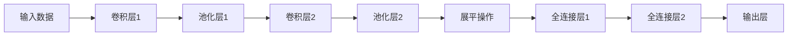

# Convolutional Neural Networks (CNN) 原理与代码实战案例讲解

## 1. 背景介绍

### 1.1 神经网络简介

神经网络是一种受生物神经系统启发而设计的计算模型,旨在模拟人脑的工作原理。它由大量互相连接的节点(神经元)组成,每个节点接收来自其他节点的输入信号,经过加权求和和非线性激活函数的处理后,产生自己的输出信号。神经网络通过学习大量数据样本,自动提取特征并建立输入与输出之间的映射关系。

### 1.2 卷积神经网络(CNN)概述

卷积神经网络(Convolutional Neural Network, CNN)是一种专门用于处理网格结构数据(如图像)的神经网络。CNN在计算机视觉、图像识别、视频分析等领域表现出色,也逐渐扩展到自然语言处理、推荐系统等其他领域。CNN的核心思想是通过卷积操作提取局部特征,并通过池化操作降低特征维度,从而实现对输入数据的有效编码和表示。

## 2. 核心概念与联系

### 2.1 卷积层

卷积层是CNN的核心组成部分,负责从输入数据中提取局部特征。卷积操作通过一个小窗口(卷积核或滤波器)在输入数据上滑动,对每个局部区域进行加权求和,生成一个特征映射(Feature Map)。

卷积层的主要参数包括:

- 卷积核大小:卷积核的高度和宽度,通常为3x3或5x5。
- 步长(Stride):卷积核在输入数据上滑动的步长,控制卷积操作的覆盖范围。
- 填充(Padding):在输入数据周围补零,以控制输出特征映射的空间维度。

### 2.2 池化层

池化层通常紧随卷积层,目的是降低特征维度,减少计算量和过拟合风险。常见的池化操作包括最大池化(Max Pooling)和平均池化(Average Pooling)。池化层通过在输入特征映射上滑动一个小窗口,对窗口内的值进行最大或平均操作,生成一个新的下采样特征映射。

池化层的主要参数包括:

- 池化窗口大小:池化窗口的高度和宽度,通常为2x2。
- 步长(Stride):池化窗口在输入特征映射上滑动的步长。

### 2.3 全连接层

全连接层位于CNN的最后几层,将前面卷积层和池化层提取的高级特征进行整合,并映射到最终的输出(如分类标签)。全连接层的每个神经元与前一层的所有神经元相连,因此参数量较大,计算量也较高。

### 2.4 非线性激活函数

CNN中通常使用非线性激活函数,如ReLU(Rectified Linear Unit)函数,以增加网络的表达能力。非线性激活函数引入了非线性,使网络能够学习更复杂的映射关系。

### 2.5 CNN架构流程图

下面是CNN的典型架构流程图,展示了各个组件之间的连接关系:



## 3. 核心算法原理具体操作步骤

### 3.1 卷积操作

卷积操作是CNN的核心,它通过在输入数据上滑动卷积核,对局部区域进行加权求和,生成一个新的特征映射。具体步骤如下:

1. 初始化卷积核权重,通常使用随机初始化或预训练模型的权重。
2. 在输入数据上滑动卷积核,对每个局部区域进行元素级乘积和求和操作。
3. 将求和结果作为输出特征映射的一个元素。
4. 根据设定的步长,移动卷积核到下一个位置,重复步骤2和3,直到遍历完整个输入数据。
5. 对生成的特征映射应用非线性激活函数,如ReLU函数。

数学表达式:

$$
y_{ij} = \sum_{m}\sum_{n}w_{mn}x_{i+m,j+n} + b
$$

其中,$y_{ij}$是输出特征映射的元素,$w_{mn}$是卷积核的权重,$x_{i+m,j+n}$是输入数据的局部区域,而$b$是偏置项。

### 3.2 池化操作

池化操作用于降低特征维度,减少计算量和过拟合风险。常见的池化操作包括最大池化和平均池化,具体步骤如下:

1. 在输入特征映射上滑动一个小窗口(池化窗口)。
2. 对窗口内的值进行最大或平均操作,生成一个新的下采样特征映射的元素。
3. 根据设定的步长,移动池化窗口到下一个位置,重复步骤2,直到遍历完整个输入特征映射。

数学表达式(最大池化):

$$
y_{ij} = \max_{(m,n)\in R_{ij}}x_{m,n}
$$

其中,$y_{ij}$是输出特征映射的元素,$R_{ij}$是池化窗口在输入特征映射上的区域,$x_{m,n}$是输入特征映射的元素。

### 3.3 前向传播和反向传播

CNN的训练过程遵循前向传播和反向传播的机制:

1. **前向传播**:输入数据经过卷积层、池化层和全连接层的处理,最终得到输出结果。
2. **反向传播**:计算输出结果与真实标签之间的损失函数,并通过反向传播算法,计算每一层的梯度,更新网络权重和偏置项。

反向传播算法通常采用梯度下降方法,如随机梯度下降(SGD)或其变体(如Adam优化器),以最小化损失函数,从而优化网络参数。

## 4. 数学模型和公式详细讲解举例说明

### 4.1 卷积层数学模型

卷积层的数学模型可以表示为:

$$
y_{ij}^l = f\left(\sum_{m}\sum_{n}w_{mn}^{l-1}x_{i+m,j+n}^{l-1} + b^{l-1}\right)
$$

其中:

- $y_{ij}^l$是当前层的输出特征映射的元素
- $x_{i+m,j+n}^{l-1}$是上一层的输入特征映射的局部区域
- $w_{mn}^{l-1}$是卷积核的权重
- $b^{l-1}$是偏置项
- $f$是非线性激活函数,如ReLU函数

**举例说明**:

假设我们有一个3x3的输入特征映射,卷积核大小为2x2,步长为1,无填充。则卷积操作的过程如下:

输入特征映射:

```
1 2 3
4 5 6
7 8 9
```

卷积核权重(假设为):

```
0.1 0.2
0.3 0.4
```

首先,将卷积核置于输入特征映射的左上角,计算加权求和:

$$
(1 \times 0.1) + (2 \times 0.2) + (4 \times 0.3) + (5 \times 0.4) = 2.9
$$

然后,将卷积核向右移动一步,重复计算:

$$
(2 \times 0.1) + (3 \times 0.2) + (5 \times 0.3) + (6 \times 0.4) = 4.1
$$

依此类推,直到遍历完整个输入特征映射,生成一个2x2的输出特征映射。

### 4.2 池化层数学模型

池化层的数学模型可以表示为:

$$
y_{ij}^l = \text{pool}\left(x_{i:i+k,j:j+k}^{l-1}\right)
$$

其中:

- $y_{ij}^l$是当前层的输出特征映射的元素
- $x_{i:i+k,j:j+k}^{l-1}$是上一层的输入特征映射的局部区域,大小为$k \times k$
- $\text{pool}$是池化操作,如最大池化或平均池化

**举例说明**:

假设我们有一个4x4的输入特征映射,池化窗口大小为2x2,步长为2,采用最大池化操作。则池化过程如下:

输入特征映射:

```
1 2 3 4
5 6 7 8
9 10 11 12
13 14 15 16
```

将2x2的池化窗口置于输入特征映射的左上角,计算最大值:

$$
\max\begin{pmatrix}
1 & 2\\
5 & 6
\end{pmatrix} = 6
$$

然后,将池化窗口向右移动两步,重复计算:

$$
\max\begin{pmatrix}
3 & 4\\
7 & 8
\end{pmatrix} = 8
$$

依此类推,直到遍历完整个输入特征映射,生成一个2x2的输出特征映射:

```
6 8
14 16
```

### 4.3 全连接层数学模型

全连接层的数学模型可以表示为:

$$
y^l = f\left(W^{l-1}x^{l-1} + b^{l-1}\right)
$$

其中:

- $y^l$是当前层的输出
- $x^{l-1}$是上一层的输入,通常是将前面卷积层和池化层的输出展平(Flatten)成一维向量
- $W^{l-1}$是权重矩阵
- $b^{l-1}$是偏置向量
- $f$是非线性激活函数,如ReLU或Softmax函数(对于输出层)

**举例说明**:

假设我们有一个全连接层,输入维度为8,输出维度为3,权重矩阵和偏置向量如下:

权重矩阵$W$:

$$
W = \begin{pmatrix}
0.1 & 0.2 & 0.3\\
0.4 & 0.5 & 0.6\\
0.7 & 0.8 & 0.9\\
1.0 & 1.1 & 1.2\\
1.3 & 1.4 & 1.5\\
1.6 & 1.7 & 1.8\\
1.9 & 2.0 & 2.1\\
2.2 & 2.3 & 2.4
\end{pmatrix}
$$

偏置向量$b$:

$$
b = \begin{pmatrix}
0.1\\
0.2\\
0.3
\end{pmatrix}
$$

输入向量$x$:

$$
x = \begin{pmatrix}
1\\
2\\
3\\
4\\
5\\
6\\
7\\
8
\end{pmatrix}
$$

则全连接层的输出$y$为:

$$
y = f(Wx + b)
$$

其中,$f$是非线性激活函数,如ReLU函数。具体计算过程为:

$$
y = \begin{pmatrix}
f(22.1 + 0.1)\\
f(33.2 + 0.2)\\
f(44.3 + 0.3)
\end{pmatrix}
$$

## 5. 项目实践:代码实例和详细解释说明

在本节中,我们将使用Python和PyTorch框架,实现一个基本的CNN模型,并在MNIST手写数字识别任务上进行训练和测试。

### 5.1 导入所需库

```python
import torch
import torch.nn as nn
import torch.optim as optim
import torchvision
import torchvision.transforms as transforms
```

### 5.2 定义CNN模型

```python
class CNN(nn.Module):
    def __init__(self):
        super(CNN, self).__init__()
        self.conv1 = nn.Conv2d(1, 16, kernel_size=3, stride=1, padding=1)
        self.pool = nn.MaxPool2d(kernel_size=2, stride=2)
        self.conv2 = nn.Conv2d(16, 32, kernel_size=3, stride=1, padding=1)
        self.fc1 = nn.Linear(32 * 7 * 7, 128)
        self.fc2 = nn.Linear(128, 10)

    def forward(self, x):
        x = self.pool(nn.functional.relu(self.conv1(x)))
        x = self.pool(nn.functional.relu(self.conv2(x)))
        x = x.view(-1, 32 * 7 * 7)
        x = nn.functional.relu(self.fc1(x))
        x = self.fc2(x)
        return x
```

**代码解释**:

- 我们定义了一个CNN模型类`CNN`,继承自`nn