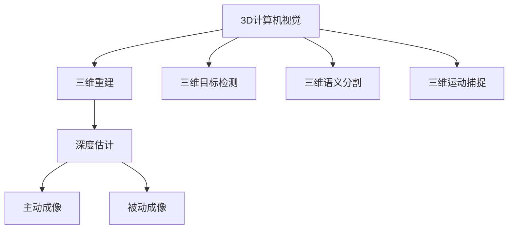
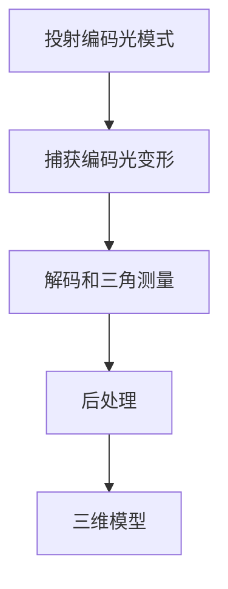
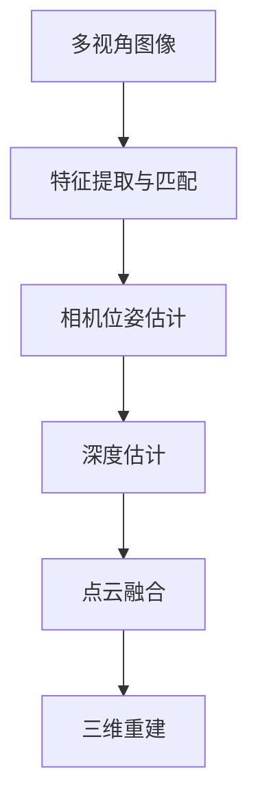
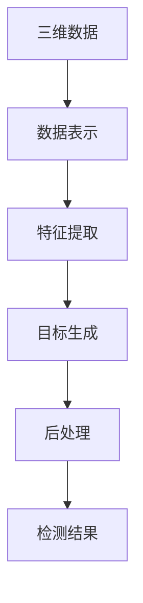

# 3D Computer Vision 原理与代码实战案例讲解

## 1. 背景介绍

三维计算机视觉(3D Computer Vision)是一个跨学科领域,融合了计算机视觉、图形学、机器学习和几何学等多个领域的知识。随着深度学习技术的快速发展,3D计算机视觉已经成为人工智能领域的一个重要研究方向,在无人驾驶、增强现实(AR)、虚拟现实(VR)、机器人技术等诸多领域都有广泛的应用前景。

3D计算机视觉的主要任务是从二维图像或视频数据中重建三维场景的几何和语义信息。这需要解决诸多具有挑战性的问题,如3D重建、3D目标检测、3D语义分割、3D运动捕捉等。相比于传统的2D计算机视觉任务,3D视觉需要处理更加复杂的数据,并且需要更深入地理解场景的几何结构和物体之间的空间关系。

## 2. 核心概念与联系

### 2.1 三维重建

三维重建是3D计算机视觉的核心任务之一,旨在从一个或多个二维图像中估计三维场景的几何结构。常见的三维重建方法包括基于结构光的主动成像技术、基于多视图的被动成像技术等。

### 2.2 三维目标检测

三维目标检测旨在从三维点云或体素数据中检测并定位感兴趣的目标物体。相比于传统的二维目标检测,三维目标检测需要处理更加复杂的数据结构,并且需要考虑物体在三维空间中的姿态和位置。

### 2.3 三维语义分割

三维语义分割是将三维点云或体素数据划分为不同的语义类别,如建筑物、汽车、行人等。这对于理解复杂的三维场景至关重要,是实现高级任务(如自动驾驶)的基础。

### 2.4 三维运动捕捉

三维运动捕捷技术旨在从视频或图像序列中估计人体或物体的三维姿态和运动轨迹。这在虚拟现实、动作捕捷、人机交互等领域有着广泛的应用。

### 2.5 深度估计

深度估计是从单目或多目图像中估计每个像素对应的三维深度值,是实现三维重建的关键步骤之一。深度估计方法包括基于几何的传统方法和基于深度学习的最新方法。

这些核心概念相互关联、相辅相成,共同构建了3D计算机视觉的理论和技术体系。



## 3. 核心算法原理具体操作步骤

### 3.1 基于结构光的主动三维重建

结构光三维重建是一种主动成像技术,通过投射已知的编码光模式(如平行光条纹或散斑投影)到场景中,并从相机观察到的编码光的变形来恢复三维形状。其核心步骤包括:

1. **投射编码光模式**: 使用数字投影仪或激光投射器投射已知的编码光模式到场景中。
2. **捕获编码光变形**: 使用相机捕获编码光在场景中的变形。
3. **解码和三角测量**: 通过对编码光的解码和三角测量,计算每个像素对应的三维坐标。
4. **后处理**: 对重建的三维点云进行滤波、填补等后处理,获得高质量的三维模型。



### 3.2 基于多视图的被动三维重建

被动三维重建技术利用从不同视角捕获的多个二维图像,通过计算机视觉算法来恢复三维场景的几何结构。常见的被动三维重建算法包括:

1. **立体视觉(Stereo Vision)**: 使用两个或多个校准好的相机从不同视角捕获图像,通过计算视差(视差是指同一空间点在两个相机图像上的位移)来估计每个像素的深度值。
2. **结构从运动(Structure from Motion, SfM)**: 从一个或多个相机的运动视频序列中,同时估计相机运动轨迹和场景的三维结构。
3. **多视图立体视觉(Multi-View Stereo, MVS)**: 利用多个校准好的相机从不同视角捕获的图像,通过像素级别的匹配和三角测量来重建高分辨率的三维模型。



### 3.3 基于深度学习的三维目标检测

基于深度学习的三维目标检测算法通常包括以下几个关键步骤:

1. **三维数据表示**: 将三维点云或体素数据转换为适合深度学习模型输入的表示形式,如投影到鸟瞰图(BEV)、球面投影等。
2. **特征提取**: 使用三维卷积神经网络或点云神经网络等模型从三维数据中提取高维特征。
3. **目标生成**: 基于提取的特征,生成目标边界框或关键点等目标表示。
4. **后处理**: 进行非极大值抑制、模型集成等后处理,获得最终的检测结果。



## 4. 数学模型和公式详细讲解举例说明

### 4.1 相机模型与投影几何

在三维计算机视觉中,我们需要建立二维图像平面和三维世界坐标系之间的数学关系。这通常由相机模型和投影几何来描述。

**针孔相机模型**:

针孔相机模型是最简单的相机模型,它假设相机的成像过程可以用一个小孔和一个成像平面来近似。针孔相机模型可以用下面的方程来描述:

$$
\begin{bmatrix}
u\\
v\\
1
\end{bmatrix}
=
\begin{bmatrix}
f_x & 0 & c_x\\
0 & f_y & c_y\\
0 & 0 & 1
\end{bmatrix}
\begin{bmatrix}
X/Z\\
Y/Z\\
1
\end{bmatrix}
$$

其中,$(u,v)$是像素坐标,$(X,Y,Z)$是三维点在相机坐标系下的坐标,$f_x$和$f_y$分别是相机的焦距,$c_x$和$c_y$是主点坐标。

**投影矩阵**:

投影矩阵$\mathbf{P}$将三维点投影到二维图像平面上,它是一个$3\times4$矩阵,包含了相机的内参数和外参数。

$$
\begin{bmatrix}
u\\
v\\
w
\end{bmatrix}
=
\mathbf{P}
\begin{bmatrix}
X\\
Y\\
Z\\
1
\end{bmatrix}
$$

其中,$(X,Y,Z)$是三维点在世界坐标系下的坐标,$(u,v,w)$是投影后的同质坐标。

### 4.2 双线性插值

在三维重建和深度估计中,我们经常需要对离散的数据进行插值,以获得连续的表面或深度图。双线性插值是一种常用的二维插值方法。

设$f(x,y)$是一个二维函数,我们希望在点$(x,y)$处的函数值。双线性插值的思想是,首先在$x$方向上对两个最近的一维函数值进行线性插值,得到一个新的一维函数,然后在$y$方向上对这个新的一维函数进行线性插值,得到最终的插值结果。

双线性插值的公式如下:

$$
f(x,y) = \frac{x_2-x}{x_2-x_1}f(x_1,y_1) + \frac{x-x_1}{x_2-x_1}f(x_2,y_1) + \frac{y_2-y}{y_2-y_1}f(x_1,y_2) + \frac{y-y_1}{y_2-y_1}f(x_2,y_2)
$$

其中,$(x_1,y_1)$、$(x_2,y_1)$、$(x_1,y_2)$、$(x_2,y_2)$是已知的四个网格点,$(x,y)$是待插值的点。

双线性插值在计算机图形学和图像处理中有广泛的应用,如纹理映射、图像缩放等。

## 5. 项目实践: 代码实例和详细解释说明

在这一部分,我们将通过一个基于Python和开源库OpenCV的实例项目,来演示如何实现基于结构光的三维重建。

### 5.1 项目概述

我们将使用一个数字投影仪投射编码光条纹到场景中,并使用相机捕获编码光在场景中的变形。然后,我们将使用OpenCV提供的函数来解码编码光条纹,并通过三角测量计算每个像素对应的三维坐标,最终获得场景的三维点云模型。

### 5.2 硬件设置

我们需要以下硬件:

- 一台带有HDMI输出的计算机
- 一个数字投影仪
- 一个相机(可以是网络摄像头或数码相机)

将投影仪和相机分别连接到计算机,并将它们对准待重建的场景。

### 5.3 代码实现

```python
import cv2
import numpy as np

# 设置相机和投影仪参数
cam_mat = ... # 相机内参数矩阵
proj_mat = ... # 投影仪内参数矩阵
dist_coefs = ... # 相机畸变系数
R, T = ... # 相机和投影仪的相对位姿

# 生成编码光条纹图案
pattern = cv2.structured_light_Pattern.create_sinusoid_pattern(height=480, width=640)

# 投射编码光条纹
proj.write(pattern.array)

# 捕获编码光变形
ret, img = cam.read()

# 解码编码光条纹
undist_pattern = cv2.structured_light_Pattern.create_sinusoid_pattern(height=480, width=640)
undist_img = cv2.undistort(img, cam_mat, dist_coefs)
undist_pattern_img = cv2.undistort(pattern.array, proj_mat, None)

decoded_disp = cv2.structured_light.computeDisparityMap(undist_pattern_img, undist_img, undist_pattern)

# 三角测量计算三维坐标
points_3d = cv2.reprojectImageTo3D(decoded_disp, Q)

# 可视化三维点云
cv2.imshow('3D Point Cloud', points_3d)
```

在上面的代码中,我们首先设置相机和投影仪的内外参数。然后,我们使用OpenCV的`structured_light_Pattern`模块生成编码光条纹图案,并通过投影仪投射到场景中。

接下来,我们使用相机捕获编码光在场景中的变形图像,并使用`cv2.undistort()`函数对图像进行去畸变处理。

然后,我们使用`cv2.structured_light.computeDisparityMap()`函数解码编码光条纹,获得视差图。视差图中的每个像素值对应该像素在两个视图之间的位移。

最后,我们使用`cv2.reprojectImageTo3D()`函数,将视差图转换为三维点云。这个函数需要一个重投影矩阵`Q`,它将像素坐标和视差值映射到三维空间中的点。

我们可以使用OpenCV的`cv2.imshow()`函数可视化生成的三维点云。

### 5.4 结果分析

通过上述代码,我们成功地实现了基于结构光的三维重建。生成的三维点云可以用于进一步的处理和应用,如三维模型重建、三维目标检测等。

然而,需要注意的是,结构光三维重建存在一些局限性,如对表面材质和光照条件的敏感性、重建范围的限制等。在实际应用中,我们可能需要结合其他三维