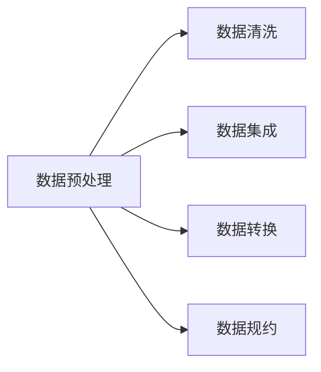

## 1.背景介绍

数据预处理(Data Preprocessing)是数据挖掘、机器学习等领域中不可或缺的一个环节。在实际工作中，原始数据往往包含了噪声、缺失值、异常值，甚至是错误的数据，这些都会对后续的数据分析造成影响。因此，我们需要通过数据预处理的方式，将这些不规范的数据进行清洗和转换，使得数据更加精确、完整、一致和可信。

## 2.核心概念与联系

数据预处理主要包括四个步骤：数据清洗、数据集成、数据转换和数据规约。其中，数据清洗主要是处理数据中的噪声、缺失值和异常值；数据集成是将多个数据库或者数据文件中的数据进行合并；数据转换是将数据转换为适合数据挖掘的形式；数据规约则是对数据进行压缩，以减少数据的规模，提高数据挖掘的效率。



## 3.核心算法原理具体操作步骤

### 3.1 数据清洗

数据清洗主要包括处理缺失值、噪声和异常值。处理缺失值的方法主要有删除记录、数据插补和不处理三种。处理噪声的方法主要有平滑法（如二值化、聚类、回归等）和数据过滤。处理异常值的方法主要有离群点分析。

### 3.2 数据集成

数据集成是将多个数据库或者数据文件中的数据进行合并。在这个过程中，需要注意数据的一致性问题，例如，不同的数据库中，相同的数据可能会有不同的表示方式。

### 3.3 数据转换

数据转换主要是将数据转换为适合数据挖掘的形式。常见的数据转换方法有规范化、离散化和概念分层产生等。

### 3.4 数据规约

数据规约是对数据进行压缩，以减少数据的规模，提高数据挖掘的效率。常见的数据规约方法有属性规约、数值规约、数据立方体聚合和离散化和概念分层产生等。

## 4.数学模型和公式详细讲解举例说明

在数据预处理中，我们经常需要用到一些数学模型和公式。例如，在处理缺失值时，我们可以使用均值插补的方法，即使用属性的平均值来填充缺失值。假设我们有一个属性A，它的值是一个连续的数值，我们可以使用下面的公式来计算属性A的平均值：

$$
\bar{A} = \frac{\sum_{i=1}^{n}A_i}{n}
$$

其中，$A_i$是属性A的第i个值，n是属性A的总数。

另外，在数据转换中，我们经常需要用到规范化。规范化是将属性值缩放到一个指定的范围，常见的规范化方法有最小-最大规范化、z-score规范化和小数定标规范化等。例如，最小-最大规范化的公式如下：

$$
V' = \frac{V - min}{max - min}
$$

其中，V是原始值，V'是规范化后的值，min和max分别是属性值的最小值和最大值。

## 5.项目实践：代码实例和详细解释说明

在Python中，我们可以使用pandas和numpy这两个库来进行数据预处理。下面是一个简单的例子：

```python
import pandas as pd
import numpy as np

# 创建一个包含缺失值的DataFrame
df = pd.DataFrame({'A': [1, 2, np.nan], 'B': [5, np.nan, np.nan], 'C': [1, 2, 3]})

# 使用均值插补法处理缺失值
df.fillna(value=df.mean(), inplace=True)

# 输出处理后的DataFrame
print(df)
```

在这个例子中，我们首先创建了一个包含缺失值的DataFrame，然后使用均值插补法来处理缺失值，最后输出处理后的DataFrame。

## 6.实际应用场景

数据预处理在很多领域都有应用，例如：

- 在金融领域，银行和信用卡公司可以通过数据预处理，清洗和整理客户的交易数据，然后进行数据挖掘，以预测客户的信用风险。
- 在电商领域，电商平台可以通过数据预处理，清洗和整理用户的购物数据，然后进行数据挖掘，以推荐用户可能感兴趣的商品。

## 7.工具和资源推荐

在数据预处理的过程中，我们经常需要用到一些工具和资源，例如：

- Python：Python是一种广泛用于数据科学的编程语言，它有很多用于数据处理的库，如pandas、numpy等。
- Jupyter Notebook：Jupyter Notebook是一个开源的Web应用程序，允许用户创建和共享包含代码、方程、可视化和文本的文档。
- Scikit-learn：Scikit-learn是一个开源的Python机器学习库，提供了很多数据预处理的功能，如缺失值处理、数据规范化等。

## 8.总结：未来发展趋势与挑战

随着数据的增长，数据预处理的重要性也在不断提高。然而，数据预处理也面临着一些挑战，例如，如何处理大规模的数据，如何处理高维度的数据，如何处理复杂的数据等。此外，随着隐私保护的重要性日益提高，如何在数据预处理中保护用户的隐私，也是一个重要的问题。

## 9.附录：常见问题与解答

Q: 数据预处理的目的是什么？
A: 数据预处理的目的是将原始数据转换为更适合数据分析的形式，通过数据清洗、数据集成、数据转换和数据规约等步骤，使得数据更加精确、完整、一致和可信。

Q: 数据预处理的步骤有哪些？
A: 数据预处理主要包括四个步骤：数据清洗、数据集成、数据转换和数据规约。

Q: 如何处理缺失值？
A: 处理缺失值的方法主要有删除记录、数据插补和不处理三种。

Q: 数据预处理在哪些领域有应用？
A: 数据预处理在很多领域都有应用，例如金融、电商、医疗、教育等。

作者：禅与计算机程序设计艺术 / Zen and the Art of Computer Programming
