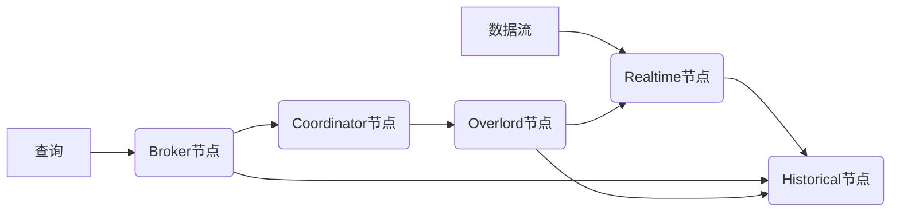
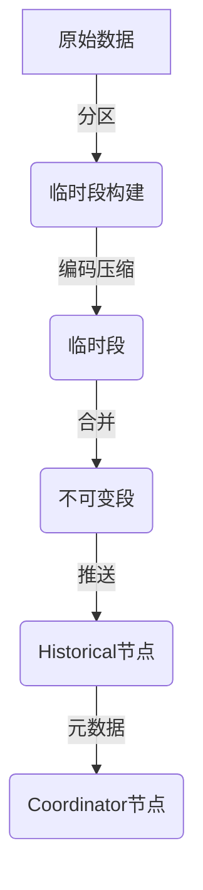
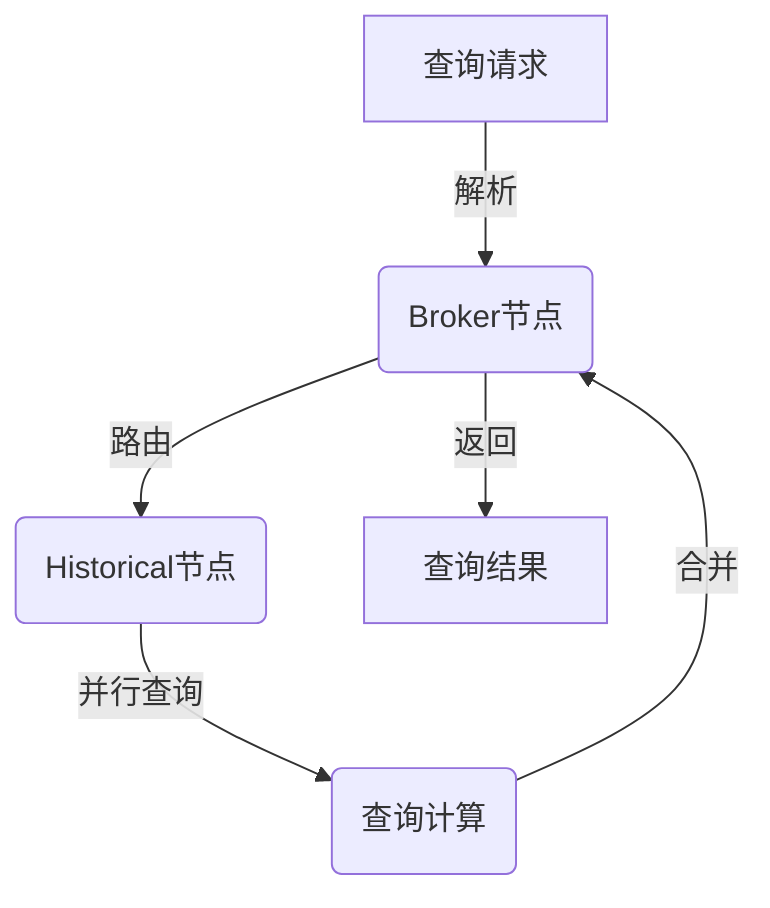

# Druid原理与代码实例讲解

## 1.背景介绍

在当今大数据时代,数据的爆炸性增长对传统的数据库系统带来了巨大的挑战。为了应对海量数据的存储、查询和分析需求,出现了一种新型的数据存储和分析系统——列式数据库。与传统的行式数据库不同,列式数据库按列存储数据,非常适合于对大量结构化数据进行快速分析查询。Druid就是一种列式分布式数据存储系统,旨在解决大数据实时探索的需求。

Druid最初由Metamarkets公司开发,后被Alibaba收购并开源。它具有实时数据摄取、快速查询、容错能力等特点,被广泛应用于用户行为分析、网络监控、应用程序日志探索等领域。Druid的核心设计思想是将数据存储和查询分离,从而实现高并发、低延迟的数据查询。

## 2.核心概念与联系

为了理解Druid的工作原理,我们需要先了解一些核心概念:

### 2.1 数据模型

Druid将数据组织为数据源(DataSource)、段(Segment)和分区(Partition)三个层次。

- **数据源**:表示一个逻辑数据集,如网站日志、应用程序指标等。
- **段**:数据源中的数据会被分割并持久化为不可变的数据段,每个段包含一段时间内的数据。
- **分区**:段可以根据规则(如时间范围、数据来源等)进一步分区,以实现更好的查询性能和数据分布。


### 2.2 Druid架构

Druid采用主从架构,主要由以下几个组件组成:



- **Realtime节点**:负责从外部数据源实时接收数据,对数据进行分区和持久化。
- **Historical节点**:用于存储和管理不可变的数据段,响应历史数据查询。
- **Broker节点**:充当查询入口,将查询路由到合适的Historical节点,并合并查询结果。
- **Coordinator节点**:负责管理数据段的生命周期,包括数据段的分配、删除和迁移等。
- **Overlord节点**:协调Realtime节点和Historical节点之间的数据流动,管理任务的分发和执行。

### 2.3 数据摄取

Druid支持多种数据摄取方式,包括批量数据摄取和实时数据摄取。

- **批量数据摄取**:适用于离线数据处理,将静态数据文件(如CSV、JSON等)转换为Druid的数据段格式。
- **实时数据摄取**:适用于流式数据处理,从Kafka、Kinesis等消息队列中实时消费数据,并持久化为数据段。

## 3.核心算法原理具体操作步骤

### 3.1 数据存储

Druid采用列式存储格式,将数据按列进行压缩和编码,从而提高查询效率。数据存储过程如下:

1. **数据分区**:根据配置规则(如时间范围、数据来源等),将接收到的数据划分为多个分区。
2. **构建临时段**:对每个分区中的数据进行编码和压缩,生成临时的数据段。
3. **持久化段**:将临时段合并为不可变的数据段,并将其推送到Historical节点进行持久化存储。
4. **段元数据管理**:Coordinator节点负责管理数据段的元数据信息,包括段的时间范围、分区规则等。



### 3.2 数据查询

Druid采用分而治之的查询策略,将查询分解为多个子查询,并在Historical节点上并行执行。查询过程如下:

1. **查询解析**:Broker节点接收查询请求,并解析查询语句。
2. **路由查询**:根据查询涉及的数据段,将查询路由到相应的Historical节点。
3. **并行查询**:Historical节点并行扫描本地数据段,执行查询计算。
4. **合并结果**:Broker节点收集并合并Historical节点返回的查询结果。
5. **返回结果**:将最终结果返回给客户端。



## 4.数学模型和公式详细讲解举例说明

Druid在数据存储和查询过程中,采用了多种数学模型和算法,以提高查询效率和降低存储开销。

### 4.1 列式存储编码

Druid使用多种列式存储编码技术,包括位图编码、字典编码和前缀编码等。

**位图编码**

位图编码用于高效存储和查询多值列。对于一个多值列,Druid会为每个唯一值创建一个位向量,用于标记该值在每行数据中的出现情况。查询时,可以通过位运算快速计算出满足条件的行。

设有$n$行数据,列$C$有$m$个不同的值$\{v_1, v_2, \cdots, v_m\}$,则位图编码如下:

$$
B_i = [b_{i1}, b_{i2}, \cdots, b_{in}], \quad b_{ij} = \begin{cases}
1, & \text{if } C_j = v_i \\
0, & \text{otherwise}
\end{cases}
$$

其中$B_i$表示值$v_i$的位向量。查询$C = v_i$时,只需计算$\sum_{j=1}^n b_{ij}$即可得到满足条件的行数。

**字典编码**

字典编码用于压缩字符串类型的列。Druid会为每个列构建一个全局字典,将字符串映射为整数ID,从而减小存储开销。

设有$n$行数据,列$C$有$m$个不同的字符串值$\{s_1, s_2, \cdots, s_m\}$,则字典编码如下:

$$
D = \{(s_1, id_1), (s_2, id_2), \cdots, (s_m, id_m)\}
$$

其中$D$为全局字典,$(s_i, id_i)$表示字符串$s_i$映射为整数ID $id_i$。查询时,可以直接在整数ID上进行计算和过滤,从而提高效率。

### 4.2 近似聚合函数

Druid支持多种近似聚合函数,如HyperLogLog、数据sketch等,用于快速估计基数(去重计数)和集合操作。这些算法通过牺牲一定的精度,换取更高的计算效率和更小的存储开销。

**HyperLogLog**

HyperLogLog是一种用于估计基数的算法,其基本思想是将输入值通过哈希函数映射到一个较小的空间,并根据观测到的最大值估计基数。

设有$n$个输入值$\{x_1, x_2, \cdots, x_n\}$,哈希函数$h(x)$将值映射为一个$b$位的二进制串。定义$\rho(h(x))$为二进制串中最长的前导0的长度,则基数估计公式为:

$$
E = \alpha_m \times m^2 / \sum_{j=1}^m 2^{-M_j}
$$

其中$m$为HyperLogLog的精度参数,$\alpha_m$为偏差校正因子,$M_j$为$j$个桶中观测到的最大$\rho$值。

HyperLogLog在估计基数时,相比直接计数,可以大幅减小存储开销,同时保持较高的精度。

## 5.项目实践:代码实例和详细解释说明

为了更好地理解Druid的使用,我们来看一个基于Druid的简单项目实践。在这个示例中,我们将使用Druid存储和查询网站日志数据。

### 5.1 环境准备

首先,我们需要安装和配置Druid环境。可以参考官方文档进行安装,或者使用Docker快速启动一个单机版本的Druid:

```bash
docker run -p 8888:8888 -p 8083:8083 apache/druid:0.23.0 bash -c 'java -Xms512m -Xmx512m -Xmx512m -Duser.timezone=UTC -Dfile.encoding=UTF-8 -Ddruid.extensions.loadList=["druid-kafka-indexing-service"] -Ddruid.extensions.remoteUrlSource.type=local -classpath "/opt/druid/extensions/*" org.apache.druid.cli.Main server router middleManager'
```

### 5.2 数据摄取

接下来,我们需要将网站日志数据加载到Druid中。这里我们使用实时数据摄取的方式,从Kafka消费日志数据。

首先,创建一个Kafka主题,并向其中发送模拟的日志数据:

```python
from kafka import KafkaProducer
import json
import random
import time

# 模拟日志数据
log_data = {
    "timestamp": int(time.time()),
    "remote_addr": ".".join(str(random.randint(0, 255)) for _ in range(4)),
    "request": "GET /path HTTP/1.1",
    "status": random.choice([200, 404, 500]),
    "user_agent": "Mozilla/5.0 (X11; Linux x86_64) AppleWebKit/537.36 (KHTML, like Gecko) Chrome/58.0.3029.110 Safari/537.3"
}

# 创建Kafka Producer
producer = KafkaProducer(bootstrap_servers='localhost:9092',
                         value_serializer=lambda v: json.dumps(v).encode('utf-8'))

# 发送模拟日志数据
for _ in range(100):
    producer.send('web-logs', log_data)
    time.sleep(0.1)
```

然后,配置Druid的实时任务,从Kafka消费日志数据并进行持久化:

```json
{
  "type": "kafka",
  "spec": {
    "dataSchema": {
      "dataSource": "web-logs",
      "timestampSpec": {
        "column": "timestamp",
        "format": "auto"
      },
      "dimensionsSpec": {
        "dimensions": [
          "remote_addr",
          "request",
          "user_agent"
        ]
      },
      "metricsSpec": [
        {
          "type": "count",
          "name": "count"
        },
        {
          "type": "longSum",
          "name": "status_sum",
          "fieldName": "status"
        }
      ],
      "granularitySpec": {
        "type": "uniform",
        "segmentGranularity": "HOUR",
        "queryGranularity": "MINUTE"
      }
    },
    "ioConfig": {
      "topic": "web-logs",
      "consumerProperties": {
        "bootstrap.servers": "localhost:9092"
      },
      "taskDuration": "PT1H",
      "replicas": 1,
      "taskCount": 1
    },
    "tuningConfig": {
      "type": "kafka",
      "maxRowsInMemory": 1000000,
      "intermediatePersistPeriod": "PT10M",
      "reportParseExceptions": false
    }
  }
}
```

上述配置定义了数据源、时间戳列、维度列、指标列等,并指定了从Kafka消费数据的相关参数。将该配置文件保存为`ingestion-spec.json`,然后使用Druid的Overlord节点提交任务:

```bash
curl -X 'POST' -H 'Content-Type:application/json' -d @ingestion-spec.json http://localhost:8083/druid/indexer/v1/task
```

任务提交后,Druid会自动从Kafka消费日志数据,并将其持久化为数据段。

### 5.3 数据查询

数据持久化完成后,我们就可以通过Druid的查询语言进行数据探索和分析了。

**查询示例1:计算每小时的请求数**

```json
{
  "queryType": "timeseries",
  "dataSource": "web-logs",
  "granularity": "hour",
  "descending": true,
  "aggregations": [
    {
      "type": "count",
      "name": "count"
    }
  ],
  "intervals": [
    "2023-01-01T00:00:00+00:00/2024-01-01T00:00:00+00:00"
  ]
}
```

该查询按小时粒度计算请