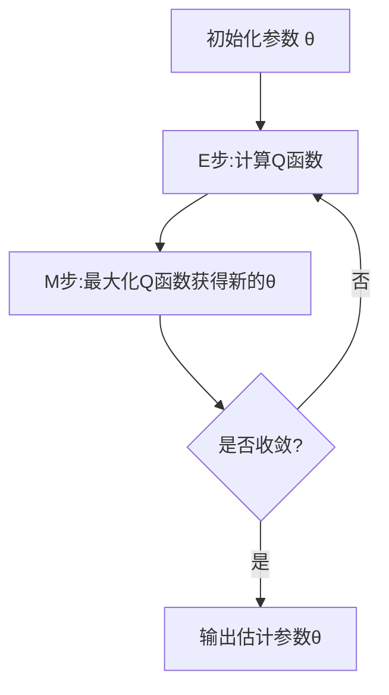

# EM算法原理与代码实战案例讲解

## 1. 背景介绍

### 1.1 EM算法的由来

在现实世界中,我们经常会遇到一些数据不完整或者存在隐藏变量的情况。例如,在聚类分析中,我们只能观测到数据点的坐标,而无法直接获取每个数据点属于哪个簇的信息。在这种情况下,传统的估计方法就行不通了,因为似然函数中存在隐藏变量,无法直接最大化。

EM算法(Expectation Maximization Algorithm)就是为了解决这类问题而被提出的一种迭代算法。它由统计学家A.P.Dempster等人在1977年首次提出,用于含有隐藏变量的概率模型的参数估计。EM算法的思想是:先用一个初始参数值对隐藏变量的概率分布进行估计(E步),然后基于这个概率分布对参数进行重新估计(M步),不断重复这个过程,直到收敛为止。

### 1.2 EM算法的适用场景

EM算法主要应用于以下几种情况:

1. **存在隐藏变量的概率模型**:当概率模型中存在一些无法观测到的隐藏变量时,传统的最大似然估计方法无法直接使用,这时可以使用EM算法进行参数估计。

2. **数据不完整**:当数据集中存在缺失值时,如果直接删除缺失数据可能会导致信息损失,EM算法可以利用已知数据对缺失数据进行估计,从而完整地利用数据集。

3. **混合模型**:在混合模型中,每个观测数据都是由多个分布构成的混合分布生成的,这些分布的参数和权重都是未知的,EM算法可以用于估计这些参数。

4. **非监督学习**:在非监督学习问题中,如聚类分析、主题模型等,都存在隐藏变量,EM算法可以用于估计隐藏变量和模型参数。

总的来说,EM算法为含有隐藏变量的概率模型参数估计提供了一种通用的解决方案,在机器学习、模式识别、计算机视觉等领域有着广泛的应用。

## 2. 核心概念与联系

### 2.1 EM算法的基本概念

为了更好地理解EM算法,我们首先需要了解以下几个基本概念:

1. **观测变量(Observable Variable)**: 指可以直接观测到的随机变量,用 $X$ 表示。

2. **隐藏变量(Hidden Variable)**: 指无法直接观测到的随机变量,用 $Z$ 表示。

3. **参数(Parameter)**: 指概率模型中需要估计的未知参数,用 $\theta$ 表示。

4. **对数似然函数(Log-likelihood Function)**: 给定观测数据 $X$ 和模型参数 $\theta$,对数似然函数 $\ln P(X|\theta)$ 表示观测数据在当前模型参数下出现的对数概率。

5. **期望值(Expectation)**: 对于一个随机变量的函数 $f(X,Z)$,其期望值可以表示为 $E[f(X,Z)] = \sum_Z f(X,Z)P(Z|X,\theta)$。

EM算法的目标是最大化观测数据的对数似然函数 $\ln P(X|\theta)$,但由于存在隐藏变量 $Z$,无法直接对参数 $\theta$ 进行最大化。EM算法的做法是:先用当前的参数 $\theta$ 对隐藏变量 $Z$ 的分布进行估计(E步),然后基于这个估计的分布,对参数 $\theta$ 进行重新估计(M步),从而期望能够增大对数似然函数的值。

### 2.2 EM算法流程图

EM算法的基本流程可以用下面的Mermaid流程图来表示:

上面的流程图展示了EM算法的迭代过程:

1. 首先初始化参数 $\theta$ 的值。

2. E步(Expectation Step):基于当前的参数 $\theta$,计算隐藏变量 $Z$ 的条件分布 $P(Z|X,\theta)$,进而计算出 $Q$ 函数的值。

3. M步(Maximization Step):求使 $Q$ 函数最大化的新的参数值 $\theta$。

4. 检查算法是否收敛,如果没有收敛,则重复E步和M步,直到收敛。

5. 输出最终估计的参数值 $\theta$。

通过不断迭代E步和M步,EM算法期望能够找到使观测数据对数似然函数最大化的参数估计值。

## 3. 核心算法原理具体操作步骤 

### 3.1 EM算法的数学原理

现在我们来看一下EM算法的具体数学推导过程。假设我们有观测数据 $X$ 和隐藏变量 $Z$,目标是最大化观测数据的对数似然函数 $\ln P(X|\theta)$。由于存在隐藏变量 $Z$,无法直接对参数 $\theta$ 进行最大化,我们引入以下辅助函数:

$$
Q(\theta,\theta^{(t)}) = E_{Z|X,\theta^{(t)}}\left[\ln P(X,Z|\theta)\right]
$$

其中, $\theta^{(t)}$ 表示当前参数的估计值。上式的意义是:在给定当前参数 $\theta^{(t)}$ 和观测数据 $X$ 的情况下,对 $\ln P(X,Z|\theta)$ 关于隐藏变量 $Z$ 的条件分布 $P(Z|X,\theta^{(t)})$ 求期望值。

我们可以证明,对于任意的 $\theta$ 和 $\theta^{(t)}$,都有如下不等式成立:

$$
\ln P(X|\theta) \geq Q(\theta,\theta^{(t)}) - Q(\theta^{(t)},\theta^{(t)})
$$

上式表明,只要我们能够找到一个 $\theta$,使得 $Q(\theta,\theta^{(t)})$ 比 $Q(\theta^{(t)},\theta^{(t)})$ 大,那么对数似然函数 $\ln P(X|\theta)$ 的值也会增大。

基于这一结论,EM算法的具体步骤如下:

1. **E步(Expectation Step)**: 计算 $Q(\theta,\theta^{(t)})$,即在给定当前参数 $\theta^{(t)}$ 和观测数据 $X$ 的情况下,对 $\ln P(X,Z|\theta)$ 关于隐藏变量 $Z$ 的条件分布 $P(Z|X,\theta^{(t)})$ 求期望值。

2. **M步(Maximization Step)**: 求使 $Q(\theta,\theta^{(t)})$ 最大化的 $\theta$,记为 $\theta^{(t+1)}$,即:

$$
\theta^{(t+1)} = \arg\max_\theta Q(\theta,\theta^{(t)})
$$

3. **迭代**:重复E步和M步,直到收敛或满足停止条件。

通过不断迭代E步和M步,EM算法期望能够找到一个使观测数据对数似然函数 $\ln P(X|\theta)$ 最大化或接近最大值的参数估计 $\hat{\theta}$。

### 3.2 EM算法的一般步骤

根据上面的数学原理,我们可以总结出EM算法的一般步骤如下:

1. **初始化**:选择一个合理的初始参数值 $\theta^{(0)}$。

2. **E步**:计算 $Q(\theta,\theta^{(t)})$,即在给定当前参数 $\theta^{(t)}$ 和观测数据 $X$ 的情况下,对 $\ln P(X,Z|\theta)$ 关于隐藏变量 $Z$ 的条件分布 $P(Z|X,\theta^{(t)})$ 求期望值。

3. **M步**:求使 $Q(\theta,\theta^{(t)})$ 最大化的新参数值 $\theta^{(t+1)}$,即:

$$
\theta^{(t+1)} = \arg\max_\theta Q(\theta,\theta^{(t)})
$$

4. **判断是否收敛**:检查算法是否已经收敛,如果满足停止条件(例如对数似然函数的增量小于某个阈值),则停止迭代,否则转到步骤2,继续下一轮迭代。

5. **输出结果**:输出最终估计的参数值 $\hat{\theta}$。

需要注意的是,在具体应用中,E步和M步的具体计算方式需要根据不同的概率模型和隐藏变量的定义而有所不同。下面我们将通过一个实际案例,来具体说明如何在特定问题中应用EM算法。

## 4. 数学模型和公式详细讲解举例说明

### 4.1 高斯混合模型(Gaussian Mixture Model)

高斯混合模型是一种常用的概率模型,它可以用于聚类分析、密度估计等任务。在高斯混合模型中,我们假设观测数据是由 $K$ 个高斯分布的混合而成的,每个高斯分布代表一个潜在的簇。具体来说,对于一个 $D$ 维的观测数据 $\boldsymbol{x}$,它的概率密度函数可以表示为:

$$
P(\boldsymbol{x}|\boldsymbol{\pi},\boldsymbol{\mu},\boldsymbol{\Sigma}) = \sum_{k=1}^K \pi_k \mathcal{N}(\boldsymbol{x}|\boldsymbol{\mu}_k,\boldsymbol{\Sigma}_k)
$$

其中:

- $K$ 是混合成分的个数,也就是簇的个数
- $\boldsymbol{\pi} = (\pi_1,\pi_2,\dots,\pi_K)$ 是混合系数,满足 $\sum_{k=1}^K\pi_k=1$ 且 $\pi_k \geq 0$
- $\boldsymbol{\mu}_k$ 是第 $k$ 个高斯分布的均值向量
- $\boldsymbol{\Sigma}_k$ 是第 $k$ 个高斯分布的协方差矩阵
- $\mathcal{N}(\boldsymbol{x}|\boldsymbol{\mu}_k,\boldsymbol{\Sigma}_k)$ 表示第 $k$ 个高斯分布的概率密度函数

我们的目标是估计出这些参数 $\boldsymbol{\theta} = \{\boldsymbol{\pi},\boldsymbol{\mu},\boldsymbol{\Sigma}\}$,使得观测数据的似然函数最大化。

### 4.2 EM算法在高斯混合模型中的应用

在高斯混合模型中,我们引入隐藏变量 $\boldsymbol{Z} = (Z_1,Z_2,\dots,Z_N)$,其中 $Z_i \in \{1,2,\dots,K\}$ 表示第 $i$ 个观测数据 $\boldsymbol{x}_i$ 属于哪一个簇。由于我们无法直接观测到 $\boldsymbol{Z}$,因此需要使用EM算法来估计参数 $\boldsymbol{\theta}$。

具体来说,EM算法在高斯混合模型中的迭代步骤如下:

1. **初始化**:选择一个合理的初始参数值 $\boldsymbol{\theta}^{(0)} = \{\boldsymbol{\pi}^{(0)},\boldsymbol{\mu}^{(0)},\boldsymbol{\Sigma}^{(0)}\}$。

2. **E步**:计算隐藏变量 $\boldsymbol{Z}$ 的条件概率分布,即对于每个观测数据 $\boldsymbol{x}_i$,计算它属于第 $k$ 个簇的后验概率:

$$
\gamma_{ik}^{(t)} = P(Z_i=k|\boldsymbol{x}_i,\boldsymbol{\theta}^{(t)}) = \frac{\pi_k^{(t)}\mathcal{N}(\boldsymbol{x}_i|\boldsymbol{\mu}_k^{(t)},\boldsymbol{\Sigma}_k^{(t)})}{\sum_{j=1}^K\pi_j^{(t)}\mathcal{N}(\boldsymbol{x}_i|\boldsymbol{\mu}_j^{(t)},\boldsymbol{\Sigma}_j^{(t)})}
$$

3. **M步**:使用E步计算出的 $\gamma_{ik}^{(t)}$ 来重新估计参数:

$$
\begin{aligned}
\pi_k^{(t