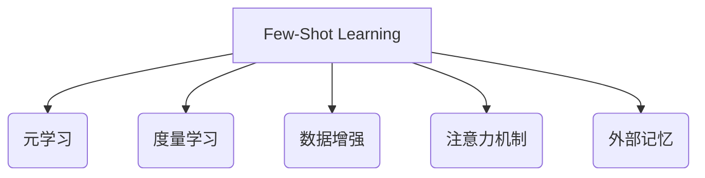

# Few-Shot Learning 原理与代码实例讲解

## 1. 背景介绍
### 1.1 什么是Few-Shot Learning
Few-Shot Learning(少样本学习)是指在只有很少的标记训练样本可用的情况下进行机器学习的问题。与传统的深度学习方法不同,Few-Shot Learning 旨在通过利用先验知识,快速适应新的任务,即使每个新类别的可用样本非常有限。

### 1.2 Few-Shot Learning的重要性
- 现实世界中很多任务的标注数据非常有限,Few-Shot Learning 使得机器学习系统能够像人类一样,通过少量样本快速学习新概念。
- Few-Shot Learning 能够减少对大规模标注数据的依赖,降低数据标注成本。
- Few-Shot Learning 使得机器学习系统能够快速适应新的任务,提高系统的灵活性和泛化能力。

### 1.3 Few-Shot Learning的主要挑战
- 如何在小样本条件下避免过拟合。
- 如何高效地从少量样本中提取泛化性强的特征表示。  
- 如何设计合适的优化目标函数,使模型能够快速适应新任务。

## 2. 核心概念与联系
### 2.1 元学习(Meta-Learning)
元学习是Few-Shot Learning的核心概念之一。元学习旨在学习如何学习,即学习一个通用的学习器,使其能够快速适应新的任务。具体来说,元学习通过在一系列相关任务上进行训练,学习一个初始化参数,使得模型能够在新任务上通过少量梯度下降步骤快速收敛到最优解。

### 2.2 度量学习(Metric Learning)  
度量学习是Few-Shot Learning的另一个重要思路。其核心思想是学习一个度量空间,使得相同类别的样本在该空间中距离尽可能近,不同类别的样本距离尽可能远。在Few-Shot场景下,可以利用度量学习找到给定查询样本的最近邻样本,从而实现分类。

### 2.3 数据增强(Data Augmentation)
数据增强是缓解Few-Shot Learning中数据稀疏问题的重要手段。通过对原始样本进行旋转、平移、缩放、添加噪声等变换,可以人工扩充训练集。数据增强不仅可以缓解过拟合,还能提高模型的鲁棒性。

### 2.4 注意力机制(Attention Mechanism)
注意力机制能够自动聚焦于输入数据中的关键部分,提取更加泛化和鲁棒的特征表示。将注意力机制引入Few-Shot Learning,可以更好地利用支持集中的信息,实现快速适应。

### 2.5 外部记忆(External Memory)
外部记忆机制允许模型将过去学习到的知识存储在外部存储器中,并在新任务中快速检索相关知识。这种机制模仿了人类利用过往经验解决新问题的思维方式,有助于提高Few-Shot Learning的性能。

下图展示了这些核心概念之间的联系:



## 3. 核心算法原理与具体操作步骤
### 3.1 基于优化的元学习(Optimization-based Meta-Learning)
#### 3.1.1 MAML算法
MAML(Model-Agnostic Meta-Learning)是一种经典的基于优化的元学习算法。其核心思想是学习一个对新任务具有良好初始化效果的参数空间。具体步骤如下:
1. 随机初始化模型参数$\theta$
2. 在元训练集上进行多轮元训练,每轮执行以下步骤:
   - 采样一个batch的任务$\{\mathcal{T}_i\}$
   - 对每个任务$\mathcal{T}_i$,计算梯度并更新参数:$\theta_i'=\theta-\alpha\nabla_\theta\mathcal{L}_{\mathcal{T}_i}(f_\theta)$
   - 在更新后的参数$\theta_i'$上计算每个任务的损失:$\mathcal{L}_{\mathcal{T}_i}(f_{\theta_i'})$
   - 计算元梯度:$\nabla_\theta\sum_{\mathcal{T}_i}\mathcal{L}_{\mathcal{T}_i}(f_{\theta_i'})$,并更新$\theta$
3. 在测试时,对于新任务,使用学习到的初始化参数$\theta$,并通过几步梯度下降进行快速适应。

#### 3.1.2 Reptile算法
Reptile算法是MAML的一个简化变体,省去了二次梯度计算的过程。其具体步骤如下:
1. 随机初始化模型参数$\phi$ 
2. 在元训练集上进行多轮训练,每轮执行以下步骤:
   - 采样一个batch的任务$\{\mathcal{T}_i\}$
   - 对每个任务$\mathcal{T}_i$,从$\phi$开始,经过$k$步SGD得到更新后的参数$\phi_i'$
   - 更新元参数:$\phi\gets\phi+\epsilon\sum_i(\phi_i'-\phi)$
3. 测试时,使用学习到的初始化参数$\phi$,并通过几步梯度下降适应新任务。

### 3.2 基于度量的元学习(Metric-based Meta-Learning)
#### 3.2.1 Prototypical Networks
Prototypical Networks学习一个度量空间,使得每个类别的样本聚集在该类别的原型向量周围。具体步骤如下:  
1. 使用嵌入函数$f_\phi$将支持集和查询集样本映射到嵌入空间。
2. 对于每个类别$k$,计算其原型向量$\mathbf{c}_k$为该类别所有支持样本嵌入向量的均值:
$$\mathbf{c}_k=\frac{1}{|S_k|}\sum_{(\mathbf{x}_i,y_i)\in S_k}f_\phi(\mathbf{x}_i)$$
3. 对于查询样本$\mathbf{x}$,计算其属于每个类别的概率:
$$p(y=k|\mathbf{x})=\frac{\exp(-d(f_\phi(\mathbf{x}),\mathbf{c}_k))}{\sum_{k'}\exp(-d(f_\phi(\mathbf{x}),\mathbf{c}_{k'}))}$$
其中$d$为欧氏距离函数。
4. 最终的分类结果为概率最大的类别:$\hat{y}=\arg\max_kp(y=k|\mathbf{x})$

#### 3.2.2 Matching Networks
Matching Networks通过注意力机制为每个查询样本分配一个支持集样本的加权组合,并据此进行分类。具体步骤如下:
1. 使用嵌入函数$f_\phi$和$g_\phi$分别对支持集样本和查询样本进行编码。
2. 对于查询样本$\hat{\mathbf{x}}$,计算其与每个支持样本$\mathbf{x}_i$的注意力权重:
$$a(\hat{\mathbf{x}},\mathbf{x}_i)=\frac{\exp(\mathrm{cosine}(f_\phi(\hat{\mathbf{x}}),g_\phi(\mathbf{x}_i)))}{\sum_{j=1}^n\exp(\mathrm{cosine}(f_\phi(\hat{\mathbf{x}}),g_\phi(\mathbf{x}_j)))}$$
3. 最终分类结果为支持集标签的加权组合:
$$\hat{y}=\sum_{i=1}^na(\hat{\mathbf{x}},\mathbf{x}_i)y_i$$

### 3.3 基于外部记忆的元学习
#### 3.3.1 Meta Networks
Meta Networks引入了外部记忆模块,用于存储不同任务的知识,并在新任务中进行检索和利用。具体步骤如下:
1. 将每个任务$\mathcal{T}_i$的训练数据$D_i$编码为一个key-value对$(k_i,v_i)$,存入记忆矩阵$\mathbf{M}$中。
2. 给定查询样本$\mathbf{x}$,使用注意力机制计算其与每个key的相似度:
$$\alpha_i=\mathrm{softmax}(\mathbf{x}^\top k_i)$$
3. 从记忆中检索与查询最相关的值:
$$\mathbf{v}=\sum_i\alpha_i v_i$$
4. 将检索到的值$\mathbf{v}$与查询样本$\mathbf{x}$拼接,输入分类器进行预测:
$$\hat{y}=f_\theta([\mathbf{x},\mathbf{v}])$$

## 4. 数学模型与公式详解
### 4.1 MAML的目标函数
MAML的目标是学习一个初始化参数$\theta$,使得经过一步或几步梯度下降后,模型能够在新任务上取得较好的性能。令$\mathcal{T}_i$表示采样的任务,其相应的损失函数为$\mathcal{L}_{\mathcal{T}_i}$,经过一步梯度下降后的参数为:
$$\theta_i'=\theta-\alpha\nabla_\theta\mathcal{L}_{\mathcal{T}_i}(f_\theta)$$
则MAML的目标函数可表示为:
$$\min_\theta\sum_{\mathcal{T}_i}\mathcal{L}_{\mathcal{T}_i}(f_{\theta_i'})=\min_\theta\sum_{\mathcal{T}_i}\mathcal{L}_{\mathcal{T}_i}(f_{\theta-\alpha\nabla_\theta\mathcal{L}_{\mathcal{T}_i}(f_\theta)})$$
求解该目标函数需要计算二阶导数,因此计算复杂度较高。Reptile算法对此进行了简化,其目标函数为:
$$\min_\phi\mathbb{E}_{\mathcal{T}_i}[\mathcal{L}_{\mathcal{T}_i}(U^k(\phi))]$$
其中$U^k(\phi)$表示从初始参数$\phi$开始,经过$k$步SGD得到的模型参数。

### 4.2 Prototypical Networks的概率输出
在Prototypical Networks中,每个类别$k$的原型向量$\mathbf{c}_k$为该类别所有支持样本嵌入向量的均值:
$$\mathbf{c}_k=\frac{1}{|S_k|}\sum_{(\mathbf{x}_i,y_i)\in S_k}f_\phi(\mathbf{x}_i)$$
对于查询样本$\mathbf{x}$,其属于类别$k$的概率与查询嵌入$f_\phi(\mathbf{x})$到原型向量$\mathbf{c}_k$的距离成反比:
$$p(y=k|\mathbf{x})=\frac{\exp(-d(f_\phi(\mathbf{x}),\mathbf{c}_k))}{\sum_{k'}\exp(-d(f_\phi(\mathbf{x}),\mathbf{c}_{k'}))}$$
其中$d$为距离函数,通常选用欧氏距离:
$$d(f_\phi(\mathbf{x}),\mathbf{c}_k)=\|f_\phi(\mathbf{x})-\mathbf{c}_k\|^2$$

### 4.3 Matching Networks的注意力机制
Matching Networks使用注意力机制为查询样本分配支持集样本的权重。查询样本$\hat{\mathbf{x}}$与支持样本$\mathbf{x}_i$的注意力权重定义为:
$$a(\hat{\mathbf{x}},\mathbf{x}_i)=\frac{\exp(\mathrm{cosine}(f_\phi(\hat{\mathbf{x}}),g_\phi(\mathbf{x}_i)))}{\sum_{j=1}^n\exp(\mathrm{cosine}(f_\phi(\hat{\mathbf{x}}),g_\phi(\mathbf{x}_j)))}$$
其中$\mathrm{cosine}$表示余弦相似度:
$$\mathrm{cosine}(\mathbf{u},\mathbf{v})=\frac{\mathbf{u}^\top\mathbf{v}}{\|\mathbf{u}\|\|\mathbf{v}\|}$$
最终的分类概率为支持集标签的加权组合:
$$p(y|\hat{\mathbf{x}})=\sum_{i=1}^na(\hat{\mathbf{x}},\mathbf{x}_i)y_i$$

## 5. 代码实例与详细解释
下面以PyTorch为例,给出Prototypical Networks的简要实现:

```python
import torch
import torch.nn as nn
import torch.nn.functional as F

class PrototypicalNetworks(nn.Module):
    def __init__(self, encoder):
        super(PrototypicalNetworks, self).__init__()
        self.encoder = encoder
    
    def forward(self, support_images, support_labels, query_images